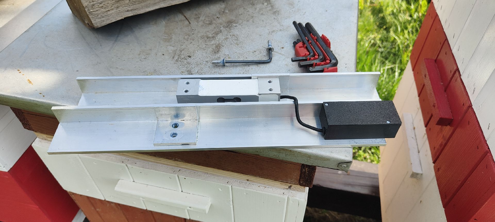
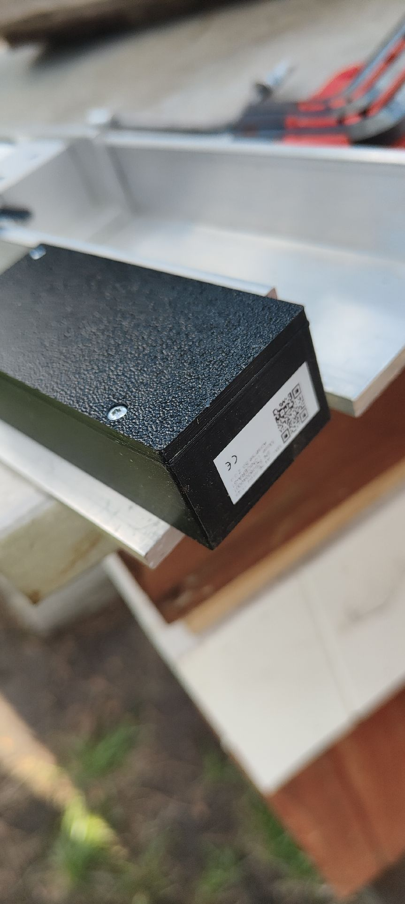
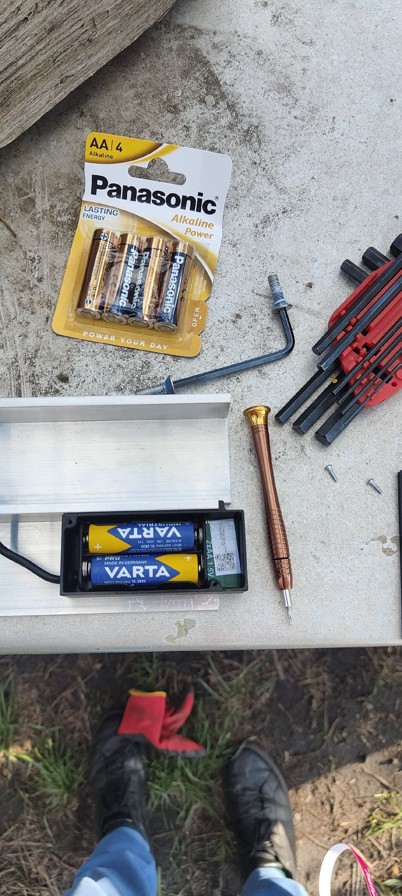

# Frequently Asked Questions (FAQ)

Questions and answers collected during the **Apisense 2026 Global Field Validation Study**.

## VitalSensor & placement

### Does the colour of the NFC/QR tag attached to the VitalSensor matter?

No. Colour is irrelevant — the VitalSensor–tag pairing is what matters.

### Where exactly should the VitalSensor be placed?

Vertically, on a brood frame in the nest part of the hive — ideally in the centre or next to the centre.

### Can I move VitalSensors up/down when adding boxes?

Yes, within the nest. Always add a note about such an action in the app (preferably along with a photo).

### Can VitalSensors be installed on non-standard frames?

Yes, using zip ties. Please add a note (and preferably a photo) of the VitalSensor after installation.

### Can VitalSensors be used in nucs (and other smaller hives) and then moved to bigger ones later?

It is recommended to wait with VitalSensor installation until the hive is in its final size (unless you want to use a small size, e.g. mini plus, through the whole season — in such case contact us first).

### How do I replace the batteries in the VitalSensor?

The VitalSensor is powered by **2× AA alkaline** batteries.

1. Open the cover.
2. Replace the batteries with **2× AA alkaline**.
3. Close the cover.

!!! note "Note"
    After completing the battery replacement, no additional steps are required in the app or on the Hub or VitalSensor device. Do not re-pair devices, add them to the hive again, or press the RESET button. Simply place the VitalSensor back within the Hub's communication range and wait for the next data synchronisation. Updated data will appear in the app automatically - this may take up to several hours, provided that the Hub is communicating properly with the system (it is not offline - discharged battery/no connectivity).

## Hub & connectivity

### Can the Hub be installed indoors or under a roof?

No. It must be outdoors for GPS and proper connectivity.

### Can I power the Hub permanently via electricity?

Yes, you can power it via USB-C, as long as it remains outdoors and is uncovered.

### Does the Hub need a battery replacement?

No. The Hub charges from a solar panel (PV). If sunlight is insufficient, you can top it up via USB-C.

### Do I need to press the RESET button after the Hub has discharged and I reconnect it to charging or expose it to the sun?

No. After sufficient charging, the Hub will automatically resume operation, connect to the system and the devices.

### Do I need to press the RESET button on the Hub after replacing the batteries in a Scale or VitalSensor?

No. Do not reset the Hub after replacing the batteries in Scale or VitalSensor devices. After replacing the batteries, simply place the device back within the Hub's communication range and wait for the next data synchronisation. Remember that the Hub must be communicating properly with the system (it must not be offline — discharged or no connectivity).

### The Hub isn't charging despite full sun — why?

This is correct behaviour — a battery safety protection has kicked in. The Hub only charges when the temperature inside the device stays below **50°C**. With a south-facing installation during hot weather, the internal temperature can reach about **70°C**, so charging is suspended for safety. Paradoxically, the all-day full sun is the reason charging stops here — the device is working correctly. Once the temperature drops, charging resumes automatically.

### How far can the Hub be from the hives?

Up to approx. 30–40 metres.

### The Hub is not appearing in the app — what should I do?

Follow the instructions in the user manual; you can also ask the assistant in the app for instructions. The general recommendations are:

- Check orientation (logo readable, antennas pointing vertically upwards).
- Leave it outdoors for ~15 minutes.
- Try USB-C charging.

If it still does not work, contact [bee@apisense.ai](mailto:bee@apisense.ai).

### A VitalSensor or Scale won't connect to the Hub — what should I do?

Devices reach the server through the Hub (VitalSensor/Scale → Bluetooth → Hub → LTE → server), so the order matters:

1. **The Hub must connect first.** No VitalSensor or Scale can connect until the Hub is online. The Hub is solar-powered — its first contact after power-on takes from ~30 minutes (charged) up to 24 hours (discharged, in bad weather). In the app, pick the start-up scenario to see the estimated time.
2. **Once the Hub is connected**, each VitalSensor and Scale has its own first-connection window. During it the app shows *"awaiting connection"* — this is normal, please wait.
3. If a device still hasn't connected after that window, the app shows *"out of range"* — the Hub is online but cannot see the device over Bluetooth. Most common causes: the device is too far from the Hub, or an issue with the device itself (e.g. power).

If some devices connect and others don't (e.g. one VitalSensor works, the rest don't), the problem is with those specific devices, not the Hub.

If the problem persists, contact [bee@apisense.ai](mailto:bee@apisense.ai).

## Scale

### Does the Scale need batteries or charging?

Yes. The Scale is powered by **2× AA alkaline** batteries. Once installed and added to the app (QR code) it works automatically — you only replace the batteries when they run out.

### How do I replace the batteries in the Scale?

You will need a **4 mm** Allen (hex) key (for the brackets) and a **T6** Torx key (for the black housing).

1. Unscrew the brackets with the 4 mm Allen key — undo the two screws.

    {width=450}

2. Undo the two T6 Torx screws on the black housing.

    {width=450}

3. Replace the batteries with **2× AA alkaline**.

    {width=450}

4. Screw the black housing back on.
5. Screw the brackets back on.

!!! note "Note"
    After completing the battery replacement, no additional steps are required in the app or on the Hub or Scale device. Do not re-pair devices, add them to the hive again, or press the RESET button. Simply place the Scale back within the Hub's communication range and wait for the next data synchronisation. Updated data will appear in the app automatically - this may take up to several hours, provided that the Hub is communicating properly with the system (it is not offline - discharged battery/no connectivity).

### Which hive should be on the Scale?

Any VitalSensor-equipped hive — trends matter more than the exact weight of a particular hive.

## After battery replacement

### What should I do after replacing the batteries in a Scale/VitalSensor?

After replacing the batteries:

- place the Scale or VitalSensor back in its target location,
- make sure it is within range of the Hub (maximum approximately 35 m),
- wait for the next measurement cycle.

Updated data will appear in the app automatically - this may take up to several hours, provided that the Hub is communicating properly with the system (it is not offline - discharged battery/no connectivity).

### Do I need to re-pair the Scale or VitalSensor after replacing the batteries?

No. Battery replacement does not require re-pairing the device. Simply place the device back within the Hub's communication range and wait for the next data synchronisation. Remember that the Hub must be communicating properly with the system (it must not be offline — discharged or no connectivity).

### Do I need to remove and re-add the Scale or VitalSensor to the hive after replacing the batteries?

No. You do not need to change anything in the app after replacing the batteries in a Scale or VitalSensor. Simply place the device back within the Hub's communication range and wait for the next data synchronisation. Remember that the Hub must be communicating properly with the system (it must not be offline — discharged or no connectivity).

### Do I need to remove and re-add the hive in the app after replacing the batteries?

No. There is no need to remove or re-add the hive or the devices assigned to it. After replacing the batteries in a Scale or VitalSensor, simply place the device back within the Hub's communication range and wait for the next data synchronisation. Remember that the Hub must be communicating properly with the system (it must not be offline — discharged or no connectivity).

## Data entry & Apisense app usage

### Is it possible for hive weight to show a positive value while honey gain is negative, even though honey gain is calculated based on weight measurements?

Yes, this is entirely possible. For example, a beekeeper may add a super, which will cause the total hive mass to increase. At the same time, if the bee colony is weakened, honey production may decrease. In such a situation, the hive weight chart will show a clear increase resulting from adding the super. However, on the honey gain chart, the mass of the added super will not be taken into account, so the chart will reflect only the actual change in the amount of honey. As a result, the honey gain chart will show a decrease related to limited bee activity, rather than an artificial increase resulting from beekeeper intervention.

### Do notes have to be added in the field?

No. You can add them later with the correct date.

### Can multiple people access the same app data?

Not confirmed yet — Apisense will follow up by email.

## Examinations & samples

### Do I need to do the Varroa sugar roll in the Global Field Validation Study examinations?

Yes — always. The Varroa sugar roll is **mandatory in every scheduled examination** (Examination 1, 2 and 3), for every monitored colony. You run it every time, regardless of the time of season, sensor readings or the absence of visible Varroa symptoms. Each examination covers the full set of **both procedures**: the Varroa sugar roll **and** Nosema/Vairimorpha microscopy. Details: [Lab procedures](../procedures/index.md).

### Can you freeze bee samples for Nosema examinations?

Yes — **freezing bees is accepted only** for *Nosema* examinations.

- Each frozen sample must be **clearly and easily identified** with the hive it comes from.
- Storage temperature: **at least −8 °C**.
- Bee samples can be stored in the freezer for approximately **3–5 months** before the examination or shipping to the lab.
- Samples **must not be thawed and frozen again**.

Details: [Nosema/Vairimorpha microscopy](../procedures/nosema-microscopy.md#storage-before-examination), [Registering a sample](../manual/app-manual.md#rejestrowanie-probki).

### Can I send live bees to Lublin via Poczta Polska?

Yes. Live bee samples should be sent **via Poczta Polska** to the laboratory in Lublin (University of Life Sciences in Lublin, ul. Doświadczalna 54, 20-280 Lublin) — **Monday to Thursday** (estimated cost **PLN 20–30**). Bees must be shipped **alive**, in transport cages that allow air access, with a piece of sugar candy and the test code from the Apisense app written on each cage. Shipments of live bees via Poczta Polska may only be sent by apiary owners located in Poland. Details: [Protocol 2 — live bees](../samples/protocol-2-live-bees.md).

## Beekeeping practices

### Can I use oxalic or formic acid treatments?

Yes. Please add a note in the app once doing so.

### Can VitalSensors be moved if a colony dies or is lost?

Do not move VitalSensors without letting the Apisense team know first! To prevent the risk of disease spread and for data integrity reasons, in such a situation always contact us directly and wait for further instructions.

### I'm moving a VitalSensor to another colony (e.g. after a colony died) — how do I reflect this in the app?

A new colony = a new hive in the app. Do it in three steps:

1. **Create a new hive** in the app — the old hive stays unchanged.
2. **Unbind the devices from the old hive** and **bind them to the new one** (after disinfecting the VitalSensor).
3. From now on new measurements go to the new hive.

Measurement history is **not** transferred between hives — it was a different colony, so the old hive's data does not describe the new one. That is why the data starts fresh with the new hive. You don't need to let us know — once you create the new hive and re-assign the devices to it, we have the full picture.

### What about splitting colonies or adding/removing supers?

Always add a note on such activities — it supports correct data interpretation.

### What if I transport my hives?

Transport all hives + Hub + Scale together and add a note in the app.

## Moving devices between hives and apiaries

This section covers what to do in the app when a VitalSensor (or a Scale) changes hive — because you moved the frame with the sensor into another hive, relocated a colony to a different apiary, or the Hubs ended up swapped.

!!! warning "Talk to us first"
    If a colony died or was lost, contact the Apisense team **every time** before moving the VitalSensor and wait for instructions — see [Can VitalSensors be moved…](#moving-a-vitalsensor). In the Global Field Validation Study, agree **every** move of a sensor between colonies with us, whatever the reason. The steps below only describe the app side; they do not replace that — the app bookkeeping itself is not something you need to report to us.

### The basic rule: a device belongs to a hive, a Hub belongs to an apiary

- A VitalSensor and a Scale are **assigned to a hive**, not to a Hub. The Hub is only a relay — it forwards data from the devices standing in its apiary to the system.
- A device always reports through the **Hub of the apiary its hive belongs to**. When you bind a sensor to a hive in another apiary, the system repoints it onto that apiary's Hub and refreshes both Hubs' configuration by itself. **You do not scan a Hub QR code for this.**
- So the sensor **does not have to stay with its original Hub**, and you do not have to move the colony back just to "return it to the old Hub".
- Measurement history is stored under the **device serial number** and shown in a hive **from the moment the device was bound** to that hive.
- **Range is a hard requirement.** Being assigned in the app is one thing, being connected is another: a VitalSensor and a Scale send their data over Bluetooth to their apiary's Hub, so they have to sit **physically close to it** — up to about 35 m. A sensor re-bound to a hive in another apiary will be assigned correctly in the app, but it will not deliver a single measurement until it is within range of that apiary's Hub.
- The ColonyLink stays with the hive (it is stuck to the hive itself) — moving a sensor does not touch the ColonyLink.

### How do I scan a sensor's QR code from a specific hive?

You always scan a device's QR code "from inside" the hive the device is going into:

1. **Apiaries** tab → apiary tile → *Hives* tab → the hive's tile.
2. On the *Details* tab tap the **⋮** icon (top right) and choose *Settings*.
3. Expand the **Equipment** section and find the **VitalSensor** (or **Scale**) block.
4. Tap the **QR code icon** on the right-hand side of the field and scan the code on the device — *Serial number* and *Confirmation code* fill in by themselves.
5. Save with the yellow button in the bottom right corner.

Things to watch out for:

- The QR code icon is **always** visible, including when the hive already has a VitalSensor (or Scale). Scanning another device's code **replaces** the device assigned to that hive.
- You can only replace it with a device that is **not bound to any other hive**. Scanning the code of a sensor that sits in another hive gives you *"VitalSensor is already assigned to hive X…"* and the replacement fails — unbind it from that hive first.
- If the apiary has no Hub, the *Equipment* section shows **the ColonyLink only** — the VitalSensor and Scale fields are not there at all.
- In an apiary someone shared with you the *Equipment* section may be read-only — device management belongs to the apiary owner.

The view is described in detail in [Hive settings](../manual/app-manual.md#omowienie-ustawien-ula).

### I moved the sensor into another hive in the same apiary (same Hub) — what do I do?

1. **Unbind the sensor from the old hive.** *Hive settings* → *Equipment* → *Disconnect VitalSensor* → **leave the** *Keep the VitalSensor data history for this hive* **toggle on** → *Disconnect*. With the toggle on, that sensor's measurements stay stored in the system; with it off they are gone for good. Either way **the old hive stops showing its parameter charts** — details: [What happens to the data in the old hive?](#data-in-the-old-hive).
2. **Bind the sensor to the new hive** — the steps in [scanning a QR code from a specific hive](#scanning-a-qr-from-a-specific-hive). If the target hive does not exist in the app yet, create it and bind the sensor right away during hive creation — see [Adding a hive with VitalSensor and Scale](../manual/app-manual.md#212-adding-a-hive-with-vitalsensor-and-scale).
3. **Add a dated note** in both hives — it is the only lasting trace of when the sensor changed hive.

You do not touch the Hub — its configuration is refreshed automatically after both operations.

**Order matters.** Until you unbind the sensor from the old hive, scanning its code in the new one ends with: *"VitalSensor is already assigned to hive X. Disconnect the device from hive X or scan a QR code from another VitalSensor."*

### I moved the sensor into a hive in a different apiary (different Hub) — can I register it with that Hub?

**Yes.** A sensor is not tied to the Hub it was first registered with. The steps are exactly the same as within one apiary: first *Disconnect VitalSensor* on the old hive, then scan its QR code on the target hive. The system assigns the sensor to the target apiary's Hub for you.

Conditions that have to be met:

- the target apiary must have **its own Hub**. Without one the app does not show the VitalSensor and Scale fields at all: hive creation skips those steps, and *Hive settings* → *Equipment* shows the ColonyLink alone;
- the sensor must stand **physically within range of that Hub** — up to about 35 m. Without that the assignment in the app is correct, but no data flows.

!!! note "Exception: the whole colony moved together with its hive"
    If you did not move a frame but relocated **the same hive with the same colony** to a different apiary, and you want to keep that hive's full history (measurements, notes, inspections, examinations, samples, queen data), **do not create a new hive and do not re-bind the devices**. The app cannot yet move a hive between apiaries on your own — write to [bee@apisense.ai](mailto:bee@apisense.ai) and we will move the hive on our side together with its whole history and its attached devices (the charts stay unbroken). If you create a new hive instead and bind the VitalSensor/Scale to it, one colony's history ends up split across two records.

### The sensor was not assigned to any hive — what do I do?

There is nothing to unbind — scanning the sensor's QR code is enough. You have two routes:

- **A new hive** — create the hive and bind the VitalSensor to it right away during hive creation; see [Adding a hive with VitalSensor and Scale](../manual/app-manual.md#212-adding-a-hive-with-vitalsensor-and-scale).
- **An existing hive** — go to *Hive settings* → *Equipment* and scan the QR code in the VitalSensor block ([steps above](#scanning-a-qr-from-a-specific-hive)).

The serial number and the confirmation code are filled in by the QR scan itself — the app has no way to type them in by hand.

If the target hive already had a different sensor, scanning the new code **replaces** the device: the previous sensor is unbound from the hive and its measurements stay stored in the system. That hive's parameter charts then **start over** from the moment the new sensor was bound — the history from before the swap does not come back onto the chart.

### What happens to the data in the old hive?

Unbinding a device only affects the device. The old hive **keeps unchanged**: notes, inspections, tasks, examinations, samples, queen data and the disease-form answers.

The measurement data is a different story. **Whatever you do with the *Keep the … history* toggle, the old hive stops showing its parameter charts once the device is unbound** — on the *Hive status* view the *Weight* and *Conditions* rows show *No Scale* / *No VitalSensor*, and the charts cannot be expanded. The toggle decides something else:

- **on** (the default) — the measurements stay stored in the system;
- **off** — that device's measurements for that hive are **permanently deleted**, and for a VitalSensor the samples registered in that hive with that sensor are deleted as well. This **cannot be undone**.

If you later bind another device to the old hive, its charts start **from the moment of that new binding**. Earlier measurements do not come back onto the chart.

!!! warning "Do not delete the old hive just to tidy up"
    Deleting a hive erases all of its content (notes, inspections, examinations) and the measurement history of the devices unbound from it. A hive without devices costs nothing and is not in the way — keep it as the record of that colony.

### What happens to the data in the new hive?

- **Charts start at the moment of binding.** Measurements from the previous hive are not carried over — they described a different colony under different conditions.
- **The device goes through first start-up again.** The hive tile shows *Awaiting connection*, and once the link is up *Device connected — waiting for the first measurement*. The first contact can take up to a few hours and requires the Hub to be online. Details: [First device start-up](../manual/app-manual.md#pierwsze-uruchomienie).
- **Colony health assessment starts from scratch.** For roughly the first 3 days after the assignment the hive tile shows *Collecting data*, and the apiary tile *Collecting health data for X of Y hives*. Details: [Colony health status](../manual/app-manual.md#stan-zdrowia).
- **Scale: binding resets the tare.** After mounting the scale under the new hive, tare it again — see [Weight](../manual/app-manual.md#4-weight).

### What to watch out for — risks

- **Risk of spreading disease.** The sensor travels between colonies together with the frame. Disinfect the VitalSensor before mounting it in the next colony, and in the Global Field Validation Study agree the move with the Apisense team first.
- **Keep the order:** *Disconnect* on the old hive first, only then scan on the new one. The other way round ends with a conflict message.
- **Switching the *Keep the … history* toggle off is irreversible** — it deletes the measurements, and for a VitalSensor that hive's samples too. The old hive's charts are gone after unbinding either way, so only switch it off when you genuinely want the data erased.
- **Do not create a new hive** if it is the same colony that relocated together with its hive — write to us instead and we will move the hive without losing its history.
- **A gap in the data while re-binding is normal.** The new hive's chart starts on the binding day, and the old hive stops showing charts as of the unbinding day.
- **Check the range.** The sensor has to sit within roughly 35 m of its new apiary's Hub, otherwise the hive tile will show *No connection* once the first-connection window elapses.
- **Add a dated note in both hives.** The note stays with the hive for good and is the only trace of what happened to the equipment and when — the old hive's chart is no longer there to tell you.
- **Do not expect the data to average out.** A short history in the new hive means disease alerts and trends only become reliable after a few days.

### I swapped the Hubs between apiaries — what do I do in the app?

**What happens to the data:** nothing is lost. The Hub is only a relay, and measurement history is stored under the device serial number. Swapping or replacing a Hub does not cut the charts, does not clear the tare and does not lose the honey gain.

**What happens to connectivity:** every Hub carries a configuration listing its own apiary's devices. After a physical swap a Hub stands next to hives that are not on its list — those hives stop reporting and after a while show *No connection*, even though the batteries are fine.

**What to do — the simplest fix:** swap the Hubs back, each to its own apiary. The devices resume reporting at the next synchronisation and you change nothing in the app.

**If the Hubs are to stay as they are:** an apiary's Hub is changed in *Apiary settings* → the **Hub** section → QR code icon → scan the code of the Hub that now stands in this apiary → save. There is a catch, though: **a straight swap between two of your own apiaries cannot be completed in the app**, because assigning a Hub that still belongs to the other apiary gives you *"Hub is already assigned to apiary X. Disconnect the device from apiary X or scan a QR code from another Hub."* In that case write to [bee@apisense.ai](mailto:bee@apisense.ai) — we will repoint the Hubs on our side.

After an apiary's Hub is replaced, the devices stay in their hives with their history and tare, but they re-establish the link from scratch — for a while the hive tiles show *Awaiting connection*.
