# Instrukcja użytkowania systemu Apisense Pro AI

## Wprowadzenie do systemu

**Apisense Pro AI** to inteligentny system ochrony pszczół łączący dane z urządzeń IoT z algorytmami sztucznej inteligencji. Umożliwia zdalny monitoring warunków w ulach, analizę produkcyjności, wczesne wykrywanie zagrożeń (m.in. chorób) z wysoką skutecznością oraz wspieranie decyzji pszczelarzy. Dzięki aplikacji Apisense zarządzasz pasiekami, przeglądasz dane pomiarowe i reagujesz na alarmy oraz komunikaty w aplikacji w jednym miejscu — na smartfonie lub w przeglądarce.

### 1. Cel

- **Monitorowanie warunków w ulu** — temperatura, wilgotność, ciśnienie, waga i przybytek miodu w czasie rzeczywistym. Stała kontrola parametrów środowiskowych umożliwia szybkie reagowanie na niekorzystne zmiany.
- **Analiza produkcyjności** — śledzenie przybytku miodu, trendów i wykresów dla poszczególnych uli pozwala ocenić wydajność zbiorów i kondycję rodziny pszczelej.
- **Wczesne wykrywanie zagrożeń** — alarmy i powiadomienia w aplikacji dotyczące stanu zdrowia rodzin pszczelich (np. warroza, nosema, zgnilec) pomagają podjąć odpowiednie decyzje na wczesnym etapie rozwoju chorób.

### 2. Główne funkcjonalności

- **Dashboard** — podsumowanie pasiek, uli, statusów i kluczowych pomiarów.
- **Alarmy i powiadomienia** — powiadomienia w aplikacji o przekroczeniu progów parametrów oraz istotnych zdarzeniach w pasiece.
- **Raporty i wykresy** — wizualizacja danych pomiarowych w postaci dziennych, tygodniowych i długoterminowych wykresów z naniesionym trendem.
- **Historia danych** — archiwum notatek, przeglądów i powiadomień.
- **Zarządzanie pasieką** — dodawanie i edycja pasiek, uli, przeglądów, notatek, oraz dodawanie badań i rejestrowanie próbek.

______________________________________________________________________

## Rejestracja / Logowanie

System Apisense Pro AI jest dostępny pod następującym adresem: [Apisense Pro AI](https://app.apisense.ai/) oraz poprzez aplikację mobilną Apisense, którą można pobrać w sklepach Google Play oraz App Store.

### 1. Rejestracja

- Pobierz aplikację mobilną i uruchom ją lub przejdź pod podany adres: [Apisense Pro AI](https://app.apisense.ai/). Po uruchomieniu aplikacji pojawi się ekran z możliwością założenia konta (**Rys. 1**).

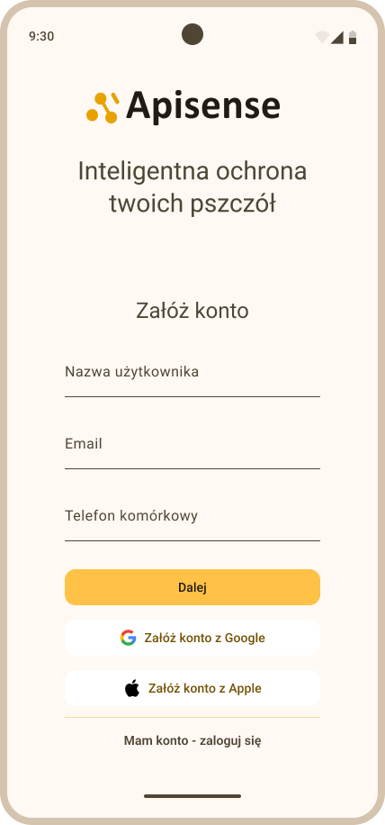
 <strong>Rys. 1</strong> Rejestracja do Systemu Apisense Pro AI - widok startowy Załóż konto

- W wyznaczonych polach wprowadź następujące dane:

    - Nazwa użytkownika
    - Adres email
    - Numer telefonu komórkowego

    Potwierdź zapoznanie się z regulaminem oraz polityką prywatności zaznaczając odpowiednie pole, a następnie kliknij przycisk *Dalej* (**Rys. 2**).

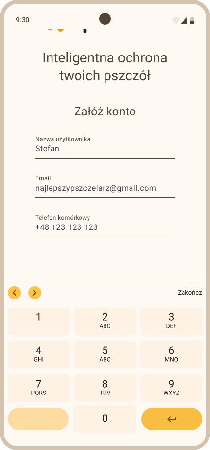
 <strong>Rys. 2</strong> Rejestracja do Systemu Apisense Pro AI - przykład poprawnie wypełnionych danych do rejestracji w widoku Załóż konto

- Zostanie wyświetlony kolejny widok - Utwórz hasło. W tym widoku zostaniesz poproszony o utworzenie silnego hasła (**Rys. 3**), które będziesz potem wykorzystywał, by zalogować się do systemu. Hasło musi zawierać:

    - Co najmniej 1 znak specjalny (np. #, $, %, \_)
    - Co najmniej 1 cyfrę
    - Co najmniej 1 wielką literę
    - Co najmniej 8 znaków

    Następnie wpisz ponownie to samo hasło w pole *Powtórz hasło* i przejdź do kolejnego kroku klikając przycisk *Dalej*.

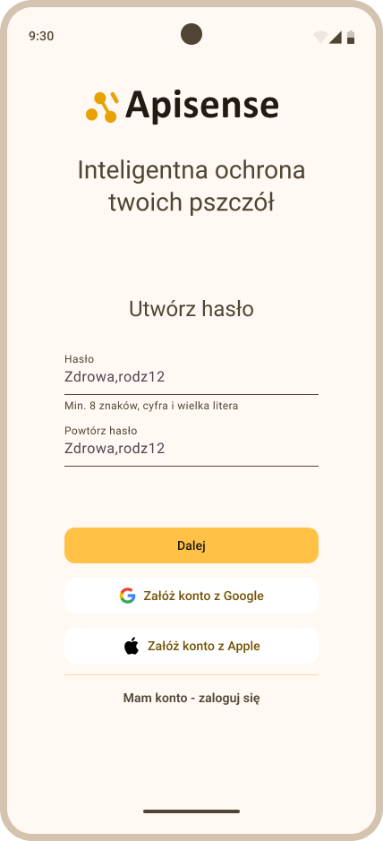
 <strong>Rys. 3</strong> Rejestracja do Systemu Apisense Pro AI - przykład poprawnie wypełnionych pól w widoku Utwórz hasło

- To już ostatni etap rejestracji. W tym kroku odpowiedz na pytanie od ilu lat zajmujesz się pszczelarstwem zaznaczając jedną z dwóch możliwych odpowiedzi, po czym kliknij przycisk *Dalej* (**Rys. 4**).

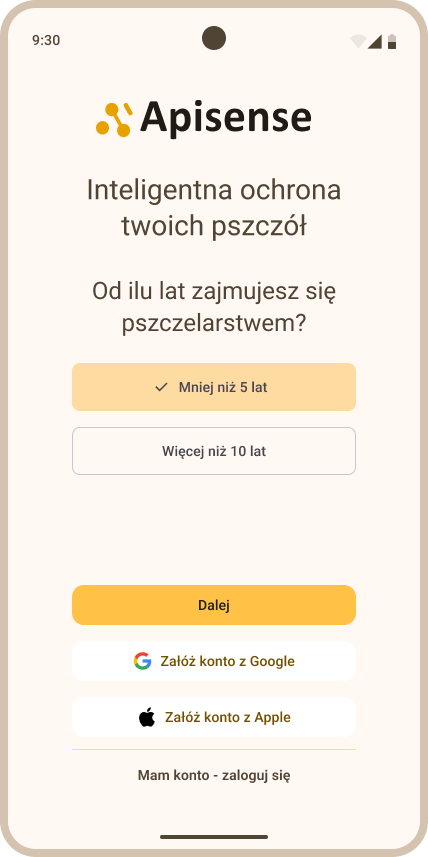
 <strong>Rys. 4</strong> Rejestracja do Systemu Apisense Pro AI - przykład odpowiedzi na pytanie o doświadczenie

- Jeśli wszystko przebiegło pomyślnie powinieneś zobaczyć poniższy ekran startowy - Witamy w Apisense! (**Rys. 5**):

 <strong>Rys. 5</strong> Ekran startowy po pomyślnej rejestracji do Systemu Apisense Pro AI - Witamy w Apisense!

### 2. Logowanie

Jeżeli posiadasz już konto w Systemie Apisense Pro AI postępuj zgodnie z poniższymi krokami:

- Uruchom aplikację mobilną Apisense lub przejdź pod podany adres: [Apisense Pro AI](https://app.apisense.ai/).

- W widoku *Zaloguj się* (**Rys. 6**), w wyznaczone pola wprowadź odpowiednie dane, podane podczas rejestracji do systemu:

    - nazwa użytkownika
    - hasło

    Następnie kliknij przycisk *Zaloguj się*, po czym powinieneś zobaczyć widok startowy aplikacji Apisense - zakładkę Pasieki.

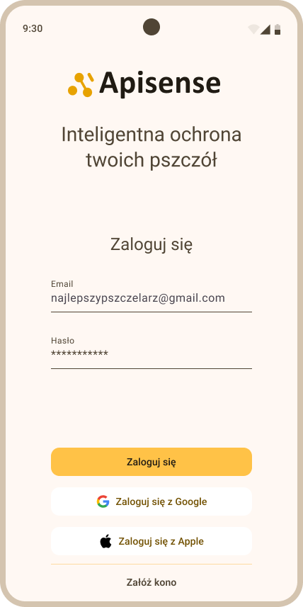
 <strong>Rys. 6</strong> Logowanie do Systemu Apisense Pro AI - widok Zaloguj się

______________________________________________________________________

## Zarządzanie pasieką

### 1. Pasieka

#### 1.1 Dodawanie pasieki

> **Wideo (PL):** [Apisense Manual PL — 02 · Dodaj pasiekę](https://www.youtube.com/shorts/wJrFummpo7Y)

- W zakładce **Pasieki** (widok startowy po zalogowaniu do aplikacji Apisense) kliknij zakładkę *Dodaj pasiekę* znajdującą się w menu na dole ekranu lub - jeśli jeszcze nie masz żadnej pasieki - żółty przycisk *Dodaj pasiekę* widoczny w centrum ekranu (**Rys. 7**).

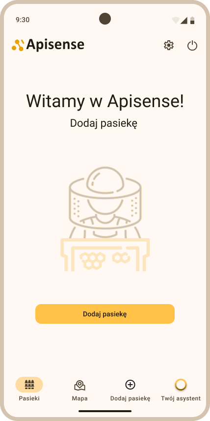
 <strong>Rys. 7</strong> Dodawanie pasieki - widok startowy Pasieki

- W rezultacie zostanie wyświetlony widok *Dodaj pasiekę* (**Rys. 8**). W tym widoku wypełnij następujące pola:

    - **Nazwa** — nazwa pasieki, która będzie wyświetlana w panelu,
    - **Skrót nazwy** — domyślnie ustawiony skrót nazwy pasieki (składający się maksymalnie z 3 znaków), możesz go zmienić,
    - **Numer seryjny** - to numer identyfikacyjny urządzenia. Kliknij w ikonę kodu QR znajdującą się w prawej części tego pola i zeskanuj kod QR z naklejki umieszczonej na Apisense Hub. Kolejne pole *Kod potwierdzający* zostanie wypełnione automatycznie.
    - **Kod potwierdzający** - zostanie wypełniony automatycznie, po poprawnym zeskanowaniu kodu QR.

     Pola *Nazwa* oraz *Skrót nazwy* będą mogły zostać zedytowane przez użytkownika w dowolnym momencie.

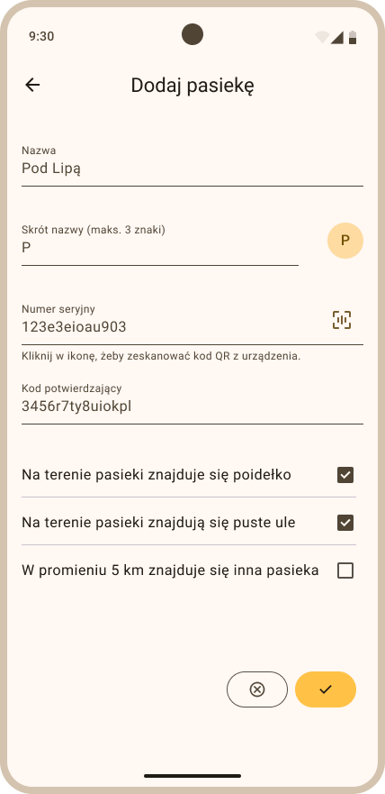
 <strong>Rys. 8</strong> Dodawanie pasieki z powiązanym Apisense Hub w systemie

**Po uzupełnieniu niezbędnych danych kliknij żółty przycisk na dole ekranu, potwierdzający utworzenie pasieki z powiązanym urządzeniem Apisense Hub.**

- Jeśli utworzenie pasieki się powiodło, zostaniesz przekierowany do widoku Pasieki, a na Twojej liście pasiek pojawi się pasieka, którą właśnie utworzyłeś (**Rys. 9**).

  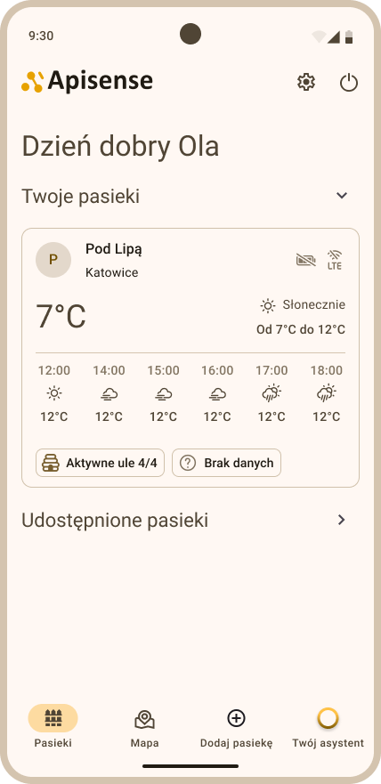
   <strong>Rys. 9</strong> Pomyślnie dodana pasieka z powiązanym Apisense Hub w widoku pasiek w systemie

#### 1.2 Edycja pasieki

- W zakładce **Pasieki** (widok startowy po zalogowaniu do aplikacji Apisense), kliknij w kafelek z wybraną pasieką. W rezultacie zostanie otwarta zakładka *Ule* (**Rys. 10**).

  
  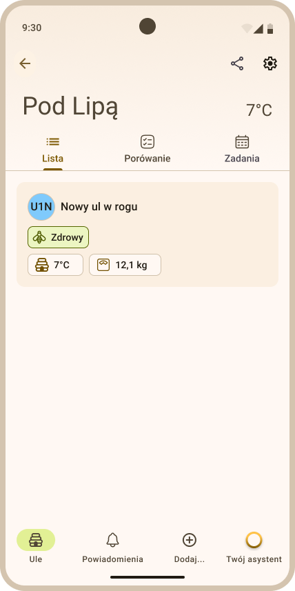
   <strong>Rys. 10</strong> Zakładka Pasieki z jedną pasieką oraz zakładka Ul z jednym ulem

- W zakładce *Ule* kliknij ikonę koła zębatego, znajdującą się w prawym górnym rogu ekranu. Po kliknięciu zębatki zostanie otwarty widok *Ustawienia pasieki* (**Rys. 11**).

  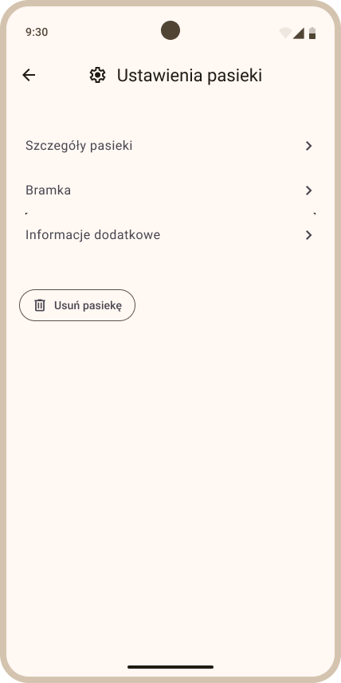
   <strong>Rys. 11</strong> Widok Ustawienia pasieki

- Widok *Ustawienia pasieki* jest podzielony na 2 sekcje. Aby zaktualizować informacje należące do danej sekcji, należy kliknąć w jej nagłówek. Dostępne sekcje:

    - **Szczegóły pasieki** - sekcja umożliwia edycję takich parametrów jak nazwa pasieki oraz jej skrót. W tym celu należy kliknąć w wybrane pole i wprowadzić zmiany.
    - **Hub** - sekcja dotyczy parametrów związanych z urządzeniem Apisense Hub. Informacji zawartych w tej sekcji nie można edytować.

- Aby zapisać wprowadzone zmiany należy kliknąć żółty przycisk, znajdujący się w prawym dolnym rogu ekranu (**Rys. 12**).

  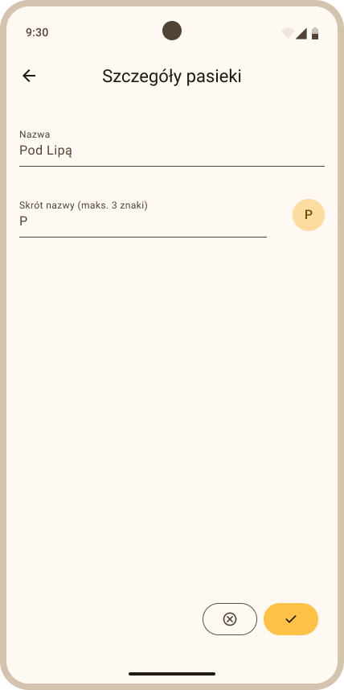
   <strong>Rys. 12</strong> Ustawienia pasieki - edycja danych w sekcji Szczegóły pasieki

#### 1.3 Usuwanie pasieki

- W zakładce **Pasieki** (widok startowy po zalogowaniu do aplikacji Apisense), kliknij w kafelek z wybraną pasieką. W rezultacie zostanie otwarta zakładka *Ule* (**Rys. 13**).

  
  
   <strong>Rys. 13</strong> Zakładka Pasieki z jedną pasieką oraz zakładka Ul z jednym ulem

- W zakładce *Ule* kliknij ikonę koła zębatego, znajdującą się w prawym górnym rogu ekranu. Po kliknięciu zębatki zostanie otwarty widok *Ustawienia pasieki* (**Rys. 14**).

  
   <strong>Rys. 14</strong> Widok Ustawienia pasieki

- W widoku *Ustawienia pasieki* kliknij przycisk *Usuń pasiekę*. W rezultacie zostanie wyświetlony widok *Usuń pasiekę* (**Rys. 15**), gdzie należy potwierdzić swój wybór przyciskiem *Tak, usuń*.

  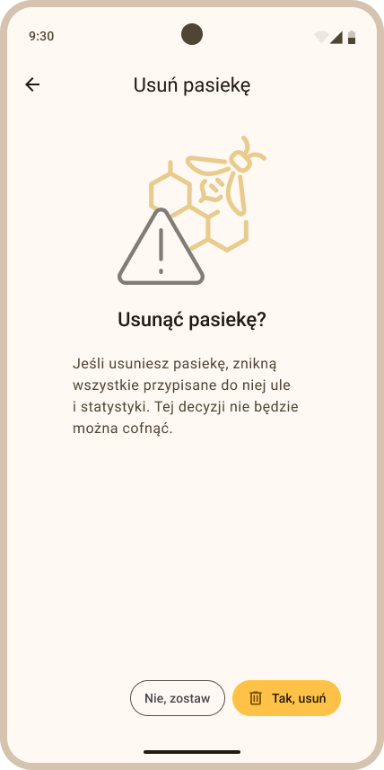
   <strong>Rys. 15</strong> Ustawienia pasieki - widok Usuń pasiekę

- Wraz z usuniętą pasieką usunięta zostaje również cała jej zawartość (ule, notatki, przeglądy itp.). Odpinane są także poszczególne urządzenia (Hub, Scale, VitalSensor) i zostaje wyczyszczona historia ich pomiarów. W związku z tym, przykładowo ten sam Apisense Hub będziesz mógł teraz wykorzystać podczas tworzenia nowej pasieki.

### 2. Ul

#### 2.1 Dodawanie ula

> **Wideo (PL):** [Apisense Manual PL — 03 · Dodaj ul](https://www.youtube.com/shorts/L_XWlMFRbbE)

- Będąc w zakładce Pasieki (widok startowy po zalogowaniu do aplikacji Apisense) kliknij kafelek z pasieką, do której chcesz dodać ul i przypisać urządzenia (Scale i VitalSensor). Po kliknięciu w kafelek zostanie wyświetlony widok pojedynczej pasieki (**Rys. 16**).

  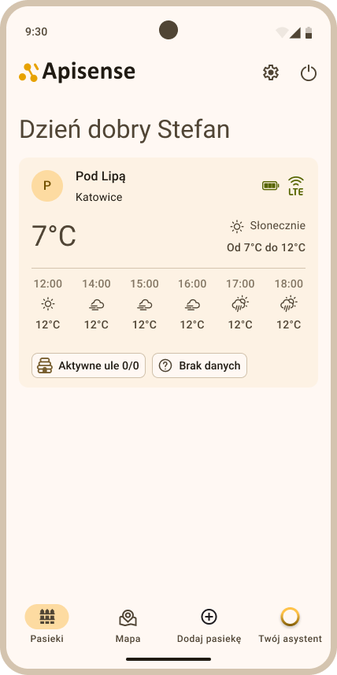
  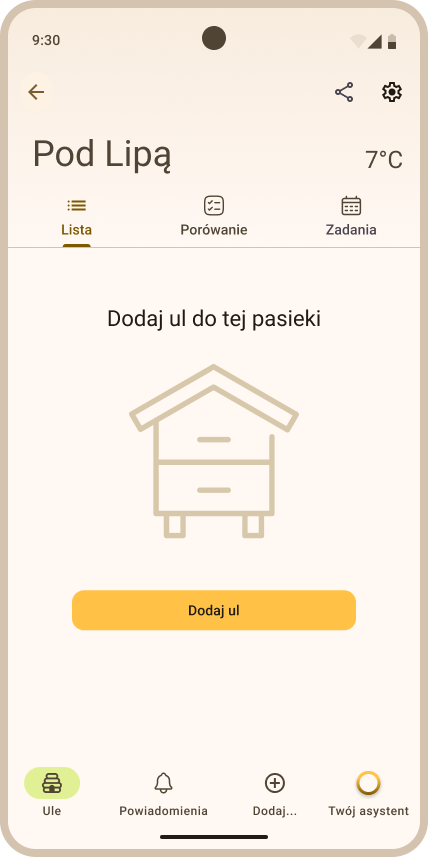
 <strong>Rys. 16</strong> Widok pasieki w zakładce Pasieki i widok pojedynczej pasieki (Ule)

- Aby dodać ul do tej pasieki kliknij zakładkę *Dodaj...* na dolnym pasku menu i wybierz opcję *Dodaj ul* (**Rys. 17**), w wyniku czego zostanie wyświetlony widok Dodaj ul (**Rys. 17**).

  
 <strong>Rys. 17</strong> Widok Ule - Przycisk Dodaj ul

- Wypełnij poszczególne pola w widoku Dodaj ul - sekcja **Szczegóły ula** (**Rys. 18**):

    - **Nazwa ula** - wpisz nazwę dla swojego ula - pod taką nazwą ul będzie wyświetlany w panelu.
    - **Maksymalna liczba ramek w korpusie gniazdowym** - podaj maksymalną liczbę ramek, które mogą zmieścić się w korpusie gniazdowym ula.
    - **Pole wyboru** - zaznacz, jeśli ul posiada dennicę higieniczną.

    Powyższe informacje będą mogły zostać zedytowane przez użytkownika w dowolnym momencie.

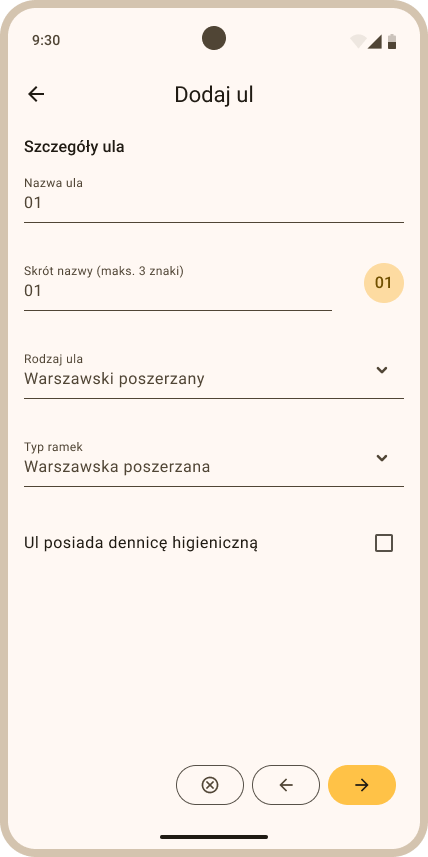
 <strong>Rys. 18</strong> Dodawanie ula w systemie - sekcja Szczegóły ula

- Aby przejść do kolejnego etapu dodawania ula kliknij żółty przycisk ze strzałką w prawo, znajdujący się na dole ekranu.

- **Informacje o matce pszczelej:** Na tym etapie dodawania ula należy wypełnić informacje o matce pszczelej (**Rys. 19**):

    - **Rok wychowu matki** - wybierz rok wychowu matki pszczelej z listy rozwijanej (kliknij strzałkę w dół widoczną przy tym polu po prawej stronie).
    - **Pochodzenie matki** - wybierz jedną z opcji dostępnej na liście rozwijanej (kliknij strzałkę w dół widoczną przy tym polu po prawej stronie).
    - **Sposób unasiennienia matki** - wybierz jedną z dostępnych opcji

    Powyższe informacje będą mogły zostać zedytowane przez użytkownika w dowolnym momencie.

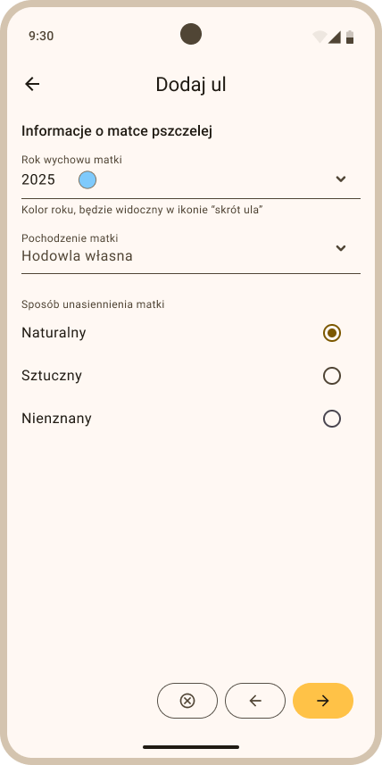
 <strong>Rys. 19</strong> Dodawanie ula w systemie - sekcja Informacje o matce pszczelej

- Następnie kliknij żółty przycisk ze strzałką w prawo, znajdujący się na dole ekranu, w celu przejścia do ostatniego kroku dodawania ula.

- **Wyposażenie:** Ostatni etap obejmuje powiązanie urządzeń z tym konkretnym ulem. **Uwaga:** Kluczowe jest, aby urządzenia skonfigurowane w ramach ula (Scale i VitalSensor) były w rzeczywistości zainstalowane w tym samym fizycznym ulu.

    Aby powiązać urządzenia z ulem wypełnij następujące pola:

    - **VitalSensor** - kliknij w ikonę kodu QR znajdującą się w prawej części tego pola i zeskanuj kod QR z naklejki umieszczonej na Apisense VitalSensor. Kolejne pole *Kod potwierdzający* zostanie wypełnione automatycznie.
    - **Kod potwierdzający** - zostanie wypełniony automatycznie, po poprawnym zeskanowaniu kodu QR.
    - **Scale** - kliknij w ikonę kodu QR znajdującą się w prawej części tego pola i zeskanuj kod QR z naklejki umieszczonej na Apisense Scale. Kolejne pole *Kod potwierdzający* zostanie wypełnione automatycznie.
    - **Kod potwierdzający** - zostanie wypełniony automatycznie, po poprawnym zeskanowaniu kodu QR.

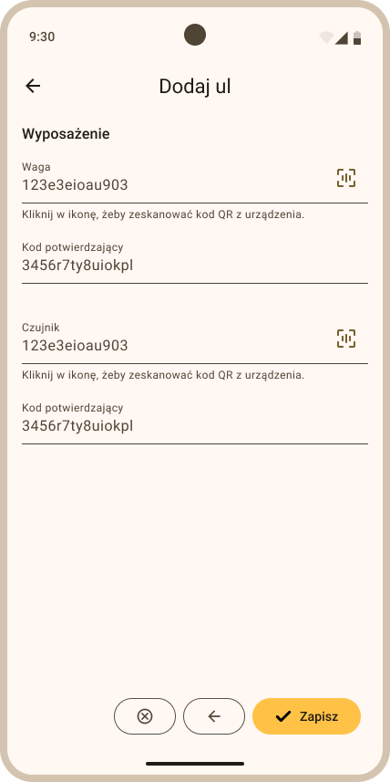
 <strong>Rys. 20</strong> Dodawanie ula w systemie - sekcja Wyposażenie

- Po wypełnieniu wszystkich sekcji i niezbędnych pól kliknij żółty przycisk *Zapisz*, aby dodać ul z powiązanymi urządzeniami (Scale, VitalSensor).

- Jeśli utworzenie ula się powiodło, zostaniesz przekierowany do widoku *Ule*, a na Twojej liście uli pojawi się ul, który właśnie utworzyłeś (**Rys. 21**).

  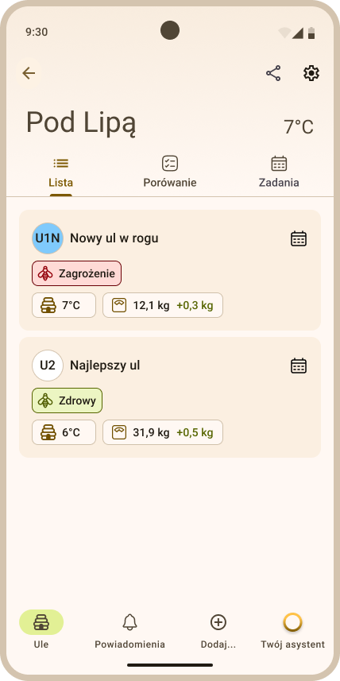
  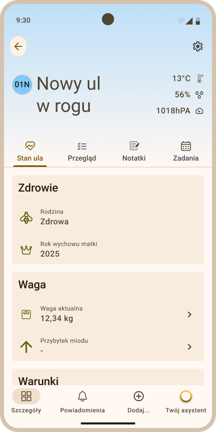
   <strong>Rys. 21</strong> Pomyślnie dodany ul z powiązanymi Apisense Scale oraz VitalSensor w widoku Ule oraz Szczegóły ula

#### 2.2 Edycja ula

- W zakładce **Pasieki** (widok startowy po zalogowaniu do aplikacji Apisense), kliknij w kafelek z wybraną pasieką. W rezultacie zostanie otwarta zakładka *Ule* (**Rys. 22**).

  
  
   <strong>Rys. 22</strong> Zakładka Pasieki z jedną pasieką oraz zakładka Ul z jednym ulem

- W zakładce *Ule* kliknij w kafelek z wybranym ulem, co spowoduje otwarcie zakładki *Szczegóły* (**Rys. 23**).

  
 <strong>Rys. 23</strong> Przykładowy widok zakładki Szczegóły ula

- Następnie kliknij w ikonę koła zębatego, zlokalizowaną w prawym górnym rogu zakładki *Szczegóły*, w wyniku czego zostanie wyświetlony widok *Ustawienia ula* (**Rys. 24**).

  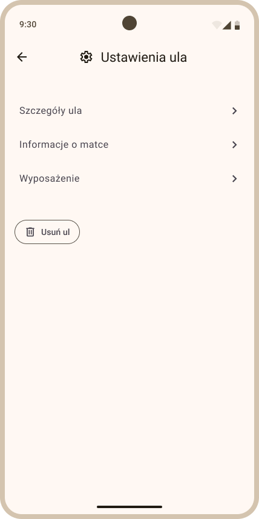
 <strong>Rys. 24</strong> Widok Ustawienia ula

- Widok *Ustawienia ula* jest podzielony na 3 sekcje. Aby zaktualizować informacje należące do danej sekcji, należy kliknąć w jej nagłówek. Dostępne sekcje:

    - **Szczegóły ula** - sekcja umożliwia edycję takich parametrów jak nazwa ula, maksymalna liczba ramek w korpusie gniazdowym oraz dennica higieniczna. W tym celu należy kliknąć w wybrane pole i wprowadzić zmiany lub zaznaczyć/odznaczyć kwadrat przy danym elemencie.

    - **Informacje o matce** - sekcja dotyczy danych związanych z matką pszczelą (rok wychowu, pochodzenie, sposób unasiennienia). Aby zaktualizować dane w tej sekcji należy wybrać odpowiednią pozycję z określonej listy rowijanej (np. Pochodzenie matki -> pozycja: Hodowla własna).

    - **Wyposażenie** - sekcja zawiera informacje na temat powiązanych urządzeń z ulem (VitalSensor, Scale). Sekcja umożliwia usunięcie przypisania urządzenia do tego ula. Aby to zrobić należy kliknąć przycisk *Odłącz VitalSensor*/*Odłącz Scale* w zależności od tego, które urządzenie ma zostać odpięte, a następnie potwierdzić wybór przy użyciu żółtego przycisku *Odłącz* (**Rys. 25**). Podczas odpinania urządzeń historia ich pomiarów zostaje domyślnie zachowana, co oznacza, że przeszłe dane pomiarowe będą dostępne na wykresach, dopóki ten ul nie zostanie usunięty. Aby wyczyścić historię pomiarów w ulu z odpinanego urządzenia użyj przełącznika. Jeżeli w skład wyposażenia ula nie wchodzi któreś z urządzeń (pola nie są wypełnione), z tego miejsca można również powiązać Scale/VitalSensor z ulem. W tym celu należy kliknąć ikonę kodu QR, znajdującą się w prawej części pola VitalSensor/Scale i zeskanować kod QR z odpowiednich urządzeń pomiarowych.

        

        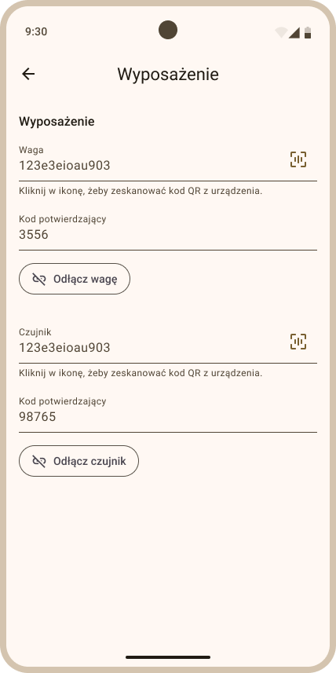
        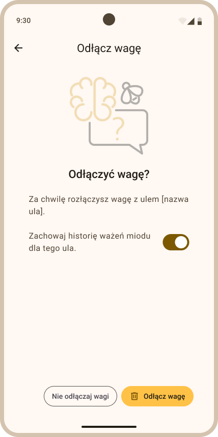
         <strong>Rys. 25</strong> Widok Ustawienia ula - sekcja Wyposażenie, potwierdzenie odłączenia Scale z zachowaniem historii pomiarów

- Aby zapisać wprowadzone zmiany w wybranej sekcji, należy kliknąć żółty przycisk, znajdujący się w prawym dolnym rogu ekranu.

#### 2.3 Usuwanie ula

- W zakładce **Pasieki** (widok startowy po zalogowaniu do aplikacji Apisense), kliknij w kafelek z wybraną pasieką. W rezultacie zostanie otwarta zakładka *Ule* (**Rys. 26**).

  
  
   <strong>Rys. 26</strong> Zakładka Pasieki z jedną pasieką oraz zakładka Ul z jednym ulem

- W zakładce *Ule* kliknij w kafelek z wybranym ulem, co spowoduje otwarcie zakładki *Szczegóły* (**Rys. 27**).

  
 <strong>Rys. 27</strong> Przykładowy widok zakładki Szczegóły ula

- Następnie kliknij w ikonę koła zębatego, zlokalizowaną w prawym górnym rogu zakładki *Szczegóły*, w wyniku czego zostanie wyświetlony widok *Ustawienia ula* (**Rys. 28**).

  
 <strong>Rys. 28</strong> Widok Ustawienia ula

- W widoku *Ustawienia ula* kliknij przycisk *Usuń ul*. W rezultacie zostanie wyświetlony widok *Usuń ul* (**Rys. 29**), gdzie należy potwierdzić swój wybór przyciskiem *Tak, usuń*.

  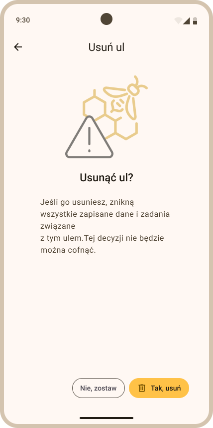
   <strong>Rys. 29</strong> Ustawienia ula - widok Usuń ul

- Wraz z usuniętym ulem usunięta zostaje również cała jego zawartość (notatki, przeglądy itp.). Odpinane są także poszczególne urządzenia (Scale, VitalSensor) i zostaje wyczyszczona historia ich pomiarów. W związku z tym, przykładowo ten sam Apisense VitalSensor będzie mógł zostać powiązany z innym ulem (który nie posiada tego typu urządzenia).

### 3. Dodawanie przeglądów

> **Wideo (PL):** [Apisense Manual PL — 04 · Dodaj przegląd](https://www.youtube.com/shorts/1kHqvSh838o)

- Będąc w zakładce Pasieki (widok startowy po zalogowaniu do aplikacji Apisense) kliknij kafelek z pasieką. Po kliknięciu w kafelek zostanie wyświetlony widok Ule (**Rys. 30**).

  
  
 <strong>Rys. 30</strong> Widok pasieki w zakładce Pasieki i widok Ule

- Następnie kliknij w kafelek ula, dla którego chcesz wykonać przegląd. W rezultacie zostanie wyświetlony widok Szczegóły ula (**Rys. 31**).

  
 <strong>Rys. 31</strong> Widok Szczegóły ula

- Aby dodać przegląd, należy z dolnego menu wybrać opcję *Dodaj...*, a następnie *Przegląd* (**Rys. 32**), w wyniku czego zostanie wyświetlony widok *Dodaj przegląd* (**Rys. 32**).

  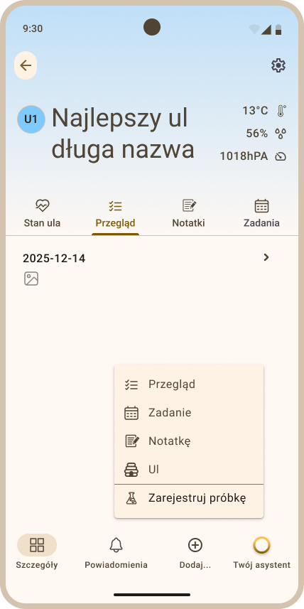
 <strong>Rys. 32</strong> Widok Szczegóły ula - Przycisk Dodaj Przegląd

- W widoku Dodaj przegląd (**Rys. 33**) załącz po 2 zdjęcia dla:

  - ramki z czujnikiem,
  - skrajnej ramki na uchwytach, które dołączyliśmy.

Aby dodać zdjęcia kliknij przycisk *Dodaj zdjęcie*, a następnie wybierz opcję *Zrób zdjęcie* lub *Dodaj zdjęcie z galerii*.

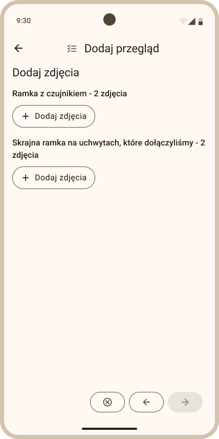
 <strong>Rys. 33</strong> Dodawanie przeglądu - dodawanie zdjęć

- Po poprawnym dodaniu zdjęć kliknij żółtą strzałkę, umieszczoną w prawym dolnym rogu, co spowoduje przejście do kolejnego kroku.

- Następnie odpowedz na kilka pytań (**Rys. 34**). Zaznacz odpowiedź Tak, Nie lub Pomiń.

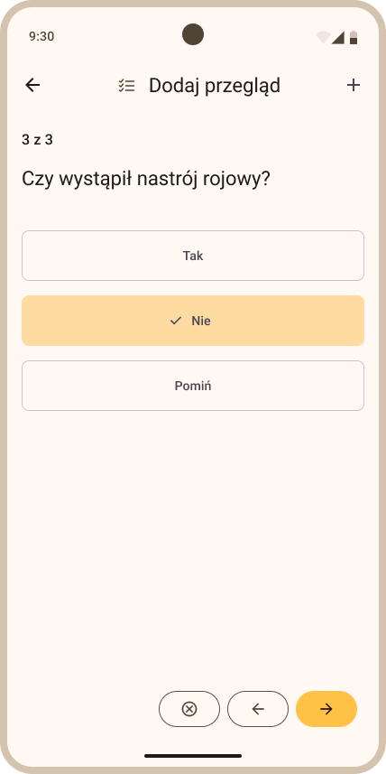
 <strong>Rys. 34</strong> Dodawanie przeglądu - przykładowe pytanie

- Aby przejść do następnego pytania przeglądu, kliknij żółty przycisk ze strzałką w prawo, znajdujący się na dole ekranu.
- Po udzieleniu odpowiedzi na wszystkie pytania przeglądu zostanie wyświetlony ostatni widok (**Rys. 35**), w którym należy wybrać datę przeglądu (domyślnie ustawiona jest aktualna data).

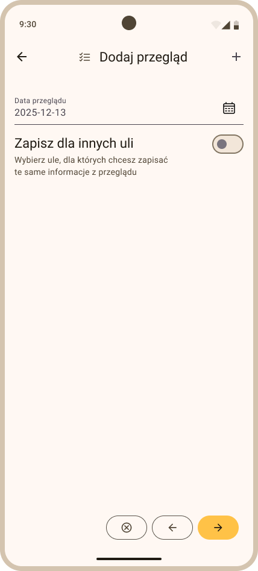
 <strong>Rys. 35</strong> Dodawanie przeglądu - zapisywanie przeglądu

- Aby zapisać przegląd kliknij żółty przycisk *Zakończ przegląd*, znajdujący się w prawym dolnym rogu ekranu. Zapisany przegląd zostanie wyświetlony na liście przeglądów w zakładce Szczegóły ula > Przegląd (**Rys. 36**).

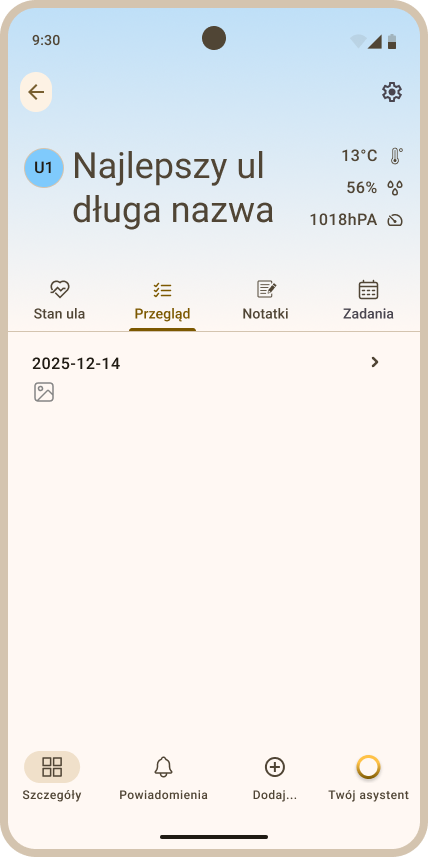
 <strong>Rys. 36</strong> Przegląd na liście przeglądów w ulu

### 4. Notatki

#### 4.1 Dodawanie notatki

> **Wideo (PL)** — seria *Apisense Manual PL*  
> · [05 · Dodaj notatkę tekstową](https://www.youtube.com/shorts/nZdzxrNIyZA)  
> · [06 · Dodaj notatkę głosową](https://www.youtube.com/shorts/_QLzIfwcRMs)

Poniższe kroki odnoszą się do dodawania notatki z poziomu ula.

- W zakładce Pasieki (widok startowy po zalogowaniu do aplikacji Apisense) kliknij kafelek z pasieką. Po kliknięciu w kafelek zostanie wyświetlony widok Ule (**Rys. 37**).

  
  
 <strong>Rys. 37</strong> Widok pasieki w zakładce Pasieki i widok Ule

- Następnie kliknij w kafelek ula, dla którego chcesz dodać notatkę. W rezultacie zostanie wyświetlony widok Szczegóły ula (**Rys. 38**).

  
 <strong>Rys. 38</strong> Widok Szczegóły ula

- Aby dodać notatkę, należy z dolnego menu wybrać opcję *Dodaj...*, a następnie *Notatkę* (**Rys. 39**), w wyniku czego zostanie wyświetlony widok Dodaj notatkę (**Rys. 40**).

  
 <strong>Rys. 39</strong> Widok Szczegóły ula - Przycisk Dodaj Notatkę

- W widoku Dodaj notatkę (**Rys. 40**) wypełnij następujące pola:

    - **Data** - wybierz datę z jaką zapisać notatkę (domyślnie aktualna).
    - **Tytuł** - wpisz tytuł notatki (pole opcjonalne).
    - **Notatka** - Wpisz treść notatki (tekst) lub kliknij ikonę mikrofonu znajdujacą sie po prawej stronie w tym polu, aby nagrać notatkę głosową.

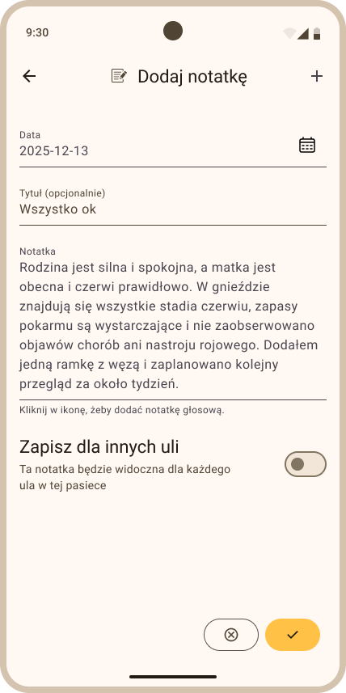
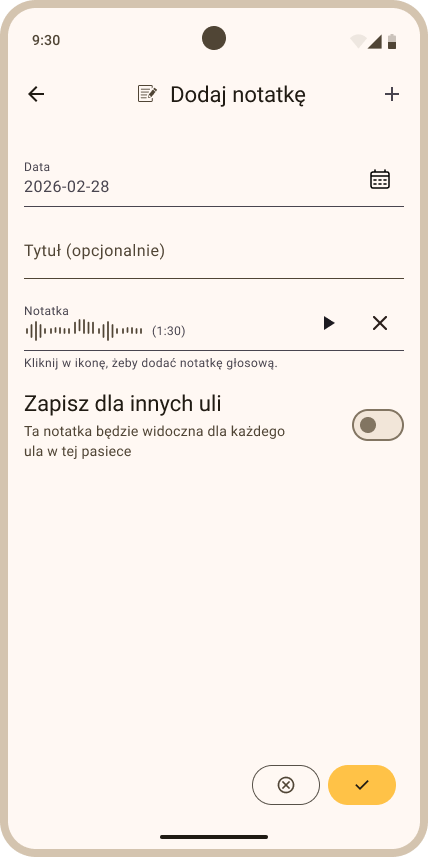
 <strong>Rys. 40</strong> Dodawanie notatki tekstowej lub głosowej

- Do notatki możesz również dodać zdjęcie lub nagranie. W tym celu kliknij przycisk *+*, znajdujący się w prawym górnym rogu widoku Dodaj notatkę (**Rys. 41**).

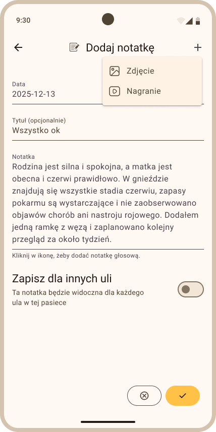
 <strong>Rys. 41</strong> Dodawanie notatki tekstowej z załącznikami

- Aby zapisać notatkę kliknij żółty przycisk, znajdujący się w prawym dolnym rogu ekranu. Zapisana notatka zostanie wyświetlona na liście notatek w zakładce Szczegóły ula > Notatki (**Rys. 42**).

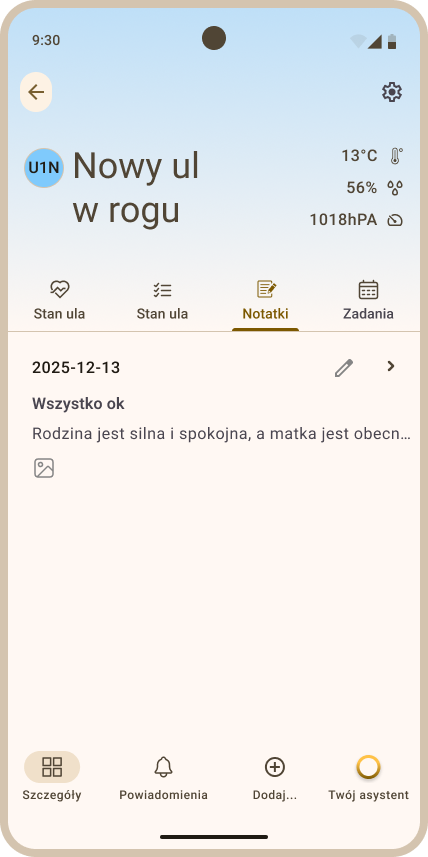
 <strong>Rys. 42</strong> Notatka na liście notatek w ulu

**Uwaga — dodawanie notatki z poziomu pasieki:** Notatka może zostać również utworzona z poziomu pasieki. W tym celu należy przejść następującą ścieżkę: w zakładce *Pasieki* kliknąć wybraną pasiekę, następnie w zakładce *Ule* wybrać z dolnego menu opcję *Dodaj...* i opcję *Notatka*. W rezultacie taka sama notatka zostanie automatycznie zapisana do wszystkich uli w wybranej pasiece i będzie widoczna na liście notatek każdego ula (*Szczegóły > Notatki*). **Edycja** takiej notatki dotyczy wyłącznie kopii w konkretnym ulu — zmiany w jednej notatce nie będą widoczne w pozostałych notatkach dodanych w ten sposób. Również **usuwając** taką notatkę w jednym z uli, notatki w pozostałych ulach zostaną nienaruszone.

#### 4.2 Edycja notatki

> **Wideo (PL):** [06 · Edycja notatki głosowej](https://www.youtube.com/shorts/_QLzIfwcRMs)

- W zakładce Pasieki (widok startowy po zalogowaniu do aplikacji Apisense) kliknij kafelek z pasieką. Po kliknięciu w kafelek zostanie wyświetlony widok Ule (**Rys. 43**).

  
  
 <strong>Rys. 43</strong> Widok pasieki w zakładce Pasieki i widok Ule

- Następnie kliknij w kafelek ula, w którym chcesz zedytować notatkę. W rezultacie zostanie wyświetlony widok Szczegóły ula (**Rys. 44**).

  
 <strong>Rys. 44</strong> Widok Szczegóły ula

- Przejdź do zakładki *Notatki* (górne menu), w wyniku czego zostanie otwarty widok z listą notatek przypisanych do wybranego ula (**Rys. 45**)

 <strong>Rys. 45</strong> Notatka na liście notatek w ulu

- Aby zaktualizować notatkę, kliknij ikonę ołówka znajdującą się przy notatce, która wymaga edycji. Po kliknięciu w ikonę ołówka zostanie wyświetlony widok *Edycja notatki* (**Rys. 46**).

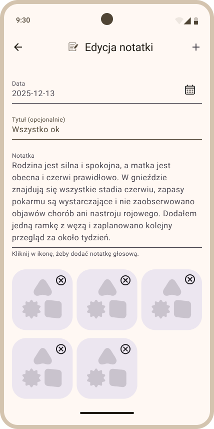
 <strong>Rys. 46</strong> Widok Edycja notatki

- W widoku *Edycja notatki* można zaktualizować wartości dla następujących pól:

    - **Data** - kliknij w ikonę kalendarza i wybierz odpowiednią datę.
    - **Tytuł** - wpisz nowy tytuł w wyznaczone miejsce.
    - **Notatka** - zmień treść notatki - zmodyfikuj tekst lub usuń go i nagraj notatkę głosową.
    - Dodaj lub usuń zdjęcie/nagranie przy użyciu *+/X*.

- Po wprowadzeniu zmian należy kliknąć żółty przycisk umieszczony w prawym dolnym rogu, aby zapisać zmodyfikowaną notatkę.

#### 4.3 Usuwanie notatki

- W zakładce Pasieki (widok startowy po zalogowaniu do aplikacji Apisense) kliknij kafelek z pasieką. Po kliknięciu w kafelek zostanie wyświetlony widok Ule (**Rys. 47**).

  
  
 <strong>Rys. 47</strong> Widok pasieki w zakładce Pasieki i widok Ule

- Następnie kliknij w kafelek ula, z którego chcesz usunąć notatkę. W rezultacie zostanie wyświetlony widok Szczegóły ula (**Rys. 48**).

  
 <strong>Rys. 48</strong> Widok Szczegóły ula

- Przejdź do zakładki *Notatki* (górne menu), w wyniku czego zostanie otwarty widok z listą notatek przypisanych do wybranego ula (**Rys. 49**)

 <strong>Rys. 49</strong> Notatka na liście notatek w ulu

- Aby usunąć notatkę złap i przesuń wiersz z wybraną notatką w lewą stronę. W efekcie po prawej stronie w tym wierszu zostanie wyświetlony czerwony przycisk z ikoną kosza. Kliknij przycisk z ikoną kosza (**Rys. 50**) oraz wybierz opcję *Usuń* na komunikacie, który zostanie wtedy wyświetlony żeby potwierdzić usunięcie notatki. 

 <strong>Rys. 50</strong> Usuwanie notatki z listy notatek w ulu

### 5. Potwierdzanie chorób

Gdy system Apisense Pro AI zgłosi zagrożenie (np. Nosemoza), w aplikacji pojawią się **alarmy** w zakładce *Powiadomienia* z opisem i zaleceniami. Potwierdzając wykrytą chorobę w aplikacji, ułatwiasz systemowi dopasowanie komunikatów do rzeczywistych warunków w Twojej pasiece.

#### 5.1 Potwierdzanie chorób z poziomu pasieki

- W zakładce Pasieki (widok startowy po zalogowaniu do aplikacji Apisense) kliknij kafelek z pasieką, w której wykryto zagrożenie (czerwona ikonka z pszczołą i napisem Zagrożenie na kafelku z pasieką). Po kliknięciu w kafelek zostanie wyświetlony widok Ule (**Rys. 51**).

  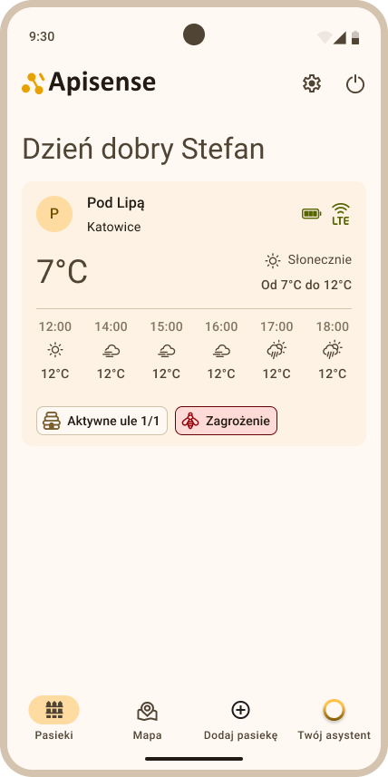
  
 <strong>Rys. 51</strong> Widok pasieki z zagrożeniem w zakładce Pasieki i widok Ule

- Następnie wybierz zakładkę *Powiadomienia* z dolnego menu. W efekcie zostanie wyświetlona zakładka *Problemy*, a w niej lista z aktualnymi oraz historycznymi problemami wykrytymi w tej pasiece (lista chorób z wszystkich uli w pasiece, **Rys. 52**).

  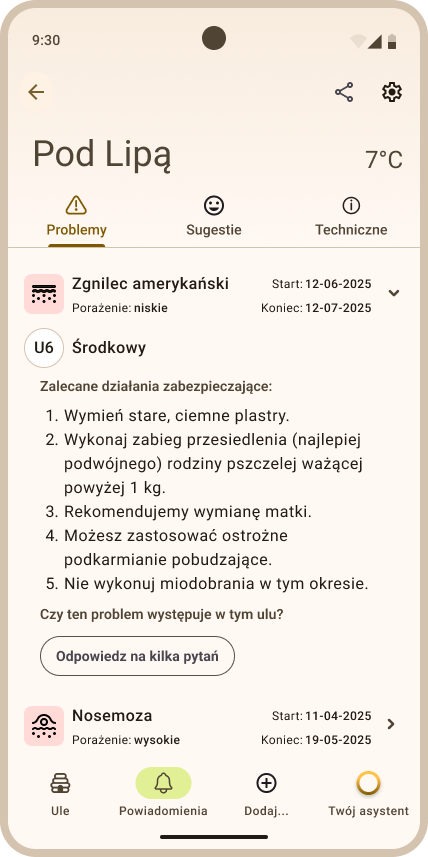
 <strong>Rys. 52</strong> Zakładka Problemy

- Przejdź do szczegółów wykrytej choroby, klikając na wiersz z chorobą np. Zgnilec amerykański (**Rys. 53**). Po przejściu do szczegółów zobaczysz czas trwania choroby, poziom jej porażenia, zalecane działania zabezpieczające oraz przycisk *Odpowiedz na kilka pytań* (zakładka *Zalecenia*), a także wcześniej udzielone odpowiedzi (zakładka *Odpowiedzi*).

  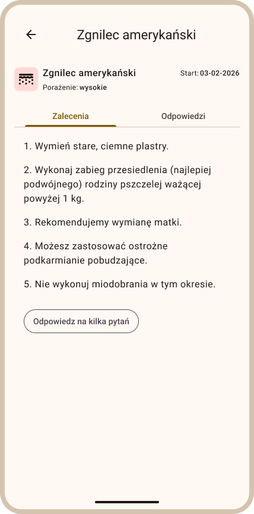
 <strong>Rys. 53</strong> Potwierdź chorobę - szczegóły choroby

- Aby potwierdzić chorobę wykrytą przez system, kliknij przycisk *Odpowiedz na kilka pytań*. Po kliknięciu w przycisk zostanie wyświetlony widok Odpowiedz na kilka pytań (**Rys. 54**). Następnie odpowiedz na wszystkie pytania, wybierając jedną z dostępnych opcji: Tak, Nie lub Pomiń.

  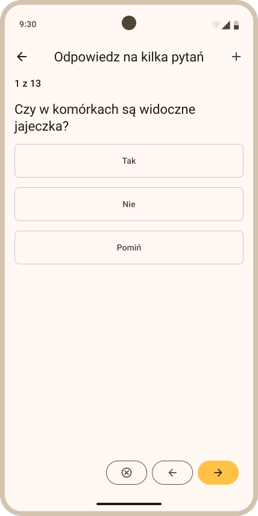
 <strong>Rys. 54</strong> Potwierdź chorobę - przykładowe pytanie

- Do odpowiedzi na poszczególne pytania możesz również załączyć zdjęcia lub nagrania. W tym celu kliknij przycisk *+*, znajdujący się w prawym górym rogu widoku Odpowiedz na kilka pytań (**Rys. 55**).

  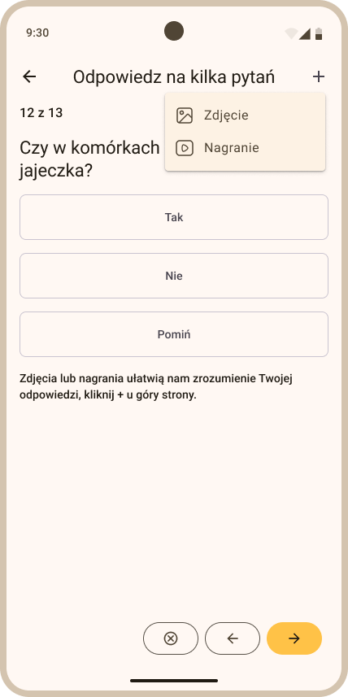
 <strong>Rys. 55</strong> Potwierdź chorobę - załączanie zdjęć i nagrań

- Aby przejść do kolejnego pytania, kliknij ikonkę żółtej strzałki skierowanej w prawo, znajdującą się w prawym dolnym rogu ekranu.

- Aby zapisać odpowiedzi i zakończyć formularz kliknij żółty przycisk *Zapisz*, umieszczony w prawym dolnym rogu ostatniego ekranu widoku Odpowiedz na kilka pytań (**Rys. 56**).

  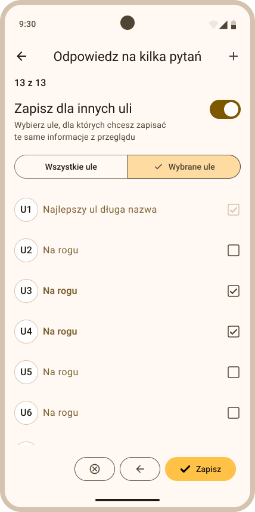
 <strong>Rys. 56</strong> Potwierdź chorobę - zapisanie formularza

#### 5.2 Potwierdzanie chorób z poziomu ula

> **Wideo (PL):** [Apisense Manual PL — 08 · Potwierdź chorobę w ulu](https://www.youtube.com/shorts/iGNXm9qu8X8) 

- W zakładce Pasieki (widok startowy po zalogowaniu do aplikacji Apisense) kliknij kafelek z pasieką, w której wykryto zagrożenie (czerwona ikonka z pszczołą i napisem Zagrożenie na kafelku z pasieką). Po kliknięciu w kafelek zostanie wyświetlony widok Ule (**Rys. 57**).

  
  
 <strong>Rys. 57</strong> Widok pasieki z zagrożeniem w zakładce Pasieki i widok Ule

- Kliknij w kafelek z ulem, w którym wykryto zagrożenie. Po kliknięciu w kafelek zostanie otwarta zakładka *Szczegóły* ula (**Rys. 58**).

  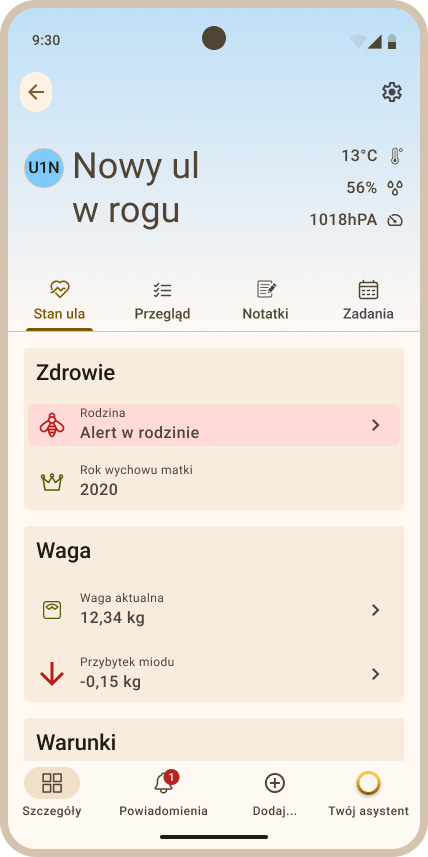
 <strong>Rys. 58</strong> Zakładka Szczegóły ula - ul z wykrytym zagrożeniem

- Następnie wybierz zakładkę *Powiadomienia* z dolnego menu. W efekcie zostanie wyświetlona zakładka *Problemy*, a w niej lista z aktualnymi oraz historycznymi problemami wykrytymi tylko w tym ulu (**Rys. 59**).

  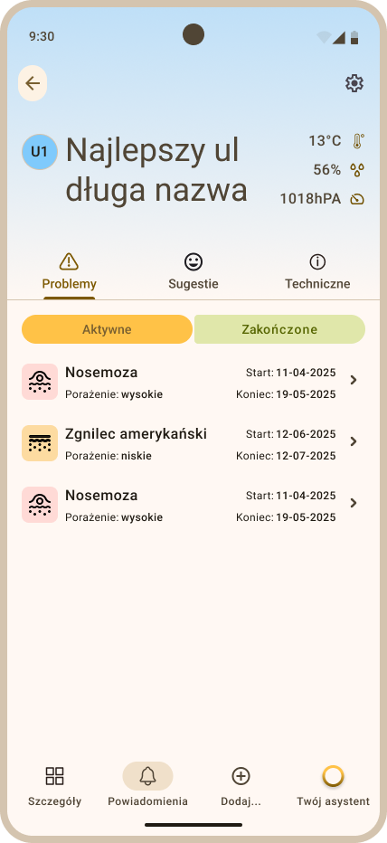
 <strong>Rys. 59</strong> Zakładka Problemy na poziomie pojedynczego ula

- Przejdź do szczegółów wykrytej choroby, klikając na wiersz z chorobą np. Zgnilec amerykański (**Rys. 60**). Po przejściu do szczegółów zobaczysz czas trwania choroby, poziom jej porażenia, zalecane działania zabezpieczające oraz przycisk *Odpowiedz na kilka pytań* (zakładka *Zalecenia*), a także wcześniej udzielone odpowiedzi (zakładka *Odpowiedzi*).

  
 <strong>Rys. 60</strong> Potwierdź chorobę - szczegóły choroby

- Aby potwierdzić chorobę wykrytą przez system, kliknij przycisk *Odpowiedz na kilka pytań*. Po kliknięciu w przycisk zostanie wyświetlony widok Odpowiedz na kilka pytań (**Rys. 61**). Następnie odpowiedz na wszystkie pytania, wybierając jedną z dostępnych opcji: Tak, Nie lub Pomiń.

  
 <strong>Rys. 61</strong> Potwierdź chorobę - przykładowe pytanie

- Do odpowiedzi na poszczególne pytania możesz również załączyć zdjęcia lub nagrania. W tym celu kliknij przycisk *+*, znajdujący się w prawym górym rogu widoku Odpowiedz na kilka pytań (**Rys. 62**).

  
 <strong>Rys. 62</strong> Potwierdź chorobę - załączanie zdjęć i nagrań

- Aby przejść do kolejnego pytania, kliknij ikonkę żółtej strzałki skierowanej w prawo, znajdującą się w prawym dolnym rogu ekranu.

- Aby zapisać odpowiedzi i zakończyć formularz kliknij żółty przycisk *Zapisz*, umieszczony w prawym dolnym rogu ostatniego ekranu widoku Odpowiedz na kilka pytań (**Rys. 63**).

  
 <strong>Rys. 63</strong> Potwierdź chorobę - zapisanie formularza

### 6. Rejestrowanie próbki

> **Wideo (PL):** [Apisense Manual PL — 07 · Zarejestruj próbkę](https://www.youtube.com/shorts/jqS9rvhd-X0)

- W zakładce Pasieki (widok startowy po zalogowaniu do aplikacji Apisense) kliknij kafelek z pasieką. Po kliknięciu w kafelek zostanie wyświetlony widok Ule (**Rys. 64**).

  
  
 <strong>Rys. 64</strong> Widok pasieki w zakładce Pasieki i widok Ule

- Następnie kliknij w kafelek ula, dla którego chcesz zarejestrować próbkę. W rezultacie zostanie wyświetlony widok Szczegóły ula (**Rys. 65**).

  
 <strong>Rys. 65</strong> Widok Szczegóły ula

- Aby zarejestrować próbkę, należy z dolnego menu wybrać opcję *Dodaj...*, a następnie *Zarejestruj próbkę* (**Rys. 66**), w wyniku czego zostanie wyświetlony widok Zarejestruj próbkę (**Rys. 67**). **Uwaga:** opcja *Zarejestruj próbkę* jest dostępna tylko dla uli z powiązanym urządzeniem Apisense VitalSensor.

  
 <strong>Rys. 66</strong> Przycisk Zarejestruj próbkę

- W widoku Zarejestruj próbkę należy uzupełnić następujące pola:

  - **Data pobrania próbki** - wprowadź datę, kiedy pobrałeś próbkę (domyślnie aktualna).
  - **Rodzaj badania** - wybierz odpowiednią pozycję z listy rozwijanej np. *Martwe pszczoły*.

- Po uzupełnieniu powyższych pól zostanie wyświetlony żółty przycisk *Wygeneruj kod*. Kliknij wspomniany przycisk a w polu *Kod badania* zostanie wygernerowany specjalny kod, który należy zapisać na próbce (**Rys. 67**). Tak przygotowaną próbkę z kodem należy następnie wysłać na następujący adres: **Uniwersytet Przyrodniczy w Lublinie, ul. Doświadczalna 54, 20-280 Lublin**.

  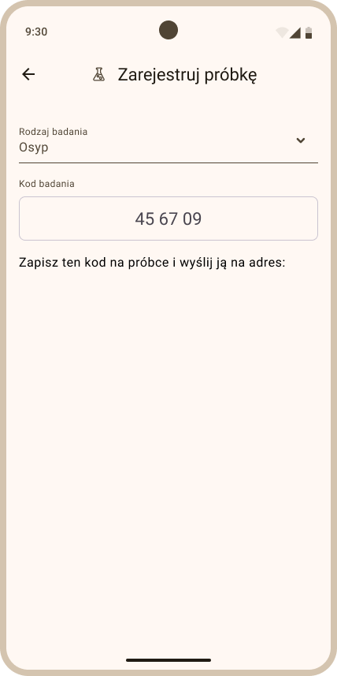
 <strong>Rys. 67</strong> Widok Zarejestruj próbkę

### 7. Badania

#### 7.1 Dodawanie badania 

- W zakładce Pasieki (widok startowy po zalogowaniu do aplikacji Apisense) kliknij kafelek z pasieką. Po kliknięciu w kafelek zostanie wyświetlony widok Ule (**Rys. 69**).

  
  
 <strong>Rys. 69</strong> Widok pasieki w zakładce Pasieki i widok Ule

- Następnie kliknij w kafelek ula, dla którego chcesz dodać badanie. W rezultacie zostanie wyświetlony widok Szczegóły ula (**Rys. 70**).

  
 <strong>Rys. 70</strong> Widok Szczegóły ula

- Aby dodać badanie, należy z dolnego menu wybrać opcję *Dodaj...*, a następnie *Badanie* (**Rys. 71**), w wyniku czego zostanie wyświetlony widok Dodaj badanie (**Rys. 72**). 

  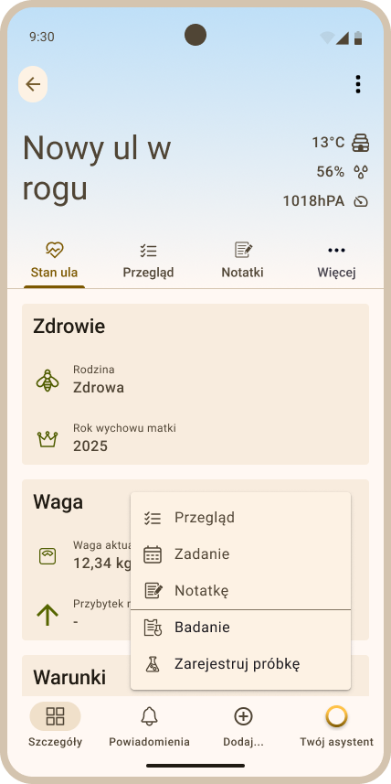
 <strong>Rys. 71</strong> Przycisk Dodaj badanie

- W widoku Dodaj badanie (**Rys. 72**) uzupełnij następujące pola:

    - **Data badania** — wybierz datę wykonania badania.
    - **Rodzaj badania** — wybierz z listy rozwijanej jedną z dostępnych opcji np. Osyp.
    - **Zdjęcia i informacje uzupełniające** — po wyborze rodzaju badania wykonaj lub wgraj wymaganą liczbę zdjęć oraz uzupełnij pola liczbowe zgodnie z komunikatami na ekranie.

  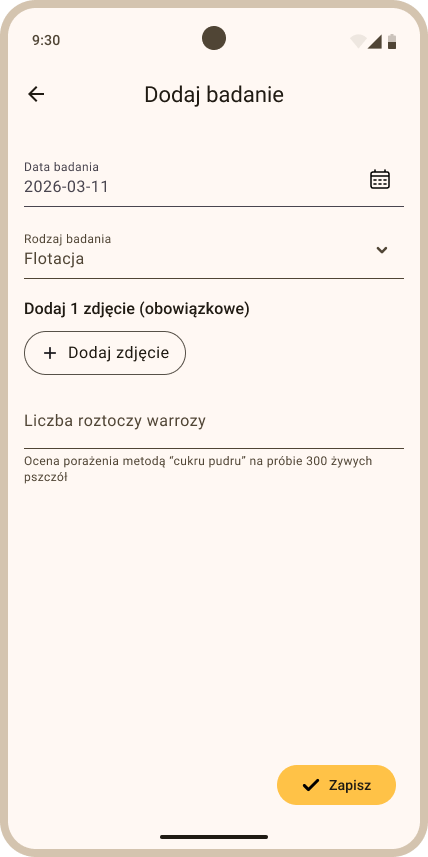
 <strong>Rys. 72</strong> Widok Dodaj badanie, rodzaj: Flotacja

- Zapisz badanie, korzystając z żółtego przycisku zapisu umieszczonego w prawej, dolnej części ekranu. Zapisane badanie zostanie wyświetlone na liście badań w zakładce Szczegóły ula > Więcej (górne menu) > Badania (**Rys. 73**).

  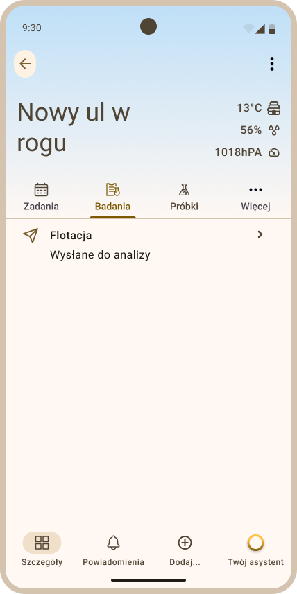
 <strong>Rys. 73</strong> Zapisane badanie na liście badań w ulu

______________________________________________________________________

## Panel główny systemu

### 1. Omówienie listy pasiek (zakładka Pasieki)

**Zakładka *Pasieki*** to podstawowa zakładka w aplikacji Apisense, którą zobaczysz zaraz po zalogowaniu się do systemu (**Rys. 74**).

  
 <strong>Rys. 74</strong> Zakładka Pasieki - przykładowy widok pasiek

**Najważniejsze informacje:**

- W zakładce *Pasieki* znajdują się wszystkie Twoje pasieki.

- Każda pasieka prezentowana jest w formie pojedynczego, przejrzystego kafelka, zawierającego kluczowe, odpowiednio zagregowane informacje.

- Kafelki pasiek są prezentowane w przejrzystej formie.

- Na każdym kafelku pasieki są wyświetlane następujące informacje:

    - nazwa pasieki wraz ze skrótem nazwy,

    - poziom baterii Apisense Hub,

    - poziom sygnału LTE Apisense Hub,

    - aktualna pogoda,

    - liczba aktywnych uli - liczba uli, które posiadają co najmniej jedno urządzenie (Scale, VitalSensor) poprawnie komunikujące się z Apisense Hub,

    - stan rodziny pszczelej - informujący o tym, czy rodzina w pasiece jest w zupełności zdorwa lub czy w jakimś ulu zostało wykryte zagrożenie,

    Więcej informacji na temat interpretacji poszczególnych statusów znajdziesz w rozdziale [7. Interpretacja statusów, pomiarów, ikonek, kolorów na poszczególnych etapach](#interpretacja-statusow)

- Kliknięcie w kafelek pasieki otwiera wnętrze pasieki - listę uli ([Zakładka Ule](#zakladka-ule)).

### 2. Omówienie mapy pasiek (zakładka Mapa)

**Zakładka Mapa** prezentuje lokalizacje wszystkich pasiek na mapie, do których użytkownik posiada dostęp (**Rys. 75**). Mapa ułatwia logistykę, planowanie wizyt i szybkie zlokalizowanie pasiek wymagających interwencji.

  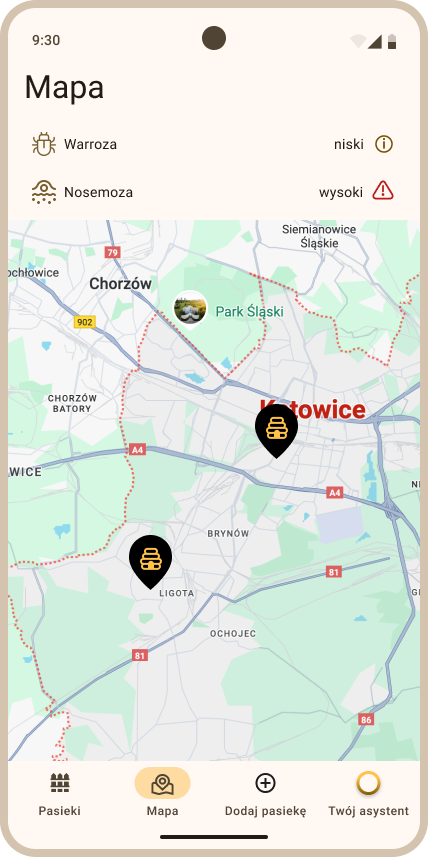
 <strong>Rys. 75</strong> Zakładka Mapa - przykładowy widok lokalizacji pasiek

**Najważniejsze informacje:**

- Aby przejść do tej zakładki należy kliknąć opcję *Mapa*, widoczną na dolnym menu zaraz po zalogowaniu się do aplikacji Apisense.
- Na mapie wyświetlane są markery określające lokalizacje pasiek użytkownika.
- Widok mapy można filtrować według problemów wykrytych w pasiekach. W tym celu należy kliknąć opcję np. *Warroza* znajdującą się powyżej mapy, w wyniku czego widok mapy zostanie ograniczony tylko do pasiek, w których występuje zagrożenie tą chorobą.

### 3. Omówienie listy uli (zakładka Ule)

Na liście uli znajdziesz wszytskie ule, które zostały przypisane do wybranej pasieki. Do zakładki *Ule* możesz przejść bezpośrednio z zakładki *Pasieki*, po kliknięciu w kafelek z wybraną pasieką.

#### 3.1 Lista uli

W **zakładce *Lista*** znajdziesz listę wszystkich uli przypisanych do wybranej pasieki (**Rys. 76**). Takie ułożenie pozwala szybko porównać ule i zlokalizować te wymagające uwagi.

  
 <strong>Rys. 76</strong> Zakładka Ule - przykładowy widok listy uli

**Najważniejsze informacje:**

- Podobnie jak pasieki - każdy ul jest prezentowany w postaci osobnego kafelka.

- Każdy kafelek z ulem składa się z poniższych elementów:

    - nazwa ula wraz z ikonką w kolorze odpowiednim dla roku wychowu matki,

    - stan rodziny pszczelej - informujący o tym, czy rodzina w danym ulu jest zdrowa lub, czy wykryto zagrożenie,

    - aktualna temperatura panująca wewnątrz ula

    - aktualna waga ula wraz z przybytkiem miodu

    - dodatkowe ikony związane ze szczególnymi zdarzeniami w ulu np. czerwona ikona baterii świadcząca o jej niskim poziomie.

    Więcej informacji na temat interpretacji poszczególnych statusów znajdziesz w rozdziale [7. Interpretacja statusów, pomiarów, ikonek, kolorów na poszczególnych etapach](#interpretacja-statusow)

- Kliknięcie w kafelek ula otwiera wnętrze ula - szczegółowe dane pomiarowe wykonane przez urządzenia przypisane do wybranego ula ([Zakładka Szczegóły](#zakladka-szczegoly-ula)).

### 4. Omówienie zawartości ula (zakładka Szczegóły)

Widok *Szczegóły* ula umożliwia monitorowanie danych pomiarowych pochodzących z urządzeń pomiarowych (Scale, VitalSensor) oraz zarządzanie zapisami dotyczącymi pracy przy konkretnym ulu (m.in. przeglądami czy notatkami). Do zakładki szczegółów można przejść bezpośrednio z zakładki *Ule*, po kliknięciu w kafelek z wybranym ulem. 

Widok *Szczegóły* został podzielony na kilka mniejszych zakładek:

- Stan ula
- Przegląd
- Notatki
- Więcej:
  - Badania
  - Próbki

#### 4.1 Stan ula

Zakładka *Stan ula* prezentuje najważniejsze, bieżące informacje o kondycji rodziny pszczelej oraz warunkach panujących w ulu (**Rys. 77**), określone na podstawie danych pomiarowych z urządzeń monitorujących.

  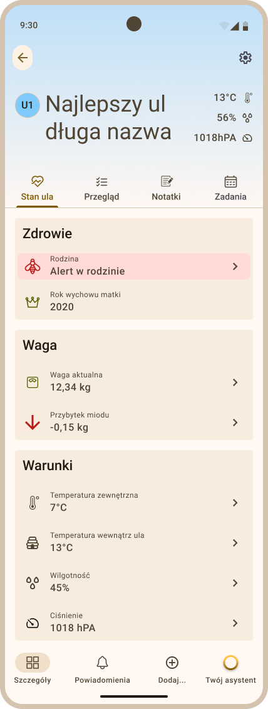
 <strong>Rys. 77</strong> Zakładka Szczegóły - przykładowy widok zakładki Stan ula

**Najważniejsze informacje:**

- **Sekcja Zdrowie** – prezentuje aktualny stan rodziny pszczelej, informując czy rodzina jest zdrowa, czy też wykryto potencjalne zagrożenie w postaci choroby. W tej sekcji wyświetlany jest również rok wychowu matki pszczelej.
- **Sekcja Waga** – zawiera informacje dotyczące aktualnej wagi ula oraz przybytku miodu, co pozwala ocenić tempo produkcji oraz aktywność rodziny pszczelej.
- **Sekcja Warunki** – przedstawia dane środowiskowe z wnętrza ula oraz jego otoczenia, takie jak temperatura zewnętrzna, temperatura wewnętrzna, wilgotność oraz ciśnienie wewnątrz ula.
- **Szczegółowe dane i wykresy** – po rozwinięciu poszczególnych elementów w danej sekcji użytkownik może zobaczyć bardziej szczegółowe informacje oraz wykresy zmian parametrów w czasie, co ułatwia analizę stanu ula i warunków panujących w jego wnętrzu.

Więcej informacji na temat analizy i prezentacji danych w formie wykresów zawarto w rozdziałach [Monitorowanie parametrów](#monitorowanie-parametr%C3%B3w) oraz [Analiza danych i raporty](#analiza-danych-i-raporty)

#### 4.2 Przegląd

Zakładka *Przegląd* umożliwia przeglądanie historii przeprowadzonych kontroli danego ula. Przeglądy zaprezentowane są w formie listy (**Rys. 78**).

  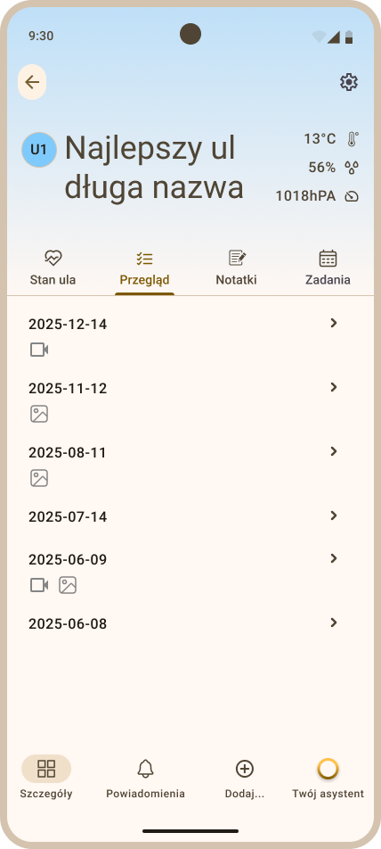
  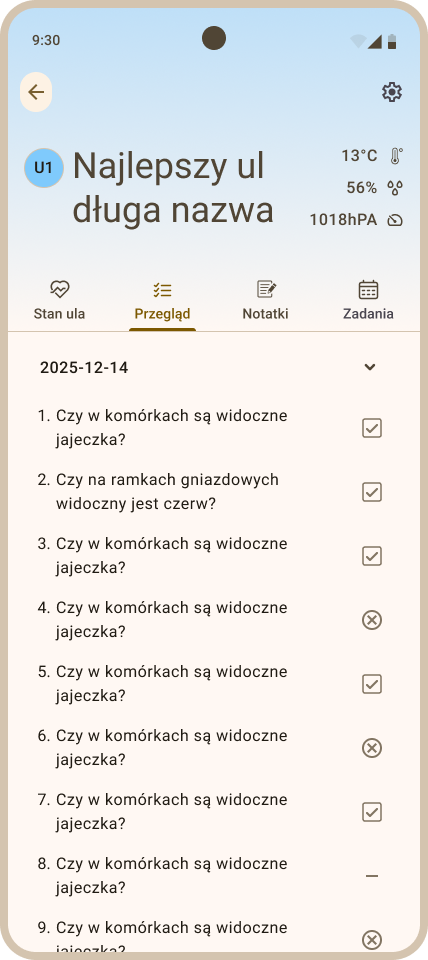
 <strong>Rys. 78</strong> Zakładka Szczegóły - przykładowy widok zakładki Przegląd (lista przeglądów i szczegóły przeglądu)

**Najważniejsze informacje:**

- **Lista przeglądów** – prezentuje zestawienie wszystkich wykonanych przeglądów dla wybranego ula wraz z datą przeglądu.
- **Materiały multimedialne** – przy danym przeglądzie może być widoczna ikona zdjęcia lub nagrania, jeśli podczas przeglądu zostały dodane materiały wizualne.
- **Szczegóły przeglądu** – po kliknięciu w wybrany wiersz wyświetlane są szczegółowe informacje dotyczące przeglądu, w tym odpowiedzi udzielone podczas jego wykonywania.

#### 4.3 Notatki

Zakładka *Notatki* pozwala zapisywać i przeglądać informacje dotyczące obserwacji lub zdarzeń związanych z danym ulem. Notatki, tak jak i przeglądy, zaprezentowane są w formie listy (**Rys. 79**).

  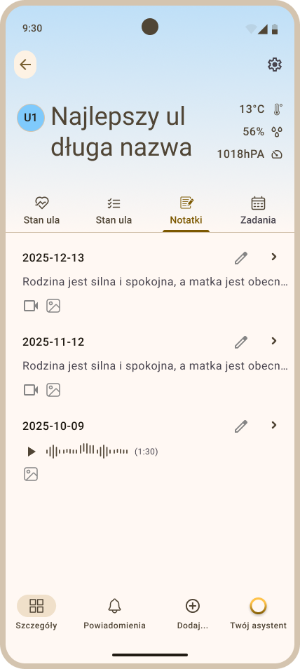
 <strong>Rys. 79</strong> Zakładka Szczegóły - przykładowy widok zakładki Notatki

**Najważniejsze informacje:**

- **Lista notatek** – prezentuje wszystkie notatki zapisane dla wybranego ula, zawierając tytuł/datę oraz skrócony fragment treści (jeśli notatka zawiera tekst).
- **Materiały dodatkowe** – przy notatkach mogą pojawić się ikony zdjęcia, nagrania wideo lub nagrania audio, jeśli takie materiały zostały do nich dołączone.
- **Szczegóły notatki** – po kliknięciu - rozwinięciu - wybranej notatki wyświetlana jest pełna treść notatki wraz z dołączonymi materiałami.

#### 4.4 Badania

Zakładka *Badania* prezentuje w przejrzysty sposób listę wszystkich wykonanych oraz zapisanych badań (**Rys. 80**), przeprowadzonych w ramach wybranego ula. Dzięki temu użytkownik może szybko sprawdzić historię analiz oraz wrócić do wcześniejszych wyników.

  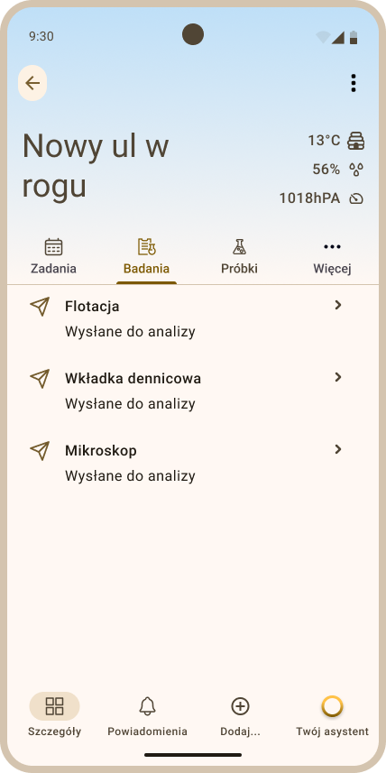
 <strong>Rys. 80</strong> Zakładka Szczegóły - przykładowy widok zakładki Badania

**Najważniejsze informacje:**

- **Lista badań** – prezentuje wszystkie badania zapisane dla wybranego ula, posortowane malejąco według daty wykonania badania.
- **Szczegóły badania** – po kliknięciu w pojedyncze badanie zostają wyświetlone jego szczegóły, w tym: data badania, rodzaj badania oraz zapisane załączniki.

#### 4.5 Próbki

W zakładce *Próbki* znajdziesz listę wszystkich zarejestrowanych próbek dla konkretnego ula (**Rys. 80**).

  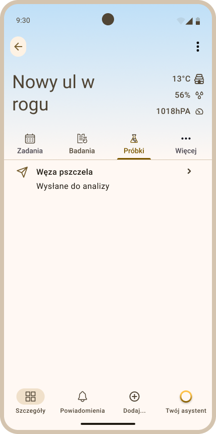
 <strong>Rys. 80</strong> Zakładka Szczegóły - przykładowy widok zakładki Próbki

**Najważniejsze informacje:**

- **Lista próbek** – prezentuje wszystkie próbki zapisane dla wybranego ula, posortowane malejąco według daty pobrania próbki.
- **Szczegóły próbki** – po kliknięciu w pojedynczą próbkę zostaną wyświetlone jej szczegóły, w tym: data pobrania próbki, rodzaj badania oraz wygenerowany przez system kod badania.

### 5. Omówienie ustawień pasieki

Widok *Ustawienia pasieki* pozwala zarządzać podstawowymi danymi pasieki oraz śledzić informacje na temat jej stanu wyposażenia. Do widoku można przejść będąc w zakładce *Ule* (wnętrze pasieki) i klikając ikonkę koła zębatego w prawym górnym rogu ekranu.
Widok *Ustawienia pasieki* składa się z następujących sekcji:

- Szczegóły pasieki
- Hub

  
 <strong>Rys. 80</strong> Widok Ustawienia pasieki

Aby zobaczyć zawartość danej sekcji, należy kliknąć w jej nagłówek, w wyniku czego zostanie wyświetlony pełny widok ze szczegółowymi informacjami.

#### 5.1 Szczegóły pasieki

Sekcja *Szczegóły pasieki* prezentuje podstawowe informacje identyfikujące pasiekę.

  
 <strong>Rys. 81</strong> Widok Ustawienia pasieki - sekcja Szczegóły pasieki

**Najważniejsze informacje:**

- **Nazwa pasieki** – wyświetlana jest pełna nazwa pasieki, identyfikująca ją w systemie.
- **Skrót nazwy pasieki** – prezentowany jest skrócony zapis nazwy, używany w różnych widokach i raportach.

#### 5.2 Hub

Sekcja **Hub** prezentuje dane techniczne urządzenia Apisense Hub, odpowiedzialnego za zbieranie danych pomiarowych z uli w pasiece.

  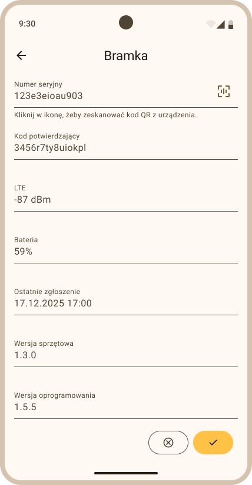
 <strong>Rys. 82</strong> Widok Ustawienia pasieki - sekcja Hub

**Najważniejsze informacje:**

- **Numer seryjny i kod potwierdzający** – prezentowane są unikalny numer seryjny urządzenia oraz kod weryfikacyjny, potwierdzający jego przypisanie do użytkownika.
- **LTE i bateria** – wyświetlane są informacje o aktualnym stanie połączenia LTE oraz poziomie naładowania baterii urządzenia Apisense Hub.
- **Ostatnie zgłoszenie** – prezentowana jest data i czas ostatniej komunikacji urządzenia Apisense Hub z systemem.
- **Wersje sprzętowa i oprogramowania** – umożliwia sprawdzenie aktualnej wersji sprzętowej oraz oprogramowania urządzenia Apisense Hub.

### 6. Omówienie ustawień ula

Widok *Ustawienia ula* pozwala na zarządzanie podstawowymi informacjami o ulu, danymi dotyczącymi matki pszczelej oraz przypisanymi urządzeniami pomiarowymi. Do widoku można przejść z zakładki *Szczegóły* ula (wnętrze ula) i klikając ikonkę koła zębatego widoczną w prawym górnym rogu ekranu.
Widok *Ustawienia ula* został podzielony na następujące sekcje:

- Szczegóły ula
- Informacje o matce
- Wyposażenie

  
 <strong>Rys. 84</strong> Widok Ustawienia ula

Aby zobaczyć zawartość danej sekcji, należy kliknąć w jej nagłówek, w wyniku czego zostanie wyświetlony pełny widok ze szczegółowymi informacjami.

#### 6.1 Szczegóły ula

Sekcja *Szczegóły ula* prezentuje podstawowe informacje identyfikujące ul i jego konstrukcję.

  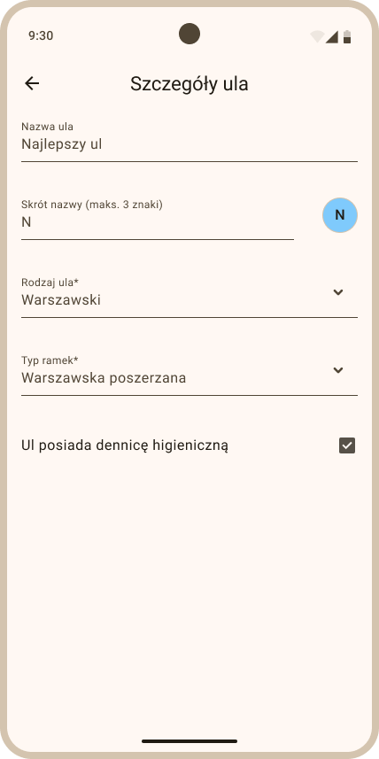
 <strong>Rys. 85</strong> Widok Ustawienia ula - sekcja Szczegóły ula

**Najważniejsze informacje:**

- **Nazwa ula** – pełna nazwa ula ułatwiająca jego identyfikację w systemie.
- **Maksymalna liczba ramek w korpusie gniazdowym** – informacja o maksymalnej liczbie ramek, które mogą zmieścić się w korpusie gniazdowym ula.
- **Dennica higieniczna** – informacja, czy ul posiada dennicę higieniczną.

#### 6.2 Informacje o matce

Sekcja *Informacje o matce* umożliwia przegląd szczegółowych danych dotyczących matki pszczelej w ulu. Kliknij wybrany nagłówek, by wyświetlić szczegóły.

  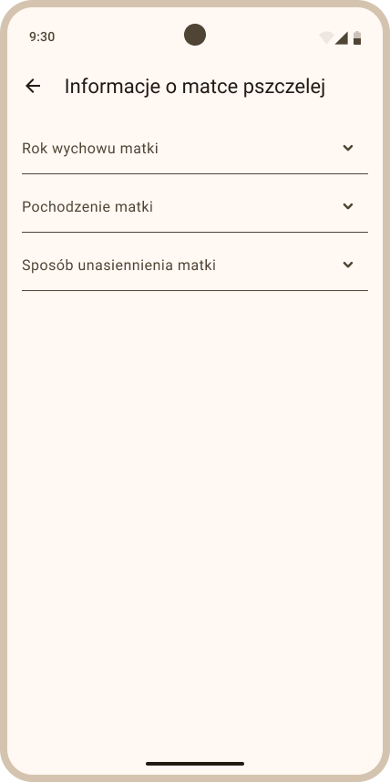
 <strong>Rys. 86</strong> Widok Ustawienia ula - sekcja Informacje o matce

**Najważniejsze informacje:**

- **Rok wychowu matki** – prezentuje rok wylęgu matki pszczelej.
- **Pochodzenie matki** – informacja o pochodzeniu matki, np. hodowla własna.
- **Sposób unasiennienia** – wskazuje metodę unasiennienia matki, np. naturalna.

#### 6.3 Wyposażenie

Sekcja *Wyposażenie* prezentuje urządzenia pomiarowe przypisane do danego ula oraz ich aktualny stan.

  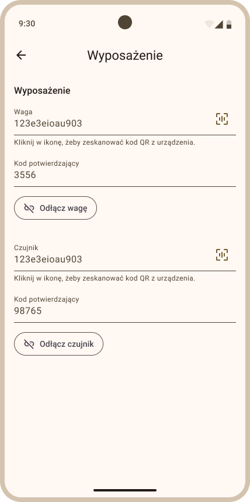
 <strong>Rys. 87</strong> Widok Ustawienia ula - sekcja Wyposażenie

**Najważniejsze informacje:**

- **Numer seryjny i kod potwierdzający** – unikalne numery seryjne oraz kody weryfikacyjne urządzeń pomiarowych Scale i VitalSensor.

- **Rozwinięcie szczegółów** – kliknięcie w wybrane urządzenie (VitalSensor/Scale) otwiera pełny widok z informacjami o stanie sprzętu w ulu (**Rys. 88**).

- **Szczegóły urządzenia** – po kliknięciu w dane urządzenie wyświetlane są:

    - **BLE i bateria** – informacja o aktualnej sile sygnału BLE i poziomie naładowania urządzenia.
    - **Ostatnie zgłoszenie** – data i czas ostatniej komunikacji urządzenia z Apisense Hub.
    - **Ostatni pomiar** – data i czas wykonania najnowszego pomiaru przez urządzenie.
    - **Wersje sprzętowa i oprogramowania** – umożliwia sprawdzenie aktualnej wersji sprzętowej oraz oprogramowania urządzenia Apisesne Scale/Apisense VitalSensor.

  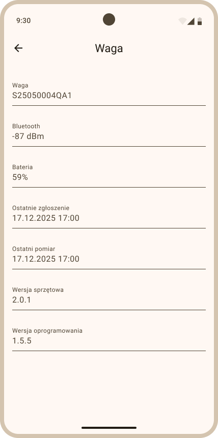
  
 <strong>Rys. 88</strong> Widok Ustawienia ula - sekcja Wyposażenie - szczegóły Scale oraz VitalSensor

### 7. Interpretacja statusów i ikon wykorzystywanych w systemie

W systemie wykorzystywane są różne statusy oraz ikony, które ułatwiają szybkie rozpoznanie stanu pasieki, uli, urządzeń pomiarowych oraz zaplanowanych działań. Elementy te pełnią funkcję wizualnych oznaczeń, dzięki którym użytkownik może w prosty sposób zidentyfikować najważniejsze informacje bez konieczności szczegółowego analizowania danych.

W niniejszym rozdziale przedstawiono znaczenie poszczególnych ikon, symboli oraz oznaczeń kolorystycznych stosowanych w interfejsie systemu, co pozwoli na ich prawidłową interpretację podczas codziennej pracy z aplikacją.

#### Ikony informacyjne

Ikony informacyjne przedstawiają informacje dotyczące pasiek i uli oraz dane zebrane z urządzeń pomiarowych.

| Ikona                                      | Występowanie                         | Znaczenie                                                                                                                                                                                                                                                                                                                                             |
| :----------------------------------------- | :----------------------------------- | :---------------------------------------------------------------------------------------------------------------------------------------------------------------------------------------------------------------------------------------------------------------------------------------------------------------------------------------------------- |
| 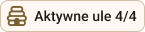          | kafelek z pasieką (zakładka Pasieki) | Liczba aktualnie aktywnych uli na całkowitą liczbę uli w pasiece. Ul jest aktywny, gdy posiada co najmniej jedno prawidłowo komunikujące się urządzenie.  Przykład: W pasiece są 2 ule. W ulu 1 wszystkie urządzenia przestały się zgłaszać. W ulu 2 tylko Scale się zgłasza, a VitalSensor nie. Na ikonie zostanie wyświetlone: Aktywne ule 1/2. |
| 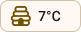      | kafelek z ulem (zakładka Ule)        | Aktualna temperatura wewnątrz ula.                                                                                                                                                                                                                                                                                                                    |
| 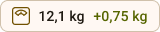    | kafelek z ulem (zakładka Ule)        | Aktualna waga ula i dzienny przybytek miodu.                                                                                                                                                                                                                                                                                                          |
| 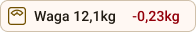  | kafelek z ulem (zakładka Ule)        | Aktualna waga ula i dzienny ubytek miodu.                                                                                                                                                                                                                                                                                                             |
| 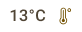     | wnętrze ula (zakładka Szczegóły)     | Aktualna temperatura wewnątrz ula.                                                                                                                                                                                                                                                                                                                    |
| 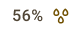 | wnętrze ula (zakładka Szczegóły)     | Aktualna wilgotność wewnątrz ula.                                                                                                                                                                                                                                                                                                                     |
<!-- TODO: brakuje assetu beehive_details_humidity_risk.png — przywrócić wiersz po dodaniu pliku do docs/manual/pictures/
|  | wnętrze ula (zakładka Szczegóły)     | Aktualna wartość wilgotności w ulu znajduje się poza oczekiwanym zakresem - występuje ryzyko pojawienia się chorób.                                                                                                                                                                                                                                                                                                                     |
-->
| 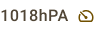 | wnętrze ula (zakładka Szczegóły)     | Aktualne ciśnienie atmosferyczne wewnątrz ula.                                                                                                                                                                                                                                                                                                        |

#### Stan zdrowia

Ikony stanu zdrowia informują o kondycji rodziny pszczelej w poszczególnych ulach i całej pasiece.

| Ikona                                   | Występowanie                                     | Znaczenie                                                                                                                                                                                                                                                                                                                                                                                                                                                                                                                                                              |
| :-------------------------------------- | :----------------------------------------------- | :--------------------------------------------------------------------------------------------------------------------------------------------------------------------------------------------------------------------------------------------------------------------------------------------------------------------------------------------------------------------------------------------------------------------------------------------------------------------------------------------------------------------------------------------------------------------- |
| 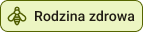  | kafelek z pasieką (zakładka Pasieki)             | Rodzina pszczela w tej pasiece jest zdrowa. W żadnym ulu w tej pasiece nie wykryto zagrożenia.                                                                                                                                                                                                                                                                                                                                                                                                                                                                         |
| 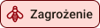          | kafelek z pasieką (zakładka Pasieki)             | Rodzina pszczela w tej pasiece jest zagrożona. W co najmniej jednym ulu w tej pasiece wykryto zagrożenie w postaci choroby.                                                                                                                                                                                                                                                                                                                                                                                                                                            |
| 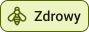 | kafelek z ulem (zakładka Ule)                    | Rodzina pszczela w tym ulu jest zdrowa. Nie wykryto żadnego zagrożenia.                                                                                                                                                                                                                                                                                                                                                                                                                                                                                                |
| 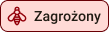  | kafelek z ulem (zakładka Ule)                    | Rodzina pszczela w tym ulu jest zagrożona. Wykryto co najmniej jedno zagrożenie w postaci choroby.                                                                                                                                                                                                                                                                                                                                                                                                                                                                     |
|          | kafelek z pasieką i ulem (zakładka Pasieki, Ule) | Brak informacji o stanie zdrowia rodziny pszczelej.  Na kafelku z ulem pojawia się, gdy:  - w ulu nie ma żadnego urządzenia typu VitalSensor, - urządzenie VitalSensor lub Hub przestało się zgłaszać, - urządzenie VitalSensor jeszcze nie przesłało danych (pierwsze uruchomienie - zmiana statusu w tym wypadku może potrwać do 4 dni). Na kafelku z pasieką pojawia się gdy: - żaden ul nie jest powiązany z urządzeniem VitalSensor, - wszystkie urządzenia VitalSensor lub Hub przestały się zgłaszać, - urządzenie VitalSensor jeszcze nie przesłało danych (pierwsze uruchomienie - zmiana statusu w tym wypadku może potrwać do 4 dni). |
| 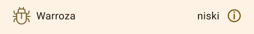            | m.in. Szczegóły ula, mapa             | Ikona z wykrytą chorobą - Warroza. Poziom porażenia - niski.                                                                                                                                                                                                                                                                                                                                                                                                                                                                                                                   |
| 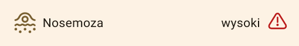           | m.in. Szczegóły ula, mapa             | Ikona z wykrytą chorobą - Nosemoza. Poziom porażenia - wysoki.                                                                                                                                                                                                                                                                                                                                                                                                                                                                                                                 |

#### Stan urządzeń Apisense

Ikony stanu urządzeń Apisense wskazują aktualny status pracy: jakość połączenia oraz poziom naładowania baterii urządzeń monitorujących pasieki i ule.

| Ikona                             | Występowanie                                     | Znaczenie                                                                                                                                                                               |
| :-------------------------------- | :----------------------------------------------- | :-------------------------------------------------------------------------------------------------------------------------------------------------------------------------------------- |
|         | kafelek z pasieką (zakładka Pasieki)             | Bardzo dobry poziom sygnału LTE urządzenia Apisense Hub. Żadna akcja nie jest wymagana.                                                                                                 |
|       | kafelek z pasieką (zakładka Pasieki)             | Średni poziom sygnału LTE urządzenia Apisense Hub. Żadna akcja nie jest wymagana.                                                                                                       |
|          | kafelek z pasieką (zakładka Pasieki)             | Bardzo słaby poziom sygnału LTE urządzenia Apisense Hub. Urządzenie może przestać się zgłaszać. W miarę możliwości należy odpowiednio zmienić położenie urządzenia (Hub).              |
| 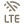     | kafelek z pasieką (zakładka Pasieki)             | Urządzenie Apisense Hub nie zgłasza się (tryb offline). Należy zweryfikować przyczynę stanu offline i podjąć odpowiednie kroki.                                                         |
|     | kafelek z pasieką (zakładka Pasieki)             | Bardzo wysoki poziom baterii urządzenia Apisense Hub. Żadna akcja nie jest wymagana.                                                                                                    |
|     | kafelek z pasieką (zakładka Pasieki)             | Średni poziom baterii urządzenia Apisense Hub.                                                                                                                                          |
|      | kafelek z pasieką i ulem (zakładka Pasieki, Ule) | Bardzo słaby poziom baterii urządzenia (na kafelku z pasieką dotyczy Hub, na kafelku z ulem - Scale lub VitalSensor). Należy naładować (Hub) lub wymienić baterie (Scale, VitalSensor). |
|  | kafelek z pasieką (zakładka Pasieki)             | Rozładowana bateria urządzenia Apisense Hub (tryb offline). Należy naładować urządzenie.                                                                                                |

#### Oznaczenia kolorystyczne

Oznaczenia kolorystyczne ułatwiają szybkie rozpoznanie statusów, kategorii oraz ważnych informacji w systemie.

| Ikona                                   | Występowanie                          | Znaczenie                                                                                                                                                                                           |
| :-------------------------------------- | :------------------------------------ | :-------------------------------------------------------------------------------------------------------------------------------------------------------------------------------------------------- |
| 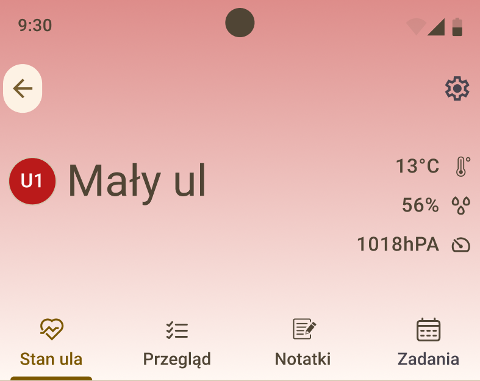         | wnętrze ula (zakładka Szczegóły)      | Kolor tła ula wraz z ikoną (kolorowe kółeczko) odpowiadają kolorowi przypisanemu do roku wychowu matki.                                                                                                |
|        | różne widoki m.in. Notatki, Przeglądy | Kolor żółty w aplikacji oznacza potwierdzenie wyboru, możliwość wykonania jakiejś akcji - często widoczny na przyciskach.                                                                           |
| 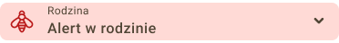             | różne widoki m.in. Stan ula           | Kolor czerwony w aplikacji świadczy o wystąpieniu negatywnego zjawiska, przekroczeniu wartości oczekiwanych parametrów, powiadomieniach i ostrzeżeniach (nie dotyczy tła ula w zakładce Szczegóły). |
|  | różne widoki m.in. kafelek z ulem     | Kolor zielony w aplikacji informuje, że wszystko jest w porządku, oznacza neutralność lub pozytywny efekt.                                                                                          |

#### Akcje

Ikony akcji umożliwiają wykonanie dostępnych operacji, takich jak dodawanie, edycja lub usuwanie danych.

| Ikona                            | Występowanie                                     | Znaczenie                                                         |
| :------------------------------- | :----------------------------------------------- | :---------------------------------------------------------------- |
| 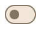 | różne widoki m.in. wykresy   | Przełącznik - wybór nieaktywny.                                   |
|   | różne widoki m.in. wykresy   | Przełącznik - wybór aktywny.                                      |
|     | różne widoki m.in. dodawanie notatek itp.        | Potwierdź lub zapisz wybór.                                       |
| 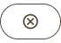  | różne widoki m.in. dodawanie notatek itp.        | Odrzuć wprowadzone dane/Nie zapisuj.                              |
|       | m.in. edycja notatek         | Przycisk umożliwiający wprowadzanie zmian dla wybranego elementu. |
|     | m.in. usuwanie notatek         | Przycisk umożliwiający usunięcie wybranego elementu.              |

#### Nawigacja

Ikony nawigacyjne służą do poruszania się pomiędzy widokami i funkcjami aplikacji.

| Ikona                           | Występowanie                                               | Znaczenie                                                                                                          |
| :------------------------------ | :--------------------------------------------------------- | :----------------------------------------------------------------------------------------------------------------- |
|         | różne widoki, m.in. zakładka Pasieki - prawy górny róg ekranu | Przycisk służący do wylogowania się z systemu.                                                                     |
|  | różne widoki - lewy górny róg ekranu                       | Przycisk służący do przejścia do poprzedniego widoku (przycisk Wstecz), np. z zakładki *Ule* do *Pasieki*.         |
|    | różne widoki m.in. potwierdzanie chorób, Dodaj przegląd    | Przycisk służący do przejścia do następnego widoku (przycisk Dalej), np. przejście do kolejnego pytania przeglądu. |

______________________________________________________________________

## Monitorowanie parametrów

System umożliwia ciągłe monitorowanie najważniejszych parametrów środowiskowych oraz produkcyjnych w ulu na podstawie danych zbieranych przez urządzenia pomiarowe. Analiza tych informacji pozwala na bieżąco oceniać kondycję rodziny pszczelej, warunki panujące w ulu oraz dynamikę produkcji miodu. Regularne obserwowanie zmian poszczególnych parametrów ułatwia również wczesne wykrywanie nieprawidłowości oraz podejmowanie odpowiednich działań w odpowiednim czasie.

Dane prezentowane w systemie mogą być wyświetlane w formie **aktualnych wartości, wykresów zmian w czasie oraz zestawień**, co umożliwia łatwe śledzenie trendów i analizę zachowania rodziny pszczelej w dłuższym okresie.

  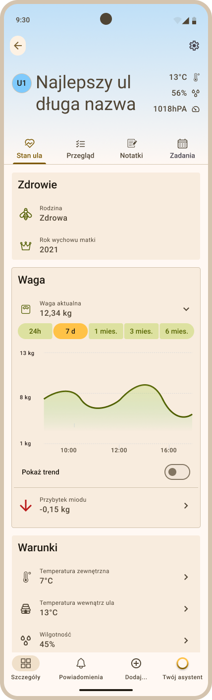
 <strong>Rys. 89</strong> Widok Szczegóły ula - przykładowe wartości parametrów i wykres wagi

### 1. Temperatura

Temperatura jest jednym z kluczowych parametrów wpływających na rozwój i funkcjonowanie rodziny pszczelej. W systemie prezentowana jest zarówno **temperatura wewnątrz ula**, jak i **temperatura zewnętrzna**, co pozwala porównać warunki panujące w ulu z temperaturą otoczenia.

Najważniejsze informacje:

- **Źródła:** VitalSensor mierzy temperaturę wewnątrz ula; Scale - temperaturę zewnętrzną przy ulu.
- **Temperatura zewnętrzna** umożliwia analizę wpływu warunków atmosferycznych na aktywność pszczół.
- **Temperatura wewnętrzna** odzwierciedla warunki panujące w gnieździe pszczelim. Stabilna temperatura wskazuje na prawidłową aktywność rodziny pszczelej i odpowiednią opiekę nad czerwiem. Typowo 32–36°C w kłębie w sezonie.
- **Nagłe zmiany temperatury wewnętrznej** mogą wskazywać na osłabienie rodziny, brak matki lub inne nieprawidłowości wymagające kontroli ula.
- **Wykresy temperatury** pozwalają obserwować zmiany w czasie i identyfikować długoterminowe trendy.

### 2. Wilgotność

Wilgotność w ulu ma istotny wpływ na rozwój czerwiu, zagęszczanie miodu oraz ogólną kondycję rodziny pszczelej. Zbyt wysoka lub zbyt niska wilgotność może negatywnie wpływać na zdrowie pszczół i jakość produktów pszczelich.

Najważniejsze informacje:

- **Wilgotność wewnętrzna** ula, mierzona przez VitalSensor, odzwierciedla warunki mikroklimatyczne w gnieździe.
- **Zbyt wysoka wilgotność** może sprzyjać rozwojowi chorób oraz pogarszać warunki przechowywania pokarmu.
- **Zbyt niska wilgotność** może prowadzić do wysychania czerwiu i negatywnie wpływać na funkcjonowanie rodziny pszczelej.
- **Analiza wykresów wilgotności** pozwala ocenić stabilność warunków w ulu oraz skuteczność wentylacji.

### 3. Ciśnienie

Pomiar ciśnienia w ulu pozwala obserwować zmiany warunków wewnętrznych oraz ich zależność od czynników zewnętrznych, takich jak zmiany pogody.

Najważniejsze informacje:

- **Ciśnienie wewnątrz ula**, również mierzone przez VitalSensor, może zmieniać się pod wpływem warunków atmosferycznych oraz aktywności rodziny pszczelej.
- **Spadki lub wzrosty ciśnienia** mogą być sygnałem nadchodzących zmian pogody, które często wpływają na aktywność lotną pszczół.
- **Analiza trendów ciśnienia** w połączeniu z innymi parametrami może pomóc w interpretacji zachowania rodziny pszczelej.

### 4. Waga

Pomiar wagi ula pozwala na bieżąco monitorować zmiany masy ula, które wynikają m.in. z aktywności pszczół, zbiorów nektaru, zużycia zapasów czy warunków pogodowych.

Najważniejsze informacje:

- **Aktualna waga** ula, mierzona przez Scale, przedstawia całkowitą masę ula wraz z rodziną pszczelą, zapasami i wyposażeniem.
- **Zmiany wagi w czasie** pozwalają obserwować intensywność pożytków oraz aktywność zbieraczek.
- **Spadki wagi** mogą wskazywać na zużywanie zapasów, rójkę lub okresy słabszego pożytku.
- **Analiza wykresów wagi** umożliwia ocenę dynamiki rozwoju rodziny pszczelej, sezonowej produkcji miodu oraz jest kluczowa w planowaniu miodobrania.

### 5. Przybytek miodu

Parametr przybytku miodu przedstawia szacunkową ilość miodu zgromadzonego przez rodzinę pszczelą w określonym czasie, na podstawie zmian wagi ula.

Najważniejsze informacje:

- **Przybytek miodu** pokazuje tempo gromadzenia nektaru i jego przetwarzania przez pszczoły.
- **Dodatnie wartości** wskazują na okres intensywnego pożytku i aktywnej pracy pszczół.
- **Spadek lub brak przybytku** może oznaczać zakończenie pożytku, niesprzyjające warunki pogodowe lub zmniejszoną aktywność rodziny.
- **Analiza trendów przybytku** pozwala ocenić produktywność rodziny oraz moment optymalny do planowania miodobrania.

______________________________________________________________________

## Analiza danych i raporty

Moduł analizy danych umożliwia przeglądanie i interpretowanie informacji zbieranych przez system. Dzięki wizualizacji danych w postaci wykresów użytkownik może łatwiej obserwować zmiany zachodzące w rodzinach pszczelich w różnych okresach czasu. Funkcje analityczne pozwalają szybciej wychwycić istotne zależności, ocenić efekty działań w pasiece oraz podejmować bardziej świadome decyzje dotyczące jej prowadzenia.

### 1. Wizualizacja danych na wykresach

Wykresy umożliwiają przejrzyste przedstawienie zmian poszczególnych parametrów w czasie. Dzięki nim użytkownik może szybko zidentyfikować charakterystyczne wzorce, nagłe zmiany lub okresy zwiększonej aktywności w ulu.

#### 1.1 Jak wyświetlić wykres

Aby wyświetlić wykresy poszczególnych parametrów dla wybranego ula (**Rys. 90**), należy przejść przez następującą ścieżkę w aplikacji:

  
 <strong>Rys. 90</strong> Widok Szczegóły ula - przykładowe wartości parametrów i wykres wagi

- Z zakładki *Pasieki* (widok startowy widoczny zaraz po zalogowaniu się do aplikacji Apisense) przejdź do zakładki *Ule*. W tym celu kliknij kafelek z wybraną pasieką.
- Z zakładki *Ule* przejdź do zakładki *Szczegóły*. Aby to zrobić kliknij w kafelek z wybranym ulem.
- Upewnij się, że znajdujesz się w zakładce *Szczegóły* (podświetlone na dolnym menu), podzakładce *Stan ula* (podkreślone na górnym menu). Wykresy znajdują się w sekcjach *Waga* oraz *Warunki*.
- Wykres zostanie wyświetlony (**Rys. 90**) po kliknięciu w dowolny nagłówek wybrany z wymienionych wyżej sekcji (np. Waga aktualna z sekcji *Waga*).

#### 1.2 Dostępne wykresy

W aplikacji Apisense dostępne są wykresy dla następujących parametrów:

- waga ula
- przybytek miodu
- temperatura zewnętrzna
- temperatura wewnętrzna
- wilgotność
- ciśnienie atmosferyczne

#### 1.3 Ramy czasowe prezentowane na wykresach

Dane na wykresach prezentowane są w kilku przedziałach czasowych. Ostatnie:

- 24 godziny
- 7 dni
- 1 miesiąc
- 3 miesiące
- 6 miesięcy

Aby wyświetlić wykres dla wybranego zakresu, należy kliknąć odpowiedni przedział czasu wyświetlany nad wykresem.

#### 1.4 Interpretacja wykresów

Wykresy pozwalają obserwować zmiany parametrów w czasie oraz analizować ich wzajemne zależności. Dzięki wizualnej formie prezentacji danych łatwiej zauważyć powtarzające się schematy, okresy stabilności lub nagłe odchylenia od typowych wartości.

Analiza wykresów umożliwia między innymi:

- ocenę dynamiki zmian w ulu w różnych okresach,
- identyfikację momentów zwiększonej aktywności rodziny pszczelej,
- wykrywanie nietypowych zdarzeń lub anomalii,
- obserwację długoterminowych zmian zachodzących w pasiece.

Regularne korzystanie z wykresów pozwala lepiej zrozumieć funkcjonowanie poszczególnych rodzin pszczelich oraz szybciej reagować na pojawiające się zmiany.

### 2. Trendy

Trendy umożliwiają analizę ogólnego kierunku zmian danego parametru w czasie. Funkcja ta pomaga odróżnić krótkotrwałe wahania od długoterminowych tendencji.

#### 2.1 Jak wyświetlić trend

Trendy dostępne są w tej samej sekcji, co wykresy poszczególnych parametrów (**Rys. 91**). Aby je wyświetlić, należy wykonać poniższe kroki:

  
 <strong>Rys. 91</strong> Widok Szczegóły ula - wykres wagi wraz z naniesionym trendem

- Z zakładki *Pasieki* (widok startowy widoczny zaraz po zalogowaniu się do aplikacji Apisense) przejdź do zakładki *Ule*. W tym celu kliknij kafelek z wybraną pasieką.
- Z zakładki *Ule* przejdź do zakładki *Szczegóły*. Aby to zrobić kliknij w kafelek z wybranym ulem.
- Upewnij się, że znajdujesz się w zakładce *Szczegóły* (podświetlone na dolnym menu), podzakładce *Stan ula* (podkreślone na górnym menu). Trendy znajdują się w sekcjach *Waga* oraz *Warunki*.
- Kliknij w nagłówek z dowolnym parametrem wybranym z wymienionych wyżej sekcji (np. Waga aktualna z sekcji *Waga*).
- Pod wykresem znajduje się przełącznik *Pokaż trend*, który domyślnie jest wyłączony. Aby wyświetlić trend na wybranym wykresie kliknij ten przełącznik. Po jego aktywowaniu na wykresie pojawi się dodatkowa linia przedstawiająca ogólny kierunek zmian analizowanego parametru.

#### 2.2 Interpretacja trendów

Linia trendu przedstawia uśredniony kierunek zmian w danym okresie, dzięki czemu łatwiej zauważyć, czy wartości danego parametru:

- rosną,
- maleją,
- pozostają stabilne.

Analiza trendów pozwala skupić się na długoterminowych zmianach, pomijając krótkotrwałe wahania wynikające z naturalnej aktywności rodziny pszczelej lub chwilowych zmian warunków.

#### 2.3 Korzyści z analizy trendów

Wykorzystanie trendów w analizie danych umożliwia:

- szybszą ocenę ogólnej sytuacji w ulu,
- wczesne wychwycenie nieprawidłowości,
- łatwiejsze identyfikowanie długoterminowych zmian,
- lepsze planowanie działań w pasiece,
- bardziej świadome podejmowanie decyzji dotyczących zarządzania rodzinami pszczelimi.

______________________________________________________________________

## Alarmy, powiadomienia i asystent AI

System powiadomień w aplikacji informuje użytkownika o istotnych zdarzeniach w pasiece, stanie urządzeń monitorujących oraz o zalecanych działaniach związanych z prowadzeniem uli. Informacje przekazywane są w formie powiadomień oraz rekomendacji generowanych na podstawie danych z czujników, obserwacji i analizy systemowej. Dzięki temu użytkownik może szybciej reagować na pojawiające się problemy, a także podejmować decyzje dotyczące dalszego prowadzenia pasieki.

### 1. Powiadomienia

Powiadomienia generowane przez system są dostępne **w aplikacji** — w sekcji powiadomień można przeglądać komunikaty i zapoznać się z ich szczegółami. 

#### 1.1 Gdzie znaleźć powiadomienia w aplikacji

Powiadomienia w aplikacji możesz znaleźć realizując poniższe kroki:

- Z zakładki *Pasieki* (widok startowy widoczny zaraz po zalogowaniu się do aplikacji Apisense) przejdź do zakładki *Ule*. W tym celu kliknij kafelek z wybraną pasieką.
- Z zakładki *Ule* przejdź do zakładki *Powiadomienia*. W tym celu kliknij ikonę z dzwonkiem znajdującą się w dolnym menu, podobnie jak zakładka *Ule*.
- W rezultacie zostanie otwarty widok *Powiadomień*, z domyślnie wybraną zakładką *Problemy* (**Rys. 91**).
- Oprócz zakładki *Problemy* możesz przejść również do zakładki *Techniczne*, wybierając odpowiednią opcję z górnego menu.

#### 1.2 Kategorie powiadomień

Powiadomienia w aplikacji są dostępne w zakładce *Powiadomienia*. Powiadomienia dzielą się na następujące kategorie, które odpowiadają poszczególnym zakładkom (**Rys. 91**):

- **Problemy** – powiadomienia związane ze stanem zdrowia rodzin pszczelich, dotyczące wykrytych chorób takich jak Warroza wraz z zalecanym postępowaniem w celu zwalczenia konkretnej choroby.
- **Techniczne** – powiadomienia dotyczące działania urządzeń monitorujących, np. niski poziom baterii lub brak zasięgu.

  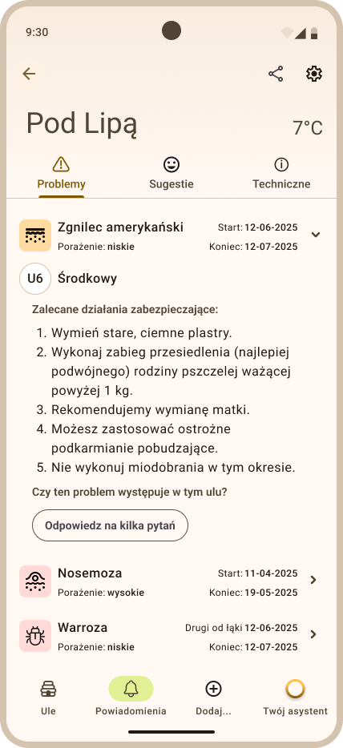
  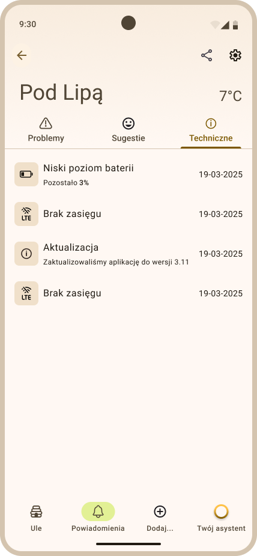
 <strong>Rys. 91</strong> Zakładka Powiadomienia - przykładowe powiadomienia chorobowe i techniczne (zakładki Problemy i Techniczne)

Nowe powiadomienia pojawiają się automatycznie na odpowiedniej liście w zależności od ich rodzaju. Nieodczytane komunikaty są wyświetlane pogrubioną czcionką, natomiast po ich otwarciu stają się lekko wyszarzone, co oznacza, że zostały już przeczytane.

Aby wyświetlić szczegóły powiadomienia, należy kliknąć jego nagłówek, co spowoduje rozwinięcie pełnej treści komunikatu.

### 2. Twój asystent AI

Asystent AI to funkcja wspierająca użytkownika w analizie sytuacji w pasiece oraz w interpretacji obserwowanych zjawisk. Na podstawie przekazanych informacji system generuje odpowiedzi i wskazówki, które mogą pomóc w podejmowaniu decyzji dotyczących prowadzenia pasieki.

Z asystenta AI można korzystać poprzez zadawanie pytań w aplikacji (**Rys. 92**).

  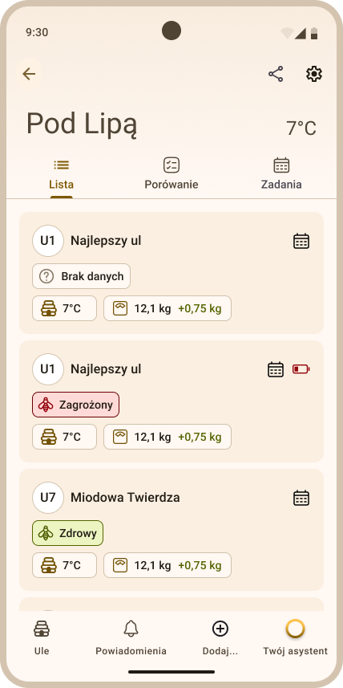
  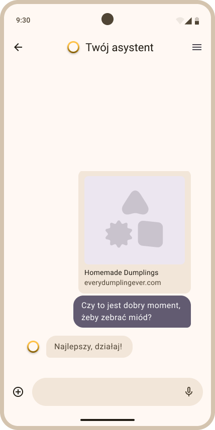
 <strong>Rys. 92</strong> Zakładka Twój asystent - przykładowe pytanie zadane asystentowi AI

Po przesłaniu pytania asystent analizuje dostępne informacje i generuje odpowiedź zawierającą możliwe wyjaśnienia sytuacji lub sugestie dalszego postępowania.

Z asystenta AI można skorzystać poprzez wybór zakładki *Twój asystent* z dolnego menu, dostępnej w podstawowych widokach aplikacji (*Pasieki*, *Ule*, *Ul*). Dzięki temu użytkownik ma szybki dostęp do pomocy asystenta w dowolnym momencie korzystania z systemu.

______________________________________________________________________

## Zarządzanie kontem

Użytkownik może przeglądać oraz modyfikować swoje dane, zmieniać ustawienia konta, a także zarządzać preferencjami dotyczącymi działania aplikacji.

### 1. Edycja danych użytkownika

Funkcja edycji danych użytkownika umożliwia aktualizację podstawowych informacji przypisanych do konta, takich jak wyświetlana nazwa użytkownika, dane kontaktowe czy hasło. Dzięki temu użytkownik może na bieżąco zarządzać swoimi danymi oraz dostosować ustawienia konta do własnych potrzeb.

#### 1.1 Edycja danych

Aby edytować dane użytkownika, należy:

- W zakładce *Pasieki* (widok startowy aplikacji Apisense) kliknąć ikonę koła zębatego, znajdującą się w prawej górnej części ekranu. W rezultacie zostanie otwarty widok *Ustawienia konta* (**Rys. 93**).
- Widok *Ustawienia konta* składa się z kilku sekcji: **Wyświetlana nazwa**, **E-mail**, **Telefon komórkowy**, **Doświadczenie**, **Hasło** oraz **Język**. W każdej z nich prezentowane są aktualne dane użytkownika.
- Aby zmienić zawartość wybranej sekcji, należy kliknąć jej nagłówek, co spowoduje otwarcie nowego widoku, w którym możliwa będzie edycja danych. Przykładowo, w przypadku zmiany hasła użytkownik zostanie poproszony o wprowadzenie nowego hasła oraz jego powtórzenie (**Rys. 93**).
- Po wprowadzeniu zmian należy je zapisać, klikając żółty przycisk znajdujący się w prawym dolnym rogu ekranu.

  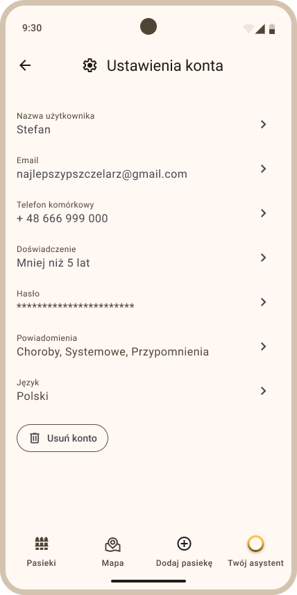
  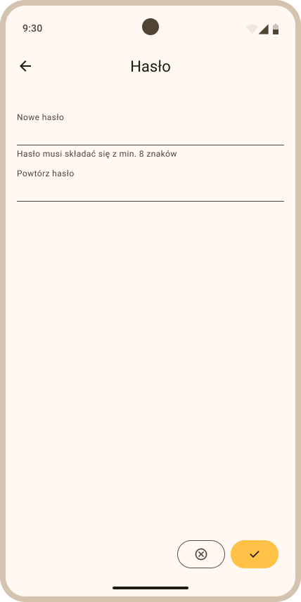
 <strong>Rys. 93</strong> Ustawienia konta - przykładowy widok ustawień oraz zmiana hasła

#### 1.2 Usunięcie konta

W dolnej części widoku *Ustawienia konta* (**Rys. 93**) dostępny jest również przycisk *Usuń konto*, który umożliwia trwałe usunięcie konta użytkownika.

______________________________________________________________________

## Dobre praktyki użytkowania systemu

### 1. Codzienne korzystanie z panelu

- Regularnie przeglądaj najważniejsze widoki apliakacji, w szczególności listę pasiek i uli, aby na bieżąco śledzić statusy i pomiary. Reaguj na alarmy i powiadomienia w aplikacji w terminie.

### 2. Uzupełnianie notatek i przeglądów

- Po każdej wizycie w pasiece dodawaj notatki i przeglądy w aplikacji (najlepiej z załącznikami w postaci zdjęć). Dzięki temu możliwe będzie analizowanie historii działań oraz dokładniejsza ocena sytuacji przez system.

### 3. Regularne sprawdzanie alarmów

- Sprawdzaj zakładkę ***Powiadomienia*** w aplikacji, aby nie przeoczyć krytycznych zdarzeń, takich jak wykrycie choroby.

### 4. Kontrola poziomu baterii przed sezonem

- Przed sezonem sprawdź w aplikacji poziom baterii wszystkich urządzeń monitorujących stan Twoich pasiek. Wymień baterie (2×AA w Scale i VitalSensor) przy niskim poziomie; Hub ładuj przez panel fotowoltaiczny lub sieć. Unikaj przerw w transmisji w szczycie sezonu.

### 5. Aktualizacje

- Aktualizuj aplikację mobilną do najnowszej wersji (Google Play / App Store), aby mieć dostęp do ulepszeń i nowych funkcji.
- Aktualizacje systemu operacyjnego urządzenia również wpływają na stabilność działania aplikacji.

______________________________________________________________________

## Rozwiązywanie problemów

### 1. Często zadawane pytania i proponowane rozwiązania

#### 1.1 Brak danych w aplikacji

**Rozwiązanie:** upewnij się, że urządzenia (Hub, Scale, VitalSensor) są włączone, w zasięgu BLE (do ok. 35 m od Hub) i że minęło do ok. 2 godzin od pierwszego uruchomienia. Sprawdź baterie i zasilanie Hub (panel PV lub sieć). Szczegółowa lista problemów i rozwiązań związanych z komunikacją urządzeń znajduje się w **Instrukcji konfiguracji urządzeń** (rozdział Rozwiązywanie problemów).

#### 1.2 Nie mogę się zalogować

**Rozwiązanie:** sprawdź poprawność wprowadzonej nazwy użytkownika i hasła. Jeśli zapomniałeś hasła skontaktuj się z z pomocą Apisense: **bee@apisense.ai**.

#### 1.3 Inne problemy

**Rozwiązanie:** skontaktuj się z pomocą techniczną Apisense: **bee@apisense.ai**.

______________________________________________________________________

## Instrukcja w skrócie

Poniżej znajdziesz skrót najważniejszych czynności w aplikacji Apisense Pro AI. Każdy punkt zawiera krótki opis oraz odnośniki do szczegółowych rozdziałów instrukcji; przy wybranych czynnościach dołączono też link do krótkiego materiału wideo.

### 1. Rejestracja i logowanie

- **Rejestracja:** Pobierz aplikację mobilną Apisense lub wejdź na stronę internetową systemu. Wybierz *Załóż konto*, wypełnij dane (nazwa użytkownika, e-mail, telefon), utwórz hasło spełniające wymagania i kliknij *Zarejestruj się*.

> [Wideo](https://www.youtube.com/shorts/sYDT5N7eUi8), [Rejestracja](#1-rejestracja)

- **Logowanie:** Uruchom aplikację lub stronę internetową, w widoku *Zaloguj się* wpisz nazwę użytkownika i hasło, następnie kliknij *Zaloguj się*.

> [Logowanie](#2-logowanie)

### 2. Zarządzanie pasieką

- **Dodawanie pasieki:** W zakładce *Pasieki* wybierz *Dodaj pasiekę* z dolnego menu. W widoku *Dodaj pasiekę* uzupełnij nazwę, skrót, zeskanuj kod QR z Apisense Hub i zapisz.

> [Wideo](https://www.youtube.com/shorts/wJrFummpo7Y), [Dodawanie pasieki](#11-dodawanie-pasieki)

- **Edycja pasieki:** Kliknij kafelek wybranej pasieki. Kliknij ikonę zębatki będąc w zakładce *Ule*. W widoku *Ustawienia pasieki* kliknij nagłówek sekcji, dla której chcesz zedytować dane. Zmień wartości pól i kliknij zapisz (żółty przycisk).

> [Edycja pasieki](#12-edycja-pasieki)

- **Usuwanie pasieki:** Kliknij kafelek wybranej pasieki. Kliknij ikonę zębatki będąc w zakładce *Ule*. W widoku *Ustawienia pasieki* kliknij przycisk *Usuń pasiekę*.

> [Usuwanie pasieki](#13-usuwanie-pasieki)

- **Dodawanie ula:** Kliknij kafelek wybranej pasieki. Wybierz *Dodaj…* → *Dodaj ul* z dolnego menu. Wypełnij dane w sekcji *Szczegóły ula*, *Informacje o matce pszczelej* oraz zeskanuj kody QR z urządzeń Scale i VitalSensor. Kliknij żółty przycisk Zapisz.

> [Wideo](https://www.youtube.com/shorts/L_XWlMFRbbE), [Dodawanie ula](#21-dodawanie-ula)

- **Edycja ula:** Kliknij kafelek wybranej pasieki. Kliknij kafelek wybranego ula. Kliknij ikonę zębatki będąc w zakładce *Szczegóły*. W widoku *Ustawienia ula* kliknij nagłówek sekcji, dla której chcesz zedytować dane. Zmień wartości pól i kliknij zapisz (żółty przycisk).

> [Edycja ula](#22-edycja-ula)

- **Usuwanie ula:** Kliknij kafelek wybranej pasieki. Kliknij kafelek wybranego ula. Kliknij ikonę zębatki będąc w zakładce *Szczegóły*. W widoku *Ustawienia ula* kliknij przycisk *Usuń ul*.

> [Usuwanie ula](#23-usuwanie-ula)

- **Dodawanie przeglądów:** Kliknij kafelek wybranej pasieki. Kliknij kafelek wybranego ula. Wybierz *Dodaj...* -> *Przegląd* z dolnego menu. Załącz łącznie 4 wymagane zdjęcia ramek. Odpowiedz na pytania. Żółta strzałka w prawo umożliwia przejście do następnego pytania. Kliknij *Zakończ przegląd* (żółty przycisk w ostatnim oknie przeglądu) by zapisać.

> [Wideo](https://www.youtube.com/shorts/1kHqvSh838o), [Dodawanie przeglądów](#3-dodawanie-przegl%C4%85d%C3%B3w)

- **Dodawanie notatek:** Kliknij kafelek wybranej pasieki. Kliknij kafelek wybranego ula. Wybierz *Dodaj...* -> *Notatkę* z dolnego menu. Wprowadź zawartość notatki (tekst lub nagraj notatkę głosową, możesz dodać też zdjęcia lub nagrania (*+*)). Zapisz notatkę (żółty przycisk).

> [Wideo — notatka tekstowa](https://www.youtube.com/shorts/nZdzxrNIyZA)
> [Wideo — notatka audio](https://www.youtube.com/shorts/_QLzIfwcRMs) 
> [Notatki](#4-notatki)

- **Potwierdzanie chorób z poziomu pasieki:** Kliknij kafelek wybranej pasieki. Wybierz *Powiadomienia* z dolnego menu. W zakładce *Problemy* kliknij w wybrany wiersz z chorobą, aby rozwinąć szczegóły. Kliknij przycisk *Odpowiedz na kilka pytań*. Udziel odpowiedzi na pytania. Aby przejść do kolejnego kliknij żółtą strzałkę w prawo. Na koniec kliknij *Zapisz*.

> [Wideo](https://www.youtube.com/shorts/iGNXm9qu8X8), [Potwierdzanie chorób](#5-potwierdzanie-chor%C3%B3b)

- **Potwierdzanie chorób z poziomu ula:** Kliknij kafelek wybranej pasieki. Kliknij kafelek wybranego ula. Wybierz *Powiadomienia* z dolnego menu. W zakładce *Problemy* kliknij w wybrany wiersz z chorobą, aby rozwinąć szczegóły. Kliknij przycisk *Odpowiedz na kilka pytań*. Udziel odpowiedzi na pytania. Aby przejść do kolejnego kliknij żółtą strzałkę w prawo. Na koniec kliknij *Zapisz*.

> [Wideo](https://www.youtube.com/shorts/iGNXm9qu8X8), [Potwierdzanie chorób](#5-potwierdzanie-chor%C3%B3b)

- **Rejestrowanie próbki:** Kliknij kafelek wybranej pasieki. Kliknij kafelek wybranego ula. Wybierz *Dodaj...* -> *Zarejestruj próbkę* z dolnego menu. Wybierz datę pobrania próbki i rodzaj badania. Kliknij przycisk *Wygeneruj kod*. Zapisz *Kod badania* na próbce i wyślij do Apisense. (Uwaga: opcja Zarejestruj próbkę jest dostępna tylko w ulu z przypisanym urządzeniem VitalSensor).

> [Wideo](https://www.youtube.com/shorts/jqS9rvhd-X0), [Rejestrowanie próbki](#6-rejestrowanie-pr%C3%B3bki)

- **Dodawanie badania:** Kliknij kafelek wybranej pasieki. Kliknij kafelek wybranego ula. Z dolnego menu wybierz *Dodaj... -> Badanie*. Wybierz datę i rodzaj badania z listy rozwijanej, uzupełnij wymagane zdjęcia i pola (np. liczba roztoczy warrozy), następnie zapisz żółtym przyciskiem.

> [Dodawanie badania](#71-dodawanie-badania)

### 3. Panel główny i nawigacja

- **Lista pasiek (zakładka Pasieki):** Widok startowy po zalogowaniu się do aplikacji Apisense - kafelki pasiek z podstawowymi informacjami. Kliknij pasiekę, aby przejść do listy uli.

> [Wideo](https://www.youtube.com/shorts/wJrFummpo7Y), [Omówienie listy pasiek (zakładka Pasieki)](#1-om%C3%B3wienie-listy-pasiek-zak%C5%82adka-pasieki)

- **Mapa pasiek:** Po zalogowaniu do aplikacji, z dolnego menu wybierz *Mapa*, aby zobaczyć lokalizacje pasiek. Możesz filtrować widok według problemów (np. Warroza).

> [Omówienie mapy pasiek (zakładka Mapa)](#2-om%C3%B3wienie-mapy-pasiek-zak%C5%82adka-mapa)

- **Lista uli (zakładka Ule):** Kliknij kafelek wybranej pasieki. W rezultacie pojawią się wszystkie ule przypisane do tej pasieki. Widok *Ule* prezentuje listę uli; kliknij wybrany ul, aby przejść do szczegółów.

> [Wideo](https://www.youtube.com/shorts/L_XWlMFRbbE), [Omówienie listy uli (zakładka Ule)](#3-om%C3%B3wienie-listy-uli-zak%C5%82adka-ule)

- **Zawartość ula (zakładka Szczegóły):** Tu sprawdzisz *Stan ula*, zapisane przeglądy, notatki oraz listę badań i próbek. Możesz wyświetlić również wykresy poszczególnych parametrów np. Przybytek miodu.

> [Omówienie zawartości ula (zakładka Szczegóły)](#4-om%C3%B3wienie-zawarto%C5%9Bci-ula-zak%C5%82adka-szczeg%C3%B3%C5%82y)

- **Ustawienia pasieki i ula:** Ikona zębatki w widoku pasieki (zakładka Ule) lub ula (zakładka Szczegóły) prowadzi do ustawień. Możesz tu edytować informacje o pasiece lub ulu.

> [Omówienie ustawień pasieki](#5-om%C3%B3wienie-ustawie%C4%84-pasieki), [Omówienie ustawień ula](#6-om%C3%B3wienie-ustawie%C4%84-ula)

### 4. Monitorowanie i analiza danych

- **Parametry (temperatura, wilgotność, ciśnienie, waga, przybytek miodu):** Kliknij kafelek wybranej pasieki. Kliknij kafelek wybranego ula. Bieżące wartości są widoczne w zakładce *Szczegóły* ula, podzakładka *Stan ula*, w sekcjach *Waga*, *Warunki*.

> [Monitorowanie parametrów](#monitorowanie-parametr%C3%B3w)

- **Wykresy:** Kliknij kafelek wybranej pasieki. Kliknij kafelek wybranego ula. W zakładce *Szczegóły* -> *Stan ula* rozwiń sekcję *Waga* lub *Warunki* i kliknij w wybrany parametr, aby zobaczyć wykres w wybranym przedziale czasowym (24 h, 7 dni, 1–6 miesięcy).

> [Wizualizacja danych na wykresach](#1-wizualizacja-danych-na-wykresach)

- **Trendy:** Kliknij kafelek wybranej pasieki. Kliknij kafelek wybranego ula. W zakładce *Szczegóły* -> *Stan ula* rozwiń sekcję *Waga* lub *Warunki* i kliknij w wybrany parametr, aby wyświetlić wykres. Na ekranie wykresu włącz przełącznik *Pokaż trend*.

> [Trendy](#2-trendy)

### 5. Alarmy, powiadomienia i asystent AI

- **Powiadomienia:** Kliknij kafelek wybranej pasieki. Wybierz zakładkę *Powiadomienia* z dolnego menu. Dostępne są kategorie: *Problemy* (m.in. choroby) oraz *Techniczne* (urządzenia, łączność).

> [Powiadomienia](#1-powiadomienia)

- **Twój asystent AI:** Z dolnego menu wybierz *Twój asystent* (dostęp z widoków *Pasieki*, *Ule*, *Szczegóły*), następnie wpisz pytanie i wyślij do asystenta. Asystent przeanalizuje dane i udzieli odpowiedzi.

> [Twój asystent AI](#2-tw%C3%B3j-asystent-ai)

### 6. Konto

- **Edycja danych użytkownika:** W widoku startowym *Pasieki* kliknij ikonę zębatki. Możesz zmienić nazwę, e-mail, telefon, hasło oraz język. Z tego miejsca możesz też usunąć konto.

> [Edycja danych użytkownika](#1-edycja-danych-u%C5%BCytkownika)

______________________________________________________________________

W razie problemów wyszukaj problem na liście [Często zadawane pytania i proponowane rozwiązania](#1-cz%C4%99sto-zadawane-pytania-i-proponowane-rozwi%C4%85zania) lub skontaktuj się z pomocą Apisense: **bee@apisense.ai**.
