# Instrukcja użytkowania systemu Apisense Pro AI

## Spis treści

Nawigację po rozdziałach ułatwia boczny spis treści generowany automatycznie przez stronę dokumentacji.

______________________________________________________________________

## Wprowadzenie do systemu

**Apisense Pro AI** to inteligentny system ochrony pszczół łączący dane z urządzeń IoT z algorytmami sztucznej inteligencji. Umożliwia zdalny monitoring warunków w ulach, analizę produkcyjności, wczesne wykrywanie zagrożeń (m.in. chorób) z wysoką skutecznością oraz wspieranie decyzji pszczelarzy. Dzięki aplikacji Apisense zarządzasz pasiekami, przeglądasz dane pomiarowe i reagujesz na alarmy oraz rekomendacje w jednym miejscu — na smartfonie lub w przeglądarce.

### 1. Cel

- **Monitorowanie warunków w ulu** — temperatura, wilgotność, ciśnienie, waga i przybytek miodu w czasie rzeczywistym. Stała kontrola parametrów środowiskowych umożliwia szybkie reagowanie na niekorzystne zmiany.
- **Analiza produkcyjności** — śledzenie przybytku miodu, trendów i porównań między ulami pozwala ocenić wydajność zbiorów i kondycję rodziny pszczelej.
- **Wczesne wykrywanie zagrożeń** — alarmy i rekomendacje AI dotyczące stanu zdrowia rodzin pszczelich (np. warroza, nosema, zgnilec) pomagają podjąć odpowiednie decyzje na wczesnym etapie rozwoju chorób.

### 2. Główne funkcjonalności

- **Dashboard** — podsumowanie pasiek, uli, statusów i kluczowych pomiarów.
- **Alarmy i powiadomienia** — automatyczne powiadomienia push oraz powiadomienia w aplikacji o przekroczeniu progów parametrów.
- **Raporty i wykresy** — dzienne, tygodniowe i długoterminowe trendy oraz zestawienia danych między ulami.
- **Historia danych** — archiwum notatek, przeglądów, zadań i powiadomień.
- **Zarządzanie pasieką** — dodawanie i edycja pasiek, uli, przeglądów, notatek, zadań oraz udostępnianie pasiek.

______________________________________________________________________

## Rejestracja / Logowanie

System Apisense Pro AI jest dostępny pod następującym adresem: [Apisense Pro AI](<>) oraz poprzez aplikację mobilną Apisense, którą można pobrać w sklepach Google Play oraz App Store.

### 1. Rejestracja

- Pobierz aplikację mobilną i uruchom ją lub przejdź pod podany adres: [Apisense Pro AI](<>). Po uruchomieniu aplikacji pojawi się ekran z możliwością założenia konta (Rys. ..).

 Rys. ... Rejestracja do Systemu Apisense Pro AI - widok startowy Załóż konto

- W wyznaczonych polach wprowadź następujące dane:

    - Nazwa użytkownika
    - Adres email
    - Numer telefonu komórkowego

    i kliknij przycisk *Dalej* (Rys. ..).

 Rys. ... Rejestracja do Systemu Apisense Pro AI - przykład poprawnie wypełnionych danych do rejestracji w widoku Załóż konto

- Zostanie wyświetlony kolejny widok - Utwórz hasło. W tym widoku zostaniesz poproszony o utworzenie silnego hasła (Rys. ...), które będziesz potem wykorzystywał, by zalogować się do systemu. Hasło musi zawierać:

    - Co najmniej 1 znak specjalny (np. #, $, %, \_)
    - Co najmniej 1 cyfrę
    - Co najmniej 1 wielką literę
    - Co najmniej 8 znaków

    Następnie wpisz ponownie to samo hasło w pole *Powtórz hasło* i przejdź do kolejnego kroku klikając przycisk *Dalej*.

 Rys. ... Rejestracja do Systemu Apisense Pro AI - przykład poprawnie wypełnionych pól w widoku Utwórz hasło

- To już ostatni etap rejestracji. W tym kroku odpowiedz na pytanie od ilu lat zajmujesz się pszczelarstwem zaznaczając jedną z dwóch możliwych odpowiedzi, po czym kliknij przycisk *Dalej* (Rys. ...).

 Rys. ... Rejestracja do Systemu Apisense Pro AI - przykład odpowiedzi na pytanie o doświadczenie

- Jeśli wszystko przebiegło pomyślnie powinieneś zobaczyć poniższy ekran startowy - witamy w Apisense! (Rys. ..):

 Rys. ... Ekran startowy po pomyślnej rejestracji do Systemu Apisense Pro AI - Witamy w Apisense!

### 2. Logowanie

Jeżeli posiadasz już konto w Systemie Apisense Pro AI postępuj zgodnie z poniższymi krokami:

- Uruchom aplikację mobilną Apisense lub przejdź pod podany adres: [Apisense Pro AI](<>).

- W widoku *Zaloguj się* (Rys. ...), w wyznaczone pola wprowadź odpowiednie dane, podane podczas rejestracji do systemu:

    - nazwa użytkownika
    - hasło

    Następnie kliknij przycisk *Zaloguj się*, po czym powinieneś zobaczyć widok startowy aplikacji Apisense - zakładkę Pasieki.

 Rys. ... Logowanie do Systemu Apisense Pro AI - widok Zaloguj się

______________________________________________________________________

## Zarządzanie pasieką

### 1. Pasieka

#### 1.1 Dodawanie pasieki

- W zakładce **Pasieki** (widok startowy po zalogowaniu do aplikacji Apisense) kliknij zakładkę *Dodaj pasiekę* znajdującą się w menu na dole ekranu lub - jeśli jeszcze nie masz żadnej pasieki - żółty przycisk *Dodaj pasiekę* widoczny w centrum ekranu (Rys. .......).

 Rys. ...Dodawanie pasieki - widok startowy Pasieki

- W rezultacie zostanie wyświetlony widok *Dodaj pasiekę*. W tym widoku wypełnij następujące pola:

    - **Nazwa** — nazwa pasieki, która będzie wyświetlana w panelu,
    - **Skrót nazwy** — domyślnie ustawiony skrót nazwy pasieki (składający się maksymalnie z 3 znaków), możesz go zmienić,
    - **Numer seryjny** - to numer identyfikacyjny urządzenia. Kliknij w ikonę kodu QR znajdującą się w prawej części tego pola i zeskanuj kod QR z naklejki umieszczonej na Apisense Hub. Kolejne pole *Kod potwierdzający* zostanie wypełnione automatycznie.
    - **Kod potwierdzający** - zostanie wypełniony automatycznie, po poprawnym zeskanowaniu kodu QR.
    - **Pola wyboru** - zaznacz jeśli, któreś z nich dotyczy Twojej pasieki.

    Powyższe informacje (niezwiązane z urządzeniem Apisense Hub) będą mogły zostać zedytowane przez użytkownika w dowolnym momencie.

 Rys. ... Dodawanie pasieki z powiązanym Apisense Hub w systemie

**Po uzupełnieniu niezbędnych danych kliknij żółty przycisk na dole ekranu, potwierdzający utworzenie pasieki z powiązanym urządzeniem Apisense Hub.**

- Jeśli utworzenie pasieki się powiodło, zostaniesz przekierowany do widoku Pasieki, a na Twojej liście pasiek pojawi się pasieka, którą właśnie utworzyłeś (Rys. .....).

  
   Rys. ... Pomyślnie dodana pasieka z powiązanym Apisense Hub w widoku pasiek w systemie

#### 1.2 Edycja pasieki

- W zakładce **Pasieki** (widok startowy po zalogowaniu do aplikacji Apisense), kliknij w kafelek z wybraną pasieką. W rezultacie zostanie otwarta zakładka *Ule* (Rys. ........).

  
  
   Rys. ... Zakładka Pasieki z jedną pasieką oraz zakładka Ul z jednym ulem

- W zakładce *Ule* kliknij ikonę koła zębatego, znajdującą się w prawym górnym rogu ekranu. Po kliknięciu zębatki zostanie otwarty widok *Ustawienia pasieki* (Rys. .........).

  
   Rys. ... Widok Ustawienia pasieki

- Widok *Ustawienia pasieki* jest podzielony na 3 sekcje. Aby zaktualizować informacje należące do danej sekcji, należy kliknąć w jej nagłówek. Dostępne sekcje:

  - **Szczegóły pasieki** - sekcja umożliwia edycję takich parametrów jak nazwa pasieki oraz jej skrót. W tym celu należy kliknąć w wybrane pole i wprowadzić zmiany.
  - **Bramka** - sekcja dotyczy parametrów związanych z urządzeniem Apisense Hub. Informacji zawartych w tej sekcji nie można edytować.
  - **Informacje dodatkowe** - sekcja zawiera informacje na temat pasieki. Aby zmienić wybór należy zaznaczyć lub odznaczyć odpowiedni kwadrat przy konkretnym opisie.

- Aby zapisać wprowadzone zmiany w wybranej sekcji, należy kliknąć żółty przycisk, znajdujący się w prawym dolnym rogu ekranu (Rys. ........).

  
  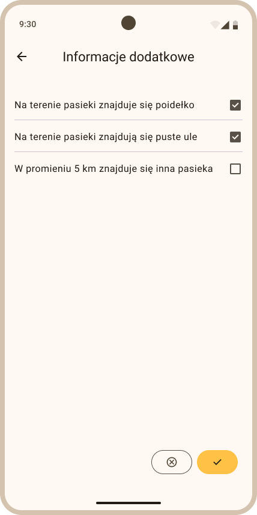
   Rys. ... Ustawienia pasieki - edycja danych w sekcji Szczegóły paiseki oraz w sekcji Informacje dodatkowe

#### 1.3 Usuwanie pasieki

- W zakładce **Pasieki** (widok startowy po zalogowaniu do aplikacji Apisense), kliknij w kafelek z wybraną pasieką. W rezultacie zostanie otwarta zakładka *Ule* (Rys. ........).

  
  
   Rys. ... Zakładka Pasieki z jedną pasieką oraz zakładka Ul z jednym ulem

- W zakładce *Ule* kliknij ikonę koła zębatego, znajdującą się w prawym górnym rogu ekranu. Po kliknięciu zębatki zostanie otwarty widok *Ustawienia pasieki* (Rys. .........).

  
   Rys. ... Widok Ustawienia pasieki

- W widoku *Ustawienia pasieki* kliknij przycisk *Usuń pasiekę*. W rezultacie zostanie wyświetlony widok *Usuń pasiekę* (Rys. .........), gdzie należy potwierdzić swój wybór przyciskiem *Tak, usuń*.

  
   Rys. ... Ustawienia pasieki - widok Usuń pasiekę

- Wraz z usuniętą pasieką usunięta zostaje również cała jej zawartość (ule, notatki, przeglądy itp.). Odpinane są także poszczególne urządzenia (Hub, Scale, VitalSensor), ale zostaje zachowana ich historia pomiarów. Przykładowo ten sam Apisense Hub będziesz mógł wykorzystać podczas tworzenia nowej pasieki.

### 2. Ul

#### 2.1 Dodawanie ula

- Będąc w zakładce Pasieki (widok startowy po zalogowaniu do aplikacji Apisense) kliknij kafelek z pasieką, do której chcesz dodać ul i przypisać urządzenia (Scale i VitalSensor). Po kliknięciu w kafelek zostanie wyświetlony widok pojedynczej pasieki (Rys. .....).

  
  
 Rys. ... Widok pasieki w zakładce Pasieki i widok pojedynczej pasieki (Ule)

- Aby dodać ul do tej pasieki kliknij zakładkę *Dodaj...* na dolnym pasku menu i wybierz opcję *Dodaj ul* (Rys. ..........), w wyniku czego zostanie wyświetlony widok Dodaj ul (Rys. ..........).

  
 Rys. ... Widok Ule - Przycisk Dodaj ul

- Wypełnij poszczególne pola w widoku Dodaj ul - sekcja **Szczegóły ula** (Rys. ..........):

    - **Nazwa ula** - wpisz nazwę dla swojego ula - pod taką nazwą ul będzie wyświetlany w panelu.
    - **Skrót nazwy** - jest ustawiany domyślnie, w celu łatwiejszej identyfikacji ula. Możesz wprowadzić własny skrót - maksymalnie 3 znaki.
    - **Rodzaj ula** - wybierz rodzaj posiadanego ula z listy rozwijanej (kliknij strzałkę w dół widoczną przy tym polu po prawej stronie).
    - **Typ ramek** - wybierz typ ramek jakie są umieszczone w Twoim ulu z listy rozwijanej (kliknij strzałkę w dół widoczną przy tym polu po prawej stronie).
    - **Pole wyboru** - zaznacz, jeśli dotyczy Twojego ula.

    Powyższe informacje będą mogły zostać zedytowane przez użytkownika w dowolnym momencie.

 Rys. ... Dodawanie ula w systemie - sekcja Szczegóły ula

- Aby przejść do kolejnego etapu dodawania ula kliknij żółty przycisk ze strzałką w prawo, znajdujący się na dole ekranu.

- **Informacje o matce pszczelej:** Na tym etapie dodawania ula należy wypełnić informacje o matce pszczelej (Rys. ....):

    - **Rok wychowu matki** - wybierz rok wychowu matki pszczelej z listy rozwijanej (kliknij strzałkę w dół widoczną przy tym polu po prawej stronie).
    - **Pochodzenie matki** - wybierz jedną z opcji dostępnej na liście rozwijanej (kliknij strzałkę w dół widoczną przy tym polu po prawej stronie).
    - **Sposób unasiennienia matki** - wybierz jedną z dostępnych opcji

    Powyższe informacje będą mogły zostać zedytowane przez użytkownika w dowolnym momencie.

 Rys. ... Dodawanie ula w systemie - sekcja Informacje o matce pszczelej

- Następnie kliknij żółty przycisk ze strzałką w prawo, znajdujący się na dole ekranu, w celu przejścia do ostatniego kroku dodawania ula.

- **Wyposażenie:** Ostatni etap obejmuje powiązanie urządzeń z tym konkretnym ulem. **Uwaga:** Kluczowe jest, aby urządzenia skonfigurowane w ramach ula (Scale i VitalSensor) były w rzeczywistości zainstalowane w tym samym fizycznym ulu.

    Aby powiązać urządzenia z ulem wypełnij następujące pola:

    - **Waga** - kliknij w ikonę kodu QR znajdującą się w prawej części tego pola i zeskanuj kod QR z naklejki umieszczonej na Apisense Scale. Kolejne pole *Kod potwierdzający* zostanie wypełnione automatycznie.
    - **Kod potwierdzający** - zostanie wypełniony automatycznie, po poprawnym zeskanowaniu kodu QR.
    - **Czujnik** - kliknij w ikonę kodu QR znajdującą się w prawej części tego pola i zeskanuj kod QR z naklejki umieszczonej na Apisense VitalSensor. Kolejne pole *Kod potwierdzający* zostanie wypełnione automatycznie.
    - **Kod potwierdzający** - zostanie wypełniony automatycznie, po poprawnym zeskanowaniu kodu QR.

 Rys. ... Dodawanie ula w systemie - sekcja Wyposażenie

- Po wypełnieniu wszystkich sekcji i niezbędnych pól kliknij żółty przycisk *Zapisz*, aby dodać ul z powiązanymi urządzeniami (Scale, VitalSensor).

- Jeśli utworzenie ula się powiodło, zostaniesz przekierowany do widoku ....., a na Twojej liście uli pojawi się ul, który właśnie utworzyłeś (Rys. .....).

  
   Rys. ... Pomyślnie dodany ul z powiązanymi Apisense Scale oraz VitalSensor w widoku Szczegóły ula

#### 2.2 Edycja ula

- W zakładce **Pasieki** (widok startowy po zalogowaniu do aplikacji Apisense), kliknij w kafelek z wybraną pasieką. W rezultacie zostanie otwarta zakładka *Ule* (Rys. ........).

  
  
   Rys. ... Zakładka Pasieki z jedną pasieką oraz zakładka Ul z jednym ulem

- W zakładce *Ule* kliknij w kafelek z wybranym ulem, co spowoduje otwarcie zakładki *Szczegóły* (Rys. ............).

  
 Rys. ... Przykładowy widok zakładki Szczegóły ula

- Następnie kliknij w ikonę koła zębatego, zlokalizowaną w prawym górnym rogu zakładki *Szczegóły*, w wyniku czego zostanie wyświetlony widok *Ustawienia ula* (Rys. ............).

  
 Rys. ... Widok Ustawienia ula

- Widok *Ustawienia ula* jest podzielony na 3 sekcje. Aby zaktualizować informacje należące do danej sekcji, należy kliknąć w jej nagłówek. Dostępne sekcje:

  - **Szczegóły ula** - sekcja umożliwia edycję takich parametrów jak nazwa ula i jej skrót, rodzaj ula, typ ramek oraz dennica. W tym celu należy kliknąć w wybrane pole i wprowadzić zmiany lub zaznaczyć/odznaczyć kwadrat przy danym elemencie.
  - **Informacje o matce** - sekcja dotyczy danych związanych z matką pszczelą (rok wychowu, pochodzenie, sposób unasiennienia). Aby zaktualizować dane w tej sekcji należy wybrać odpowiednią pozycję z określonej listy rowijanej (np. Pochodzenie matki -> pozycja: Hodowla własna).
  - **Wyposażenie** - sekcja zawiera informacje na temat powiązanych urządzeń z ulem (Scale, VitalSensor). Sekcja umożliwia usunięcie przypisania urządzenia do tego ula. Aby to zrobić należy kliknąć przycisk *Odłącz wagę*/*Odłącz czujnik* w zależności od tego, które urządzenie ma zostać odpięte, a następnie potwierdzić wybór przy użyciu żółtego przycisku *Odłącz wage/czujnik* (Rys. .........). Podczas odpinania urządzeń historia ich pomiarów zostaje zachowana, co oznacza, że po ponownym przypisaniu ich do innego ula wszystkie pomiary będą dostępne. Aby usunąć historię pomiarów użyj przełącznika. Jeżeli w skład wyposażenia ula nie wchodzi któreś z urządzeń (pola nie są wypełnione), z tego miejsca można również powiązać Scale/VitalSensor z ulem. W tym celu należy kliknąć ikonę kodu QR, znajdującą się w prawej części pola Waga/Czujnik i zeskanować kod QR z odpowiednich urządzeń pomiarowych.

    

      
      
     Rys. ... Widok Ustawienia ula - sekcja Wyposażenie, potwierdzenie odłączenia Scale z zachowaniem historii pomiarów

- Aby zapisać wprowadzone zmiany w wybranej sekcji, należy kliknąć żółty przycisk, znajdujący się w prawym dolnym rogu ekranu (Rys. ........).

rys...........

#### 2.3 Usuwanie ula

- W zakładce **Pasieki** (widok startowy po zalogowaniu do aplikacji Apisense), kliknij w kafelek z wybraną pasieką. W rezultacie zostanie otwarta zakładka *Ule* (Rys. ........).

  
  
   Rys. ... Zakładka Pasieki z jedną pasieką oraz zakładka Ul z jednym ulem

- W zakładce *Ule* kliknij w kafelek z wybranym ulem, co spowoduje otwarcie zakładki *Szczegóły* (Rys. ............).

  
 Rys. ... Przykładowy widok zakładki Szczegóły ula

- Następnie kliknij w ikonę koła zębatego, zlokalizowaną w prawym górnym rogu zakładki *Szczegóły*, w wyniku czego zostanie wyświetlony widok *Ustawienia ula* (Rys. ............).

  
 Rys. ... Widok Ustawienia ula

- W widoku *Ustawienia ula* kliknij przycisk *Usuń ul*. W rezultacie zostanie wyświetlony widok *Usuń ul* (Rys. .........), gdzie należy potwierdzić swój wybór przyciskiem *Tak, usuń*.

  
   Rys. ... Ustawienia ula - widok Usuń ul

- Wraz z usuniętym ulem usunięta zostaje również cała jego zawartość (notatki, przeglądy itp.). Odpinane są także poszczególne urządzenia (Scale, VitalSensor), ale zostaje zachowana ich historia pomiarów. Przykładowo ten sam Apisense VitalSensor będzie mógł zostać powiązany z innym ulem (który nie posiada tego typu urządzenia).

### 3. Dodawanie przeglądów

- Będąc w zakładce Pasieki (widok startowy po zalogowaniu do aplikacji Apisense) kliknij kafelek z pasieką. Po kliknięciu w kafelek zostanie wyświetlony widok Ule (Rys. .....).

  
  
 Rys. ... Widok pasieki w zakładce Pasieki i widok Ule

- Następnie kliknij w kafelek ula, dla którego chcesz wykonać przegląd. W rezultacie zostanie wyświetlony widok Szczegóły ula (Rys. .......).

  
 Rys. ... Widok Szczegóły ula

- Aby dodać przegląd, należy z dolnego menu wybrać opcję *Dodaj...*, a następnie *Przegląd* (Rys. ..........), w wyniku czego zostanie wyświetlony widok dodaj przegląd (Rys. ..........).

  
 Rys. ... Widok Szczegóły ula - Przycisk Dodaj Przegląd

- W widoku Dodaj przegląd (Rys. ..........) odpowedz na kilka pytań. Zaznacz odpowiedź Tak, Nie lub Pomiń.

 Rys. ... Dodawanie przeglądu - przykładowe pytanie

- Aby przejść do następnego pytania przeglądu, kliknij żółty przycisk ze strzałką w prawo, znajdujący się na dole ekranu.
- Aby załączyć zdjęcia do konkretnego pytania przeglądu, kliknij przycisk *+*, znajdujący się w prawym górnym rogu ekranu (Rys. .........).

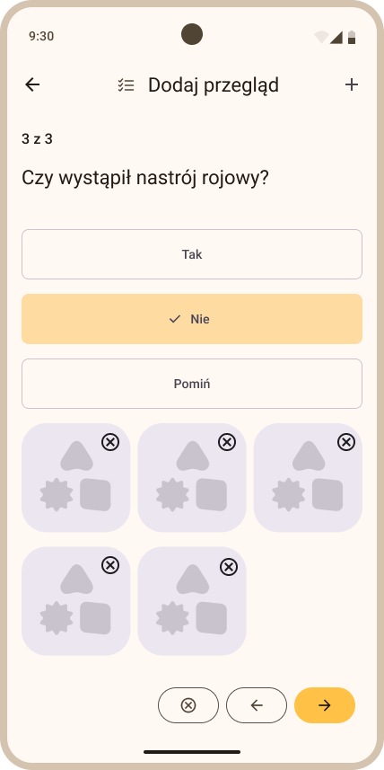
 Rys. ... Dodawanie przeglądu - załączanie zdjęć do pytania z przeglądu

- Po udzieleniu odpowiedzi na wszystkie pytania przeglądu zostanie wyświetlony ostatni widok (Rys. ........), w którym należy wybrać:

    - **datę przeglądu** - domyślnie ustawiona jest aktualna data,

    - **czy zapisać dokładnie ten sam przegląd dla innych uli** - po zaznaczeniu tej opcji można wybrać:

        - **Wszystkie ule** - jeśli chcesz zapisać przegląd dla wszystkich uli bez wyjątku,
        - **Wybrane ule** - jeśli chcesz zapisać przegląd tylko dla niektórych uli.

 Rys. ... Dodawanie przeglądu - zapisywanie przeglądu

- Aby zapisać przegląd kliknij żółty przycisk *Zakończ przegląd*, znajdujący się w prawym dolnym rogu ekranu. Zapisany przegląd zostanie wyświetlony na liście przeglądów w zakładce Szczegóły ula > Przegląd (Rys. ...........).

 Rys. ... Przegląd na liście przeglądów w ulu

### 4. Notatki

#### 4.1 Dodawanie notatki

- W zakładce Pasieki (widok startowy po zalogowaniu do aplikacji Apisense) kliknij kafelek z pasieką. Po kliknięciu w kafelek zostanie wyświetlony widok Ule (Rys. .....).

  
  
 Rys. ... Widok pasieki w zakładce Pasieki i widok Ule

- Następnie kliknij w kafelek ula, dla którego chcesz dodać notatkę. W rezultacie zostanie wyświetlony widok Szczegóły ula (Rys. .......).

  
 Rys. ... Widok Szczegóły ula

- Aby dodać notatkę, należy z dolnego menu wybrać opcję *Dodaj...*, a następnie *Notatkę* (Rys. ..........), w wyniku czego zostanie wyświetlony widok Dodaj notatkę (Rys. ..........).

  
 Rys. ... Widok Szczegóły ula - Przycisk Dodaj Notatkę

- W widoku Dodaj notatkę (Rys. ..........) wypełnij następujące pola:

    - **Data** - wybierz datę z jaką zapisać notatkę (domyślnie aktualna).
    - **Tytuł** - wpisz tytuł notatki (pole opcjonalne).
    - **Notatka** - Wpisz treść notatki (tekst) lub kliknij ikonę mikrofonu znajdujacą sie po prawej stronie w tym polu, aby nagrać notatkę głosową.
    - **Zapisz dla innych uli** - zaznacz tę opcję, jeśli chcesz zapisać dokładnie taką samą notatkę dla innych uli. Po zaznaczeniu tej opcji można wybrać:

        - **Wszystkie ule** - jeśli chcesz zapisać notatkę dla wszystkich uli bez wyjątku,
        - **Wybrane ule** - jeśli chcesz zapisać notatkę tylko dla niektórych uli.

 Rys. ... Dodawanie notatki tekstowej lub głosowej

- Do notatki możesz również dodać zdjęcie lub nagranie. W tym celu kliknij przycisk *+*, znajdujący się w prawym górnym rogu widoku Dodaj notatkę (Rys. .........).

 Rys. ... Dodawanie notatki tekstowej z załącznikami

- Aby zapisać notatkę kliknij żółty przycisk, znajdujący się w prawym dolnym rogu ekranu. Zapisana notatka zostanie wyświetlona na liście notatek w zakładce Szczegóły ula > Notatki (Rys. ...........).

 Rys. ... Notatka na liście notatek w ulu

#### 4.2 Edycja notatki

- W zakładce Pasieki (widok startowy po zalogowaniu do aplikacji Apisense) kliknij kafelek z pasieką. Po kliknięciu w kafelek zostanie wyświetlony widok Ule (Rys. .....).

  
  
 Rys. ... Widok pasieki w zakładce Pasieki i widok Ule

- Następnie kliknij w kafelek ula, w którym chcesz zedytować notatkę. W rezultacie zostanie wyświetlony widok Szczegóły ula (Rys. .......).

  
 Rys. ... Widok Szczegóły ula

- Przejdź do zakładki *Notatki* (górne menu), w wyniku czego zostanie otwarty widok z listą notatek przypisanych do wybranego ula (Rys. ........)

 Rys. ... Notatka na liście notatek w ulu

- Aby zaktualizować notatkę, kliknij ikonę ołówka znajdującą się przy notatcę, która wymaga edycji. Po kliknięciu w ikonę ołówka zostanie wyświetlony widok *Edycja notatki* (Rys. ........).

 Rys. ... Widok Edycja notatki

- W widoku *Edycja notatki* można zaktualizować wartości dla następujących pól:
  
  - **Data** - kliknij w ikonę kalendarza i wybierz odpowiednią datę.
  - **Tytuł** - wpisz nowy tytuł w wyznaczone miejsce.
  - **Notatka** - zmień treść notatki - zmodyfikuj tekst lub usuń go i nagraj notatkę głosową.
  - Dodaj lub usuń zdjęcie/nagranie przy użyciu *+*.
  - **Zapisz dla innych uli** - użyj przełącznika, aby zmienić wybór.

- Po wprowadzeniu zmian należy kliknąć żółty przycisk umieszczony w prawym dolnym rogu, aby zapisać zmodyfikowaną notatkę.

#### 4.3 Usuwanie notatki

............

### 5. Zadania

#### 5.1 Dodawanie zadań z poziomu pasieki

- W zakładce Pasieki (widok startowy po zalogowaniu do aplikacji Apisense) kliknij kafelek z pasieką, dla której chcesz dodać zadanie. Po kliknięciu w kafelek zostanie wyświetlony widok Ule (Rys. .....).

  
  
 Rys. ... Widok pasieki w zakładce Pasieki i widok Ule

- Aby dodać zadanie, należy z dolnego menu wybrać opcję *Dodaj...*, a następnie *Zadanie* (Rys. ..........), w wyniku czego zostanie wyświetlony widok Dodaj zadanie (Rys. ..........).
- W widoku Dodaj zadanie (Rys. ..........) wypełnij następujące pola:

    - **Zadanie** - wpisz treść zadania.
    - **Data zadania** - wybierz datę, dla której zapisać zadanie (domyślnie aktualna).
    - **Powtarzaj zadanie** - zaznacz tę opcję, jeśli chcesz żeby zadanie było powtarzane cyklicznie. Wybierz jedną z dostępnych opcji:

        - Co tydzień
        - Co 2 tygodnie
        - Co miesiąc
        - Co kwartał

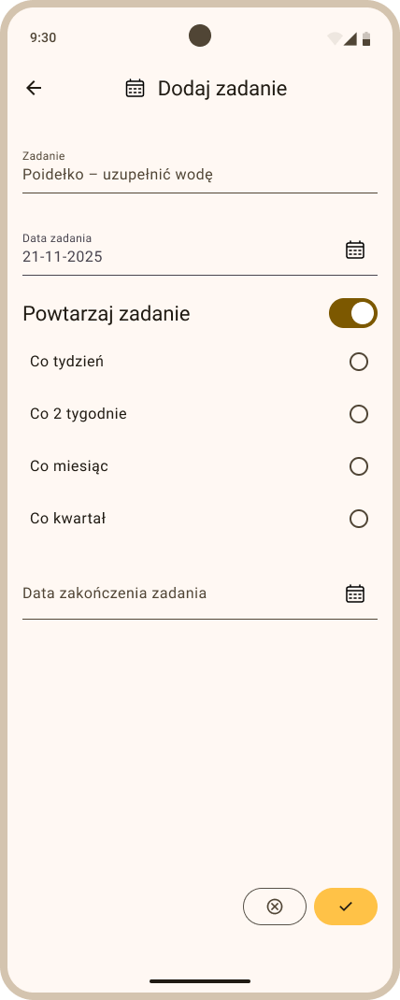
 Rys. ... Dodawanie cyklicznego zadania z poziomu pasieki

- Aby zapisać zadanie kliknij żółty przycisk, znajdujący się w prawym dolnym rogu ekranu. Zapisane zadanie zostanie wyświetlone w kalendarzu zadań w zakładce *Ule* > *Zadania* z ikoną pasieki (Rys. ...........), a także będzie dostępne z poziomu każdego ula przypisanego do tej pasieki (zakładka *Szczegóły* > *Zadania*).

 Rys. ... Zadania na liście zadań w pasiece

#### 5.2 Dodawanie zadań z poziomu ula

- W zakładce Pasieki (widok startowy po zalogowaniu do aplikacji Apisense) kliknij kafelek z pasieką. Po kliknięciu w kafelek zostanie wyświetlony widok Ule (Rys. .....).

  
  
 Rys. ... Widok pasieki w zakładce Pasieki i widok Ule

- Następnie kliknij w kafelek ula, dla którego chcesz dodać zadanie. W rezultacie zostanie wyświetlony widok Szczegóły ula (Rys. .......).

  
 Rys. ... Widok Szczegóły ula

- Aby dodać zadanie, należy z dolnego menu wybrać opcję *Dodaj...*, a następnie *Zadanie* (Rys. ..........), w wyniku czego zostanie wyświetlony widok Dodaj zadanie (Rys. ..........).

  
 Rys. ... Widok Szczegóły ula - Przycisk Dodaj Zadanie

- W widoku Dodaj zadanie (Rys. ..........) wypełnij następujące pola:

    - **Zadanie** - wpisz treść zadania.

    - **Data zadania** - wybierz datę, dla której zapisać zadanie (domyślnie aktualna).

    - **Powtarzaj zadanie** - zaznacz tę opcję, jeśli chcesz żeby zadanie było powtarzane cyklicznie. Wybierz jedną z dostępnych opcji:

        - Co tydzień
        - Co 2 tygodnie
        - Co miesiąc
        - Co kwartał

    - **Zapisz dla każdego ula** - zaznacz tę opcję, jeśli chcesz zapisać dokładnie takie samo zadanie dla wszystkich uli w tej pasiece.

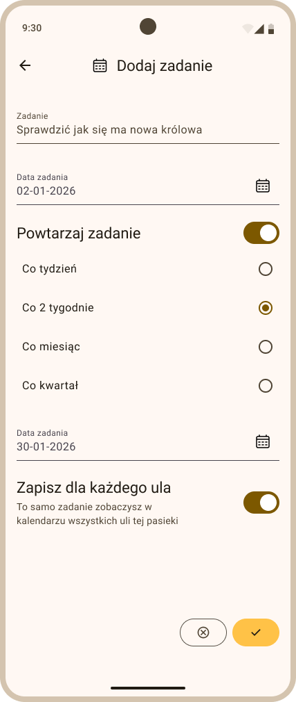
 Rys. ... Dodawanie cyklicznego zadania, zapisanego dla wszystkich uli w pasiece

- Aby zapisać zadanie kliknij żółty przycisk, znajdujący się w prawym dolnym rogu ekranu. Zapisane zadanie zostanie wyświetlone w kalendarzu zadań w zakładce *Szczegóły ula* > *Zadania* (Rys. ...........), a także będzie dostępne z poziomu zakładki *Ule* > *Zadania*.

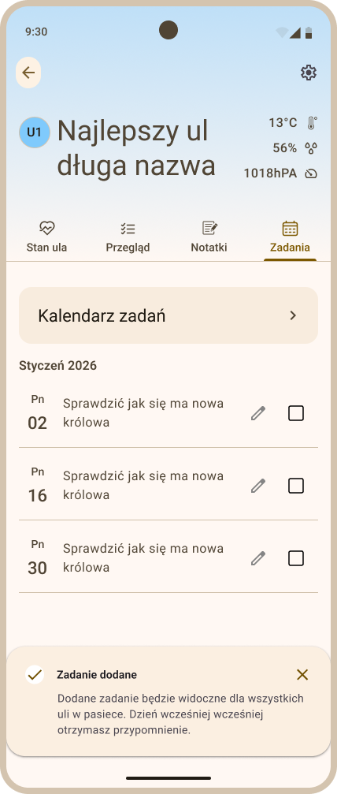
 Rys. ... Zadanie na liście zadań w ulu

### 6. Potwierdzanie chorób

Gdy system Apisense Pro AI zgłosi zagrożenie (np. zgnilec), w aplikacji pojawią się **Alarmy** lub **Rekomendacje** z opisem i zaleceniami. Potwierdzjąc wykrytą chorobę w aplikacji sprawisz, że rekomendacje proponowane przez system będą jeszcze bardziej sprecyzowane i dostosowane do rzeczywistych warunków panujących w Twojej pasiece.

#### 6.1 Potwierdzanie chorób z poziomu pasieki

- W zakładce Pasieki (widok startowy po zalogowaniu do aplikacji Apisense) kliknij kafelek z pasieką, w której wykryto zagrożenie (czerwona ikonka z pszczołą na kafelku z pasieką). Po kliknięciu w kafelek zostanie wyświetlony widok Ule (Rys. .....).

  
  
 Rys. ... Widok pasieki z zagrożeniem w zakładce Pasieki i widok Ule

- Następnie wybierz zakładkę *Powiadomienia* z dolnego menu. W efekcie zostanie wyświetlona lista z aktualnymi oraz historycznymi problemami wykrytymi w tej pasiece (lista chorób z wszystkich uli w pasiece, Rys. .......).

  
 Rys. ... Zakładka Problemy

- Rozwiń szczegóły wykrytej choroby, klikając na wiersz z chorobą np. Zgnilec amerykański (Rys. .........). Po rozwinięciu szczegółów zobaczysz, w którym ulu została wykryta choroba, zalecane działania zabezpieczające oraz przycisk *Odpowiedz na kilka pytań*.
- Aby potwierdzić chorobę wykrytą przez system, kliknij przycisk *Odpowiedz na kilka pytań*. Po kliknięciu w przycisk zostanie wyświetlony widok Odpowiedz na kilka pytań (Rys. .........). Następnie odpowiedz na wszystkie pytania, wybierając jedną z dostępnych opcji: Tak, Nie lub Pomiń.

  
 Rys. ... Potwierdź chorobę - przykładowe pytanie

- Do odpowiedzi na poszczególne pytania możesz również załączyć zdjęcia lub nagrania. W tym celu kliknij przycisk *+*, znajdujący się w prawym górym rogu widoku Odpowiedz na kilka pytań (Rys. ........).

  
 Rys. ... Potwierdź chorobę - załączanie zdjęć i nagrań

- Aby przejść do kolejnego pytania, kliknij ikonkę żółtej strzałki skierowanej w prawo, znajdującą się w prawym dolnym rogu ekranu.

- Po udzieleniu odpowiedzi na wszystkie pytania, zdecyduj czy te same objawy występują również w innych ulach w tej pasiece. Jeśli tak, zaznacz opcję *Zapisz dla innych uli* i wybierz:

    - **Wszystkie ule** - jeśli takie same objawy choroby występują we wszystkich ulach bez wyjątku,
    - **Wybrane ule** - jeśli takie same objawy choroby występują tylko w niektórych ulach. Zaznacz takie ule.

 Rys. ... Zapisanie odpowiedzi na pytania do wybranych uli

- Aby zapisać odpowiedzi i zakończyć formularz kliknij żółty przycisk *Zapisz*, umieszczony w prawym dolnym rogu ostatniego ekranu widoku Odpowiedz na kilka pytań (Rys ........).

#### 6.2 Potwierdzanie chorób z poziomu ula

- W zakładce Pasieki (widok startowy po zalogowaniu do aplikacji Apisense) kliknij kafelek z pasieką, w której wykryto zagrożenie (czerwona ikonka z pszczołą na kafelku z pasieką). Po kliknięciu w kafelek zostanie wyświetlony widok Ule (Rys. .....).

  
  
 Rys. ... Widok pasieki z zagrożeniem w zakładce Pasieki i widok Ule

- Kliknij w kafelek z ulem, w którym wykryto zagrożenie. Po kliknięciu w kafelek zostanie otwarta zakładka *Szczegóły* ula (Rys. ............).

  
 Rys. ... Zakładka Szczegóły ula - ul z wykrytym zagrożeniem

- Następnie wybierz zakładkę *Powiadomienia* z dolnego menu. W efekcie zostanie wyświetlona lista z aktualnymi oraz historycznymi problemami wykrytymi tylko w tym ulu (Rys. .......).

  
 Rys. ... Zakładka Problemy na poziomie pojedynczego ula

- Rozwiń szczegóły wykrytej choroby, klikając na wiersz z chorobą np. Zgnilec amerykański (Rys. .........). Po rozwinięciu szczegółów zobaczysz zalecane działania zabezpieczające oraz przycisk *Odpowiedz na kilka pytań*.
- Aby potwierdzić chorobę wykrytą przez system, kliknij przycisk *Odpowiedz na kilka pytań*. Po kliknięciu w przycisk zostanie wyświetlony widok Odpowiedz na kilka pytań (Rys. .........). Następnie odpowiedz na wszystkie pytania, wybierając jedną z dostępnych opcji: Tak, Nie lub Pomiń.

  
 Rys. ... Potwierdź chorobę - przykładowe pytanie

- Do odpowiedzi na poszczególne pytania możesz również załączyć zdjęcia lub nagrania. W tym celu kliknij przycisk *+*, znajdujący się w prawym górym rogu widoku Odpowiedz na kilka pytań (Rys. ........).

  
 Rys. ... Potwierdź chorobę - załączanie zdjęć i nagrań

- Aby przejść do kolejnego pytania, kliknij ikonkę żółtej strzałki skierowanej w prawo, znajdującą się w prawym dolnym rogu ekranu.
- Po udzieleniu odpowiedzi na wszystkie pytania, zdecyduj czy te same objawy występują również w innych ulach w tej pasiece. Jeśli tak, zaznacz opcję *Zapisz dla innych uli* i wybierz:

    - **Wszystkie ule** - jeśli takie same objawy choroby występują we wszystkich ulach bez wyjątku,
    - **Wybrane ule** - jeśli takie same objawy choroby występują tylko w niektórych ulach. Zaznacz takie ule.

 Rys. ... Zapisanie odpowiedzi na pytania do wybranych uli

- Aby zapisać odpowiedzi i zakończyć formularz kliknij żółty przycisk *Zapisz*, umieszczony w prawym dolnym rogu ostatniego ekranu widoku Odpowiedz na kilka pytań (Rys ........).

### 7. Rejestrowanie próbki

- W zakładce Pasieki (widok startowy po zalogowaniu do aplikacji Apisense) kliknij kafelek z pasieką. Po kliknięciu w kafelek zostanie wyświetlony widok Ule (Rys. .....).

  
  
 Rys. ... Widok pasieki w zakładce Pasieki i widok Ule

- Następnie kliknij w kafelek ula, dla którego chcesz zarejestrować próbkę. W rezultacie zostanie wyświetlony widok Szczegóły ula (Rys. .......).

  
 Rys. ... Widok Szczegóły ula

- Aby zarejestrować próbkę, należy z dolnego menu wybrać opcję *Dodaj...*, a następnie *Zarejestruj próbkę* (Rys. ..........), w wyniku czego zostanie wyświetlony widok Zarejestruj próbkę (Rys. ..........).

  
 Rys. ... Przycisk Zarejestruj próbkę

- W widoku Zarejestruj próbkę należy uzupełnić jedynie pole *Rodzaj badania* (Rys. ...........). W tym celu kliknij na to pole i wybierz odpowiednią pozycję z listy rozwijanej. W rezultacie zostanie wygernerowany specjalny kod w polu *Kod badania*. Ten kod należy zapisać na próbcę. Tak przygotowaną próbkę z kodem należy następnie wysłać na następujący adres: ............... .

  
 Rys. ... Widok Zarejestruj próbkę

### 8. Udostępnianie pasiek

#### 8.1 Udostępnij pasiekę (perspektywa właściciela)

- Z zakładki *Pasieki* (widok startowy aplikacji po zalogowaniu) przejdź do zakładki *Ule*, klikając kafelek wybranej pasieki (Rys. ..............).

  
  
 Rys. ... Zakładka Pasieki i zakładka Ule - przykładowe widoki

- W zakładce *Ule* kliknij w ikonę udostępnienia, znajdującą się w prawym górnym rogu ekranu, obok ikony koła zębatego (Rys. ..........). W rezultacie zostanie wyświetlony widok *Udostępnij pasiekę* (Rys. ..........).
- W widoku Udostępnij pasiekę kliknij żółty przycik *Udostępnij pasiekę* (Rys. ........).

  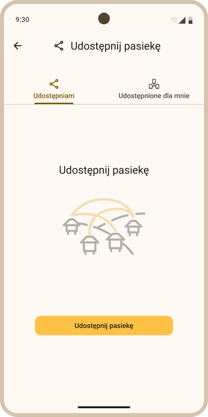
 Rys. ... Przycisk udostępnij pasiekę

- Następnie wypełnij poniższe pola (Rys. ..........):

  - **Numer telefonu** - podaj numer telefonu użytkownika systemu, któremu chcesz udostępnić pasiekę. Numer telefonu możesz wpisać ręcznie lub wybrać ze swojej listy kontaktów. Aby wybrać numer telefonu z listy kontaktów kliknij ikonkę człowieka znajdującą się po prawej strronie w tym polu i wybierz numer z listy. 
  - **Imię** - podaj nazwę użytkownika. Z taką nazwą użytkownik będzie wyświetlany na Twojej liście osób, którym udostępniłeś pasieki.
  
  - **Rodzaj dostępu** - wybierz jeden z możliwych poziomów dostępu:

    - **Ograniczony** - tylko ogólne informacje na temat pasieki
    - **Standardowy** - wszystkie informacje o pasiece i ulach
    - **Pełny** - możliwość zarządzania pasieką. **Uwaga!** Użytkownik z takim rodzajem dostępu będzie mógł edytować, a także usuwać Twoje pasieki, ule, zadania, notatki itp.

  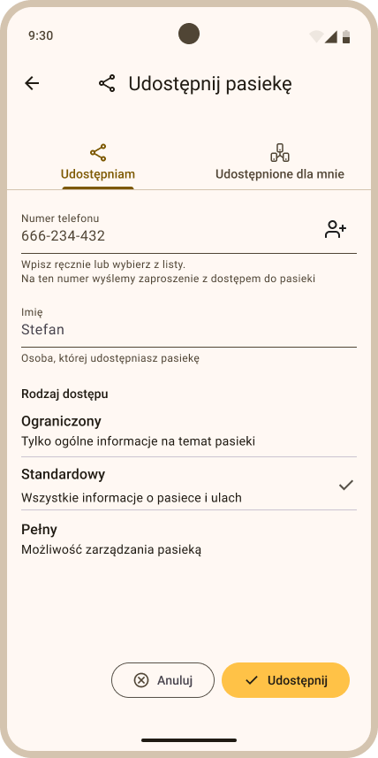
 Rys. ... Widok udostępnij pasiekę

- Aby udostępnić pasiekę kliknij żółty przycisk *Udostępnij*, znajdujący się w prawym dolnym rogu ekranu (Rys. ..........). 
- Po kliknięciu przycisku *Udostępnij*, użytkownik zostanie dodany na Twoją listę w zakładce *Udostępniam* (Rys. .........). Wysłane w ten sposób zaproszenie oczekuje na akceptację ze strony użytkownika, któremu udostępniłeś pasiekę. Tylko jeśli użytkownik zaakceptuje Twoje zaproszenie, pasieka zostanie udostępniona. Status *Zaproszenie* zostanie zmieniony z *Oczekuje na akceptację* na jeden z dwóch, w zależności od decyzji użytkownika:
  
  - **Zaakceptowane** - jeśli użytkownik przyjął Twoje zaproszenie (pasieka została udostępniona),
  - **Wycofane** - jeśli użytkownił odrzucił Twoje zaproszenie (pasieka nie została udostępniona).

  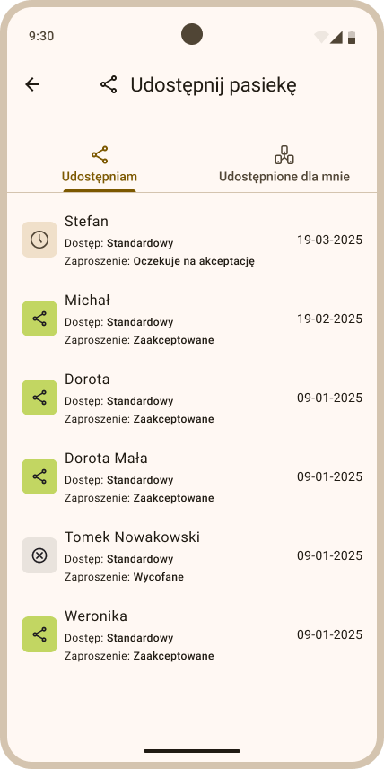
 Rys. ... Lista użytkowników, dla których wysłano zaproszenie z udostępnieniem pasieki

- Udostępnione pasieki są widoczne dla osób, które przyjęły zaproszenie. Właściciel zachowuje pełną kontrolę i może w każdej chwili cofnąć dostęp do udostępnionej pasieki.

#### 8.2 Wycofaj zaproszenie (perspektywa właściciela)

- Z zakładki *Pasieki* (widok startowy aplikacji po zalogowaniu) przejdź do zakładki *Ule*, klikając kafelek wybranej pasieki (Rys. ..............).

  
  
 Rys. ... Zakładka Pasieki i zakładka Ule - przykładowe widoki

- W zakładce *Ule* kliknij w ikonę udostępnienia, znajdującą się w prawym górnym rogu ekranu, obok ikony koła zębatego (Rys. ..........). W rezultacie zostanie wyświetlony widok *Udostępnij pasiekę* (Rys. ..........).

  
 Rys. ... Widok Udostępnij pasiekę, zakładka Udostępniam - przykładowa lista użytkowników

- W zakładce *Udostępniam* kliknij na wiersz z użytkownikiem, któremu chcesz wycofać wysłane zaproszenie lub dostęp do pasieki. Zostanie wtedy otwarty widok z nazwą tego użytkownika np. Stefan (Rys. .............).

  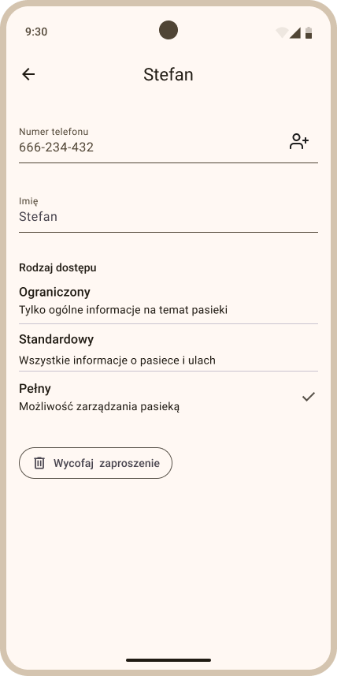
 Rys. ... Podgląd widoku osoby, dla której udostępniono pasiekę

- Następnie kliknij przycisk *Wycofaj zaproszenie*. Po kliknięciu zostanie wyświetlony widok Wycofaj zaproszenie (Rys. ..........). 

  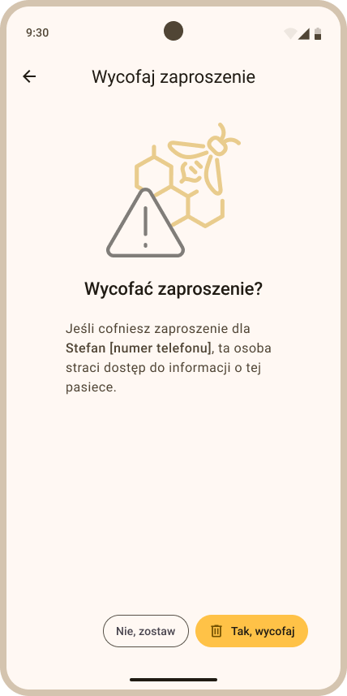
 Rys. ... Potwierdzenie wycofania zaproszenia

- Aby wycofać zaproszenie kliknij żółty przycisk *Tak, wycofaj*, umieszczony w prawym dolnym rogu widoku Wycofaj zaproszenie (Rys. ........). W rezultacie udostępniona pasieka zostanie natychmiast usunięta z widoku użytkownika, któremu ją udostępniłeś.

#### 8.3 Przyjmij zaproszenie (perspektywa otrzymującego)

- Jeśli inny użytkownik udostępni Ci pasiekę, otrzymasz odpowiednie powiadomienie (Rys. .......).

  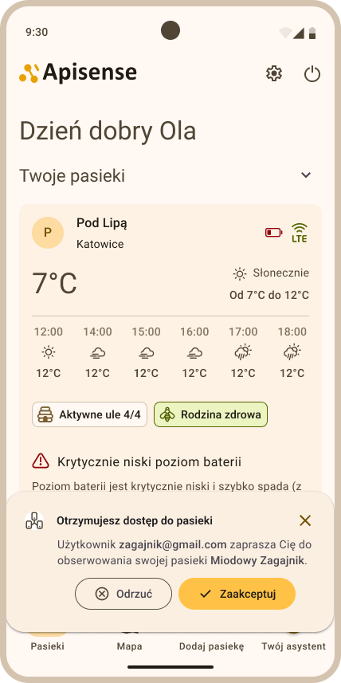
 Rys. ... Otrzymanie powiadomienia o udostępnieniu pasieki przez innego użytkownika

- Zaproszenie możesz przyjąć lub odrzucić. W tym celu kliknij przycisk na powiadomieniu:
  
  - **Zaakceptuj** - jeśli chcesz przyjąć zaproszenie i mieć określony dostęp do pasieki innego użytkownika.
  - **Odrzuć** - jeśli chcesz odrzucić zaproszenie. Odrzucenie zaproszenia od użytkownika spowoduje, że zostanie on o tym odpowiednio powiadomiony, a w Twoim widoku aplikacji nic się nie zmieni. 

- Jeżeli zdecydowałeś się przyjąć zaproszenie, w zakładce *Pasieki* w sekcji *Udostępnione pasieki* zostanie wyświetlona pasieka użytkownika, od którego przyjąłeś zaproszenie (Rys. .........).

  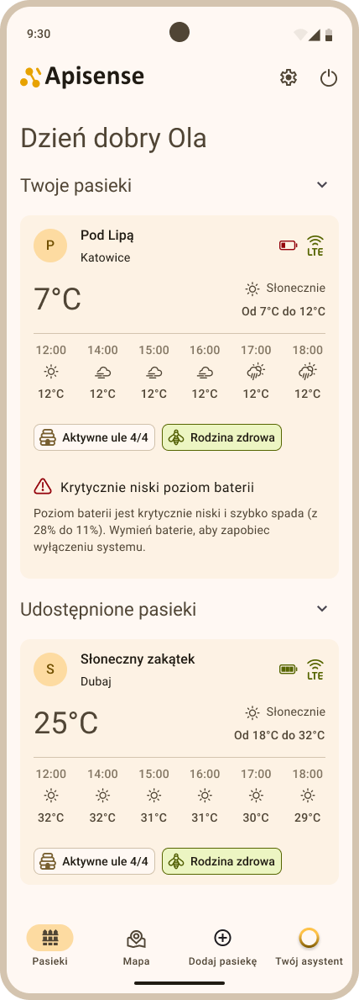
 Rys. ... Zakładka Pasieki - sekcja Udostępnione pasieki

- Właściciel zachowuje pełną kontrolę i może w każdej chwili cofnąć dostęp do udostępnionej pasieki. W rezultacie taka pasieka zniknie z Twojej listy *Udostępnione pasieki* i nie będziesz mógł już z niej korzystać.

- Jeżeli nie podjąłeś żadnej decyzji w momencie gdy powiadomienie o udostępnieniu było aktywne, a użytkownik nie wycofał jeszcze zaproszenia, możesz zareagować na udostępnienie przechodząc do .........., a następnie do zakładki *Udostępnione dla mnie* (Rys. ...........).

  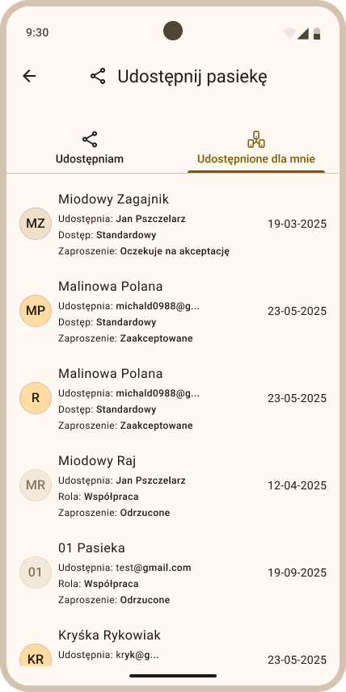
 Rys. ... Zakładka Udostępnione dla mnie

- W zakładce *Udostępnione dla mnie* kliknij na pasiekę ze statusem *Oczekuje na akceptację* i kliknij przycisk *Odrzuć* lub *Zaakceptuj* (Rys. ..........).

  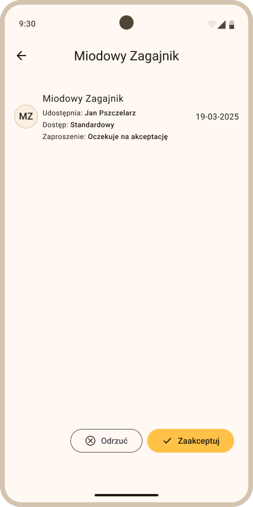
 Rys. ... Zakładka Udostępnione dla mnie - przyjęcie lub odrzucenie zaproszenia

- Jeżeli zdecydowałeś się przyjąć zaproszenie, w zakładce *Pasieki* w sekcji *Udostępnione pasieki* zostanie wyświetlona pasieka użytkownika, od którego przyjąłeś zaproszenie. Jeśli nie - nic się nie zmieni.

#### 8.4 Usuń zaakceptowane zaproszenie (perspektywa otrzymującego)

- Jeśli zaakceptowałeś zaproszenie o udostępnionej pasiece od innego użytkownika, ale nie chcesz już dłużej korzystać z udostępnionej pasieki, w widoku ...... przejdź .......
- Następnie kliknij w zakładkę *Udostępnione dla mnie*, w wyniku czego zostanie wyświetlona lista udostępnionych dla Ciebie pasiek (Rys. ..........).

  
 Rys. ... Zakładka Udostępnione dla mnie

- W zakładce *Udostępnione dla mnie* kliknij na pasiekę ze statusem *Zaakceptowane*, którą chcesz usunąć. W rezultacie zobaczysz widok z tą konkretną pasieką (Rys. ..........).

  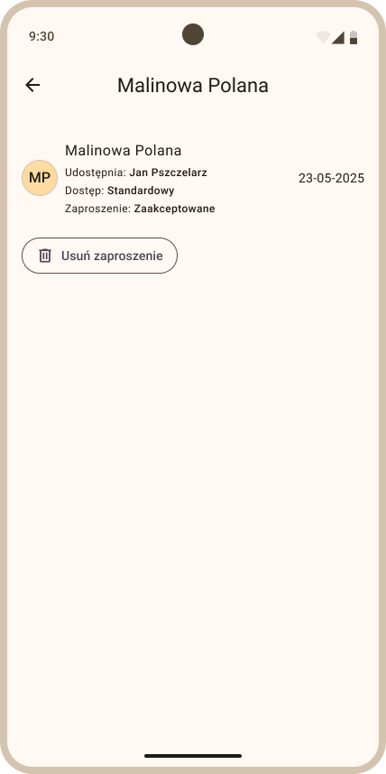
 Rys. ... Szczegóły udostępnionej pasieki

- Aby usunąć pasiekę należy kliknąć przycisk *Usuń zaproszenie* (Rys. .......). Po kliknięciu zobaczysz kolejny ekran, gdzie należy potwierdzić sowją decyzję, klikając żółty przycisk *Tak, usuń*, znajdujący się w prawym dolnym rogu widoku Usuń zaproszenie (Rys. .........). Pasieka zostanie usunięta z sekcji *Udostępnione pasieki* w zakładce *Pasieki*, nie będziesz mógł już z niej dłużej korzystać.

  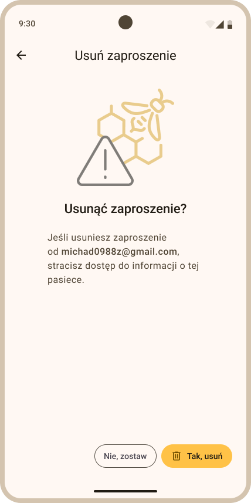
 Rys. ... Usunięcie zaakceptowanego zaproszenia

______________________________________________________________________

## Panel główny systemu

### 1. Omówienie listy pasiek (zakładka Pasieki)

**Zakładka *Pasieki*** to podstawowa zakładka w aplikacji Apisense, którą zobaczysz zaraz po zalogowaniu się do systemu (Rys. .......).

  
 Rys. ... Zakładka Pasieki - przykładowy widok pasiek

**Najważniejsze informacje:**
- W zakładce *Pasieki* znajdują się wszystkie pasieki, do których masz dostęp - zarówno Twoje własne (sekcja *Twoje pasieki*), jak i te udostępnione dla Ciebie przez innych użytkowników (sekcja *Udostępnione pasieki*).
- Każda pasieka prezentowana jest w formie pojedynczego, przejrzystego kafelka, zawierającego kluczowe, odpowiednio zagregowane informacje.
- Kafelki Twoich, jak i udostępnionych pasiek są prezentowane w analogiczny sposób. Różni się natomiast możliwość korzystania z udostępnionych pasiek w zależności od przydzielonego przez właściciela poziomu dostępu Udostępnianie pasiek - rodzaje dostępu.
- Na każdym kafelku pasieki są wyświetlane następujące informacje: 

  - nazwa pasieki wraz ze skrótem nazwy i ikonką,
  - lokalizacja pasieki wyświetlana na podstawie lokalizacji Apisense Hub,
  - poziom baterii Apisense Hub,
  - poziom sygnału LTE Apisense Hub,
  - aktualna pogoda,
  - liczba aktywnych uli - liczba uli, które posiadają co najmniej jedno urządzenie (Scale, VitalSensor) poprawnie komunikujące się z Apisense Hub,
  - stan rodziny pszczelej - informujący o tym, czy rodzina w pasiece jest w zupełności zdorwa lub czy w jakimś ulu zostało wykryte zagrożenie,
  - ostrzeżenia np. o krytycznie niskim poziomie baterii.
  
    Więcej informacji na temat interpretacji poszczególnych statusów znajdziesz w rozdziale 7. Interpretacja statusów, pomiarów, ikonek, kolorów na poszczególnych etapach

- Kliknięcie w kafelek pasieki otwiera wnętrze pasieki - listę uli (Zakładka Ule).

### 2. Omówienie mapy pasiek (zakładka Mapa)

**Zakładka Mapa** prezentuje lokalizacje wszystkich pasiek na mapie, do których użytkownik posiada dostęp - zarówno własne pasieki jak i udostępnione przez innych (Rys. ..........). Mapa ułatwia logistykę, planowanie wizyt i szybkie zlokalizowanie pasiek wymagających interwencji.

  
 Rys. ... Zakładka Mapa - przykładowy widok lokalizacji pasiek

**Najważniejsze informacje:**
- Aby przejść do tej zakładki należy kliknąć opcję *Mapa*, widoczną na dolnym menu zaraz po zalogowaniu się do aplikacji Apisense.
- Na mapie wyświetlane są markery określające lokalizacje pasiek użytkownika. 
- Widok mapy można filtrować według problemów wykrytych w pasiekach. W tym celu należy kliknąć opcję np. *Warroza* znajdującą się powyżej mapy, w wyniku czego widok mapy zostanie ograniczony tylko do pasiek, w których występuje zagrożenie tą chorobą.

### 3. Omówienie listy uli (zakładka Ule)

Zakładka *Ule* jest bardziej złożona niż poprzednie, gdyż w jej skład wchodzą 3 podzakładki (Rys. .......):

- Lista
- Porównanie
- Zadania

Do zakładki *Ule* moźesz przejść bezpośrednio z zakładki *Pasieki*, po kliknięciu w kafelek z wybraną pasieką. 

  
 Rys. ... Zakładka Ule - przykładowy widok listy uli

#### 3.1 Lista

W **zakładce *Lista*** znajdziesz listę wszystkich uli przypisanych do wybranej pasieki (Rys. .......). Takie ułożenie pozwala szybko porównać ule i zlokalizować te wymagające uwagi.

**Najwaźniejsze informacje:**
- Podobnie jak pasieki - każdy ul jest prezentowany w postaci osobnego kafelka.
- Każdy kafelek z ulem składa się z poniższych elementów:
  
  - nazwa ula wraz ze skrótem nazwy i ikonką w kolorze odpowiednim dla roku wychowu matki,
  - stan rodziny pszczelej - informujący o tym, czy rodzina w danym ulu jest zdrowa lub, czy wykryto zagrożenie,
  - aktualna temperatura panująca wewnątrz ula
  - aktualna waga ula wraz z przybytkiem miodu
  - dodatkowe ikony związane ze szczególnymi zdarzeniami w ulu np. ikona kalendarza.
  
    Więcej informacji na temat interpretacji poszczególnych statusów znajdziesz w rozdziale 7. Interpretacja statusów, pomiarów, ikonek, kolorów na poszczególnych etapach

- Kliknięcie w kafelek ula otwiera wnętrze ula - szczegółowe dane pomiarowe wykonane przez urządzenia przypisane do wybranego ula (Zakładka Szczegóły).

#### 3.2 Porównanie

**Zakładka *Porównanie*** umożliwia zestawienie kilku uli w jednym widoku i ocenę ich parametrów. Zawartość zakładki została szczegółowo omówiona w rozdziale Porównywanie uli.

#### 3.3 Zadania

**Zakładka *Zadania*** służy do planowania oraz monitorowania prac wykonywanych w danej pasiece, umożliwiając użytkownikowi przegląd wszystkich zaplanowanych czynności w formie kalendarza oraz szybki dostęp do najbliższych nadchodzących zadań (Rys. .........).

  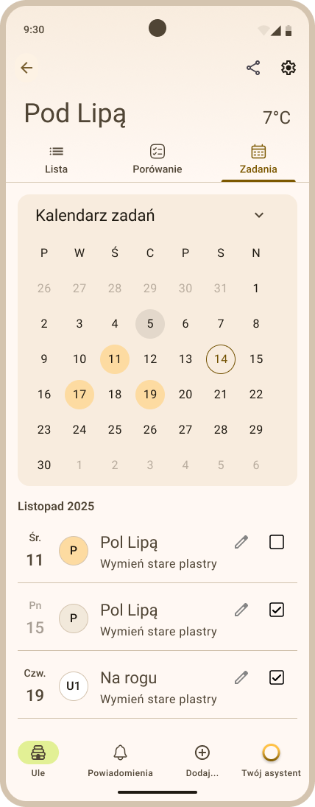
 Rys. ... Zakładka Zadania (w pasiece) - przykładowy widok kalendarza zadań

**Najważniejsze informacje:**

- **Kalendarz zadań** – w centralnej części zakładki znajduje się kalendarz (kliknij, aby rozwinąć lub zwinąć), w którym prezentowane są wszystkie zadania związane z daną pasieką. Zadania dodane na poziomie pasieki oznaczone są ikoną pasieki i są automatycznie przypisywane do wszystkich uli w tej pasiece (zobaczysz je w kalendarzach zadań dla poszczególnych uli). Natomiast zadania dodane na poziomie pojedynczego ula są widoczne tylko w tym ulu i w kalendarzu zadań dla pasieki (zakładka Ule > Zadania). W kalendarzu zadań pasieki, zadania dodane na poziomie pojedynczego ula są wyświetlane z ikoną ula, co pozwala łatwo rozróżnić ich zakres.
- **Najbliższe zadania** – oprócz kalendarza wyświetlana jest również lista kilku najbliższych nadchodzących zadań, zawierająca bardziej szczegółowe informacje, co ułatwia szybkie sprawdzenie najpilniejszych prac do wykonania.
- **Dodawanie zadań** – sposób dodawania zadania na poziomie pasieki został opisany w rozdziale 5.1 Dodawanie zadań z poziomu pasieki
- **Oznaczanie wykonania zadania** – użytkownik może oznaczyć zadanie jako wykonane poprzez zaznaczenie checkboxa znajdującego się przy danym zadaniu.
- **Wizualne oznaczenie wykonanych zadań** – po oznaczeniu zadania jako wykonane zostaje ono automatycznie wyróżnione w kalendarzu kolorem szarym, co ułatwia odróżnienie zadań zakończonych od tych, które nadal wymagają realizacji.
- **Powiadomienia o zadaniach** – użytkownik otrzymuje powiadomienie dzień przed zaplanowanym terminem zadania, co pozwala odpowiednio przygotować się do wykonania zaplanowanych prac w pasiece.
- **Kontrola prac w pasiece** – korzystanie z zakładki pozwala uporządkować harmonogram prac w pasiece i ograniczyć ryzyko pominięcia ważnych czynności związanych z obsługą uli.

### 4. Omówienie zawartości ula (zakładka Szczegóły)

Widok *Szczegóły* ula umożliwia monitorowanie danych pomiarowych pochodzących z urządzeń pomiarowych (Scale, VitalSensor) oraz zarządzanie zapisami dotyczącymi pracy przy konkretnym ulu (przeglądami, notatkami i zadaniami). Do zakładki szczegółów można przejść bezpośrednio z zakładki *Ule*, po kliknięciu w kafelek z wybranym ulem. Widok *Szczegóły* został podzielony na 4 mniejsze zakładki: 

- Stan ula
- Przeglądy 
- Notatki
- Zadania

#### 4.1 Stan ula

Zakładka *Stan ula* prezentuje najważniejsze bieżące informacje o kondycji rodziny pszczelej oraz warunkach panujących w ulu (Rys. ...........), na podstawie danych pomiarowych z urządzeń monitorujących.

  
 Rys. ... Zakładka Szczegóły - przykładowy widok zakładki Stan ula

**Najważniejsze informacje:**

- **Sekcja Zdrowie** – prezentuje aktualny stan rodziny pszczelej, informując czy rodzina jest zdrowa, czy też wykryto potencjalne zagrożenie w postaci choroby. W tej sekcji wyświetlany jest również rok wychowu matki pszczelej.
- **Sekcja Waga** – zawiera informacje dotyczące aktualnej wagi ula oraz przybytku miodu, co pozwala ocenić tempo produkcji oraz aktywność rodziny pszczelej.
- **Sekcja Warunki** – przedstawia dane środowiskowe z wnętrza ula oraz jego otoczenia, takie jak temperatura zewnętrzna, temperatura wewnętrzna, wilgotność oraz ciśnienie wewnątrz ula.
- **Szczegółowe dane i wykresy** – po rozwinięciu poszczególnych elementów w danej sekcji użytkownik może zobaczyć bardziej szczegółowe informacje oraz wykresy zmian parametrów w czasie, co ułatwia analizę stanu ula i warunków panujących w jego wnętrzu.
  
Więcej informacji na temat analizy i prezentacji danych w formie wykresów zawarto w rozdziałach Monitorowanie parametrów oraz Analiza danych i raporty

#### 4.2 Przegląd

Zakładka *Przeglądy* umożliwia przeglądanie historii przeprowadzonych kontroli danego ula. Przeglądy zaprezentowane są w formie listy (Rys. ..........).

  
  
 Rys. ... Zakładka Szczegóły - przykładowy widok zakładki Przegląd (lista przeglądów i szczegóły przeglądu)

**Najważniejsze informacje:**

- **Lista przeglądów** – prezentuje zestawienie wszystkich wykonanych przeglądów dla wybranego ula wraz z datą przeglądu.
- **Materiały multimedialne** – przy danym przeglądzie może być widoczna ikona zdjęcia lub nagrania, jeśli podczas przeglądu zostały dodane materiały wizualne.
- **Szczegóły przeglądu** – po kliknięciu w wybrany wiersz wyświetlane są szczegółowe informacje dotyczące przeglądu, w tym odpowiedzi udzielone podczas jego wykonywania.

#### 4.3 Notatki

Zakładka *Notatki* pozwala zapisywać i przeglądać informacje dotyczące obserwacji lub zdarzeń związanych z danym ulem. Notatki, tak jak i przeglądy, zaprezentowane są w formie listy (Rys. ..........).

  
 Rys. ... Zakładka Szczegóły - przykładowy widok zakładki Notatki

**Najważniejsze informacje:**

- **Lista notatek** – prezentuje wszystkie notatki zapisane dla wybranego ula, zawierając tytuł/datę oraz skrócony fragment treści (jeśli notatka zawiera tekst).
- **Materiały dodatkowe** – przy notatkach mogą pojawić się ikony zdjęcia, nagrania wideo lub nagrania audio, jeśli takie materiały zostały do nich dołączone.
- **Szczegóły notatki** – po kliknięciu - rozwinięciu - wybranej notatki wyświetlana jest pełna treść notatki wraz z dołączonymi materiałami.

#### 4.4 Zadania

Zakładka *Zadania* służy do planowania oraz monitorowania prac wykonywanych przy konkretnym ulu, umożliwiając przegląd zaplanowanych czynności w formie kalendarza oraz listy najbliższych zadań.

  
 Rys. ... Zakładka Szczegóły - przykładowy widok zakładki Zadania

**Najważniejsze informacje:**

- **Kalendarz zadań** – w kalendarzu prezentowane są wszystkie zadania przypisane tylko do tego konkretnego ula (kliknij, aby rozwinąć lub zwinąć).
- **Najbliższe zadania** – widoczna jest lista kilku najbliższych nadchodzących zadań, zawierająca bardziej szczegółowe informacje o planowanych pracach.
- **Dodawanie zadań** – sposób dodawania zadania na poziomie ula został opisany w rozdziale 5.2 Dodawanie zadań z poziomu ula
- **Oznaczenia zadań** – przy zadaniach wyświetlanych na liście widnieje data planowanego zadania, co pozwala łatwo priorytetyzować czynności.
- **Oznaczanie wykonania zadania** – użytkownik może oznaczyć zadanie jako wykonane poprzez zaznaczenie checkboxa przy danym zadaniu.
- **Wizualne oznaczenie wykonanych zadań** – po oznaczeniu zadania jako wykonane zostaje ono oznaczone w kalendarzu kolorem szarym.
- **Powiadomienia o zadaniach** – użytkownik otrzymuje powiadomienie dzień przed zaplanowanym terminem zadania, co ułatwia przygotowanie się do wykonania zaplanowanych prac przy ulu.

### 5. Omówienie ustawień pasieki

Widok *Ustawienia pasieki* pozwala zarządzać podstawowymi danymi pasieki oraz śledzić informacje na temat jej stanu wyposażenia. Do widoku można przejść będąc w zakładce *Ule* (wnętrze pasieki) i klikając ikonkę koła zębatego w prawym górnym rogu ekranu.
Widok *Ustawienia pasieki* składa się z następujących sekcji:

- Szczegóły pasieki
- Bramka
- Informacje dodatkowe

  
 Rys. ... Widok Ustawienia pasieki

Aby zobaczyć zawartość danej sekcji, należy kliknąć w jej nagłówek, w wyniku czego zostanie wyświetlony pełny widok ze szczegółowymi informacjami.

#### 5.1 Szczegóły pasieki

Sekcja *Szczegóły pasieki* prezentuje podstawowe informacje identyfikujące pasiekę.

  
 Rys. ... Widok Ustawienia pasieki - sekcja Szczegóły pasieki

**Najważniejsze informacje:**

- **Nazwa pasieki** – wyświetlana jest pełna nazwa pasieki, identyfikująca ją w systemie.
- **Skrót nazwy pasieki** – prezentowany jest skrócony zapis nazwy, używany w różnych widokach i raportach.

#### 5.2 Bramka

Sekcja **Bramka** prezentuje dane techniczne urządzenia Apisense Hub, odpowiedzialnego za zbieranie danych pomiarowych z uli w pasiece.

  
 Rys. ... Widok Ustawienia pasieki - sekcja Bramka

**Najważniejsze informacje:**

- **Numer seryjny i kod potwierdzający** – prezentowane są unikalny numer seryjny urządzenia oraz kod weryfikacyjny, potwierdzający jego przypisanie do użytkownika.
- **LTE i bateria** – wyświetlane są informacje o aktualnym stanie połączenia LTE oraz poziomie naładowania baterii urządzenia apisense Hub.
- **Ostatnie zgłoszenie** – prezentowana jest data i czas ostatniej komunikacji urządzenia Apisense Hub z systemem.
- **Wersje sprzętowa i oprogramowania** – umożliwia sprawdzenie aktualnej wersji sprzętowej oraz oprogramowania urządzenia Apisense Hub.

#### 5.3 Informacje dodatkowe

Sekcja *Informacje dodatkowe* pozwala sprawdzić dane uzupełniające dotyczące pasieki.

  
 Rys. ... Widok Ustawienia pasieki - sekcja Informacje dodatkowe

**Najważniejsze informacje:**

- **Dodatkowe informacje o pasiece** - przedstawione są udzielone odpowiedzi na pytania zadane podczas tworzenia pasieki.

### 6. Omówienie ustawień ula

Widok *Ustawienia ula* pozwala na zarządzanie podstawowymi informacjami o ulu, danymi dotyczącymi matki pszczelej oraz przypisanymi urządzeniami pomiarowymi. Do widoku można przejść z zakładki *Szczegóły* ula (wnętrze ula) i klikając ikonkę koła zębatego widoczną w prawym górnym rogu ekranu.
Widok *Ustawienia ula* został podzielony na następujące sekcje:

- Szczegóły ula
- Informacje o matce
- Wyposażenie

  
 Rys. ... Widok Ustawienia ula

Aby zobaczyć zawartość danej sekcji, należy kliknąć w jej nagłówek, w wyniku czego zostanie wyświetlony pełny widok ze szczegółowymi informacjami.

#### 6.1 Szczegóły ula

Sekcja *Szczegóły ula* prezentuje podstawowe informacje identyfikujące ul i jego konstrukcję.

  
 Rys. ... Widok Ustawienia ula - sekcja Szczegóły ula

**Najważniejsze informacje:**

- **Nazwa i skrót** – pełna nazwa ula oraz jej skrót, ułatwiający identyfikację w systemie.
- **Rodzaj ula** – określa typ konstrukcji, np. dadant
- **Typ ramek** – prezentuje zastosowany rodzaj ramki w ulu.
- **Dennica higieniczna** – informacja, czy ul posiada dennicę higieniczną.

#### 6.2 Informacje o matce

Sekcja *Informacje o matce* umożliwia przegląd szczegółowych danych dotyczących matki pszczelej w ulu. Kliknij wybrany nagłówek, by wyświetlić szczegóły. 

  
 Rys. ... Widok Ustawienia ula - sekcja Informacje o matce

**Najważniejsze informacje:**

- **Rok wychowu matki** – prezentuje rok wylęgu matki pszczelej.
- **Pochodzenie matki** – informacje o pochodzeniu matki, np. hodowla własna.
- **Sposób unasiennienia** – wskazuje metodę unasiennienia matki, np. naturalna.

#### 6.3 Wyposażenie

Sekcja *Wyposażenie* prezentuje urządzenia pomiarowe przypisane do danego ula oraz ich aktualny stan.

  
 Rys. ... Widok Ustawienia ula - sekcja Wyposażenie

**Najważniejsze informacje:**

- **Numer seryjny i kod potwierdzający** – unikalne numery seryjne oraz kody weryfikacyjne urządzeń pomiarowych Scale i VitalSensor.
- **Rozwinięcie szczegółów** – kliknięcie w wybrane urządzenie otwiera pełny widok z informacjami o stanie sprzętu w ulu (Rys. ..........).
- **Szczegóły urządzenia** – po kliknięciu w dane urządzenie wyświetlane są:
  
  - **BLE i bateria** – informacja o aktualnej sile sygnału BLE i poziomie naładowania urządzenia. 
  - **Ostatnie zgłoszenie** – data i czas ostatniej komunikacji urządzenia z Apisense Hub. 
  - **Ostatni pomiar** – data i czas wykonania najnowszego pomiaru przez urządzenie. 
  - **Wersje sprzętowa i oprogramowania** – umożliwia sprawdzenie aktualnej wersji sprzętowej oraz oprogramowania urządzenia Apisesne Scale/Apisense VitalSensor.

  
  
 Rys. ... Widok Ustawienia ula - sekcja Wyposażenie - szczegóły Scale oraz VitalSensor

### 7. Interpretacja statusów i ikon wykorzystywanych w systemie

W systemie wykorzystywane są różne statusy oraz ikony, które ułatwiają szybkie rozpoznanie stanu pasieki, uli, urządzeń pomiarowych oraz zaplanowanych działań. Elementy te pełnią funkcję wizualnych oznaczeń, dzięki którym użytkownik może w prosty sposób zidentyfikować najważniejsze informacje bez konieczności szczegółowego analizowania danych.

W niniejszym rozdziale przedstawiono znaczenie poszczególnych ikon, symboli oraz oznaczeń kolorystycznych stosowanych w interfejsie systemu, co pozwoli na ich prawidłową interpretację podczas codziennej pracy z aplikacją.

#### Ikony informacyjne

Ikony informacyjne przedstawiają informacje dotyczące pasiek i uli oraz dane zebrane z urządzeń pomiarowych.

| Ikona                                      | Występowanie                                     | Znaczenie                                                                                                                                                                                                                                                                                                                                             |
|:-------------------------------------------|:-------------------------------------------------|:------------------------------------------------------------------------------------------------------------------------------------------------------------------------------------------------------------------------------------------------------------------------------------------------------------------------------------------------------|
|           | kafelek z pasieką (zakładka Pasieki)             | Liczba aktualnie aktywnych uli na całkowitą liczbę uli w pasiece. Ul jest aktywny, gdy posiada co najmniej jedno prawidłowo komunikujące się urządzenie.  Przykład: W pasiece są 2 ule. W ulu 1 wszystkie urządzenia przestały się zgłaszać. W ulu 2 tylko Scale się zgłasza, a VitalSensor nie. Na ikonie zostanie wyświetlone: Aktywne ule 1/2. |
|       | kafelek z ulem (zakładka Ule)                    | Aktualna temperatura wewnątrz ula.                                                                                                                                                                                                                                                                                                                    |
|     | kafelek z ulem (zakładka Ule)                    | Aktualna waga ula i dzienny przybytek miodu.                                                                                                                                                                                                                                                                                                          |
|   | kafelek z ulem (zakładka Ule)                    | Aktualna waga ula i dzienny ubytek miodu.                                                                                                                                                                                                                                                                                                             |
|      | wnętrze ula (zakładka Szczegóły)                 | Aktualna temperatura wewnątrz ula.                                                                                                                                                                                                                                                                                                                    |
|  | wnętrze ula (zakładka Szczegóły)                 | Aktualna wilgotność wewnątrz ula.                                                                                                                                                                                                                                                                                                                     |
|  | wnętrze ula (zakładka Szczegóły)                 | Aktualne ciśnienie atmosferyczne wewnątrz ula.                                                                                                                                                                                                                                                                                                        |

#### Stan zdrowia

Ikony stanu zdrowia informują o kondycji rodziny pszczelej w poszczególnych ulach i całej pasiece.

| Ikona                                        | Występowanie                                     | Znaczenie                                                                                                                                                                                                                                                                                                                                                                                                                                                                                                                                                               |
|:---------------------------------------------|:-------------------------------------------------|:------------------------------------------------------------------------------------------------------------------------------------------------------------------------------------------------------------------------------------------------------------------------------------------------------------------------------------------------------------------------------------------------------------------------------------------------------------------------------------------------------------------------------------------------------------------------|
|        | kafelek z pasieką (zakładka Pasieki)             | Rodzina pszczela w tej pasiece jest zdrowa. W żadnym ulu w tej pasiece nie wykryto zagrożenia.                                                                                                                                                                                                                                                                                                                                                                                                                                                                          |
|                | kafelek z pasieką (zakładka Pasieki)             | Rodzina pszczela w tej pasiece jest zagrożona. W co najmniej jednym ulu w tej pasiece wykryto zagrożenie w postaci choroby.                                                                                                                                                                                                                                                                                                                                                                                                                                             |
|       | kafelek z ulem (zakładka Ule)                    | Rodzina pszczela w tym ulu jest zdrowa. Nie wykryto żadnego zagrożenia.                                                                                                                                                                                                                                                                                                                                                                                                                                                                                                 |
|        | kafelek z ulem (zakładka Ule)                    | Rodzina pszczela w tym ulu jest zagrożona. Wykryto co najmniej jedno zagrożenie w postaci choroby.                                                                                                                                                                                                                                                                                                                                                                                                                                                                      |
|        | kafelek z pasieką i ulem (zakładka Pasieki, Ule) | Brak informacji o stanie zdrowia rodziny pszczelej.  Na kafelku z ulem pojawia się, gdy:   - w ulu nie ma żadnego urządzenia typu VitalSensor, - urządzenie VitalSensor lub Hub przestało się zgłaszać, - urządzenie VitalSensor jeszcze nie przesłało danych (pierwsze uruchomienie). Na kafelku z pasieką pojawia się gdy: - żaden ul nie jest powiązany z urządzeniem VitalSensor, - wszystkie urządzenia VitalSensor lub Hub przestały się zgłaszać, - urządzenie VitalSensor jeszcze nie przesłało danych (pierwsze uruchomienie). |
|                  | m.in. kafelki z pasieką i ulem, mapa             | Ikona z chorobą - Warroza. Poziom porażenia - niski.                                                                                                                                                                                                                                                                                                                                                                                                                                                                                                                    |
|                 | m.in. kafelki z pasieką i ulem, mapa             | Ikona z chorobą - Nosemoza. Poziom porażenia - wysoki.                                                                                                                                                                                                                                                                                                                                                                                                                                                                                                                  |

#### Stan urządzeń Apisense

Ikony stanu urządzeń Apisense wskazują aktualny status pracy: jakość połączenia oraz poziom naładowania baterii urządzeń monitorujących pasieki i ule.

| Ikona                                        | Występowanie                                     | Znaczenie                                                                                                                                                                               |
|:---------------------------------------------|:-------------------------------------------------|:----------------------------------------------------------------------------------------------------------------------------------------------------------------------------------------|
|        | kafelek z pasieką (zakładka Pasieki)             | Bardzo dobry poziom sygnału LTE urządzenia Apisense Hub. Żadna akcja nie jest wymagana.                                                                                                 |
| Brak ikony w materiale źródłowym | kafelek z pasieką (zakładka Pasieki)             | Średni poziom sygnału LTE urządzenia Apisense Hub. Żadna akcja nie jest wymagana.                                                                                                       |
|       | kafelek z pasieką (zakładka Pasieki)                    | Bardzo słaby poziom sygnału LTE urządzenia Apisense Hub. Urządzenie możne przestać się zgłaszać. W miarę możliwośći należy odpowiednio zmienić położenie urządzenia (Hub).              |
|        | kafelek z pasieką (zakładka Pasieki)                    | Urządzenie Apisense Hub nie zgłasza się (tryb offline). Należy zweryfikować przyczynę stanu offline i podjąć odpowiednie kroki.                                                         |
|        | kafelek z pasieką (zakładka Pasieki) | Bardzo wysoki poziom baterii urządzenia Apisense Hub. Żadna akcja nie jest wymagana.                                                                                                                                  |
| Brak ikony w materiale źródłowym | kafelek z pasieką (zakładka Pasieki) | Średni poziom baterii urządzenia Apisense Hub.                                                                                                                                          |
|                  | kafelek z pasieką i ulem (zakładka Pasieki, Ule)             | Bardzo słaby poziom baterii urządzenia (na kafelku z pasieką dotyczy Hub, na kafelku z ulem - Scale lub VitalSensor). Należy naładować (Hub) lub wymienić baterie (Scale, VitalSensor). |
|                 | kafelek z pasieką (zakładka Pasieki)           | Rozładowana bateria urządzenia Apisense Hub (tryb offline). Należy naładować urządzenie.                                                                                                |

#### Oznaczenia kolorystyczne

Oznaczenia kolorystyczne ułatwiają szybkie rozpoznanie statusów, kategorii oraz ważnych informacji w systemie.

| Ikona                                      | Występowanie                          | Znaczenie                                                                                                                                                                                           |
|:-------------------------------------------|:--------------------------------------|:----------------------------------------------------------------------------------------------------------------------------------------------------------------------------------------------------|
|           | wnętrze ula (zakładka Szczegóły)      | Kolor tła ula oraz avatar (skrót nazwy ula) odpowiadają kolorowi przypisanemu do roku wychowu matki.                                                                                                |
|           | różne widoki m.in. Notatki, Przeglądy | Kolor żółty w aplikacji oznacza potwierdzenie wyboru, możliwość wykonania jakiejś akcji - często widoczny na przyciskach.                                                                           |
|           | różne widoki m.in. Stan ula           | Kolor czerwony w aplikacji świadczy o wystąpieniu negatywnego zjawiska, przekroczeniu wartości oczekiwanych parametrów, powiadomieniach i ostrzeżeniach (nie dotyczy tła ula w zakładce Szczegóły). |
|           | różne widoki m.in. kafelek z ulem     | Kolor zielony w aplikacji informuje, że wszystko jest w porządku, oznacza neutralność lub pozytywny efekt.                                                                                      |
| 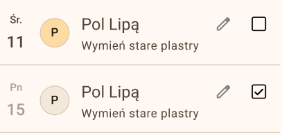          | różne widoki m.in. Zadania            | Wyszarzony element w aplikacji oznacza, że jest nieaktywny, nieaktualny lub czynność została ukończona.                                                                                             |

#### Akcje

Ikony akcji umożliwiają wykonanie dostępnych operacji, takich jak dodawanie, edycja lub usuwanie danych.

| Ikona                                  | Występowanie                                     | Znaczenie                                                         |
|:---------------------------------------|:-------------------------------------------------|:------------------------------------------------------------------|
|        | różne widoki m.in. wykresy, dodawanie zadań itp. | Przełącznik - wybór nieaktywny.                                   |
|         | różne widoki m.in. wykresy, dodawanie zadań itp. | Przełącznik - wybór aktywny.                                      |
|           | różne widoki m.in. dodawanie notatek itp.        | Potwierdź lub zapisz wybór.                                       |
|         | różne widoki m.in. dodawanie notatek itp.        | Odrzuć wprowadzone dane/Nie zapisuj.                              |
|         | różne widoki m.in. zakładka Zadania itp.         | Przycisk umożliwiający wprowadzanie zmian dla wybranego elementu. |
|         | różne widoki m.in. zakładka Zadania itp.        | Przycisk umożliwiający usunięcie wybranego elementu.              |

#### Nawigacja

Ikony nawigacyjne służą do poruszania się pomiędzy widokami i funkcjami aplikacji.

| Ikona                           | Występowanie                                               | Znaczenie                                                                                                          |
|:--------------------------------|:-----------------------------------------------------------|:-------------------------------------------------------------------------------------------------------------------|
|         | zakładka Pasieki (widok startowy) - prawy górny róg ekranu | Przycisk służący do wylogowania się z systemu.                                                                     |
|  | różne widoki - lewy górny róg ekranu                       | Przycisk służący do przejścia do poprzedniego widoku (przycisk Wstecz), np. z zakładki *Ule* do *Pasieki*.         |
|    | różne widoki m.in. potwierdzanie chorób, Dodaj przegląd    | Przycisk służący do przejścia do następnego widoku (przycisk Dalej), np. przejście do kolejnego pytania przeglądu. |

______________________________________________________________________

## Monitorowanie parametrów

System umożliwia ciągłe monitorowanie najważniejszych parametrów środowiskowych oraz produkcyjnych w ulu na podstawie danych zbieranych przez urządzenia pomiarowe. Analiza tych informacji pozwala na bieżąco oceniać kondycję rodziny pszczelej, warunki panujące w ulu oraz dynamikę produkcji miodu. Regularne obserwowanie zmian poszczególnych parametrów ułatwia również wczesne wykrywanie nieprawidłowości oraz podejmowanie odpowiednich działań w odpowiednim czasie.

Dane prezentowane w systemie mogą być wyświetlane w formie **aktualnych wartości, wykresów zmian w czasie oraz zestawień**, co umożliwia łatwe śledzenie trendów i analizę zachowania rodziny pszczelej w dłuższym okresie.

  
 Rys. ... Widok Szczegóły ula - przykładowe wartości parametrów i wykres wagi

### 1. Temperatura

Temperatura jest jednym z kluczowych parametrów wpływających na rozwój i funkcjonowanie rodziny pszczelej. W systemie prezentowana jest zarówno **temperatura wewnątrz ula**, jak i **temperatura zewnętrzna**, co pozwala porównać warunki panujące w ulu z temperaturą otoczenia.

Najważniejsze informacje:

- **Źródła:** VitalSensor mierzy temperaturę wewnątrz ula; Scale - temperaturę zewnętrzną przy ulu.
- **Temperatura zewnętrzna** umożliwia analizę wpływu warunków atmosferycznych na aktywność pszczół.
- **Temperatura wewnętrzna** odzwierciedla warunki panujące w gnieździe pszczelim. Stabilna temperatura wskazuje na prawidłową aktywność rodziny pszczelej i odpowiednią opiekę nad czerwiem. Typowo 32–36°C w kłębie w sezonie.
- **Nagłe zmiany temperatury wewnętrznej** mogą wskazywać na osłabienie rodziny, brak matki lub inne nieprawidłowości wymagające kontroli ula.
- **Wykresy temperatury** pozwalają obserwować zmiany w czasie i identyfikować długoterminowe trendy.

### 2. Wilgotność

Wilgotność w ulu ma istotny wpływ na rozwój czerwiu, zagęszczanie miodu oraz ogólną kondycję rodziny pszczelej. Zbyt wysoka lub zbyt niska wilgotność może negatywnie wpływać na zdrowie pszczół i jakość produktów pszczelich.

Najważniejsze informacje:

- **Wilgotność wewnętrzna** ula, mierzona przez VitalSensor, odzwierciedla warunki mikroklimatyczne w gnieździe.
- **Zbyt wysoka wilgotność** może sprzyjać rozwojowi chorób oraz pogarszać warunki przechowywania pokarmu.
- **Zbyt niska wilgotność** może prowadzić do wysychania czerwiu i negatywnie wpływać na funkcjonowanie rodziny pszczelej.
- **Analiza wykresów wilgotności** pozwala ocenić stabilność warunków w ulu oraz skuteczność wentylacji.

### 3. Ciśnienie

Pomiar ciśnienia w ulu pozwala obserwować zmiany warunków wewnętrznych oraz ich zależność od czynników zewnętrznych, takich jak zmiany pogody.

Najważniejsze informacje:

- **Ciśnienie wewnątrz ula**, również mierzone przez VitalSensor, może zmieniać się pod wpływem warunków atmosferycznych oraz aktywności rodziny pszczelej.
- **Spadki lub wzrosty ciśnienia** mogą być sygnałem nadchodzących zmian pogody, które często wpływają na aktywność lotną pszczół.
- **Analiza trendów ciśnienia** w połączeniu z innymi parametrami może pomóc w interpretacji zachowania rodziny pszczelej.

### 4. Waga

Pomiar wagi ula pozwala na bieżąco monitorować zmiany masy ula, które wynikają m.in. z aktywności pszczół, zbiorów nektaru, zużycia zapasów czy warunków pogodowych.

Najważniejsze informacje:

- **Aktualna waga** ula, mierzona przez Scale, przedstawia całkowitą masę ula wraz z rodziną pszczelą, zapasami i wyposażeniem.
- **Zmiany wagi w czasie** pozwalają obserwować intensywność pożytków oraz aktywność zbieraczek.
- **Spadki wagi** mogą wskazywać na zużywanie zapasów, rójkę lub okresy słabszego pożytku.
- **Analiza wykresów wagi** umożliwia ocenę dynamiki rozwoju rodziny pszczelej, sezonowej produkcji miodu oraz jest kluczowa w planowaniu miodobrania.

### 5. Przybytek miodu

Parametr przybytku miodu przedstawia szacunkową ilość miodu zgromadzonego przez rodzinę pszczelą w określonym czasie, na podstawie zmian wagi ula.

Najważniejsze informacje:

- **Przybytek miodu** pokazuje tempo gromadzenia nektaru i jego przetwarzania przez pszczoły.
- **Dodatnie wartości** wskazują na okres intensywnego pożytku i aktywnej pracy pszczół.
- **Spadek lub brak przybytku** może oznaczać zakończenie pożytku, niesprzyjające warunki pogodowe lub zmniejszoną aktywność rodziny.
- **Analiza trendów przybytku** pozwala ocenić produktywność rodziny oraz moment optymalny do planowania miodobrania.

______________________________________________________________________

## Analiza danych i raporty

Moduł analizy danych umożliwia przeglądanie, porównywanie i interpretowanie informacji zbieranych przez system. Dzięki wizualizacji danych w postaci wykresów oraz zestawień porównawczych użytkownik może łatwiej obserwować zmiany zachodzące w rodzinach pszczelich w różnych okresach czasu. Funkcje analityczne pozwalają szybciej wychwycić istotne zależności, ocenić efekty działań w pasiece oraz podejmować bardziej świadome decyzje dotyczące jej prowadzenia.

### 1. Wizualizacja danych na wykresach

Wykresy umożliwiają przejrzyste przedstawienie zmian poszczególnych parametrów w czasie. Dzięki nim użytkownik może szybko zidentyfikować charakterystyczne wzorce, nagłe zmiany lub okresy zwiększonej aktywności w ulu.

#### 1.1 Jak wyświetlić wykres

Aby wyświetlić wykresy poszczególnych parametrów dla wybranego ula (Rys. ......), należy przejść przez następującą ścieżkę w aplikacji:

  
 Rys. ... Widok Szczegóły ula - przykładowe wartości parametrów i wykres wagi

- Z zakładki *Pasieki* (widok startowy widoczny zaraz po zalogowaniu się do aplikacji Apisense) przejdź do zakładki *Ule*. W tym celu kliknij kafelek z wybraną pasieką.
- Z zakładki *Ule* przejdź do zakładki *Szczegóły*. Aby to zrobić kliknij w kafelek z wybranym ulem.
- Upewnij się, że znajdujesz się w zakładce *Szczegóły* (podświetlone na dolnym menu), podzakładce *Stan ula* (podkreślone na górnym menu). Wykresy znajdują się w sekcjach *Waga* oraz *Warunki*.
- Wykres zostanie wyświetlony (Rys. .....) po kliknięciu w dowolny nagłówek wybrany z wymienionych wyżej sekcji (np. Waga aktualna z sekcji *Waga*).

#### 1.2 Dostępne wykresy

W aplikacji Apisense dostępne są wykresy dla następujących parametrów:

- waga ula
- przybytek miodu
- temperatura zewnętrzna
- temperatura wewnętrzna
- wilgotność
- ciśnienie atmosferyczne

#### 1.3 Ramy czasowe prezentowane na wykresach

Dane na wykresach prezentowane są w kilku przedziałach czasowych. Ostatnie:

- 24 godziny
- 7 dni
- 1 miesiąc
- 3 miesiące
- 6 miesięcy

Aby wyświetlić wykres dla wybranego zakresu, należy kliknąć odpowiedni przedział czasu wyświetlany nad wykresem.

#### 1.4 Interpretacja wykresów

Wykresy pozwalają obserwować zmiany parametrów w czasie oraz analizować ich wzajemne zależności. Dzięki wizualnej formie prezentacji danych łatwiej zauważyć powtarzające się schematy, okresy stabilności lub nagłe odchylenia od typowych wartości.

Analiza wykresów umożliwia między innymi:

- ocenę dynamiki zmian w ulu w różnych okresach,
- identyfikację momentów zwiększonej aktywności rodziny pszczelej,
- wykrywanie nietypowych zdarzeń lub anomalii,
- obserwację długoterminowych zmian zachodzących w pasiece.

Regularne korzystanie z wykresów pozwala lepiej zrozumieć funkcjonowanie poszczególnych rodzin pszczelich oraz szybciej reagować na pojawiające się zmiany.

### 2. Trendy

Trendy umożliwiają analizę ogólnego kierunku zmian danego parametru w czasie. Funkcja ta pomaga odróżnić krótkotrwałe wahania od długoterminowych tendencji.

#### 2.1 Jak wyświetlić trend

Trendy dostępne są w tej samej sekcji, co wykresy poszczególnych parametrów. Aby je wyświetlić, należy wykonać poniższe kroki:

- Z zakładki *Pasieki* (widok startowy widoczny zaraz po zalogowaniu się do aplikacji Apisense) przejdź do zakładki *Ule*. W tym celu kliknij kafelek z wybraną pasieką.
- Z zakładki *Ule* przejdź do zakładki *Szczegóły*. Aby to zrobić kliknij w kafelek z wybranym ulem.
- Upewnij się, że znajdujesz się w zakładce *Szczegóły* (podświetlone na dolnym menu), podzakładce *Stan ula* (podkreślone na górnym menu). Trendy znajdują się w sekcjach *Waga* oraz *Warunki*.
- Kliknij w nagłówek z dowolnym parametrem wybranym z wymienionych wyżej sekcji (np. Waga aktualna z sekcji *Waga*).
- Pod wykresem znajduje się przełącznik *Pokaż trend*, który domyślnie jest wyłączony. Aby wyświetlić trend na wybranym wykresie kliknij ten przełącznik. Po jego aktywowaniu na wykresie pojawi się dodatkowa linia przedstawiająca ogólny kierunek zmian analizowanego parametru.

#### 2.2 Interpretacja trendów

Linia trendu przedstawia uśredniony kierunek zmian w danym okresie, dzięki czemu łatwiej zauważyć, czy wartości danego parametru:

- rosną,
- maleją,
- pozostają stabilne.

Analiza trendów pozwala skupić się na długoterminowych zmianach, pomijając krótkotrwałe wahania wynikające z naturalnej aktywności rodziny pszczelej lub chwilowych zmian warunków.

#### 2.3 Korzyści z analizy trendów

Wykorzystanie trendów w analizie danych umożliwia:

- szybszą ocenę ogólnej sytuacji w ulu,
- wczesne wychwycenie nieprawidłowości,
- łatwiejsze identyfikowanie długoterminowych zmian,
- lepsze planowanie działań w pasiece,
- bardziej świadome podejmowanie decyzji dotyczących zarządzania rodzinami pszczelimi.

### 3. Porównywanie uli

Funkcja porównywania uli umożliwia zestawienie wybranych parametrów dla wszystkich uli znajdujących się w danej pasiece. Dzięki temu użytkownik może szybko ocenić różnice pomiędzy rodzinami pszczelimi i zidentyfikować ule, które wymagają większej uwagi.

#### 3.1 Jak porównać ule

Aby skorzystać z tej funkcji, należy wykonać nastepujące czynności:

- Z zakładki *Pasieki* (widok startowy widoczny zaraz po zalogowaniu się do aplikacji Apisense) przejdź do zakładki *Ule*. W tym celu kliknij kafelek z wybraną pasieką.
- Będąc w zakładce *Ule* przejdź do zakładki *Porównanie*. Aby to zrobić wybierz pozycję *Porównanie* z górnego menu.
- Upewnij się, że znajdujesz się w zakładce *Ule* (podświetlone na dolnym menu), podzakładce *Porównanie* (podkreślone na górnym menu).
- Kliknij w nagłówek dowolnej sekcji np. Zdrowie. W rezultacie wybrana sekcja zostanie rozwinięta (Rys. .......) a wraz z nią zostanie wyświetlona lista wszystkich uli przypisanych do danej pasieki z odpowiadającymi im wartościami danego parametru.

  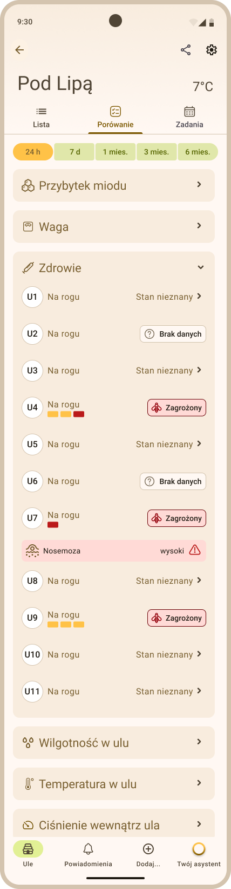
 Rys. ... Zakładka Porównanie - przykładowe porównanie parametru Zdrowie

#### 3.2 Parametry

W aplikacji Apisense możliwe jest porównanie następujących parametrów między ulami należącymi do tej samej pasieki:

- Przybytek miodu
- Waga
- Zdrowie
- Wilgotność w ulu
- Temperatura w ulu
- Ciśnienie wewnątrz ula

#### 3.3 Zakresy czasowe porównania

Podobnie jak w przypadku wykresów, użytkownik może wybrać okres, dla którego mają być porównywane dane:

- 24 godziny
- 7 dni
- 1 miesiąc
- 3 miesiące
- 6 miesięcy

Zmiana zakresu czasu pozwala analizować zarówno bieżącą sytuację w pasiece, jak i długotrwałe zmiany.

#### 3.4 Korzyści z porównywania uli

Zestawienie danych dla wielu uli w jednym miejscu umożliwia:

- szybkie wychwycenie różnic pomiędzy rodzinami pszczelimi,
- identyfikację uli o najlepszych lub najsłabszych wynikach,
- ocenę równomierności rozwoju rodzin w pasiece,
- łatwiejsze planowanie działań pasiecznych.

Funkcja ta jest szczególnie przydatna w większych pasiekach, gdzie ręczne porównywanie danych dla wielu uli byłoby czasochłonne.

______________________________________________________________________

## Alarmy, powiadomienia i rekomendacje

System powiadomień w aplikacji informuje użytkownika o istotnych zdarzeniach w pasiece, stanie urządzeń monitorujących oraz o zalecanych działaniach związanych z prowadzeniem uli. Informacje przekazywane są w formie powiadomień oraz rekomendacji generowanych na podstawie danych z czujników, obserwacji i analizy systemowej. Dzięki temu użytkownik może szybciej reagować na pojawiające się problemy, a także podejmować decyzje dotyczące dalszego prowadzenia pasieki.

### 1. Powiadomienia

Powiadomienia generowane przez system mogą być przekazywane na dwa sposoby:

- **Powiadomienia push** - wyświetlane bezpośrednio na urządzeniu mobilnym, nawet gdy aplikacja nie jest aktualnie otwarta. Informują o nowych zdarzeniach wymagających uwagi użytkownika.
- **Powiadomienia w aplikacji** - dostępne w sekcji powiadomień wewnątrz aplikacji, gdzie można przeglądać wszystkie komunikaty i zapoznać się z ich szczegółami.

#### 1.1 Gdzie znaleźć powiadomienia w aplikacji

Powiadomienia w aplikacji możesz znaleźć realizując poniższe kroki:

- Z zakładki *Pasieki* (widok startowy widoczny zaraz po zalogowaniu się do aplikacji Apisense) przejdź do zakładki *Ule*. W tym celu kliknij kafelek z wybraną pasieką.
- Z zakładki *Ule* przejdź do zakładki *Powiadomienia*. W tym celu kliknij ikonę z dzwonkiem znajdującą się w dolnym menu, podobnie jak zakładka *Ule*.
- W rezultacie zostanie otwarty widok *Powiadomień*, z domyślnie wybraną zakładką *Problemy* (Rys. ...... po lewej stronie).
- Oprócz zakładki *Problemy* możesz przejść również do zakładek *Sugestie* oraz *Techniczne*, wybierając odpowiednią opcje z górnego menu.

#### 1.2 Kategorie powiadomień

Powiadomienia w aplikacji są dostępne w zakładce *Powiadomienia*. Powiadomienia dzielą się na następujące kategorie, które odpowiadają poszczególnym zakładkom (Rys. .........):

- **Problemy** – powiadomienia związane ze stanem zdrowia rodzin pszczelich, dotyczące wykrytych chorób takich jak Warroza wraz z zalecanym postępowaniem w celu zwalczenia konkretnej choroby.
- **Techniczne** – powiadomienia dotyczące działania urządzeń monitorujących, np. niski poziom baterii lub brak zasięgu.
- **Sugestie** – rekomendacje generowane przez system. Więcej na ten temat opisano w rozdziale Rekomendacje.

  
  
 Rys. ... Zakładka Powiadomienia - przykładowe powiadomienia chorobowe i techniczne (zakładki Problemy i Techniczne)

Nowe powiadomienia pojawiają się automatycznie na odpowiedniej liście w zależności od ich rodzaju. Nieodczytane komunikaty są wyświetlane pogrubioną czcionką, natomiast po ich otwarciu stają się lekko wyszarzone, co oznacza, że zostały już przeczytane.

Aby wyświetlić szczegóły powiadomienia, należy kliknąć jego nagłówek, co spowoduje rozwinięcie pełnej treści komunikatu.

### 2. Rekomendacje

Rekomendacje to komunikaty zawierające sugestie dotyczące zalecanych działań w pasiece (Rys. ..........). Są generowane na podstawie analizy danych zbieranych przez system oraz obserwowanych parametrów w poszczególnych ulach.

  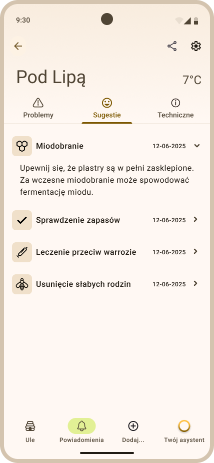
 Rys. ... Zakładka Powiadomienia - przykładowe rekomendacje w zakładce Sugestie

Rekomendacje zawierają opis problemu i proponowane kroki jego rozwiązania. Mogą dotyczyć między innymi:

- przeprowadzenia miodobrania,
- zastosowania leczenia,
- wykonania określonych czynności pasiecznych.

Sugestie pojawiają się wtedy, gdy system na podstawie dostępnych danych uzna, że w danym ulu lub pasiece wskazane jest wykonanie określonego działania. Rekomendacje mają charakter wspierający i pomagają użytkownikowi w podejmowaniu decyzji dotyczących prowadzenia pasieki.

#### 2.1 Gdzie znaleźć rekomendacje w aplikacji

- Rekomendacje, podobnie jak pozostałe powiadomienia, znajdują się w zakładce *Powiadomienia* (zobacz Gdzie znaleźć powiadomienia w aplikacji). 
- Po dotarciu do zakładki *Powiadomienia* należy wybrać z górnego menu zakładkę *Sugestie* (Rys. ...........) - są to sugestie związane z prowadzeniem pasieki. Sugestie dotyczące leczenia w przypadku wystąpienia określonego rodzaju choroby znajdują się w zakładce *Problemy*, po rozwinięciu wybranego wiersza z chorobą.

### 3. Ustawienia powiadomień

Użytkownik może samodzielnie określić, jakie typy powiadomień chce otrzymywać w aplikacji.

Aby przejść do ustawień powiadomień, należy:

- W zakładce *Pasieki* (widok startowy aplikacji Apisense) kliknąć ikonę koła zębatego, znajdującą się w prawej górnej części ekranu. W rezultacie zostanie otwarty widok *Ustawienia konta* (Rys. ........).
- W widoku *Ustawienia konta* wybrać sekcję *Powiadomienia*. Po kliknięciu w nagłówek sekcji zostanie wyświetlony widok *Powiadomienia* (Rys. ..............).

  
  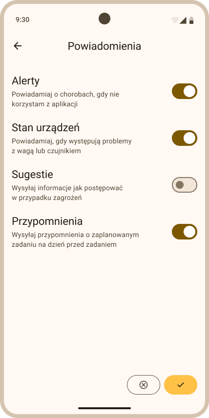
 Rys. ... Ustawienia konta - ustawienia powiadomień

Aby włączyć lub wyłączyć daną kategorię powiadomień, należy użyć odpowiedniego przełącznika.

Dostępne opcje obejmują:

- **Alerty** – powiadomienia dotyczące chorób lub potencjalnych zagrożeń dla rodzin pszczelich.
- **Stan urządzeń** – powiadomienia o problemach technicznych związanych z urządzeniami monitorującymi, np. niski poziom baterii lub brak danych.
- **Sugestie** – rekomendowane działania, generowane przez system, pomagające w podejmowaniu decyzji dotyczących prowadzenia pasieki.
- **Przypomnienia** – powiadomienia związane z zadaniami zapisanymi w kalendarzu. Są wysyłane dzień przed planowanym terminem wykonania zadania.

### 4. Twój asystent AI

Asystent AI to funkcja wspierająca użytkownika w analizie sytuacji w pasiece oraz w interpretacji obserwowanych zjawisk. Na podstawie przekazanych informacji system generuje odpowiedzi i wskazówki, które mogą pomóc w podejmowaniu decyzji dotyczących prowadzenia pasieki.

Z asystenta AI można korzystać poprzez zadawanie pytań w aplikacji (Rys. ..........). Zapytanie może być przekazane w formie tekstu, a także uzupełnione zdjęciem, które pozwala systemowi lepiej zrozumieć problem.

  
  
 Rys. ... Zakładka Twój asystent - przykładowe pytanie ze zdjęciem zadane asystentowi AI

Po przesłaniu pytania asystent analizuje dostępne informacje i generuje odpowiedź zawierającą możliwe wyjaśnienia sytuacji lub sugestie dalszego postępowania.

Z asystenta AI można skorzystać poprzez wybór zakładki *Twój asystent* z dolnego menu, dostępnej w podstawowych widokach aplikacji (*Pasieki*, *Ule*, *Ul*). Dzięki temu użytkownik ma szybki dostęp do pomocy asystenta w dowolnym momencie korzystania z systemu.
______________________________________________________________________

## Zarządzanie kontem

Użytkownik może przeglądać oraz modyfikować swoje dane, zmieniać ustawienia konta, a także zarządzać preferencjami dotyczącymi działania aplikacji.

### 1. Edycja danych użytkownika

Funkcja edycji danych użytkownika umożliwia aktualizację podstawowych informacji przypisanych do konta, takich jak nazwa użytkownika, dane kontaktowe czy hasło. Dzięki temu użytkownik może na bieżąco zarządzać swoimi danymi oraz dostosować ustawienia konta do własnych potrzeb.

#### 1.1 Edycja danych

Aby edytować dane użytkownika, należy:

- W zakładce *Pasieki* (widok startowy aplikacji Apisense) kliknąć ikonę koła zębatego, znajdującą się w prawej górnej części ekranu. W rezultacie zostanie otwarty widok *Ustawienia konta* (Rys. ........).
- Widok *Ustawienia konta* składa się z kilku sekcji: **Nazwa użytkownika**, **E-mail**, **Telefon komórkowy**, **Doświadczenie**, **Hasło**, **Powiadomienia** oraz **Język**. W każdej z nich prezentowane są aktualne dane użytkownika.
- Aby zmienić zawartość wybranej sekcji, należy kliknąć jej nagłówek, co spowoduje otwarcie nowego widoku, w którym możliwa będzie edycja danych. Przykładowo, w przypadku zmiany hasła użytkownik zostanie poproszony o wprowadzenie nowego hasła oraz jego powtórzenie (Rys. ..............).
- Po wprowadzeniu zmian należy je zapisać, klikając żółty przycisk znajdujący się w prawym dolnym rogu ekranu.

  
  
 Rys. ... Ustawienia konta - przykładowy widok ustawień oraz zmiana hasła

#### 1.2 Usunięcie konta

W dolnej części widoku *Ustawienia konta* (Rys. .......) dostępny jest również przycisk *Usuń konto*, który umożliwia trwałe usunięcie konta użytkownika.

### 2. Zarządzanie subskrypcją

- W **Ustawieniach konta** sprawdzisz aktualny plan (np. freemium, premium). Dostęp do części funkcji (zaawansowane wykresy, porównywanie uli, rekomendacje AI) zależy od planu. Odnów lub zmień subskrypcję zgodnie z ofertą w aplikacji lub na stronie Apisense.

______________________________________________________________________

## Dobre praktyki użytkowania systemu

### 1. Codzienne korzystanie z panelu

- Regularnie przeglądaj najważniejsze widoki apliakacji, w szczególności listę pasiek i uli, aby na bieżąco śledzić statusy i pomiary. Reaguj na alarmy i rekomendacje w terminie.

### 2. Uzupełnianie notatek i przeglądów

- Po każdej wizycie w pasiece dodawaj notatki i przeglądy w aplikacji (najlepiej z załącznikami w postaci zdjęć). Dzięki temu możliwe będzie analizowanie historii działań oraz uzyskiwanie dokładniejszych rekomendacji.

### 3. Regularne sprawdzanie alarmów

- Sprawdzaj zakładkę ***Powiadomienia*** i włącz powiadomienia push, aby nie przeoczyć żadnych krytycznych zdarzeń, takich jak wykrycie choroby.

### 4. Kontrola poziomu baterii przed sezonem

- Przed sezonem sprawdź w aplikacji poziom baterii wszystkich urządzeń monitorujących stan Twoich pasiek. Wymień baterie (2×AA w Scale i VitalSensor) przy niskim poziomie; Hub ładuj przez panel fotowoltaiczny lub sieć. Unikaj przerw w transmisji w szczycie sezonu.

### 5. Aktualizacje

- Aktualizuj aplikację mobilną do najnowszej wersji (Google Play / App Store), aby mieć dostęp do ulepszeń i nowych funkcji. 
- Aktualizacje systemu operacyjnego urządzenia również wpływają na stabilność powiadomień i działania aplikacji.

______________________________________________________________________

## Rozwiązywanie problemów

### 1. Często zadawane pytania i proponowane rozwiązania

#### 1.1 Brak danych w aplikacji

**Rozwiązanie:** upewnij się, że urządzenia (Hub, Scale, VitalSensor) są włączone, w zasięgu BLE (do ok. 35 m od Hub) i że minęło do ok. 1 godziny od pierwszego uruchomienia. Sprawdź baterie i zasilanie Hub (panel PV lub sieć). Szczegółowa lista problemów i rozwiązań związanych z komunikacją urządzeń znajduje się w **Instrukcji konfiguracji urządzeń** (rozdział Rozwiązywanie problemów).

#### 1.2 Nie mogę się zalogować

**Rozwiązanie:** sprawdź poprawność wprowadzonej nazwy użytkownika i hasła. Jeśli zapomniałeś hasła skontaktuj się z z pomocą Apisense: **bee@apisense.ai**, **+48 606 153 759**.

#### 1.3 Powiadomienia nie dochodzą

**Rozwiązanie:** sprawdź uprawnienia aplikacji do powiadomień w ustawieniach systemu oraz ustawienia powiadomień w aplikacji.

#### 1.4 Inne problemy

**Rozwiązanie:** skontaktuj się z pomocą techniczną Apisense: **bee@apisense.ai**, **+48 606 153 759**.

______________________________________________________________________

## Instrukcja w skrócie

Poniżej znajdziesz skrót najważniejszych czynności w aplikacji Apisense Pro AI. Każdy punkt zawiera krótki opis oraz odnośniki do szczegółowych rozdziałów instrukcji oraz materiałów Wideo.

### 1. Rejestracja i logowanie

- **Rejestracja:** Pobierz aplikację mobilną Apisense lub wejdź na stronę internetową systemu. Wybierz *Załóż konto*, wypełnij dane (nazwa użytkownika, e-mail, telefon), utwórz hasło spełniające wymagania i kliknij *Zarejestruj się*.

  Wideo (w przygotowaniu), Rejestracja

- **Logowanie:** Uruchom aplikację lub stronę internetową, w widoku *Zaloguj się* wpisz nazwę użytkownika i hasło, następnie kliknij *Zaloguj się*.

  Wideo (w przygotowaniu), Logowanie

### 2. Zarządzanie pasieką

- **Dodawanie pasieki:** W zakładce *Pasieki* wybierz *Dodaj pasiekę* z dolnego menu. W widoku *Dodaj pasiekę* uzupełnij nazwę, skrót, zeskanuj kod QR z Apisense Hub i zapisz.

  Wideo (w przygotowaniu), Dodawanie pasieki

- **Edycja pasieki:** Kliknij kafelek wybranej pasieki. Kliknij ikonę zębatki będąc w zakładce *Ule*. W widoku *Ustawienia pasieki* kliknij nagłówek sekcji, dla której chcesz zedytować dane. Zmień wartości pól i kliknij zapisz (żółty przycisk).

  Wideo (w przygotowaniu), Edycja pasieki

- **Usuwanie pasieki:** Kliknij kafelek wybranej pasieki. Kliknij ikonę zębatki będąc w zakładce *Ule*. W widoku *Ustawienia pasieki* kliknij przycisk *Usuń pasiekę*.

  Wideo (w przygotowaniu), Usuwanie pasieki

- **Dodawanie ula:** Kliknij kafelek wybranej pasieki. Wybierz *Dodaj…* → *Dodaj ul* z dolnego menu. Wypełnij dane w sekcji *Szczegóły ula*, *Informacje o matce pszczelej* oraz zeskanuj kody QR z urządzeń Scale i VitalSensor. Kliknij żółty przycisk Zapisz.

  Wideo (w przygotowaniu), Dodawanie ula

- **Edycja ula:** Kliknij kafelek wybranej pasieki. Kliknij kafelek wybranego ula. Kliknij ikonę zębatki będąc w zakładce *Szczegóły*. W widoku *Ustawienia ula* kliknij nagłówek sekcji, dla której chcesz zedytować dane. Zmień wartości pól i kliknij zapisz (żółty przycisk).

  Wideo (w przygotowaniu), Edycja ula

- **Usuwanie ula:** Kliknij kafelek wybranej pasieki. Kliknij kafelek wybranego ula. Kliknij ikonę zębatki będąc w zakładce *Szczegóły*. W widoku *Ustawienia ula* kliknij przycisk *Usuń ul*.

  Wideo (w przygotowaniu), Usuwanie ula

- **Dodawanie przeglądów:** Kliknij kafelek wybranej pasieki. Kliknij kafelek wybranego ula. Wybierz *Dodaj...* -> *Przegląd* z dolnego menu. Odpowiedz na pytania. Żółta strzałka w prawo umożliwia przejście do następnego pytania. Dodaj zdjęcia jeśli chcesz (*+*). Kliknij *Zakończ przegląd* (żółty przycisk w ostatnim oknie przeglądu) by zapisać.

  Wideo (w przygotowaniu), Dodawanie przeglądów

- **Dodawanie notatek:** Kliknij kafelek wybranej pasieki. Kliknij kafelek wybranego ula. Wybierz *Dodaj...* -> *Notatkę* z dolnego menu. Wprowadź zawartość notatki (tekst lub nagraj notatkę głosową, możesz dodać też zdjęcia lub nagrania (*+*)). Zapisz notatkę (żółty przycisk).

  Wideo (w przygotowaniu), Notatki

- **Dodawanie zadań z poziomu pasieki:** Kliknij kafelek wybranej pasieki. Wybierz *Dodaj...* -> *Zadanie* z dolnego menu. Wprowadź treść zadania, wybierz datę i czy powtarzać zadanie. Zapisz żółtym przyciskiem. Zadanie zostanie zapisane dla wszystkich uli (całej pasieki).

  Wideo (w przygotowaniu), Zadania

- **Dodawanie zadań z poziomu ula:** Kliknij kafelek wybranej pasieki. Kliknij kafelek wybranego ula. Wybierz *Dodaj...* -> *Zadanie* z dolnego menu. Wprowadź treść zadania, wybierz datę i czy powtarzać zadanie. Zapisz żółtym przyciskiem. Zadanie zostanie zapisane tylko dla wybranego ula.

  Wideo (w przygotowaniu), Zadania

- **Potwierdzanie chorób z poziomu pasieki:** Kliknij kafelek wybranej pasieki. Wybierz *Powiadomienia* z dolnego menu. W zakładce *Problemy* kliknij w wybrany wiersz z chorobą, aby rozwinąć szczegóły. Kliknij przycisk *Odpowiedz na kilka pytań*. Udziel odpowiedzi na pytania. Aby przejść do kolejnego kliknij żółtą strzałkę w prawo. Na koniec kliknij *Zapisz*.

  Wideo (w przygotowaniu), Potwierdzanie chorób

- **Potwierdzanie chorób z poziomu ula:** Kliknij kafelek wybranej pasieki. Kliknij kafelek wybranego ula. Wybierz *Powiadomienia* z dolnego menu. W zakładce *Problemy* kliknij w wybrany wiersz z chorobą, aby rozwinąć szczegóły. Kliknij przycisk *Odpowiedz na kilka pytań*. Udziel odpowiedzi na pytania. Aby przejść do kolejnego kliknij żółtą strzałkę w prawo. Na koniec kliknij *Zapisz*.

  Wideo (w przygotowaniu), Potwierdzanie chorób

- **Rejestrowanie próbki:** Kliknij kafelek wybranej pasieki. Kliknij kafelek wybranego ula. Wybierz *Dodaj...* -> *Zarejestruj próbkę* z dolnego menu. Wybierz rodzaj badania. Zapisz *Kod badania* na próbcę i wyślij do Apisense.

  Wideo (w przygotowaniu), Rejestrowanie próbki

- **Udostępnianie pasiek:** Kliknij kafelek wybranej pasieki. Kliknij ikonę udostępniania w prawym górnym rogu (obok zębatki). Kliknij żółty przycisk *Udostępnij pasiekę*. Wprowadź dane odbiorcy i ustaw poziom dostępu. Kliknij żółty przycisk *Udostępnij*.

  Wideo (w przygotowaniu), Udostępnianie pasiek

### 3. Panel główny i nawigacja

- **Lista pasiek (zakładka Pasieki):** Widok startowy po zalogowaniu się do aplikacji Apisense - kafelki pasiek z podstawowymi informacjami. Kliknij pasiekę, aby przejść do listy uli.

  Wideo (w przygotowaniu), Omówienie listy pasiek (zakładka Pasieki)

- **Mapa pasiek:** Po zalogowaniu do aplikacji, z dolnego menu wybierz *Mapa*, aby zobaczyć lokalizacje pasiek. Możesz filtrować widok według problemów (np. Warroza).

  Wideo (w przygotowaniu), Omówienie mapy pasiek (zakładka Mapa)

- **Lista uli (zakładka Ule):** Kliknij kafelek wybranej pasieki. W rezultacie pojawią się wszystkie ule przypisane do tej pasieki. Dostępne zakładki *Lista*, *Porównanie*, *Zadania*. Kliknij dowolny ul aby wyświetlić jego szczegóły.

  Wideo (w przygotowaniu), Omówienie listy uli (zakładka Ule)

- **Zawartość ula (zakładka Szczegóły):** Tu sprawdzisz Stan ula, Przeglądy, Notatki i Zadania przypisane dla wybranego ula. Możesz wyświetlić również wykresy poszczególnych parametrów.

  Wideo (w przygotowaniu), Omówienie zawartości ula (zakładka Szczegóły)

- **Ustawienia pasieki i ula:** Ikona zębatki w widoku pasieki (zakładka Ule) lub ula (zakładka Szczegóły) prowadzi do ustawień. Możesz tu edytować informacje o pasiece lub ulu.

  Wideo (w przygotowaniu), Omówienie ustawień pasieki, Omówienie ustawień ula

### 4. Monitorowanie i analiza danych

- **Parametry (temperatura, wilgotność, ciśnienie, waga, przybytek miodu):** Kliknij kafelek wybranej pasieki. Kliknij kafelek wybranego ula. Bieżące wartości są widoczne w zakładce *Szczegóły* ula, podzakładka *Stan ula*, w sekcjach *Waga*, *Warunki*.

  Wideo (w przygotowaniu), Monitorowanie parametrów

- **Wykresy:** Kliknij kafelek wybranej pasieki. Kliknij kafelek wybranego ula. W zakładce *Szczegóły* -> *Stan ula* rozwiń sekcję *Waga* lub *Warunki* i kliknij w wybrany parametr, aby zobaczyć wykres w wybranym przedziale czasowym (24 h, 7 dni, 1–6 miesięcy).

  Wideo (w przygotowaniu), Wizualizacja danych na wykresach

- **Trendy:** Kliknij kafelek wybranej pasieki. Kliknij kafelek wybranego ula. W zakładce *Szczegóły* -> *Stan ula* rozwiń sekcję *Waga* lub *Warunki* i kliknij w wybrany parametr, aby wyświetlić wykres. Na ekranie wykresu włącz przełącznik *Pokaż trend*.

  Wideo (w przygotowaniu), Trendy

- **Porównywanie uli:** Kliknij kafelek wybranej pasieki. Z górnego menu wybierz zakładkę *Porównanie*. Rozwiń wybraną sekcję (np. Waga), by porównać dane dla wielu uli.

  Wideo (w przygotowaniu), Porównywanie uli

### 5. Alarmy, powiadomienia i asystent AI

- **Powiadomienia:** Kliknij kafelek wybranej pasieki. Wybierz zakładkę *Powiadomienia* z dolnego menu. Kategorie powiadomień: *Problemy*, *Techniczne*, *Sugestie*.

  Wideo (w przygotowaniu), Powiadomienia

- **Rekomendacje:** Kliknij kafelek wybranej pasieki. Wybierz zakładkę *Powiadomienia* z dolnego menu. Z górnego menu wybierz *Sugestie* - tu znajdziesz zalecane działania, proponowane przez system w konkretnej sytuacji.

  Wideo (w przygotowaniu), Rekomendacje

- **Twój asystent AI:** Z dolnego menu wybierz *Twój asystent* (dostęp z widoków *Pasieki*, *Ule*, *Szczegóły*), wpisz pytanie (możesz dołączyć zdjęcie). Asystent przeanalizuje dane i udzieli odpowiedzi.

  Wideo (w przygotowaniu), Twój asystent AI

### 6. Konto

- **Edycja danych użytkownika:** W widoku startowym *Pasieki* kliknij ikonę zębatki. Możesz zmienić nazwę, e-mail, telefon, hasło, preferencje dotyczące powiadomień oraz język. Z tego miejsca możesz też usunąć konto.

  Wideo (w przygotowaniu), Edycja danych użytkownika

---

W razie problemów wyszukaj problem na liście Często zadawane pytania i proponowane rozwiązania lub skontaktuj się z pomocą Apisense: **bee@apisense.ai**, **+48 606 153 759**.
