# Instrukcja użytkowania systemu Apisense Pro AI

## Wprowadzenie do systemu

**Apisense Pro AI** to inteligentny system ochrony pszczół łączący dane z urządzeń IoT z algorytmami sztucznej inteligencji. Umożliwia zdalny monitoring warunków w ulach, analizę produkcyjności, wczesne wykrywanie zagrożeń (m.in. chorób) z wysoką skutecznością oraz wspieranie decyzji pszczelarzy. Dzięki aplikacji Apisense zarządzasz pasiekami, przeglądasz dane pomiarowe i reagujesz na alarmy oraz komunikaty w aplikacji w jednym miejscu — na smartfonie lub w przeglądarce.

### 1. Cel

- **Monitorowanie warunków w ulu** — temperatura, wilgotność, ciśnienie, waga i przybytek miodu w czasie rzeczywistym. Stała kontrola parametrów środowiskowych umożliwia szybkie reagowanie na niekorzystne zmiany.
- **Analiza produkcyjności** — śledzenie przybytku miodu, trendów i wykresów dla poszczególnych uli pozwala ocenić wydajność zbiorów i kondycję rodziny pszczelej.
- **Wczesne wykrywanie zagrożeń** — alarmy i powiadomienia w aplikacji dotyczące stanu zdrowia rodzin pszczelich (np. warroza, nosema, zgnilec) pomagają podjąć odpowiednie decyzje na wczesnym etapie rozwoju chorób.

### 2. Główne funkcjonalności

- **Dashboard** — podsumowanie pasiek, uli, statusów i kluczowych pomiarów.
- **Alarmy i powiadomienia** — powiadomienia w aplikacji o przekroczeniu progów parametrów oraz istotnych zdarzeniach w pasiece.
- **Raporty i wykresy** — wizualizacja danych pomiarowych w postaci dziennych, tygodniowych i długoterminowych wykresów z naniesionym trendem.
- **Historia danych** — archiwum notatek, przeglądów i powiadomień.
- **Zarządzanie pasieką** — dodawanie i edycja pasiek, uli, przeglądów, notatek, oraz dodawanie badań i rejestrowanie próbek.
- **FrameSense** — analiza zdjęcia ramki pszczelej oparta na AI, szacująca udział czerwiu, zapasów pokarmu i pustego plastra.
- **Obserwacja szerszenia azjatyckiego** — zgłaszanie obecności szerszenia azjatyckiego w pasiece wraz z przypomnieniem o ponownej kontroli po kilku dniach.

______________________________________________________________________

## Rejestracja / Logowanie

System Apisense Pro AI jest dostępny pod następującym adresem: [Apisense Pro AI](https://app.apisense.ai/) oraz poprzez aplikację mobilną Apisense, którą można pobrać w sklepach Google Play oraz App Store.

### 1. Rejestracja

  <iframe src="https://www.youtube.com/embed/sYDT5N7eUi8"
          title="Apisense Manual PL — 01 · Rejestracja"
          allow="accelerometer; clipboard-write; encrypted-media; gyroscope; picture-in-picture; web-share"
          allowfullscreen></iframe>

- Pobierz aplikację mobilną i uruchom ją lub przejdź pod podany adres: [Apisense Pro AI](https://app.apisense.ai/). Po uruchomieniu aplikacji pojawi się ekran z możliwością założenia konta ().

Figure: Rejestracja do Systemu Apisense Pro AI - widok startowy Załóż konto {#fig-rejestracja}

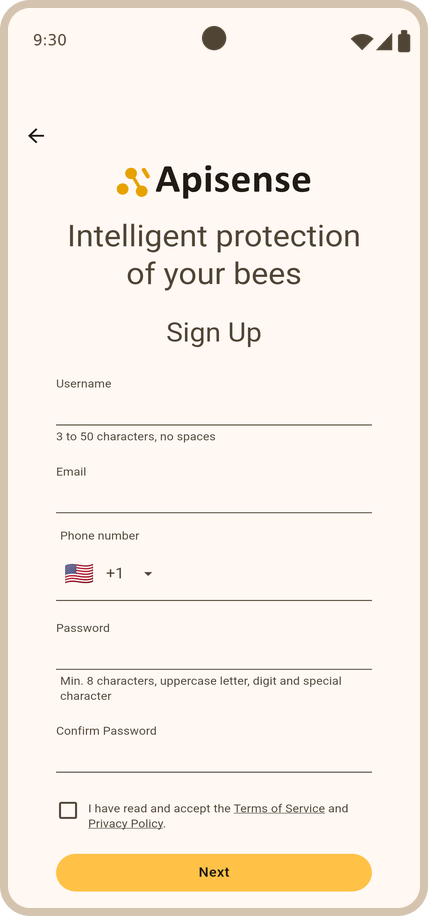{width=200}

- W wyznaczonych polach wprowadź następujące dane:

    - Nazwa użytkownika
    - Adres email
    - Numer telefonu komórkowego

    Potwierdź zapoznanie się z regulaminem oraz polityką prywatności zaznaczając odpowiednie pole, a następnie kliknij przycisk *Dalej* ().

Figure: Rejestracja do Systemu Apisense Pro AI - przykład poprawnie wypełnionych danych do rejestracji w widoku Załóż konto {#fig-zaloz-konto}

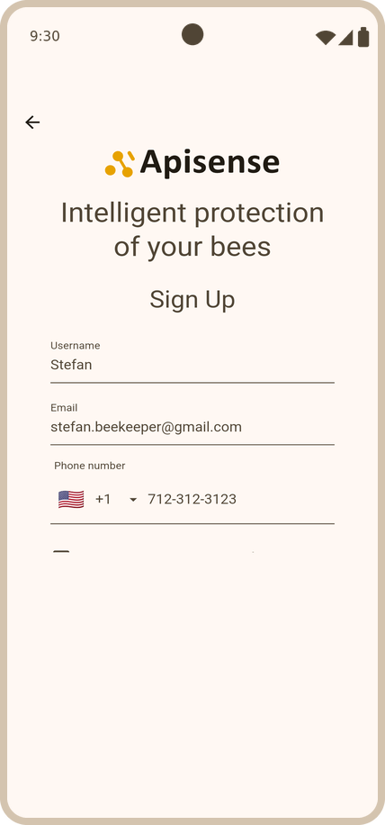{width=200}

- Zostanie wyświetlony kolejny widok - Utwórz hasło. W tym widoku zostaniesz poproszony o utworzenie silnego hasła (), które będziesz potem wykorzystywał, by zalogować się do systemu. Hasło musi zawierać:

    - Co najmniej 8 znaków
    - Co najmniej 1 wielką literę
    - Co najmniej 1 znak specjalny (np. #, $, %, \_)

    Pod polem hasła aplikacja wyświetla te wymagania w skrócie: *Min. 8 znaków, wielka litera i znak specjalny*.

    Następnie wpisz ponownie to samo hasło w pole *Powtórz hasło* i przejdź do kolejnego kroku klikając przycisk *Dalej*.

Figure: Rejestracja do Systemu Apisense Pro AI - przykład poprawnie wypełnionych pól w widoku Utwórz hasło {#fig-utworz-haslo}

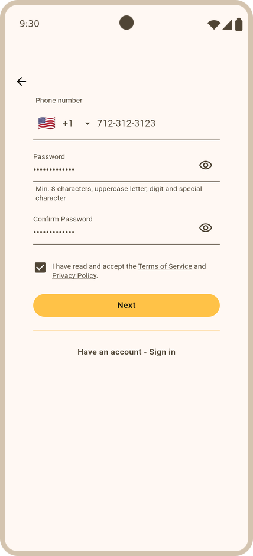{width=200}

- To już ostatni etap rejestracji. W tym kroku odpowiedz na pytanie od ilu lat zajmujesz się pszczelarstwem zaznaczając jedną z dwóch możliwych odpowiedzi, po czym kliknij przycisk *Dalej* ().

Figure: Rejestracja do Systemu Apisense Pro AI - przykład odpowiedzi na pytanie o doświadczenie {#fig-pytanie-o-doswiadczenie}

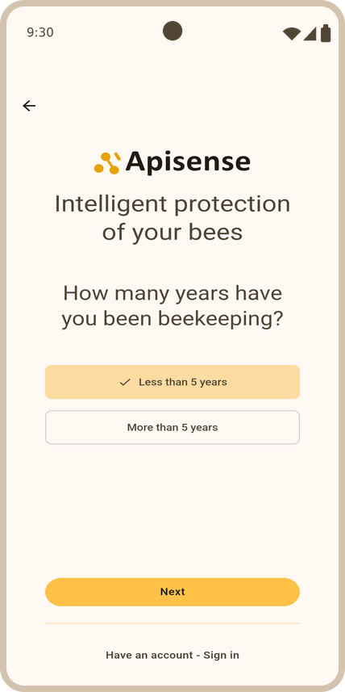{width=200}

- Jeśli wszystko przebiegło pomyślnie powinieneś zobaczyć poniższy ekran startowy - Witamy w Apisense! ():

Figure: Ekran startowy po pomyślnej rejestracji do Systemu Apisense Pro AI - Witamy w Apisense! {#fig-empty-state-apiary}

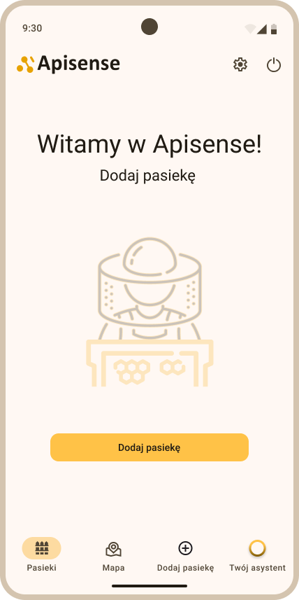{width=200}

### 2. Logowanie

Jeżeli posiadasz już konto w Systemie Apisense Pro AI postępuj zgodnie z poniższymi krokami:

- Uruchom aplikację mobilną Apisense lub przejdź pod podany adres: [Apisense Pro AI](https://app.apisense.ai/).

- W widoku *Zaloguj się* (), w wyznaczone pola wprowadź odpowiednie dane, podane podczas rejestracji do systemu:

    - *Email lub nazwa użytkownika* — w to pole możesz wpisać zarówno nazwę użytkownika, jak i adres e-mail podany przy rejestracji
    - *Hasło*

    Następnie kliknij przycisk *Zaloguj się*, po czym powinieneś zobaczyć widok startowy aplikacji Apisense - zakładkę Pasieki.

    Jeśli nie pamiętasz hasła, kliknij *Nie pamiętasz hasła?* pod polami logowania i zresetuj je samodzielnie — patrz [Nie mogę się zalogować](#12-nie-moge-sie-zalogowac).

Figure: Logowanie do Systemu Apisense Pro AI - widok Zaloguj się {#fig-logowanie}

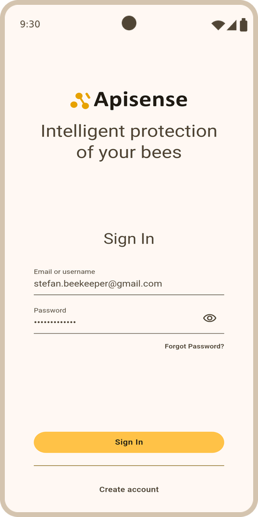{width=200}

______________________________________________________________________

## Zarządzanie pasieką

### 1. Pasieka

#### 1.1 Dodawanie pasieki

  <iframe src="https://www.youtube.com/embed/wJrFummpo7Y"
          title="Apisense Manual PL — 02 · Dodaj pasiekę"
          allow="accelerometer; clipboard-write; encrypted-media; gyroscope; picture-in-picture; web-share"
          allowfullscreen></iframe>

- W zakładce **Pasieki** (widok startowy po zalogowaniu do aplikacji Apisense) kliknij zakładkę *Dodaj pasiekę* znajdującą się w menu na dole ekranu lub - jeśli jeszcze nie masz żadnej pasieki - żółty przycisk *Dodaj pasiekę* widoczny w centrum ekranu ().

Figure: Dodawanie pasieki - widok startowy Pasieki {#fig-apiaries}

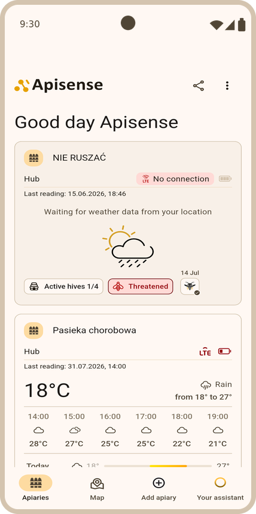{width=200}

- W rezultacie zostanie wyświetlony widok *Dodaj pasiekę* (). 

Figure: Widok Dodaj pasiekę {#fig-add-apiary}

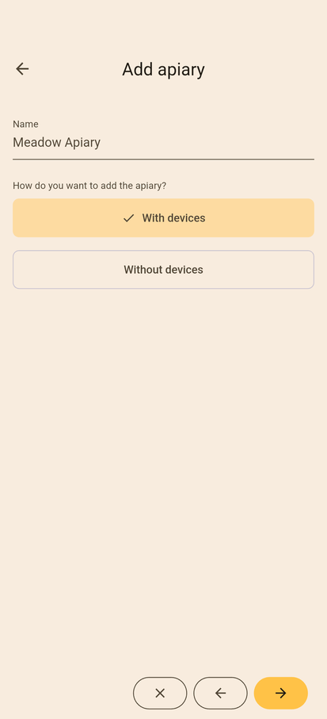{width=200}

#### 1.1.1 Dodawanie pasieki z urządzeniami

W widoku *Dodaj pasiekę* () wypełnij następujące pola:

- **Nazwa** — nazwa pasieki, która będzie wyświetlana w panelu,
- **Z urządzeniami** - zaznacz tę opcję, aby dodać pasiekę i powiązać z nią urządzenie Apisense Hub.

Pole *Nazwa* będzie mogło zostać zedytowane przez użytkownika w dowolnym momencie.

Po uzupełnieniu powyższych informacji kliknij żółty przycisk ze strzałką, znajdujący się prawym dolnym rogu ekranu. W rezultacie zostaniesz przeniesiony do kolejnego kroku dodawania pasieki, gdzie powiążesz urządzenie Apisense Hub ze swoją pasieką. W tym celu uzupełnij poniższe pola:

- **Hub** - kliknij w ikonę kodu QR znajdującą się w prawej części tego pola i zeskanuj kod QR z naklejki umieszczonej na urządzeniu Apisense Hub. Kolejne pole *Kod potwierdzający* zostanie wypełnione automatycznie.
- **Kod potwierdzający** - zostanie wypełniony automatycznie, po poprawnym zeskanowaniu kodu QR.

**Po uzupełnieniu niezbędnych danych i zeskanowaniu kodu QR kliknij żółty przycisk na dole ekranu, potwierdzający utworzenie pasieki z powiązanym urządzeniem Apisense Hub.**

Jeśli utworzenie pasieki się powiodło, zostaniesz przekierowany do jej wnętrza (widok *Ule*), natomiast po przejściu do zakładki *Pasieki* na Twojej liście pasiek pojawi się pasieka, którą właśnie utworzyłeś (). Na kafelku z pasieką zostaną wyświetlone odpowiednie statusy lub wskazówki jak uruchomić Apisense Hub (patrz [Pierwsze uruchomienie urządzeń](#pierwsze-uruchomienie)). Aby dowiedzieć się więcej o statusach, przejdź do rozdziału [7. Interpretacja statusów i ikon wykorzystywanych w systemie](#interpretacja-statusow).

Figure: Pomyślnie dodana pasieka z powiązanym Apisense Hub w widoku pasiek w systemie {#fig-apiaries-list}

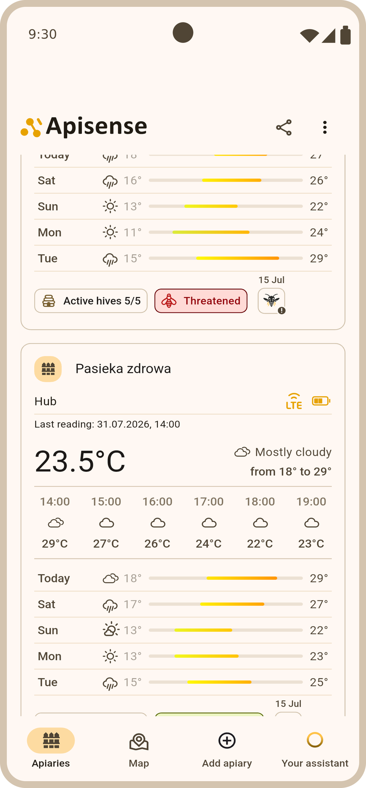{width=200}

#### 1.1.2 Dodawanie pasieki bez urządzeń

Aby dodać pasiekę bez urządzeń, w widoku *Dodaj pasiekę* ():

- w polu *Nazwa* wpisz nazwę pod jaką ma zostać wyświetlana pasieka w aplikacji,
- zaznacz opcję *Bez urządzeń*.

**Po uzupełnieniu powyższych informacji kliknij żółty przycisk na dole ekranu, potwierdzający utworzenie pasieki bez urządzeń.**

Jeśli utworzenie pasieki się powiodło, zostaniesz przekierowany do jej wnętrza (widok *Ule*), natomiast po przejściu do zakładki *Pasieki* na Twojej liście pasiek pojawi się pasieka, którą właśnie utworzyłeś (). Na kafelku pasieki **nie będą widoczne** ikony baterii i LTE Huba ani dane pogodowe. Zostanie wyświetlona jedynie nazwa pasieki.

Figure: Pomyślnie dodana pasieka bez urządzeń w widoku pasiek w systemie {#fig-apiaries-list-without-hub}

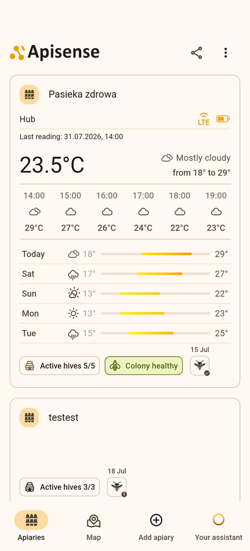{width=200}

!!! note
    **Pasieka bez urządzeń:** Możesz utworzyć pasiekę, podając wyłącznie nazwę i wybierając opcję *Bez urządzeń*, ale do pasieki utworzonej bez Huba nie będzie już możliwości przypisania tego urządzenia nawet na poziomie edycji  pasieki. Ponadto, jeżeli pasieka została utworzona bez Huba, to do żadnego ula w takiej pasiece nie będzie możliwości przypisania urządzeń Scale ani VitalSensor — podczas dodawania uli sekcja *Wyposażenie* nie będzie dostępna. Możesz jednak dodawać ule bez urządzeń oraz prowadzić dokumentację (notatki, przeglądy, zadania).

#### 1.2 Edycja pasieki

- W zakładce **Pasieki** (widok startowy po zalogowaniu do aplikacji Apisense), kliknij w kafelek z wybraną pasieką. W rezultacie zostanie otwarta zakładka *Ule* ().

Figure: Zakładka Pasieki z jedną pasieką oraz zakładka Ul z jednym ulem (1) {#fig-apiaries-list-2}

{width=200}

Figure: Zakładka Pasieki z jedną pasieką oraz zakładka Ul z jednym ulem (2) {#fig-beehives}

{width=200}

- W zakładce *Ule* kliknij ikonę **⋮**, znajdującą się w prawym górnym rogu ekranu, i wybierz *Ustawienia*. W rezultacie zostanie otwarty widok *Ustawienia pasieki* ().

Figure: Widok Ustawienia pasieki {#fig-apiary-settings}

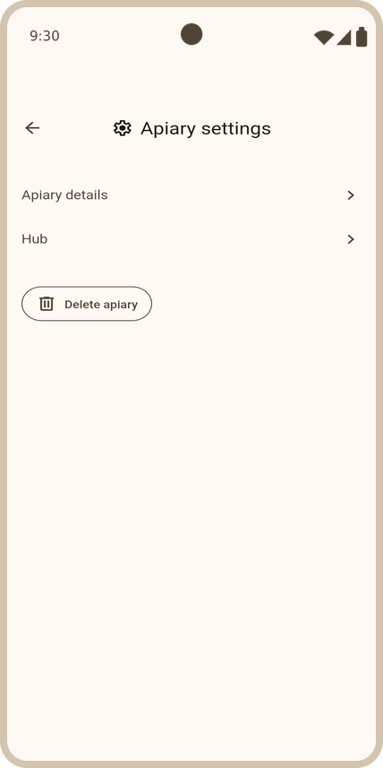{width=200}

- Widok *Ustawienia pasieki* jest podzielony na 2 sekcje. Aby zaktualizować informacje należące do danej sekcji, należy kliknąć w jej nagłówek. Dostępne sekcje:

    - **Szczegóły pasieki** - sekcja zawiera jedno pole: **Nazwa**. Kliknij w nie i wprowadź zmiany. Litera na kafelku pasieki wylicza się automatycznie z pierwszej litery nazwy — nie ma osobnego pola na skrót.
    - **Hub** - sekcja dotyczy parametrów związanych z urządzeniem Apisense Hub. Informacji zawartych w tej sekcji nie można edytować.

- Aby zapisać wprowadzone zmiany kliknij przycisk z ikoną **✓** w prawym dolnym rogu ekranu (). Przycisk staje się aktywny dopiero po zmianie wartości; sąsiedni przycisk **⊗** zamyka ekran bez zapisu.

Figure: Ustawienia pasieki - edycja danych w sekcji Szczegóły pasieki {#fig-apiary-settings-details}

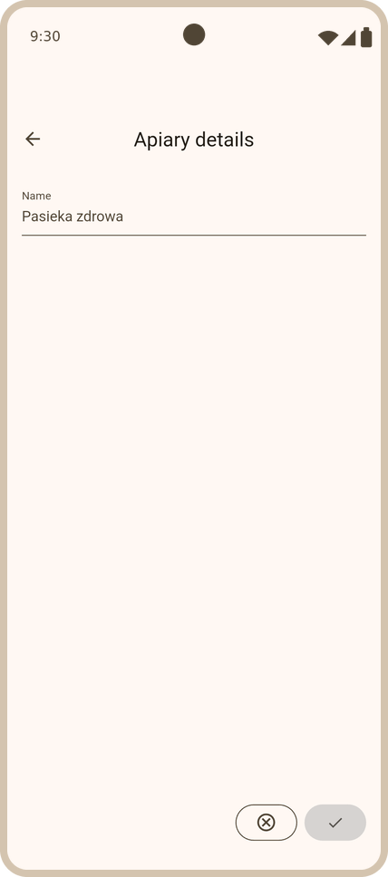{width=200}

#### 1.3 Usuwanie pasieki

- W zakładce **Pasieki** (widok startowy po zalogowaniu do aplikacji Apisense), kliknij w kafelek z wybraną pasieką. W rezultacie zostanie otwarta zakładka *Ule* ().

Figure: Zakładka Pasieki z jedną pasieką oraz zakładka Ul z jednym ulem (1) {#fig-apiaries-list-3}

{width=200}

Figure: Zakładka Pasieki z jedną pasieką oraz zakładka Ul z jednym ulem (2) {#fig-beehives-2}

{width=200}

- W zakładce *Ule* kliknij ikonę **⋮**, znajdującą się w prawym górnym rogu ekranu, i wybierz *Ustawienia*. W rezultacie zostanie otwarty widok *Ustawienia pasieki* ().

Figure: Widok Ustawienia pasieki {#fig-apiary-settings-2}

{width=200}

- W widoku *Ustawienia pasieki* kliknij przycisk *Usuń pasiekę*. W rezultacie zostanie wyświetlony widok *Usuń pasiekę* (), gdzie należy potwierdzić swój wybór przyciskiem *Tak, usuń*.

Figure: Ustawienia pasieki - widok Usuń pasiekę {#fig-apiary-settings-remove-apiary}

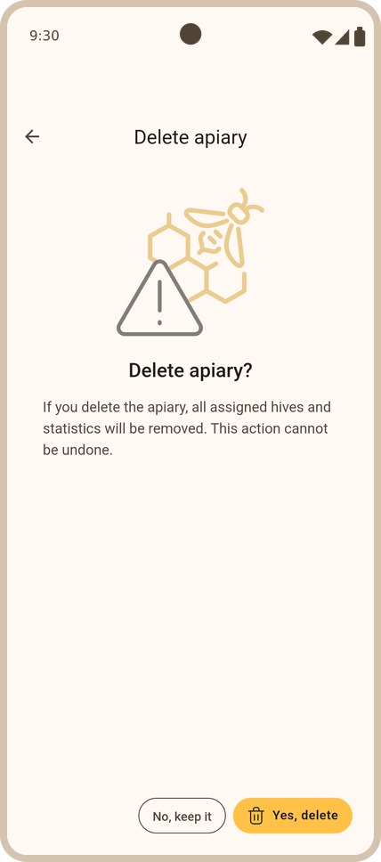{width=200}

- Wraz z usuniętą pasieką usunięta zostaje również cała jej zawartość (ule, notatki, przeglądy itp.). Odpinane są także poszczególne urządzenia (Hub, Scale, VitalSensor) i zostaje wyczyszczona historia ich pomiarów. W związku z tym, przykładowo ten sam Apisense Hub będziesz mógł teraz wykorzystać podczas tworzenia nowej pasieki.

### 2. Ul

#### 2.1 Dodawanie ula

  <iframe src="https://www.youtube.com/embed/L_XWlMFRbbE"
          title="Apisense Manual PL — 03 · Dodaj ul"
          allow="accelerometer; clipboard-write; encrypted-media; gyroscope; picture-in-picture; web-share"
          allowfullscreen></iframe>

- Będąc w zakładce Pasieki (widok startowy po zalogowaniu do aplikacji Apisense ) kliknij kafelek z pasieką, do której chcesz dodać ul. Po kliknięciu w kafelek zostanie wyświetlony widok pojedynczej pasieki ().

Figure: Widok pasieki w zakładce Pasieki {#fig-apiaries-apiary}

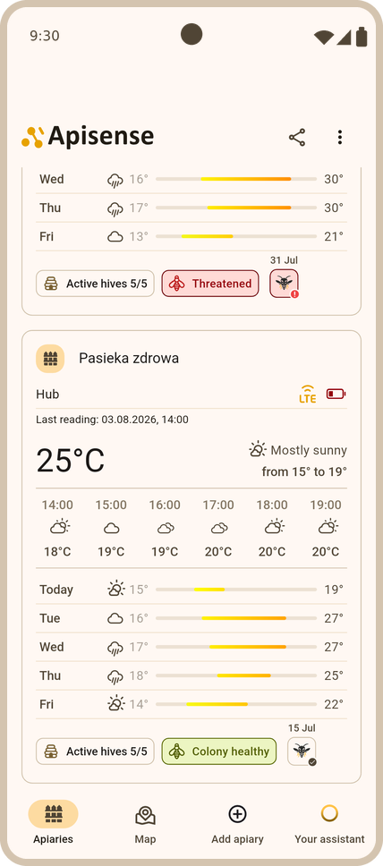{width=200}

Figure: Widok zawartości pojedynczej pasieki (Ule) {#fig-apiary-interior}

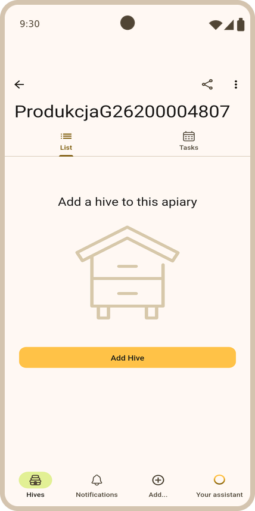{width=200}

- Aby dodać ul do tej pasieki kliknij zakładkę *Dodaj...* na dolnym pasku menu i wybierz opcję *Ul* (), w wyniku czego zostanie wyświetlony widok Dodaj ul (). Menu zawiera trzy pozycje: *Ul*, *Zadanie* i *Notatka*; *Notatka* jest wyszarzona, dopóki w pasiece nie ma żadnego ula.

Figure: Widok Ule - Przycisk Dodaj ul {#fig-apiary-add-beehive-button}

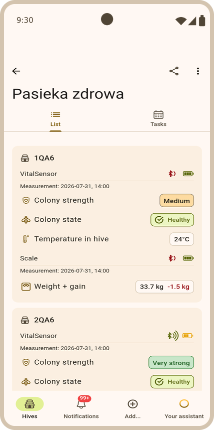{width=200}

- Wypełnij poszczególne pola w widoku Dodaj ul - sekcja **Szczegóły ula** ():

    - **Nazwa ula** - wpisz nazwę dla swojego ula - pod taką nazwą ul będzie wyświetlany w panelu.
    - **Maksymalna liczba ramek w korpusie gniazdowym** - podaj maksymalną liczbę ramek, które mogą zmieścić się w korpusie gniazdowym ula.
    - **Pole wyboru** - zaznacz, jeśli ul posiada dennicę higieniczną.

    Powyższe informacje będą mogły zostać zedytowane przez użytkownika w dowolnym momencie.

Figure: Dodawanie ula w systemie - sekcja Szczegóły ula {#fig-add-beehive-details}

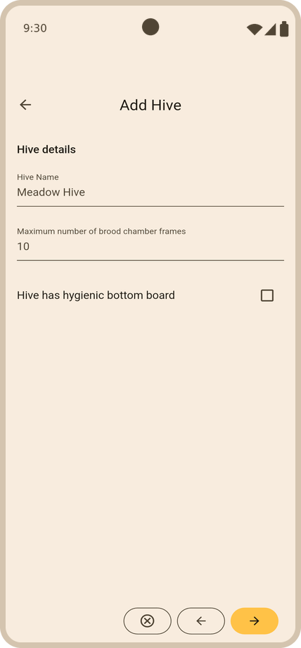{width=200}

- Aby przejść do kolejnego etapu dodawania ula kliknij żółty przycisk ze strzałką w prawo, znajdujący się na dole ekranu.

- **Informacje o matce pszczelej:** Na tym etapie dodawania ula należy wypełnić informacje o matce pszczelej ():

    - **Rok wychowu matki** - wybierz rok wychowu matki pszczelej z listy rozwijanej (kliknij strzałkę w dół widoczną przy tym polu po prawej stronie).
    - **Pochodzenie matki** - wybierz jedną z opcji dostępnej na liście rozwijanej (kliknij strzałkę w dół widoczną przy tym polu po prawej stronie).
    - **Sposób unasiennienia matki** - wybierz jedną z dostępnych opcji

    Powyższe informacje będą mogły zostać zedytowane przez użytkownika w dowolnym momencie.

Figure: Dodawanie ula w systemie - sekcja Informacje o matce pszczelej {#fig-add-beehive-queen}

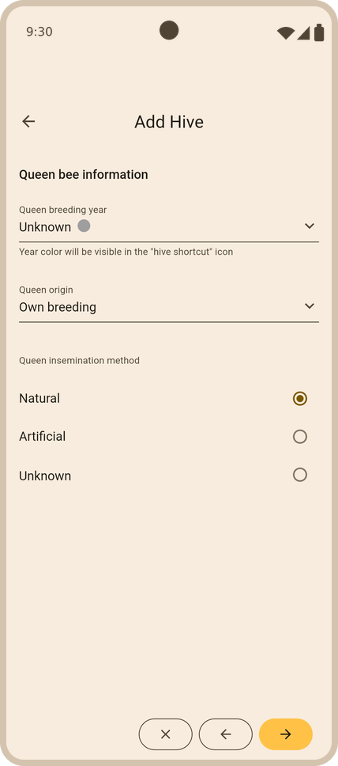{width=200}

- Następnie kliknij żółty przycisk ze strzałką w prawo, znajdujący się na dole ekranu, w celu przejścia do etapu **Wyposażenie**.

Etap wyposażenia to od jednego do trzech osobnych ekranów, zawsze w tej samej kolejności: **ColonyLink → VitalSensor → Scale**. Pierwszy ekran pojawia się przy każdym dodawaniu ula, dwa kolejne tylko wtedy, gdy pasieka ma przypisane urządzenie Apisense Hub.

!!! note
    **Wymóg Hub:** VitalSensor i Scale można powiązać z ulem wyłącznie w pasiece z przypisanym **Apisense Hub**. ColonyLink Huba nie wymaga — jego ekran pojawia się również w pasiece bez Huba.

#### 2.1.1 Krok ColonyLink

- Po informacjach o matce zostanie wyświetlony ekran *Wyposażenie - zeskanuj kod QR z Apisense ColonyLink*. Wypełnij pola:

    - **ColonyLink** - kliknij w ikonę kodu QR znajdującą się w prawej części tego pola i zeskanuj kod QR z Apisense ColonyLink. Kolejne pole *Kod potwierdzający* zostanie wypełnione automatycznie.
    - **Kod potwierdzający** - zostanie wypełniony automatycznie, po poprawnym zeskanowaniu kodu QR.

- Przycisk przejścia dalej pozostaje **nieaktywny (wyszarzony)**, dopóki oba pola nie zostaną wypełnione — ColonyLink jest domyślnie wymagany dla każdego ula.

!!! note
    W niektórych planach ColonyLink jest opcjonalny. Poznasz to po komunikacie *„ColonyLink jest opcjonalny w Twoim planie — możesz pominąć ten krok"*, wyświetlanym pod nagłówkiem ekranu. Wtedy możesz zostawić oba pola puste i przejść dalej. Nie da się natomiast wypełnić tylko jednego z nich — albo oba, albo żadne.

- To, co dzieje się po tym kroku, zależy od pasieki:

    - **Pasieka z Apisense Hub** - przycisk ze strzałką w prawo prowadzi do kolejnych ekranów wyposażenia (VitalSensor, następnie Scale).
    - **Pasieka bez Apisense Hub** - ColonyLink jest krokiem ostatnim. Przycisk na dole ekranu ma wtedy ikonę zapisu, a jego kliknięcie tworzy ul z samym ColonyLinkiem.

#### 2.1.2 Dodawanie ula z VitalSensorem i Scale

Te dwa ekrany pojawiają się tylko w pasiece z Hubem, po kroku ColonyLink. **Uwaga:** Kluczowe jest, aby urządzenia skonfigurowane w ramach ula były w rzeczywistości zainstalowane w tym samym fizycznym ulu.

- **VitalSensor:** ekran *Wyposażenie - zeskanuj kod QR z urządzenia Apisense VitalSensor lub z Apisense Tag* ():

    - **VitalSensor / Tag** - kliknij w ikonę kodu QR znajdującą się w prawej części tego pola i zeskanuj kod QR z naklejki umieszczonej na urządzeniu Apisense VitalSensor lub z Apisense Tag. Kolejne pole *Kod potwierdzający* zostanie wypełnione automatycznie.
    - **Kod potwierdzający** - zostanie wypełniony automatycznie, po poprawnym zeskanowaniu kodu QR.

    Link *Zobacz, jak zamontować VitalSensor* nad polami otwiera instrukcję montażu urządzenia.

    Figure: Dodawanie ula w systemie - sekcja Wyposażenie - przypisywanie urządzenia VitalSensor {#fig-add-beehive-devices-sensor}

    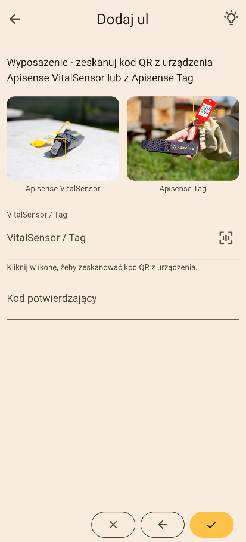{width=200}

- **Scale:** ostatni ekran kreatora, *Wyposażenie - zeskanuj kod QR z urządzenia Apisense Scale* ():

    - **Scale** - kliknij w ikonę kodu QR znajdującą się w prawej części tego pola i zeskanuj kod QR z naklejki umieszczonej na Apisense Scale. Kolejne pole *Kod potwierdzający* zostanie wypełnione automatycznie.
    - **Kod potwierdzający** - zostanie wypełniony automatycznie, po poprawnym zeskanowaniu kodu QR.

    Link *Zobacz, jak zamontować Scale* nad polami otwiera instrukcję montażu urządzenia.

    Figure: Dodawanie ula w systemie - sekcja Wyposażenie - przypisywanie urządzenia Scale {#fig-add-beehive-devices-scale}

    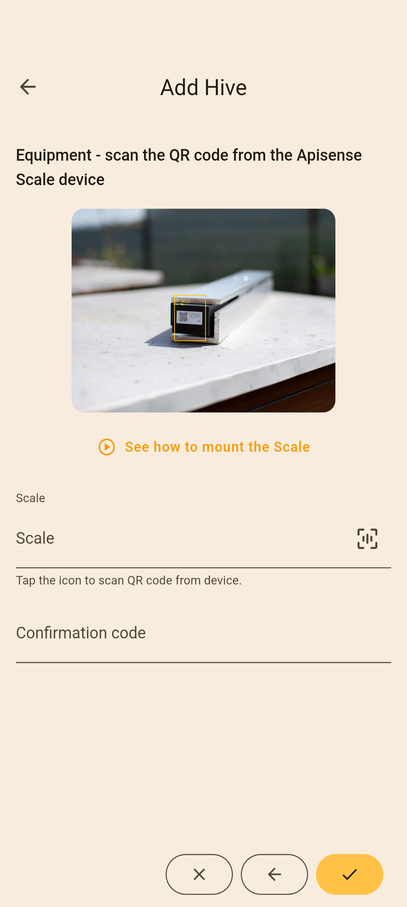{width=200}

!!! note
    Oba te ekrany są opcjonalne. Aby pominąć urządzenie, zostaw jego pola puste i przejdź dalej — tak utworzysz ul np. tylko z VitalSensorem albo tylko ze Scale. Nie da się natomiast wypełnić samego numeru seryjnego lub samego kodu potwierdzającego; aplikacja pokaże wtedy błąd przy brakującym polu.

- Kliknięcie przycisku zapisu na ekranie Scale kończy dodawanie ula. To ten krok tworzy ul wraz ze wszystkimi zeskanowanymi wcześniej urządzeniami — jeśli któryś z numerów seryjnych zostanie odrzucony, aplikacja wróci na ekran tego urządzenia i pokaże błąd przy odpowiednim polu.

- Jeśli utworzenie ula się powiodło, zostaniesz przekierowany do widoku *Ule*, a na Twojej liście uli pojawi się ul, który właśnie utworzyłeś (, ).

Figure: Pomyślnie dodany ul z powiązanymi Apisense Scale oraz VitalSensor w widoku Ule {#fig-beehives-beehive-with-problem}

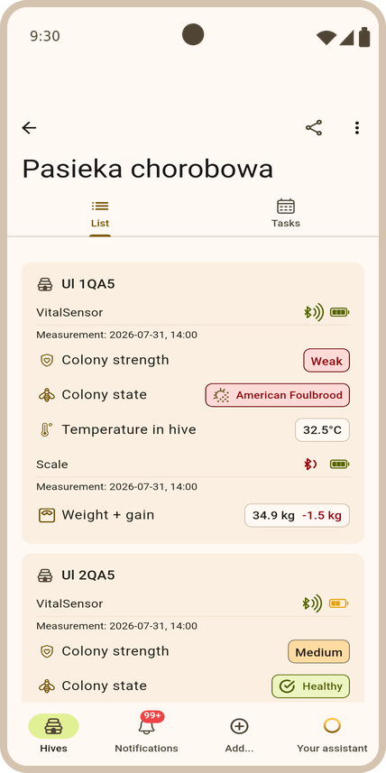{width=200}

Figure: Pomyślnie dodany ul z powiązanymi Apisense Scale oraz VitalSensor w widoku Szczegóły ula {#fig-beehive-interior}

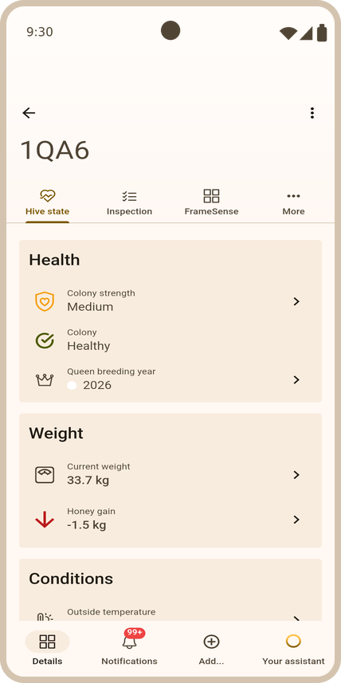{width=200}

#### 2.1.3 Dodawanie ula bez Scale i VitalSensora

Jeśli chcesz utworzyć ul tylko do ewidencji (bez monitoringu):

- Przejdź przez kroki **Szczegóły ula**, **Informacje o matce pszczelej** oraz **ColonyLink** jak przy standardowym dodawaniu ula. Kroku ColonyLink nie da się pominąć, chyba że Twój plan wyraźnie oznacza go jako opcjonalny.
- Jeśli pasieka **nie ma Huba**, ColonyLink jest ostatnim krokiem — kliknij przycisk zapisu i ul zostanie utworzony.
- Jeśli pasieka **ma Huba**, przejdź przez ekrany VitalSensor i Scale, zostawiając ich pola puste (nie skanuj kodów QR), a na ekranie Scale kliknij przycisk zapisu.

**Po utworzeniu ula bez urządzeń pomiarowych:**

- Na kafelku ula nie zobaczysz bieżących pomiarów (temperatura, waga) ani oceny stanu zdrowia rodziny opartej na danych z VitalSensora ().
- Funkcje wymagające VitalSensora (np. *Zarejestruj próbkę*) nie będą dostępne, dopóki nie przypiszesz urządzenia.
- Scale i VitalSensor możesz dodać później w *Ustawieniach ula* → **Wyposażenie**, pod warunkiem, że pasieka ma przypisany Hub.

Figure: Pomyślnie dodany ul bez urządzeń w widoku Ule {#fig-beehives-beehive-without-devices}

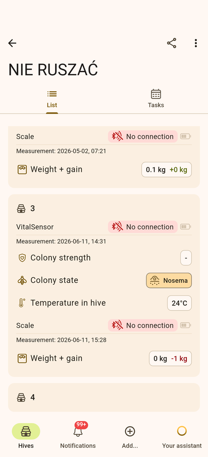{width=200}

#### 2.2 Edycja ula

- W zakładce **Pasieki** (widok startowy po zalogowaniu do aplikacji Apisense), kliknij w kafelek z wybraną pasieką. W rezultacie zostanie otwarta zakładka *Ule* ().

Figure: Zakładka Pasieki z jedną pasieką oraz zakładka Ul z jednym ulem (1) {#fig-apiaries-list-4}

{width=200}

Figure: Zakładka Pasieki z jedną pasieką oraz zakładka Ul z jednym ulem (2) {#fig-beehives-3}

{width=200}

- W zakładce *Ule* kliknij w kafelek z wybranym ulem, co spowoduje otwarcie zakładki *Szczegóły* ().

Figure: Przykładowy widok zakładki Szczegóły ula {#fig-beehive-interior-2}

{width=200}

- Następnie kliknij w ikonę **⋮**, zlokalizowaną w prawym górnym rogu zakładki *Szczegóły*, i wybierz *Ustawienia*, w wyniku czego zostanie wyświetlony widok *Ustawienia ula* ().

Figure: Widok Ustawienia ula {#fig-beehive-settings}

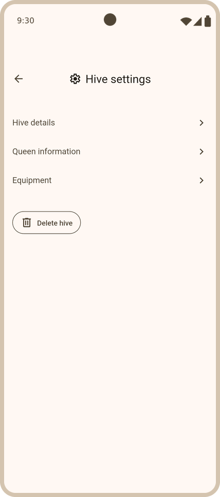{width=200}

- Widok *Ustawienia ula* jest podzielony na 3 sekcje. Aby zaktualizować informacje należące do danej sekcji, należy kliknąć w jej nagłówek. Dostępne sekcje:

    - **Szczegóły ula** - sekcja umożliwia edycję takich parametrów jak nazwa ula, maksymalna liczba ramek w korpusie gniazdowym oraz dennica higieniczna. W tym celu należy kliknąć w wybrane pole i wprowadzić zmiany lub zaznaczyć/odznaczyć kwadrat przy danym elemencie.

    - **Informacje o matce** - sekcja dotyczy danych związanych z matką pszczelą: *Rok wychowu matki*, *Pochodzenie matki* (*Własna hodowla*, *Zakup krajowy*, *Zakup zagraniczny*, *Nieznane*) oraz *Sposób unasiennienia matki* (*Naturalny*, *Sztuczny*, *Nieznany*). Aby zaktualizować dane w tej sekcji należy wybrać odpowiednią pozycję z listy rozwijanej.

    - **Wyposażenie** - sekcja zawiera trzy bloki urządzeń, w kolejności **ColonyLink**, **VitalSensor**, **Scale**. Każdy blok ma pola *Numer seryjny* i *Kod potwierdzający*, a kliknięcie nazwy urządzenia otwiera jego szczegóły. Jeżeli któregoś urządzenia w ulu nie ma (pola są puste), możesz je stąd powiązać: kliknij ikonę kodu QR w prawej części pola i zeskanuj kod z urządzenia.

        - **ColonyLink** nie ma przycisku odłączania — można go wyłącznie podmienić, skanując kod innego ColonyLinka.
        - **VitalSensor** i **Scale** mają przyciski *Wymieniłem baterię* oraz *Odłącz VitalSensor* / *Odłącz Scale*.

        Po kliknięciu *Odłącz VitalSensor* / *Odłącz Scale* otwiera się ekran potwierdzenia (*Odłączyć VitalSensor?* / *Odłączyć Scale?*) z przyciskami *Odłącz* i *Nie odłączaj* przy VitalSensorze oraz *Odłącz Scale* i *Nie odłączaj Scale* przy Scale (). Historia pomiarów odłączanego urządzenia zostaje domyślnie zachowana — przeszłe dane będą dostępne na wykresach, dopóki ul nie zostanie usunięty. Aby ją wyczyścić, wyłącz przełącznik *Zachowaj historię…* przed potwierdzeniem.

        Przycisk *Wymieniłem baterię* zgłasza wymianę baterii w danym urządzeniu — aplikacja odświeża konfigurację i potwierdza komunikatem *Wymiana baterii potwierdzona*.

    !!! note
        Sekcja *Wyposażenie* nie jest dostępna, jeśli do pasieki nie jest przypisane urządzenie Apisense Hub.

Figure: Widok Ustawienia ula - sekcja Wyposażenie, potwierdzenie odłączenia Scale z zachowaniem historii pomiarów (1) {#fig-beehive-settings-devices-edit}

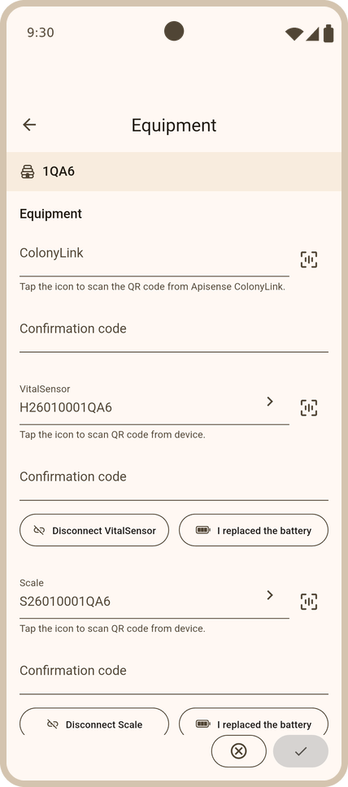{width=200}

Figure: Widok Ustawienia ula - sekcja Wyposażenie, potwierdzenie odłączenia Scale z zachowaniem historii pomiarów (2) {#fig-disconnect-scale}

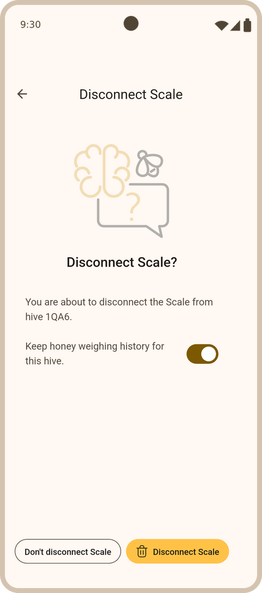{width=200}

- Aby zapisać wprowadzone zmiany w wybranej sekcji, należy kliknąć żółty przycisk, znajdujący się w prawym dolnym rogu ekranu.

#### 2.3 Usuwanie ula

- W zakładce **Pasieki** (widok startowy po zalogowaniu do aplikacji Apisense), kliknij w kafelek z wybraną pasieką. W rezultacie zostanie otwarta zakładka *Ule* ().

Figure: Zakładka Pasieki z jedną pasieką oraz zakładka Ul z jednym ulem (1) {#fig-apiaries-list-5}

{width=200}

Figure: Zakładka Pasieki z jedną pasieką oraz zakładka Ul z jednym ulem (2) {#fig-beehives-4}

{width=200}

- W zakładce *Ule* kliknij w kafelek z wybranym ulem, co spowoduje otwarcie zakładki *Szczegóły* ().

Figure: Przykładowy widok zakładki Szczegóły ula {#fig-beehive-interior-3}

{width=200}

- Następnie kliknij w ikonę **⋮**, zlokalizowaną w prawym górnym rogu zakładki *Szczegóły*, i wybierz *Ustawienia*, w wyniku czego zostanie wyświetlony widok *Ustawienia ula* ().

Figure: Widok Ustawienia ula {#fig-beehive-settings-2}

{width=200}

- W widoku *Ustawienia ula* kliknij przycisk *Usuń ul*. W rezultacie zostanie wyświetlony widok *Usuń ul* (), gdzie należy potwierdzić swój wybór przyciskiem *Tak, usuń*.

Figure: Ustawienia ula - widok Usuń ul {#fig-beehive-settings-remove-beehive}

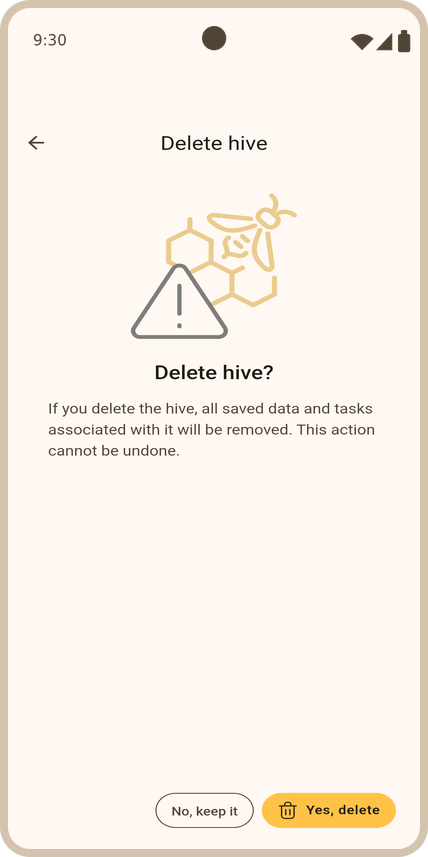{width=200}

- Wraz z usuniętym ulem usunięta zostaje również cała jego zawartość (notatki, przeglądy itp.). Odpinane są także poszczególne urządzenia (Scale, VitalSensor) i zostaje wyczyszczona historia ich pomiarów. W związku z tym, przykładowo ten sam Apisense VitalSensor będzie mógł zostać powiązany z innym ulem (który nie posiada tego typu urządzenia).

### 3. Dodawanie przeglądów

  <iframe src="https://www.youtube.com/embed/1kHqvSh838o"
          title="Apisense Manual PL — 04 · Dodaj przegląd"
          allow="accelerometer; clipboard-write; encrypted-media; gyroscope; picture-in-picture; web-share"
          allowfullscreen></iframe>

- Będąc w zakładce Pasieki (widok startowy po zalogowaniu do aplikacji Apisense) kliknij kafelek z pasieką. Po kliknięciu w kafelek zostanie wyświetlony widok Ule ().

Figure: Widok pasieki w zakładce Pasieki i widok Ule (1) {#fig-apiaries-apiary-with-beehive}

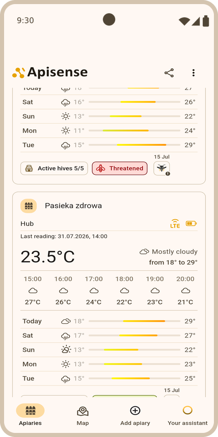{width=200}

Figure: Widok pasieki w zakładce Pasieki i widok Ule (2) {#fig-beehives-5}

{width=200}

- Następnie kliknij w kafelek ula, dla którego chcesz wykonać przegląd. W rezultacie zostanie wyświetlony widok Szczegóły ula ().

Figure: Widok Szczegóły ula {#fig-beehive-interior-4}

{width=200}

- Aby dodać przegląd, należy z dolnego menu wybrać opcję *Dodaj...*, a następnie *Przegląd* (), w wyniku czego zostanie wyświetlony widok *Dodaj przegląd* ().

Figure: Widok Szczegóły ula - Przycisk Dodaj Przegląd {#fig-add-overview-button}

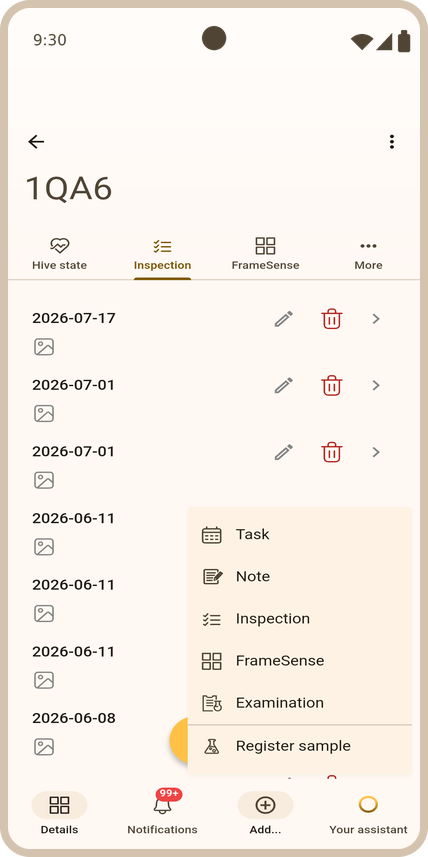{width=200}

- W widoku Dodaj przegląd () załącz po 2 zdjęcia dla:

  - ramki z VitalSensorem - przód i tył ramki wyposażonej w urządzenie VitalSensor, z pszczołami,
  - jednej skrajnej ramki - pierwszej albo ostatniej przy ściance ula - również przód i tył tej samej ramki.

Aby dodać zdjęcia kliknij przycisk *Dodaj zdjęcie*, a następnie wybierz opcję *Zrób zdjęcie* lub *Dodaj zdjęcie z galerii*. Jeśli nie wiesz, jak powinno wyglądać dane zdjęcie, kliknij odnośnik *Zobacz przykład*, aby zobaczyć przykłady prawidłowo wykonanych zdjęć ramek pszczelich (przód i tył).

!!! note
    Zdjęcia RAW/DNG nie są obsługiwane w wersji webowej w przypadku przeglądów - dodaj zdjęcie w formacie JPG lub PNG. W wersji mobilnej istnieje natomiast możliwość dodania zdjęcia do przeglądu w formacie RAW/DNG. 
    Jeśli zdjęć nie uda się przesłać od razu (np. z powodu słabego połączenia internetowego), aplikacja będzie automatycznie ponawiać próbę wysyłki w tle. Do czasu zakończenia procesu wyświetlany będzie komunikat *„Wysyłanie zdjęć…”*. Jeśli po kolejnych próbach wysyłka nadal się nie powiedzie, pojawi się komunikat *„Nie wysłano zdjęć”*.

Figure: Dodawanie przeglądu - dodawanie zdjęć {#fig-add-inspection-photos}

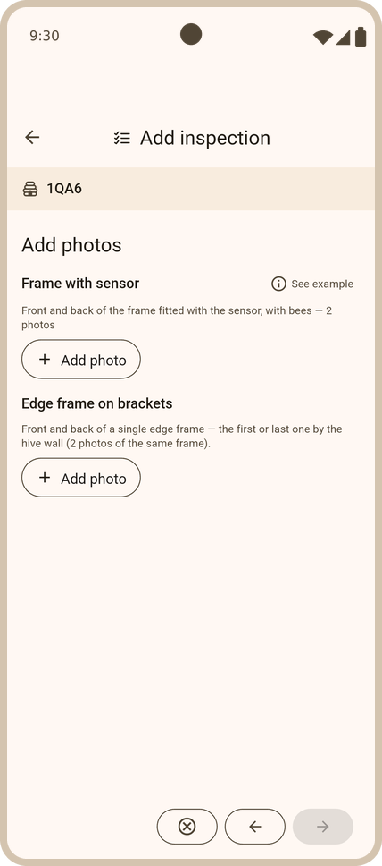{width=200}

Figure: Przykładowe zdjęcie ramki z VitalSensorem dołączane do przeglądu {#fig-inspection-photo-example}

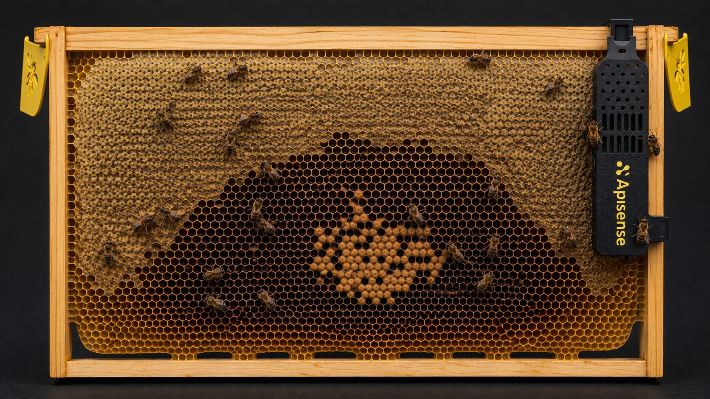{width=400}

- Po poprawnym dodaniu zdjęć kliknij żółtą strzałkę, umieszczoną w prawym dolnym rogu, co spowoduje przejście do kolejnego kroku.

- Następnie odpowiedz na kilka pytań (). Pytania są trzech rodzajów:

    - **wyboru** - zaznacz odpowiedź *Tak*, *Nie* lub *Pomiń*. Przy pytaniu wymaganym zaznaczenie odpowiedzi automatycznie przenosi do następnego pytania;
    - **tekstowe** - wpisz odpowiedź w pole tekstowe;
    - **liczbowe** - wpisz liczbę; aplikacja pilnuje dopuszczalnego zakresu wartości.

Figure: Dodawanie przeglądu - przykładowe pytanie {#fig-add-overview-question}

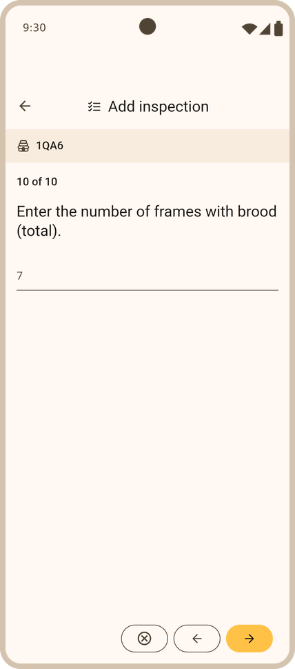{width=200}

- Aby przejść do następnego pytania przeglądu, kliknij żółty przycisk ze strzałką w prawo, znajdujący się na dole ekranu.
- Po udzieleniu odpowiedzi na wszystkie pytania przeglądu zostanie wyświetlony ostatni widok (), w którym należy wybrać datę przeglądu (domyślnie ustawiona jest aktualna data).

Figure: Dodawanie przeglądu - zapisywanie przeglądu {#fig-add-overview-save}

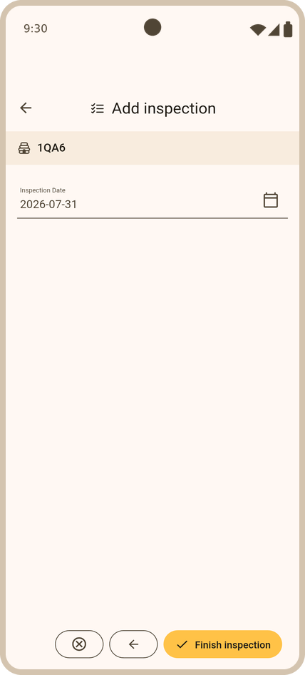{width=200}

- Aby zapisać przegląd kliknij żółty przycisk *Zakończ przegląd*, znajdujący się w prawym dolnym rogu ekranu. Zapisany przegląd zostanie wyświetlony na liście przeglądów w zakładce Szczegóły ula > Przegląd ().

!!! tip
    **Szkice przeglądów:** Jeśli opuścisz rozpoczęty przegląd z niezapisanymi zmianami (np. klikając przycisk wstecz), aplikacja zapyta, czy *Zapisać szkic*, czy *Odrzucić*. Zapisany szkic pojawi się na liście przeglądów (u góry) i można go w dowolnym momencie wznowić, ale **jest przechowywany tylko przez 24 godziny**, po czym zostaje automatycznie usunięty. Aby usunąć szkic wcześniej, kliknij czerwoną ikonę kosza przy wybranym szkicu na liście przeglądów. Aby trwale zapisać szkic, dokończ wypełnianie przeglądu w ciągu 24 godzin i kliknij przycisk *Zakończ przegląd*. Szkic zamieni się w typowy przegląd i zostanie wyświetlony na liście przeglądów.

Figure: Przegląd na liście przeglądów w ulu {#fig-beehive-details-overview}

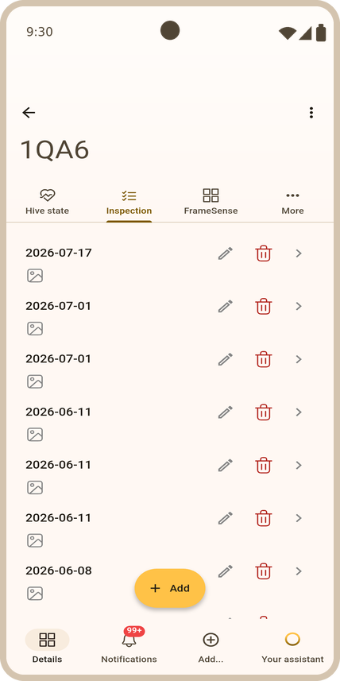{width=200}

#### 3.1 Edycja przeglądu

Aby wykonać edycję zapisanego przeglądu należy:

- Na liście przeglądów (*Szczegóły ula > Przegląd*), przy przeglądzie wymagającym edycji, kliknąć w ikonę ołówka lub w widoku szczegółów przeglądu otworzyć dodatkowe menu (trzy kropki w prawym górnym rogu) i wybrać opcję *Edytuj*. W efekcie zostanie otwarty kreator przeglądu z zapisanymi zdjęciami i wypełnionymi odpowiedziami na poszczególne pytania.
- W pierwszym kroku edycji zostaną wyświetlone zdjęcia ramek. Jeżeli nie chcesz nic zmieniać na etapie zdjęć, kliknij żółtą strzałkę w prawo, aby przejść do kolejnego etapu i zachować aktualny stan zdjęć. Jeśli któreś z nich wymaga podmiany - kliknij *"X"* widoczny na miniaturze wybranego zdjęcia aby je usunąć. Następnie kliknij przycisk *Dodaj zdjęcie*, który zostanie wyświetlony pod wszystkimi zdjęciami, wybierz opcję *Zrób zdjęcie* lub *Dodaj zdjęcie z galerii* i zamieść nowe zdjęcie.
- W kolejnych krokach zobaczysz udzielone odpowiedzi na pytania przeglądu. Jeśli nie chcesz zmieniać odpowiedzi na dane pytanie kliknij żółtą strzałkę w prawo. Jeśli chcesz zmienić odpowiedź, wybierz nową opcję (*Tak*/*Nie*/*Pomiń*) albo popraw wpisany tekst lub liczbę. Przy wymaganych pytaniach wyboru zmiana odpowiedzi automatycznie przenosi do kolejnego pytania; przy pytaniach tekstowych i liczbowych przejdź dalej żółtą strzałką.
- W ostatnim etapie zaktualizuj odpowiednio datę przeglądu lub pozostaw ją bez zmian. Aby zapisać wszystkie wprowadzone zmiany kliknij żółty przycisk *Zakończ przegląd*. Jeśli zmiany zostały poprawnie zapisane zostanie wyświetlony komunikat: Przegląd został pomyślnie zaktualizowany.

#### 3.2 Usuwanie przeglądu

Aby usunąć przegląd:

- Na liście przeglądów (*Szczegóły ula > Przegląd*) kliknij czerwoną ikonę kosza przy przeglądzie, który ma zostać usunięty lub na ekranie szczegółów przeglądu wybierz opcję *Usuń* z dodatkowego menu (trzy kropki w prawym górnym rogu).
- W rezultacie zostanie wyświetlony komunikat, czy na pewno usunąć przegląd. Potwierdź operację klikając przycisk *Usuń*. **Uwaga!** Tej czynności nie można cofnąć.

### 4. Notatki

#### 4.1 Dodawanie notatki

  <iframe src="https://www.youtube.com/embed/nZdzxrNIyZA"
          title="Apisense Manual PL — 05 · Dodaj notatkę tekstową"
          allow="accelerometer; clipboard-write; encrypted-media; gyroscope; picture-in-picture; web-share"
          allowfullscreen></iframe>

  <iframe src="https://www.youtube.com/embed/_QLzIfwcRMs"
          title="Apisense Manual PL — 06 · Dodaj notatkę głosową"
          allow="accelerometer; clipboard-write; encrypted-media; gyroscope; picture-in-picture; web-share"
          allowfullscreen></iframe>

Poniższe kroki odnoszą się do dodawania notatki z poziomu ula.

- W zakładce Pasieki (widok startowy po zalogowaniu do aplikacji Apisense) kliknij kafelek z pasieką. Po kliknięciu w kafelek zostanie wyświetlony widok Ule ().

Figure: Widok pasieki w zakładce Pasieki i widok Ule (1) {#fig-apiaries-apiary-with-beehive-2}

{width=200}

Figure: Widok pasieki w zakładce Pasieki i widok Ule (2) {#fig-beehives-6}

{width=200}

- Następnie kliknij w kafelek ula, dla którego chcesz dodać notatkę. W rezultacie zostanie wyświetlony widok Szczegóły ula ().

Figure: Widok Szczegóły ula {#fig-beehive-interior-5}

{width=200}

- Aby dodać notatkę, należy z dolnego menu wybrać opcję *Dodaj...*, a następnie *Notatkę* (), w wyniku czego zostanie wyświetlony widok Dodaj notatkę ().

Figure: Widok Szczegóły ula - Przycisk Dodaj Notatkę {#fig-add-overview-button-2}

{width=200}

- W widoku Dodaj notatkę () wypełnij następujące pola:

    - **Data** - wybierz datę z jaką zapisać notatkę (domyślnie aktualna).
    - **Tytuł** - wpisz tytuł notatki (pole opcjonalne).
    - **Notatka** - Wpisz treść notatki (tekst) lub kliknij ikonę mikrofonu znajdujacą sie po prawej stronie w tym polu, aby nagrać notatkę głosową.

!!! tip
    **Transkrypcja notatki głosowej:** Po nagraniu notatki głosowej aplikacja automatycznie przygotowuje jej transkrypcję, dzięki czemu notatka jest dostępna zarówno w formie audio, jak i tekstu. W trakcie generowania transkrypcji na ekranie szczegółów notatki widoczny jest napis *Transkrypcja w toku...*. Gdy transkrypcja jest już gotowa, wygenerowany tekst pojawia się pod nagranym dźwiękiem, pod nagłówkiem *Transkrypcja*. Jeśli transkrypcja się nie powiedzie, w tym samym miejscu pojawi się komunikat *Nie udało się utworzyć transkrypcji.*

Figure: Dodawanie notatki tekstowej lub głosowej (1) {#fig-add-note-add-text}

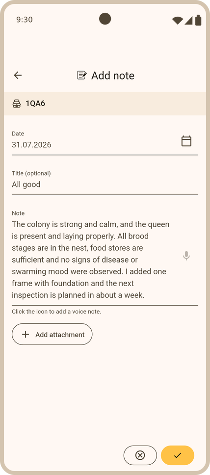{width=200}

Figure: Dodawanie notatki tekstowej lub głosowej (2) {#fig-add-note-add-audio}

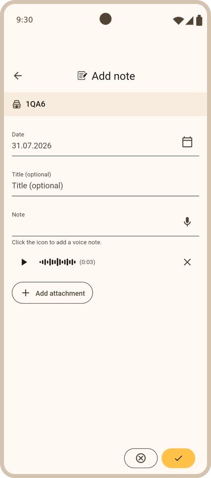{width=200}

- Do notatki możesz również dodać zdjęcie, nagranie lub **dokument PDF**. W tym celu kliknij przycisk *Dodaj załącznik* (z ikoną plusa), znajdujący się w treści formularza pod polem notatki (), i wybierz typ załącznika z listy: *Aparat*, *Galeria*, *Nagraj wideo*, *Wideo z galerii*, *Dokument PDF*. Dodane załączniki pojawiają się pod przyciskiem.

Figure: Dodawanie notatki tekstowej z załącznikami {#fig-add-note-add-photos}

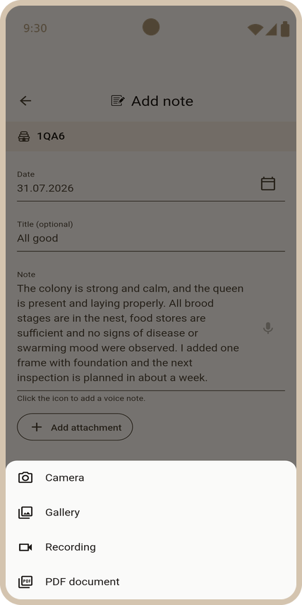{width=200}

- Aby zapisać notatkę kliknij żółty przycisk, znajdujący się w prawym dolnym rogu ekranu. Zapisana notatka zostanie wyświetlona na liście notatek w zakładce Szczegóły ula > Więcej > Notatki ().

Figure: Notatka na liście notatek w ulu {#fig-beehive-details-note}

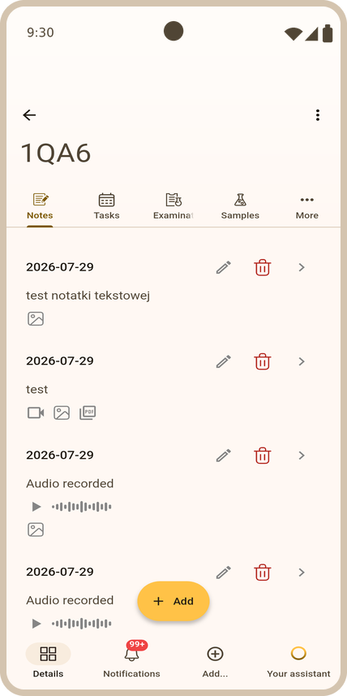{width=200}

**Uwaga — dodawanie notatki z poziomu pasieki:** Notatka może zostać również utworzona z poziomu pasieki. W tym celu należy przejść następującą ścieżkę: w zakładce *Pasieki* kliknąć wybraną pasiekę, następnie w zakładce *Ule* wybrać z dolnego menu opcję *Dodaj...* i opcję *Notatka*. W rezultacie taka sama notatka zostanie automatycznie zapisana do wszystkich uli w wybranej pasiece i będzie widoczna na liście notatek każdego ula (*Szczegóły > Więcej > Notatki*). **Edycja** takiej notatki dotyczy wyłącznie kopii w konkretnym ulu — zmiany w jednej notatce nie będą widoczne w pozostałych notatkach dodanych w ten sposób. Również **usuwając** taką notatkę w jednym z uli, notatki w pozostałych ulach zostaną nienaruszone.

#### 4.2 Edycja notatki

  <iframe src="https://www.youtube.com/embed/_QLzIfwcRMs"
          title="Apisense Manual PL — 06 · Edycja notatki głosowej"
          allow="accelerometer; clipboard-write; encrypted-media; gyroscope; picture-in-picture; web-share"
          allowfullscreen></iframe>

- W zakładce Pasieki (widok startowy po zalogowaniu do aplikacji Apisense) kliknij kafelek z pasieką. Po kliknięciu w kafelek zostanie wyświetlony widok Ule ().

Figure: Widok pasieki w zakładce Pasieki i widok Ule (1) {#fig-apiaries-apiary-with-beehive-3}

{width=200}

Figure: Widok pasieki w zakładce Pasieki i widok Ule (2) {#fig-beehives-7}

{width=200}

- Następnie kliknij w kafelek ula, w którym chcesz zedytować notatkę. W rezultacie zostanie wyświetlony widok Szczegóły ula ().

Figure: Widok Szczegóły ula {#fig-beehive-interior-6}

{width=200}

- W górnym menu kliknij *Więcej*, a następnie zakładkę *Notatki*, w wyniku czego zostanie otwarty widok z listą notatek przypisanych do wybranego ula ()

Figure: Notatka na liście notatek w ulu {#fig-beehive-details-note-2}

{width=200}

- Aby zaktualizować notatkę, kliknij ikonę ołówka znajdującą się przy notatce, która wymaga edycji. Po kliknięciu w ikonę ołówka zostanie wyświetlony widok *Edycja notatki* ().

Figure: Widok Edycja notatki {#fig-edit-note}

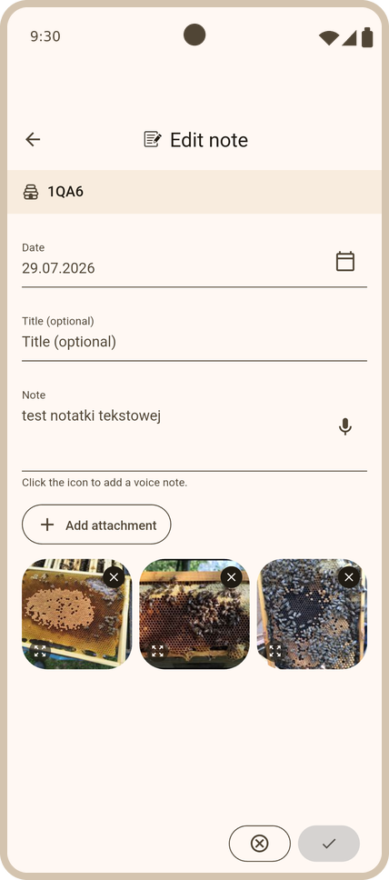{width=200}

- W widoku *Edycja notatki* można zaktualizować wartości dla następujących pól:

    - **Data** - kliknij w ikonę kalendarza i wybierz odpowiednią datę.
    - **Tytuł** - wpisz nowy tytuł w wyznaczone miejsce.
    - **Notatka** - zmień treść notatki - zmodyfikuj tekst lub usuń go i nagraj notatkę głosową.
    - Dodaj lub usuń zdjęcie/nagranie przy użyciu *+/X*.

- Po wprowadzeniu zmian należy kliknąć żółty przycisk umieszczony w prawym dolnym rogu, aby zapisać zmodyfikowaną notatkę.

#### 4.3 Usuwanie notatki

- W zakładce Pasieki (widok startowy po zalogowaniu do aplikacji Apisense) kliknij kafelek z pasieką. Po kliknięciu w kafelek zostanie wyświetlony widok Ule ().

Figure: Widok pasieki w zakładce Pasieki i widok Ule (1) {#fig-apiaries-apiary-with-beehive-4}

{width=200}

Figure: Widok pasieki w zakładce Pasieki i widok Ule (2) {#fig-beehives-8}

{width=200}

- Następnie kliknij w kafelek ula, z którego chcesz usunąć notatkę. W rezultacie zostanie wyświetlony widok Szczegóły ula ().

Figure: Widok Szczegóły ula {#fig-beehive-interior-7}

{width=200}

- W górnym menu kliknij *Więcej*, a następnie zakładkę *Notatki*, w wyniku czego zostanie otwarty widok z listą notatek przypisanych do wybranego ula ()

Figure: Notatka na liście notatek w ulu {#fig-beehive-details-note-3}

{width=200}

- Aby usunąć notatkę złap i przesuń wiersz z wybraną notatką w lewą stronę. W efekcie po prawej stronie w tym wierszu zostanie wyświetlony czerwony przycisk z ikoną kosza. Kliknij przycisk z ikoną kosza () oraz wybierz opcję *Usuń* na komunikacie, który zostanie wtedy wyświetlony żeby potwierdzić usunięcie notatki. 

Figure: Usuwanie notatki z listy notatek w ulu {#fig-beehive-details-remove-note}

{width=200}

### 5. Zadania

Zadania (kalendarz) pozwalają planować pracę w pasiece — przeglądy, podkarmianie, miodobrania, prace porządkowe. Każde zadanie ma datę, status (*Do zrobienia* / *Wykonane*) i **zakres** określający, których pasiek i uli dotyczy. Zadania można powtarzać (serie) oraz oznaczać jako wykonane w miarę realizacji.

#### 5.1 Czym jest zadanie

Każde zadanie zawiera następujące informacje:

- **Zadanie** — krótki opis/nazwa zadania, notatka kontekstowa (pole wymagane).
- **Data zadania** — kiedy zadanie ma być wykonane.
- **Status** — *Do zrobienia* (planowane) lub *Wykonane*. Uwaga: Status zadania można zmienić dopiero po dodaniu zadania do kalendarza.
- **Zakres** — czy zadanie dotyczy całej pasieki, wybranych uli, czy jednego ula (patrz [5.2 Zakres zadania](#52-zakres-zadania-gdzie-jest-widoczne-i-edytowalne)).
- **Powtarzanie** — opcjonalne; *Co tydzień*, *Co 2 tygodnie*, *Co miesiąc* lub *Co kwartał*, z datą końca serii (patrz [5.5 Powtarzanie zadań](#55-powtarzanie-zadan)).

#### 5.2 Zakres zadania (gdzie jest widoczne i edytowalne)

Zakres określa, gdzie zadanie jest widoczne oraz skąd można je edytować i usunąć.

| Zakres            | Widoczne w widoku pasieki | Widoczne w widokach uli       | Edytowalne z poziomu ula |
|-------------------|---------------------------|--------------------------------|--------------------------|
| Cała pasieka      | Tak                       | Tak — we wszystkich ulach      | Nie                      |
| Wybrane ule       | Tak                       | Tak — tylko w wybranych ulach  | Nie                      |
| Pojedynczy ul     | Tak                       | Tak — tylko w tym jednym ulu   | Tak                      |

!!! tip
    Zadania o zakresie *Cała pasieka* i *Wybrane ule* są edytowalne i usuwane wyłącznie z poziomu pasieki — z poziomu ula są dostępne tylko do podglądu. Zadanie utworzone dla pojedynczego ula można edytować i usunąć z poziomu tego ula, jak i z poziomu pasieki.

#### 5.3 Dodawanie zadania z poziomu pasieki

Z poziomu pasieki możesz utworzyć zadanie dla **całej pasieki** (Zakres: Pasieka), dla **wybranych uli** lub kilka zadań w serii.

- W zakładce *Pasieki* kliknij kafelek z pasieką, dla której chcesz dodać zadanie. Zostanie wyświetlony widok *Ule*.
- Z dolnego menu wybierz opcję *Dodaj...*, a następnie *Zadanie* (). Zostanie wyświetlony widok *Dodaj zadanie*.

Figure: Widok Dodaj zadanie z poziomu pasieki {#fig-apiary-add-task}

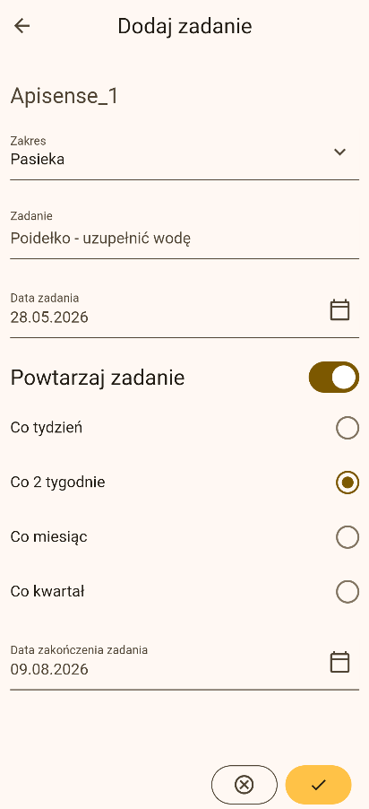{width=200}

- W widoku *Dodaj zadanie* wypełnij następujące pola:

    - **Zakres** — wybierz jedną z opcji:
        - *Pasieka* — zadanie pojawi się we wszystkich ulach tej pasieki.
        - *Wybrane ule* — po wyborze opcji zaznacz konkretne ule z listy.
    - **Zadanie** — wpisz treść zadania (np. *Przegląd wiosenny*).
    - **Data zadania** — wybierz datę zadania (domyślnie aktualna).    
    - **Powtarzanie** (opcjonalnie) — patrz [5.5 Powtarzanie zadań](#55-powtarzanie-zadan).

- Aby zapisać zadanie, kliknij żółty przycisk w prawym dolnym rogu ekranu. Zapisane zadanie pojawi się na liście zadań pasieki (zakładka *Zadania*) oraz we wszystkich ulach w tej pasiece (*Szczegóły ula > Więcej > Zadania*).

#### 5.4 Dodawanie zadania z poziomu ula

Zadanie dodane z poziomu ula będzie widoczne na liście zadań, zarówno w tym konkretnym ulu jak i w pasiece. Takie zadanie będzie można również edytować lub usunąć z obu tych poziomów - pasieki i ula. 

Aby dodać zadanie z poziomu ula:

- W zakładce *Pasieki* kliknij kafelek z pasieką, a następnie kafelek ula, dla którego chcesz dodać zadanie. Zostanie wyświetlony widok *Szczegóły ula*.
- Z dolnego menu wybierz opcję *Dodaj...*, a następnie *Zadanie* (). Zostanie wyświetlony widok *Dodaj zadanie*.

Figure: Widok Dodaj zadanie z poziomu ula {#fig-beehive-add-task}

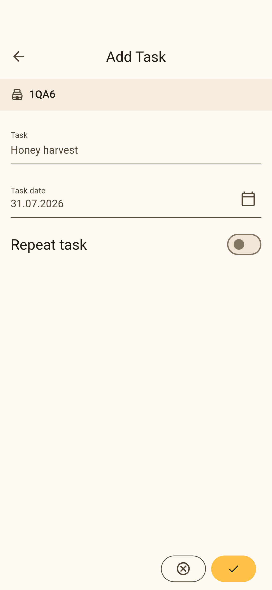{width=200}

- Uzupełnij pola **Zadanie** (wymagane), **Data zadania** oraz opcjonalnie zaznacz **Powtarzaj zadanie**. Brak wyboru zakresu — zadanie automatycznie dotyczy tego ula.
- Kliknij żółty przycisk zapisu w prawym dolnym rogu.

#### 5.5 Powtarzanie zadań

Zadanie można skonfigurować jako powtarzające się (). W sekcji *Powtarzaj zadanie* w widoku *Dodaj zadanie* wybierz:

- **Częstotliwość** — *Co tydzień*, *Co 2 tygodnie*, *Co miesiąc* lub *Co kwartał*.
- **Data zakończenia zadania** — maksymalnie 1 rok od daty pierwszego zadania.

Aplikacja utworzy osobne wystąpienia zadania zgodnie z wybraną częstotliwością (np. co tydzień) w podanym zakresie dat. Każde wystąpienie jest niezależnym zadaniem i może być edytowane lub usunięte osobno.

Figure: Utworzenie cyklicznego zadania {#fig-task-series-apply-to}

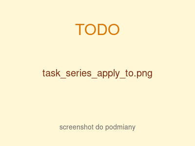{width=200}

#### 5.6 Oznaczanie zadania jako wykonane

- Otwórz listę zadań w zakładce *Zadania* (z poziomu pasieki lub ula).
- Przy wybranym zadaniu kliknij ikonę zaznaczenia / przycisk *Wykonane* (). Status zmieni się z *Do zrobienia* na *Wykonane*.

Figure: Oznaczanie zadania jako wykonane {#fig-task-mark-done}

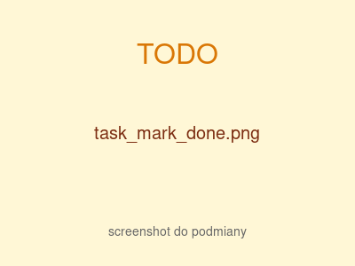{width=200}

!!! note
    Z poziomu pasieki można oznaczyć dowolne zadanie jako wykonane. Z poziomu ula można oznaczyć jako wykonane wyłącznie zadanie, które zostało dodane z poziomu tego konkretnego ula.

#### 5.7 Edycja zadania

- Na liście zadań przy wybranym zadaniu kliknij ikonę ołówka, aby otworzyć widok *Edycja zadania* ().
- Zaktualizuj pola: **Zadanie**, **Data zadania**, **Powtarzaj zadanie**.
- Dla zadania powtarzającego się wybierz częstotliwość (np. *Co miesiąc*) oraz uzupełnij *Datę zakończenia zadania* (patrz [5.5 Powtarzanie zadań](#55-powtarzanie-zadan)).
- Zapisz zmiany żółtym przyciskiem w prawym dolnym rogu.

Figure: Edycja zadania {#fig-task-edit}

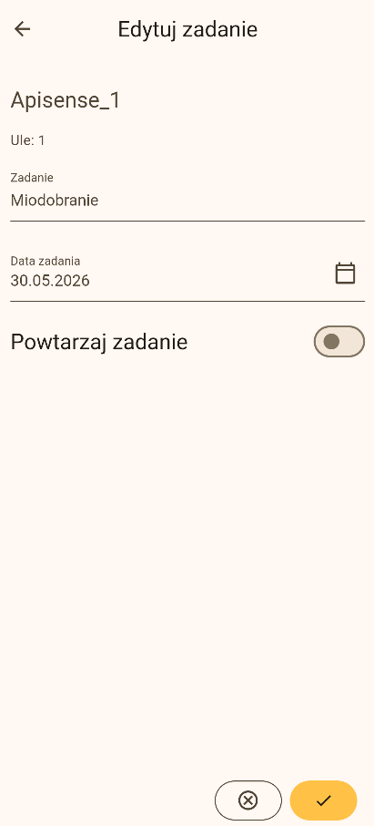{width=200}

!!! note
    Zadania o zakresie *Pasieka* lub *Wybrane ule* można edytować i usuwać **wyłącznie z poziomu pasieki**. Z poziomu ula zobaczysz takie zadanie tylko jako podgląd — z wyszarzona ikoną ołówka.

#### 5.8 Usuwanie zadania

- Na liście zadań przesuń wiersz z wybranym zadaniem w lewą stronę ().
- Aby usunąć wybrane zadanie kliknij ikonę kosza na czerwonym tle.

Figure: Usuwanie zadania {#fig-task-delete}

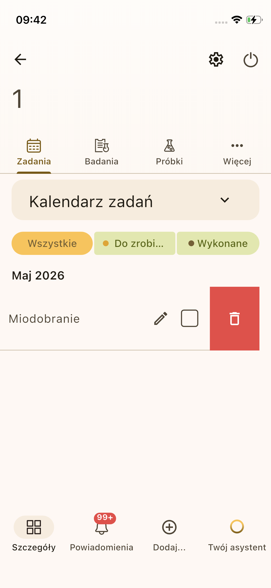{width=200}

!!! note
    Zadania o zakresie *Pasieka* lub *Wybrane ule* można edytować i usuwać **wyłącznie z poziomu pasieki**. Usunięcie takiego zadania z poziomu pasieki spowoduje automatyczne usunięcie powiązanych z nim zadań z widoku wszystkich uli.

#### 5.9 Lista zadań i filtrowanie

Listę zadań znajdziesz w zakładce *Zadania*:

- **Z poziomu pasieki** — wyświetla wszystkie zadania pasieki: o zakresie *Pasieka*, *Wybrane ule* oraz zadania pojedynczych uli należących do tej pasieki ().

Figure: Lista zadań w widoku pasieki {#fig-apiary-tasks-list}

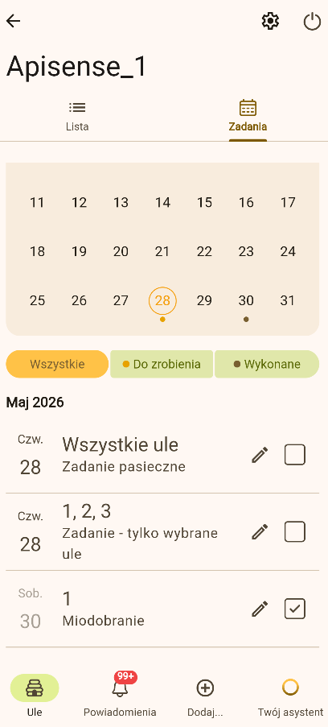{width=200}

- **Z poziomu ula** — wyświetla zadania widoczne w tym ulu: zadania o zakresie *Pasieka*, zadania *Wybrane ule* obejmujące ten ul, oraz zadania *Pojedynczy ul* dla tego ula ().

Figure: Lista zadań w widoku ula {#fig-beehive-tasks-list}

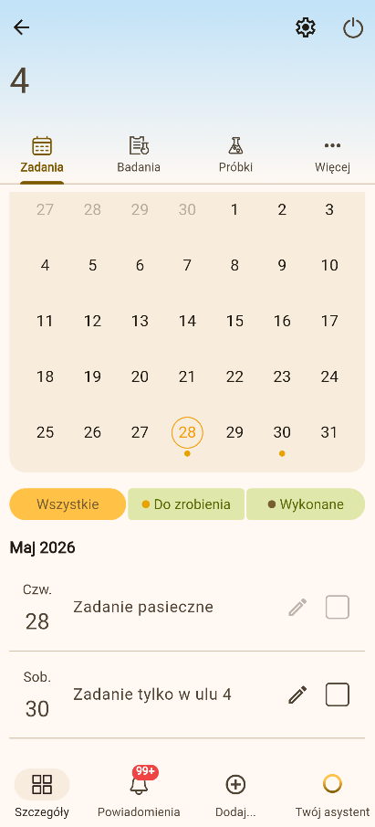{width=200}

Listę zadań możesz filtrować po statusie. Dostępne są dwa filtry: *Do zrobienia* i *Wykonane*. Kliknięcie aktywnego filtru wyłącza go i przywraca pełną listę.

### 6. Obserwacja szerszenia azjatyckiego

Ikona szerszenia azjatyckiego, znajdująca się na kafelku pasieki obok wskaźnika stanu zdrowia rodziny pszczelej, umożliwia zgłaszanie oraz przeglądanie obserwacji szerszenia azjatyckiego. Pozwala na bieżąco monitorować jego aktywność w pasiekach i szybciej reagować na potencjalne zagrożenie dla rodzin pszczelich. **Uwaga:** Obserwacje może zgłaszać wyłącznie właściciel pasieki. W pasiece udostępnionej pozostali użytkownicy mają dostęp wyłącznie do podglądu zgłoszeń.

#### 6.1 Zgłaszanie obserwacji

- Kliknij ikonę szerszenia azjatyckiego na kafelku pasieki w wyniku czego zostanie otwarty panel *Szerszeń azjatycki*.
- W panelu *Szerszeń azjatycki* kliknij żółty przycisk *Zgłoś obserwację*, a następnie odpowiedz na pytanie *Czy widzisz teraz szerszenia azjatyckiego?*.
- Odpowiedź **Nie** zapisuje zgłoszenie od razu — zobaczysz komunikat *Zgłoszenie zapisane*.
- Odpowiedź **Tak** otwiera dodatkowy formularz zgłoszenia:

    - **karta gatunku** - u góry formularza, z nazwą *Szerszeń azjatycki* i nazwą łacińską *Vespa velutina*;
    - **Data obserwacji** - domyślnie dzisiejsza; kliknij pole i wybierz inną datę z kalendarza;
    - **Liczba osobników** - **pole wymagane**, minimum 1. Bez niego nie da się wysłać zgłoszenia — aplikacja pokaże błąd *Podaj liczbę osobników (min. 1)*;
    - **Zdjęcia (opcjonalnie)** - możesz dołączyć do 10 zdjęć. Formularz ostrzega: *Uwaga: szerszeń azjatycki może użądlić — zachowaj ostrożność podczas robienia zdjęć.*

- Zgłoszenie wysyłasz przyciskiem *Wyślij zgłoszenie*. Po zapisaniu zobaczysz komunikat *Zgłoszenie zapisane*, a jeśli dołączyłeś zdjęcia — *Zgłoszenie zapisane, zdjęcia wysyłamy w tle*.

#### 6.2 Status obserwacji i jej aktualność

Ikona szerszenia azjatyckiego wyświetlana na kafelku pasieki zmienia się w zależności od aktualnego statusu zgłoszenia:

- **Brak obserwacji** — nigdy nie dodano zgłoszenia. Ikona z wyszarzoną głową szerszenia azjatyckiego, bez daty i dodatkowej plakietki.
- **Szerszeń azjatycki - Aktywna obserwacja** — potwierdzono obecność szerszeni azjatyckich i zgłoszenie jest wciąż aktualne (do 4 dni od dodania zgłoszenia). Ikona z brązową głową szerszenia azjatyckiego wraz z czerwoną plakietką „!”.
- **Szerszeń azjatycki - Ostatnio widziano** — potwierdzono obecność szerszeni azjatyckich, ale minęły już 4 dni od dodania zgłoszenia — sprawdź ponownie i zgłoś aktualny stan. Ikona z wyszarzoną głową szerszenia azjatyckiego i plakietką „!” na ciemnym tle. 
- **Sprawdzono, czysto; aktualna obserwacja** — aktualne zgłoszenie (do 4 dni od dodania zgłoszenia) potwierdzające brak szerszeni azjatyckich w pasiece. Ikona z brązową głową szerszenia azjatyckiego wraz z zieloną plakietką z symbolem zatwierdzenia nieobecności.
- **Sprawdzono, czysto; wygasła obserwacja** — potwierdzono brak szerszeni azjatyckich w pasiece, ale minęły już 4 dni od dodania zgłoszenia. Ikona z wyszarzoną głową szerszenia azjatyckiego wraz z plakietką z symbolem zatwierdzenia nieobecności na ciemnym tle. 

#### 6.3 Cofanie zgłoszenia

Jeśli zgłoszenie powstało przez pomyłkę (przypadkowe kliknięcie), kliknij ponownie w ikonę szerszenia azjatyckiego widoczną na kafelku pasieki, a następnie kliknij *Cofnij zgłoszenie*. Potwierdź wybór czerwonym przyciskiem *Cofnij zgłoszenie* wyświetlanym na komunikacie, który się wtedy pojawi. Spowoduje to całkowite usunięcie zgłoszenia z historii.

!!! note
    Opcji *Cofnij zgłoszenie* używaj tylko dla omyłkowego zgłoszenia. Jeśli szerszenie po prostu zniknęły, nie cofaj zgłoszenia obserwacji — zamiast tego dodaj nowe zgłoszenie i odpowiedz *Nie*, aby zachować historię obserwacji.

#### 6.4 Przypomnienia o obserwacji

Jeśli od ostatniego zgłoszenia szerszenia azjatyckiego dla jednej lub kilku Twoich pasiek minęły 4 dni, aplikacja wyświetli *Przypomnienie o obserwacji* z prośbą o zapisanie aktualnego stanu, aby dane pozostały wiarygodne. Możesz zareagować od razu lub odłożyć przypomnienie przyciskiem *Później*.

______________________________________________________________________

## Zdrowie rodziny

Ten rozdział zbiera wszystko, co dotyczy kondycji rodziny pszczelej: automatyczne alerty chorobowe wraz z formularzem zwrotnym, rekomendacje przygotowane przez system, a także badania i próbki, które wykonujesz samodzielnie, oraz analizę zdjęć ramek w FrameSense.

### 1. Alerty chorobowe

Gdy system Apisense Pro AI zgłosi zagrożenie (np. Nosemoza), w aplikacji pojawią się **alarmy** w zakładce *Powiadomienia* z opisem i zaleceniami. Wypełniając **formularz chorobowy** (*Odpowiedz na kilka pytań*), przekazujesz systemowi informację zwrotną i pomagasz dopasować komunikaty do rzeczywistych warunków w Twojej pasiece.

#### 1.1 Co oznaczają alerty o chorobach?

Alerty w zakładce *Powiadomienia* > *Problemy*, jak i w widoku ula (*Szczegóły* > zakładka *Stan ula* > sekcja *Zdrowie* > wiersz *Rodzina*) dotyczą **chorób wykrytych automatycznie przez model sztucznej inteligencji** Apisense Pro AI na podstawie danych z czujników i analizy systemowej. To nie jest diagnoza weterynaryjna — system sygnalizuje **prawdopodobne** zagrożenie (np. Warroza, Nosemoza, Zgnilec), wraz z poziomem porażenia i zalecanymi działaniami, które zobaczysz po kliknięciu wiersza z chorobą w zakładce *Problemy* — otworzy się wtedy osobny widok ze szczegółami epizodu.

Na kafelkach pasieki/ula alerty chorobowe objawiają się m.in. jako status **Zagrożony**/**nazwa wykrytej choroby** (czasem z oznaczeniem „+N”, gdy w ulu wykryto więcej niż jedno zagrożenie).

Model posiada **bardzo wysoką dokładność**, jednak — jak każda analiza predykcyjna — **może się czasem mylić**. Dlatego warto taki alert zweryfikować w terenie i uzupełnić **formularz chorobowy** (zakładka *Problemy > Szczegóły choroby > Odpowiedz na kilka pytań*). Wypełnienie formularza jest bardzo ważne, ponieważ zebrane odpowiedzi pomagają w dalszym doskonaleniu modelu i zwiększaniu skuteczności wykrywania chorób. Dzięki informacjom zwrotnym system może lepiej rozpoznawać rzeczywiste przypadki oraz ograniczać liczbę fałszywych alarmów.

Warto również pamiętać, że model potrafi wykrywać oznaki choroby na bardzo wczesnym etapie rozwoju, kiedy symptomy mogą być jeszcze niewidoczne lub trudne do zauważenia podczas standardowej obserwacji. Dlatego nawet jeśli na pierwszy rzut oka nie widać wyraźnych objawów, warto sprawdzić wskazany w alercie ul i przekazać informację zwrotną poprzez formularz.

#### 1.2 Co zrobić gdy choroba nie występuje w ulu

Jeśli po wizycie w pasiece uznasz, że **choroba faktycznie nie występuje** w danym ulu:

1. Wejdź w szczegóły alertu (zakładka *Powiadomienia* > *Problemy* > wiersz z chorobą).
2. Kliknij *Odpowiedz na kilka pytań*.
3. Na pytania dotyczące obecności objawów odpowiedz **Nie** (do każdego pytania możesz też dołączyć zdjęcia z przeglądu).
4. Prześlij formularz klikając przycisk *Zapisz*.

Twoje odpowiedzi pomagają systemowi lepiej dopasować przyszłe komunikaty do warunków w Twojej pasiece. Kwestionariusz dla tego samego epizodu choroby możesz wypełnić ponownie po **48 godzinach** — do tego czasu aplikacja wyświetla komunikat *Możesz ponownie wypełnić kwestionariusz dla tego epizodu za 48 godzin*.

Opcja **Pomiń** pozwala przejść dalej bez odpowiedzi na dane pytanie — formularz i tak warto uzupełnić choćby częściowo, w szczególności gdy masz wątpliwości co do alertu.

#### 1.3 Wypełnianie formularza chorobowego z poziomu pasieki

- W zakładce Pasieki (widok startowy po zalogowaniu do aplikacji Apisense) kliknij kafelek z pasieką, w której wykryto zagrożenie (czerwona ikonka z pszczołą i napisem *Zagrożony* na kafelku z pasieką). Po kliknięciu w kafelek zostanie wyświetlony widok Ule ().

Figure: Widok pasieki z zagrożeniem w zakładce Pasieki i widok Ule (1) {#fig-apiaries-apiary-with-problem}

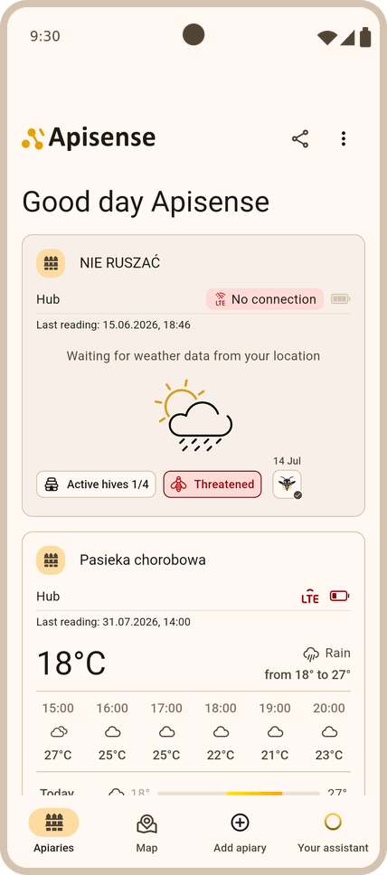{width=200}

Figure: Widok pasieki z zagrożeniem w zakładce Pasieki i widok Ule (2) {#fig-beehives-beehive-with-problem-2}

{width=200}

- Następnie wybierz zakładkę *Powiadomienia* z dolnego menu. W efekcie zostanie wyświetlona zakładka *Problemy*, a w niej lista problemów wykrytych w tej pasiece (choroby ze wszystkich uli, ). Listę przełączasz filtrem *Aktywne* / *Zakończone* nad nią.

Figure: Zakładka Problemy {#fig-problems-tab}

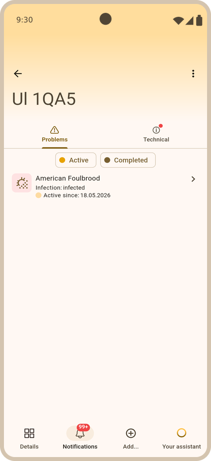{width=200}

- Przejdź do szczegółów wykrytej choroby, klikając na wiersz z chorobą np. Zgnilec amerykański (). Szczegóły otwierają się jako osobny widok, domyślnie na liście rekomendacji: zobaczysz numer ula, poziom porażenia, czas trwania epizodu, sekcję *Rekomendacje* z listą zalecanych działań oraz przycisk *Odpowiedz na kilka pytań*. Wcześniej wypełnione formularze znajdziesz w zakładce *Odpowiedzi*.

Figure: Formularz chorobowy - szczegóły choroby {#fig-problems-tab-disease-details}

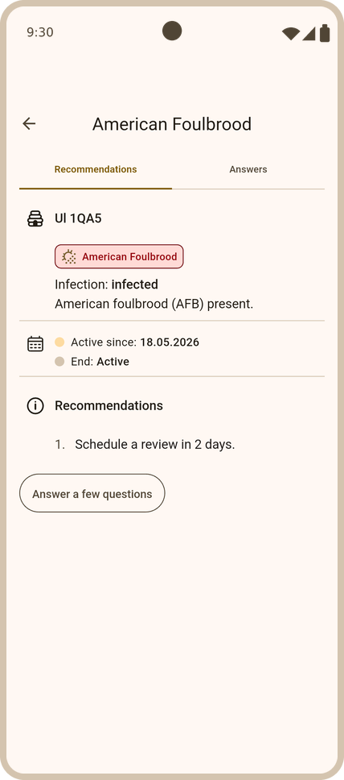{width=200}

- Aby wypełnić formularz chorobowy dotyczący alertu wykrytego przez system, kliknij przycisk *Odpowiedz na kilka pytań*. Po kliknięciu w przycisk zostanie wyświetlony widok *Odpowiedz na kilka pytań* (). Następnie odpowiedz na wszystkie pytania, wybierając jedną z dostępnych opcji: **Tak**, **Nie** lub **Pomiń** — w zależności od tego, co zaobserwowałeś w ulu.

Figure: Formularz chorobowy - przykładowe pytanie {#fig-confirm-problem-questions}

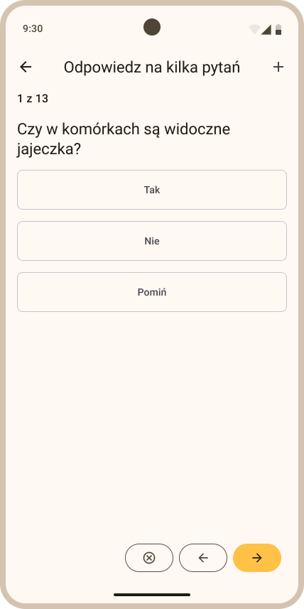{width=200}

- Do odpowiedzi na poszczególne pytania możesz również załączyć zdjęcia lub nagrania. W tym celu kliknij przycisk *Dodaj zdjęcie/nagranie* (z ikoną plusa), znajdujący się pod opcjami *Tak / Nie / Pomiń* (). Pod przyciskiem widnieje adnotacja *Dodanie zdjęcia lub nagrania jest opcjonalne*.

Figure: Formularz chorobowy - załączanie zdjęć i nagrań {#fig-confirm-problem-add-photos}

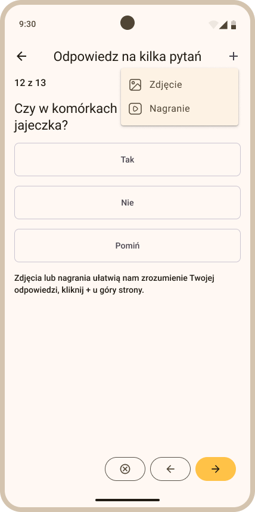{width=200}

- Aby przejść do kolejnego pytania, kliknij ikonkę żółtej strzałki skierowanej w prawo, znajdującą się w prawym dolnym rogu ekranu.

- Aby zapisać odpowiedzi i przesłać formularz, kliknij żółty przycisk *Zapisz*, umieszczony w prawym dolnym rogu ostatniego ekranu widoku *Odpowiedz na kilka pytań* ().

Figure: Formularz chorobowy - zapisanie formularza {#fig-confirm-problem-save}

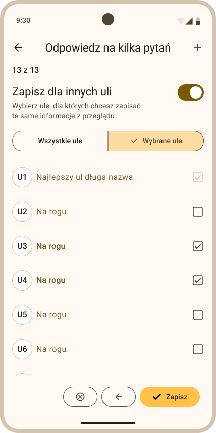{width=200}

#### 1.4 Wypełnianie formularza chorobowego z poziomu ula

  <iframe src="https://www.youtube.com/embed/iGNXm9qu8X8"
          title="Apisense Manual PL — 08 · Formularz chorobowy w ulu"
          allow="accelerometer; clipboard-write; encrypted-media; gyroscope; picture-in-picture; web-share"
          allowfullscreen></iframe>

- W zakładce Pasieki (widok startowy po zalogowaniu do aplikacji Apisense) kliknij kafelek z pasieką, w której wykryto zagrożenie (czerwona ikonka z pszczołą i napisem *Zagrożony* na kafelku z pasieką). Po kliknięciu w kafelek zostanie wyświetlony widok Ule ().

Figure: Widok pasieki z zagrożeniem w zakładce Pasieki i widok Ule (1) {#fig-apiaries-apiary-with-problem-2}

{width=200}

Figure: Widok pasieki z zagrożeniem w zakładce Pasieki i widok Ule (2) {#fig-beehives-beehive-with-problem-3}

{width=200}

- Kliknij w kafelek z ulem, w którym wykryto zagrożenie. Po kliknięciu w kafelek zostanie otwarta zakładka *Szczegóły* ula ().

Figure: Zakładka Szczegóły ula - ul z wykrytym zagrożeniem {#fig-beehive-details-with-problems}

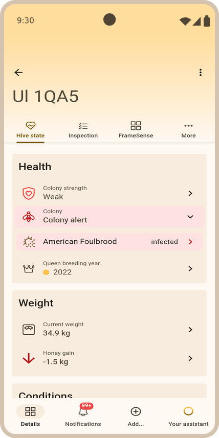{width=200}

- Następnie wybierz zakładkę *Powiadomienia* z dolnego menu. W efekcie zostanie wyświetlona zakładka *Problemy*, a w niej lista problemów wykrytych tylko w tym ulu (). Listę przełączasz filtrem *Aktywne* / *Zakończone* nad nią.

Figure: Zakładka Problemy na poziomie pojedynczego ula {#fig-beehive-details-problems-tab}

{width=200}

- Przejdź do szczegółów wykrytej choroby, klikając na wiersz z chorobą np. Zgnilec amerykański (). Szczegóły otwierają się jako osobny widok, domyślnie na liście rekomendacji: zobaczysz numer ula, poziom porażenia, czas trwania epizodu, sekcję *Rekomendacje* z listą zalecanych działań oraz przycisk *Odpowiedz na kilka pytań*. Wcześniej wypełnione formularze znajdziesz w zakładce *Odpowiedzi*.

Figure: Formularz chorobowy - szczegóły choroby {#fig-problems-tab-disease-details-2}

{width=200}

- Aby wypełnić formularz chorobowy dotyczący alertu wykrytego przez system, kliknij przycisk *Odpowiedz na kilka pytań*. Po kliknięciu w przycisk zostanie wyświetlony widok *Odpowiedz na kilka pytań* (). Następnie odpowiedz na wszystkie pytania, wybierając jedną z dostępnych opcji: **Tak**, **Nie** lub **Pomiń**.

Figure: Formularz chorobowy - przykładowe pytanie {#fig-confirm-problem-questions-2}

{width=200}

- Do odpowiedzi na poszczególne pytania możesz również załączyć zdjęcia lub nagrania. W tym celu kliknij przycisk *Dodaj zdjęcie/nagranie* (z ikoną plusa), znajdujący się pod opcjami *Tak / Nie / Pomiń* ().

Figure: Formularz chorobowy - załączanie zdjęć i nagrań {#fig-confirm-problem-add-photos-2}

{width=200}

- Aby przejść do kolejnego pytania, kliknij ikonkę żółtej strzałki skierowanej w prawo, znajdującą się w prawym dolnym rogu ekranu.

- Aby zapisać odpowiedzi i przesłać formularz, kliknij żółty przycisk *Zapisz*, umieszczony w prawym dolnym rogu ostatniego ekranu widoku *Odpowiedz na kilka pytań* ().

Figure: Formularz chorobowy - zapisanie formularza {#fig-confirm-problem-save-2}

{width=200}

#### 1.5 Edycja lub usuwanie zapisanej odpowiedzi

Zapisaną odpowiedź w formularzu chorobowym można poprawić przez ograniczony czas od zapisania:

- W zakładce *Odpowiedzi* w widoku szczegółów choroby znajdź wybraną odpowiedź. Kliknij ikonę ołówka, aby edytować udzielone odpowiedzi, lub ikonę kosza, aby usunąć wypełniony formularz. Te same opcje są dostępne również z poziomu widoku formularza — otwórz menu kontekstowe (trzy kropki) i wybierz *Edytuj* lub *Usuń*.
- Po wybraniu opcji *Usuń* potwierdź komunikat *Usunąć odpowiedzi?*. Formularz wraz z odpowiedziami zostanie trwale usunięty.
- **Uwaga:** Odpowiedzi można edytować przez 30 dni od ich przesłania. Po upływie tego czasu edycja lub usunięcie formularza nie będzie już możliwe, a aplikacja wyświetli komunikat: Czas na korektę tej odpowiedzi minął — dodaj nową odpowiedź. Jeśli epizod chorobowy jest nadal aktywny, możesz przesłać nowy zestaw odpowiedzi, korzystając z przycisku *Odpowiedz na kilka pytań*.

### 2. Rekomendacje

Rekomendacje to konkretne działania, które system podpowiada na podstawie danych z czujników, Twoich obserwacji i analizy AI. Nie są osobną zakładką w menu — pojawiają się tam, gdzie system wykrył coś, co wymaga reakcji.

#### 2.1 Rekomendacje przy wykrytej chorobie

- Otwórz szczegóły choroby: zakładka *Powiadomienia* (dolne menu) > *Problemy* > wiersz z chorobą. Szczegóły otwierają się jako osobny widok.
- Widok otwiera się domyślnie na liście rekomendacji. U góry zobaczysz numer ula, nazwę choroby, poziom porażenia i czas trwania epizodu, a pod nimi sekcję *Rekomendacje* z ponumerowaną listą zalecanych działań.
- Pod listą znajduje się przycisk *Odpowiedz na kilka pytań* — to wejście do formularza chorobowego (patrz [1. Alerty chorobowe](#1-alerty-chorobowe)).
- Druga zakładka, *Odpowiedzi*, zawiera formularze, które już wypełniłeś dla tego epizodu.

!!! note
    W pasiece udostępnionej Ci w trybie tylko do odczytu zakładki nie są widoczne — zobaczysz same rekomendacje, bez możliwości wypełnienia formularza.

#### 2.2 Rekomendacje po analizie ramki (FrameSense)

Po zakończonej analizie zdjęcia ramki, pod wynikami znajduje się sekcja *Rekomendacje* z praktycznymi wskazówkami opracowanymi na podstawie tego, co model rozpoznał na plastrze. Szczegóły w [5. FrameSense](#5-framesense).

!!! warning
    Rekomendacje są podpowiedzią, nie zaleceniem lekarsko-weterynaryjnym. Decyzję o leczeniu podejmij po sprawdzeniu ula, a wynik obserwacji przekaż systemowi przez formularz chorobowy — to poprawia trafność kolejnych alertów.

### 3. Próbki

  <iframe src="https://www.youtube.com/embed/jqS9rvhd-X0"
          title="Apisense Manual PL — 07 · Zarejestruj próbkę"
          allow="accelerometer; clipboard-write; encrypted-media; gyroscope; picture-in-picture; web-share"
          allowfullscreen></iframe>

#### 3.1 Rejestrowanie próbki

- W zakładce Pasieki (widok startowy po zalogowaniu do aplikacji Apisense) kliknij kafelek z pasieką. Po kliknięciu w kafelek zostanie wyświetlony widok Ule ().

Figure: Widok pasieki w zakładce Pasieki i widok Ule (1) {#fig-apiaries-apiary-with-beehive-5}

{width=200}

Figure: Widok pasieki w zakładce Pasieki i widok Ule (2) {#fig-beehives-9}

{width=200}

- Następnie kliknij w kafelek ula, dla którego chcesz zarejestrować próbkę. W rezultacie zostanie wyświetlony widok Szczegóły ula ().

Figure: Widok Szczegóły ula {#fig-beehive-interior-8}

{width=200}

- Aby zarejestrować próbkę, należy z dolnego menu wybrać opcję *Dodaj...*, a następnie *Zarejestruj próbkę* (), w wyniku czego zostanie wyświetlony widok Zarejestruj próbkę (). **Uwaga:** opcja *Zarejestruj próbkę* jest dostępna tylko dla uli z powiązanym urządzeniem Apisense VitalSensor.

Figure: Przycisk Zarejestruj próbkę {#fig-add-overview-button-3}

{width=200}

- W widoku Zarejestruj próbkę należy uzupełnić następujące pola:

  - **Data pobrania próbki** - wprowadź datę, kiedy pobrałeś próbkę (domyślnie aktualna).
  - **Rodzaj badania** - wybierz odpowiednią pozycję z listy rozwijanej np. *Martwe pszczoły*.

- Po uzupełnieniu powyższych pól zostanie wyświetlony żółty przycisk *Wygeneruj kod*. Kliknij wspomniany przycisk a w polu *Kod badania* zostanie wygernerowany specjalny kod, który należy zapisać na próbce (). Tak przygotowaną próbkę z kodem należy następnie wysłać na adres podany w aplikacji pod kodem: **Maciej Bryś, Uniwersytet Przyrodniczy w Lublinie, ul. Doświadczalna 54, 20-280 Lublin**.

Figure: Widok Zarejestruj próbkę {#fig-register-sample}

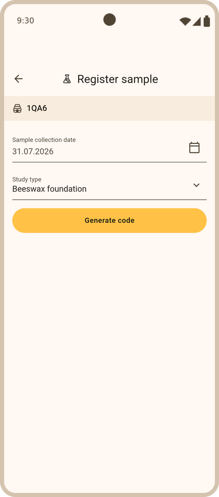{width=200}

!!! note "Przechowywanie próbek w zamrażarce — tylko badania na Nosemę"
    **Zamrażanie pszczół jest dopuszczalne wyłącznie** w przypadku badań na *Nosemę*.

    - Każda zamrożona próbka musi być **czytelnie i jednoznacznie opisana**, tak aby można było ustalić, z którego ula pochodzi (np. kod badania z aplikacji zapisany na kopercie).
    - Temperatura przechowywania: **co najmniej −8 °C**.
    - Próbki można przechowywać w zamrażarce przez około **3–5 miesięcy** przed wykonaniem badania lub wysłaniem do laboratorium.
    - Próbek **nie wolno rozmrażać i zamrażać ponownie**.

!!! tip "Jak wykonać badanie samodzielnie?"
    Szczegółowe instrukcje pobierania próbek i wykonywania badań (mikroskopia *Nosema*, flotacja na *Varroa*) znajdziesz w sekcji [Badania](../procedures/index.md).

!!! tip "Wysyłka żywych pszczół"
    Próbki żywych pszczół wysyłaj **żywe**, w wentylowanych klateczkach transportowych zapewniających dostęp powietrza, z ciastem cukrowym (ok. 10 pszczół w każdej, 4 klateczki na ul), z kodem badania z aplikacji. Nadawaj **od poniedziałku do czwartku** — Pocztą Polską lub kurierem. Przesyłki za pośrednictwem Poczty Polskiej mogą być nadawane wyłącznie przez właścicieli pasiek zlokalizowanych w Polsce. Szczegóły: [Protokół 2 — żywe pszczoły](../samples/protocol-2-live-bees.md).

#### 3.2 Status próbki

Każda zarejestrowana próbka ma etykietę statusu opisującą, na jakim etapie badania się znajduje:

- **Oczekuje** — próbka została zarejestrowana w aplikacji, ale nie została jeszcze wysłana ani odebrana przez laboratorium.
- **Wysłana** — próbka została wysłana do laboratorium.
- **Odebrana** — laboratorium potwierdziło odbiór próbki.
- **Przeanalizowana** — badanie próbek w laboratorium zostało zakończone.
- **Anulowana** — próbka została anulowana.

#### 3.3 Usuwanie próbki

Usunąć można **wyłącznie próbkę w statusie *Oczekuje***, czyli taką, która nie została jeszcze wysłana. Przy próbkach ze statusem *Wysłana*, *Odebrana*, *Przeanalizowana* i *Anulowana* opcja usuwania w ogóle się nie pojawia — ani ikona kosza na liście, ani pozycja *Usuń* w szczegółach próbki.

Aby usunąć próbkę oczekującą:

- Przejść do listy próbek (*Szczegóły ula > Więcej > Próbki*).
- Kliknąć ikonę czerwonego kosza przy próbce albo przesunąć jej wiersz w lewo i kliknąć wyświetlony kosz. To samo zrobisz z poziomu szczegółów próbki — menu ⋮ w prawym górnym rogu, opcja *Usuń*.
- Potwierdzić operację przyciskiem *Usuń*. Po kliknięciu wspomnianego przycisku próbka zostanie trwale usunięta i nie będzie można już cofnąć tej operacji.
    
### 4. Badania

#### 4.1 Dodawanie badania

- W zakładce Pasieki (widok startowy po zalogowaniu do aplikacji Apisense) kliknij kafelek z pasieką. Po kliknięciu w kafelek zostanie wyświetlony widok Ule ().

Figure: Widok pasieki w zakładce Pasieki i widok Ule (1) {#fig-apiaries-apiary-with-beehive-6}

{width=200}

Figure: Widok pasieki w zakładce Pasieki i widok Ule (2) {#fig-beehives-10}

{width=200}

- Następnie kliknij w kafelek ula, dla którego chcesz dodać badanie. W rezultacie zostanie wyświetlony widok Szczegóły ula ().

Figure: Widok Szczegóły ula {#fig-beehive-interior-9}

{width=200}

- Aby dodać badanie, należy z dolnego menu wybrać opcję *Dodaj...*, a następnie *Badanie* (), w wyniku czego zostanie wyświetlony widok Dodaj badanie (). 

Figure: Przycisk Dodaj badanie {#fig-add-examination-button}

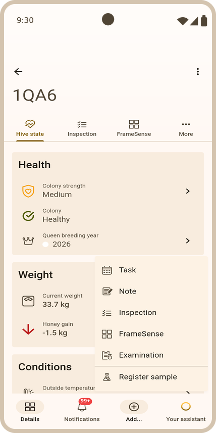{width=200}

- W widoku Dodaj badanie () uzupełnij następujące pola:

    - **Data badania** — wybierz datę wykonania badania.
    - **Rodzaj badania** — wybierz z listy rozwijanej jedną z dostępnych opcji np. Osyp.
    - **Zdjęcia i informacje uzupełniające** — po wyborze rodzaju badania wykonaj lub wgraj wymaganą liczbę zdjęć oraz uzupełnij pola liczbowe (np. liczba roztoczy warrozy) zgodnie z komunikatami na ekranie.

Figure: Widok Dodaj badanie, rodzaj: Flotacja {#fig-add-examination}

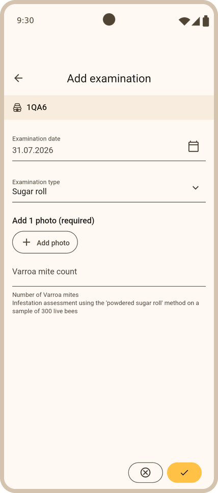{width=200}

- Zapisz badanie, korzystając z żółtego przycisku zapisu umieszczonego w prawej, dolnej części ekranu. Zapisane badanie zostanie wyświetlone na liście badań w zakładce Szczegóły ula > Więcej (górne menu) > Badania ().

Figure: Zapisane badanie na liście badań w ulu {#fig-add-examination-list}

{width=200}

#### 4.2 Edycja badania

Aby dokonać edycji badania:

- Na liście badań (*Szczegóły ula > Więcej > Badania*) kliknij ikonę ołówka lub na ekranie szczegółów badania otwórz menu dodatkowe (trzy kropki w prawym górnym rogu) i wybierz opcję *Edytuj*. W rezultacie zostanie otwarty widok *Edytuj badanie* z wypełnionymi wcześniej danymi. 
- W widoku *Edytuj badanie* możesz zaktualizować wszystkie pola, poza rodzajem badania.
- Aby zaktualizować zdjęcie należy najpierw usunąć zdjęcie klikając przycisk *"X"* umieszczony na miniaturze zdjęcia, a następnie dodać nowe zdjęcie przy użyciu przycisku *Dodaj zdjęcie*.
- Aby zapisać wprowadzone zmiany należy kliknąć żółty przycisk potwierdzenia, znajdujący się w prawym dolnym rogu.

#### 4.3 Usuwanie badania

Aby usunąć badanie z listy badań należy:

- Przejść do listy badań (*Szczegóły ula > Więcej > Badania*).
- Kliknąć ikonę czerwonego kosza przy badaniu, które ma zostać usunięte z listy lub w szczegółach wybranego badania kliknąć opcję *Usuń*, dostępną z dodatkowego menu (trzy kropki w prawym górnym rogu).
- Potwierdzić operację przyciskiem *Usuń*. Po kliknięciu wspomnianego przycisku badanie zostanie trwale usunięte i nie będzie można już cofnąć tej operacji.

### 5. FrameSense

FrameSense wykorzystuje sztuczną inteligencję, aby na podstawie jednego zdjęcia automatycznie oszacować zawartość plastra, w tym udział czerwiu, zapasów pokarmu oraz pustej lub zasłoniętej powierzchni.

#### 5.1 Dodawanie analizy ramki

- Kliknij kafelek wybranej pasieki, a następnie kafelek wybranego ula. W rezultacie zostanie wyświetlony widok *Szczegóły ula*.
- Z dolnego menu wybierz opcję *Dodaj...*, a następnie *FrameSense*; zostanie wyświetlony widok *FrameSense*.
- Kliknij przycisk *Dodaj zdjęcie ramki do analizy*, znajdujący się w centralnej części widoku *FrameSense*. Wybierz opcje *Aparat* i wykonaj zdjęcie ramki pszczelej lub wgraj **jedno zdjęcie** ramki z *Galerii*. Podczas wykonywania zdjęcia w widoku aparatu wyświetlana jest prowadnica z komunikatem *Umieść ramkę w obrysie*. Ustaw całą ramkę pszczelą wewnątrz wyznaczonego obrysu. Po wykonaniu zdjęcia aplikacja automatycznie przytnie je do obszaru wyznaczonego przez prowadnicę, dzięki czemu do analizy zostanie wykorzystany wyłącznie fragment obejmujący ramkę. Aby uzyskać jak najdokładniejszy wynik analizy AI, ustaw ramkę tak, aby zajmowała możliwie największą powierzchnię wewnątrz obrysu, nie wychodząc poza jego granice. Zadbaj również o to, aby była dobrze widoczna i znajdowała się na jednolitym tle.
- Po wybraniu zdjęcia kliknij żółty przycisk *Wyślij do analizy*, widoczny w dolnej części ekranu. Zdjęcie zostanie przesłane do przetworzenia przez AI.

!!! note
    Analiza ramki pszczelej wymaga połączenia z internetem do przesłania zdjęcia. Przetwarzanie zdjęcia wysłanego do analizy trwa zwykle kilka minut. Zalecamy załączanie zdjęć w formacie JPG lub PNG. Pliki RAW/DNG są obsługiwane tylko w wersji mobilnej.

#### 5.2 Wyniki analizy ramki

Wyniki analizy przesłanych ramek pszczelich są dostępne w zakładce *FrameSense* (*Szczegóły ula > FrameSense*). Aby wyświetlić wynik dla wybranej ramki kliknij odpowiednią pozycję na liście ze statusem *Analiza zakończona*. 

Możliwe statusy:

- **Analizujemy** — zdjęcie zostało wysłane do analizy i jest przetwarzane przez AI (ok. 5 minut).
- **Analiza zakończona** — analiza ramki została pomyślnie zakończona. Teraz możesz zobaczyć opisane kolorami zdjęcie z procentowym udziałem poszczególnych kategorii wchodzących w skład plastra: **Czerw** (jaja, larwy, czerw robotnic i trutni), **Zapasy** (nektar, pyłek, zasklepiony miód) oraz **Pusta/zasłonięta** powierzchnia, a także liczbę znalezionych mateczników/misek matecznikowych i spis pszczół. Wynik analizy składa się z kilku widoków tego samego przesłanego zdjęcia. Każdy z nich zawiera oznaczenia innych przeanalizowanych elementów oraz odpowiadające im opisy. Przesuwaj zdjęcia, aby wyświetlić kolejne wyniki analizy. Kliknięcie zdjęcia otwiera je w trybie pełnoekranowym. Poniżej wyników analizy znajduje się sekcja *Rekomendacje*, zawierająca praktyczne wskazówki i sugerowane działania opracowane na podstawie analizy AI. Pomagają one zidentyfikować potencjalne problemy oraz podjąć świadome decyzje dotyczące dalszego postępowania.
- **Analiza nie powiodła się** — analizy nie udało się ukończyć. Spróbuj dodać ponownie zdjęcie ramki pszczelej i wysłać je do analizy.

Gdy analiza ramki pszczelej zostanie ukończona, wysyłane jest powiadomienie push, które po kliknięciu otwiera bezpośrednio jej wynik.

______________________________________________________________________

## Panel główny systemu

### 1. Omówienie listy pasiek (zakładka Pasieki)

**Zakładka *Pasieki*** to podstawowa zakładka w aplikacji Apisense, którą zobaczysz zaraz po zalogowaniu się do systemu ().

Figure: Zakładka Pasieki - przykładowy widok pasiek {#fig-apiaries-2}

{width=200}

**Najważniejsze informacje:**

- W zakładce *Pasieki* znajdują się wszystkie Twoje pasieki.

- Każda pasieka prezentowana jest w formie pojedynczego, przejrzystego kafelka, zawierającego kluczowe, odpowiednio zagregowane informacje.

- Kafelki pasiek są prezentowane w przejrzystej formie.

- Na każdym kafelku pasieki są wyświetlane następujące informacje:

    - nazwa pasieki wraz z literą wyliczoną z pierwszej litery nazwy,

    - lokalizacja pasieki (miejscowość) pod nazwą,

    - poziom baterii Apisense Hub,

    - poziom sygnału LTE Apisense Hub,

    - aktualna pogoda,

    - liczba aktywnych uli - liczba uli, które posiadają co najmniej jedno urządzenie (Scale, VitalSensor) poprawnie komunikujące się z Apisense Hub,

    - stan rodziny pszczelej - informujący o tym, czy rodzina w pasiece jest w pełni zdrowa, czy w którymś ulu zostało wykryte zagrożenie,

    - ikona szerszenia azjatyckiego ze statusem ostatniej obserwacji (patrz [6. Obserwacja szerszenia azjatyckiego](#obserwacja-szerszenia)),

    - plakietka *Brak połączenia*, jeśli Hub tej pasieki jest offline,

    Więcej informacji na temat interpretacji poszczególnych statusów znajdziesz w rozdziale [7. Interpretacja statusów, pomiarów, ikonek, kolorów na poszczególnych etapach](#interpretacja-statusow)

- Kliknięcie w kafelek pasieki otwiera wnętrze pasieki - listę uli ([Zakładka Ule](#zakladka-ule)).

### 2. Omówienie mapy pasiek (zakładka Mapa)

**Zakładka Mapa** prezentuje lokalizacje wszystkich pasiek na mapie, do których użytkownik posiada dostęp (). Mapa ułatwia logistykę, planowanie wizyt i szybkie zlokalizowanie pasiek wymagających interwencji.

Figure: Zakładka Mapa - przykładowy widok lokalizacji pasiek {#fig-apiaries-map}

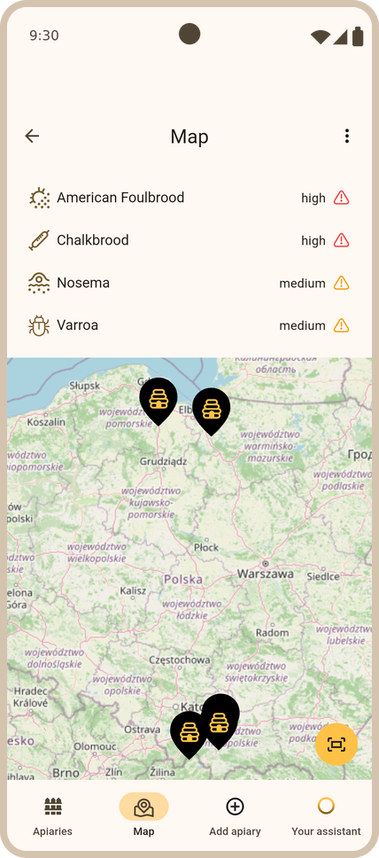{width=200}

**Najważniejsze informacje:**

- Aby przejść do tej zakładki należy kliknąć opcję *Mapa*, widoczną na dolnym menu zaraz po zalogowaniu się do aplikacji Apisense.
- Na mapie wyświetlane są markery określające lokalizacje pasiek użytkownika.
- Widok mapy można filtrować według problemów wykrytych w pasiekach. W tym celu należy kliknąć opcję np. *Warroza* znajdującą się powyżej mapy, w wyniku czego widok mapy zostanie ograniczony tylko do pasiek, w których występuje zagrożenie tą chorobą.

### 3. Omówienie listy uli (zakładka Ule)

Na liście uli znajdziesz wszytskie ule, które zostały przypisane do wybranej pasieki. Do zakładki *Ule* możesz przejść bezpośrednio z zakładki *Pasieki*, po kliknięciu w kafelek z wybraną pasieką.

#### 3.1 Lista uli

W **zakładce *Lista*** znajdziesz listę wszystkich uli przypisanych do wybranej pasieki (). Takie ułożenie pozwala szybko porównać ule i zlokalizować te wymagające uwagi.

Figure: Zakładka Ule - przykładowy widok listy uli {#fig-beehives-beehive-with-problem-4}

{width=200}

**Najważniejsze informacje:**

- Podobnie jak pasieki - każdy ul jest prezentowany w postaci osobnego kafelka.

- Każdy kafelek z ulem składa się z poniższych elementów:

    - nazwa ula i jego kod, wraz z ikonką w kolorze odpowiednim dla roku wychowu matki,

    - *Stan rodziny* - informujący o tym, czy rodzina w danym ulu jest zdrowa, czy wykryto zagrożenie,

    - *Temperatura w ulu* - aktualna temperatura panująca wewnątrz ula,

    - *Waga + przybytek* - aktualna waga ula wraz z przybytkiem miodu,

    - *Siła rodziny* - wiersz wyświetlany zawsze; dopóki nie ma danych, w miejscu wartości widnieje „-",

    - wskaźnik zadania zaplanowanego w ciągu najbliższych 10 dni,

    - dodatkowe ikony związane ze szczególnymi zdarzeniami w ulu np. czerwona ikona baterii świadcząca o jej niskim poziomie.

    Więcej informacji na temat interpretacji poszczególnych statusów znajdziesz w rozdziale [7. Interpretacja statusów, pomiarów, ikonek, kolorów na poszczególnych etapach](#interpretacja-statusow)

- Kliknięcie w kafelek ula otwiera wnętrze ula - szczegółowe dane pomiarowe wykonane przez urządzenia przypisane do wybranego ula ([Zakładka Szczegóły](#zakladka-szczegoly-ula)).

### 4. Omówienie zawartości ula (zakładka Szczegóły)

Widok *Szczegóły* ula umożliwia monitorowanie danych pomiarowych pochodzących z urządzeń pomiarowych (Scale, VitalSensor) oraz zarządzanie zapisami dotyczącymi pracy przy konkretnym ulu (m.in. przeglądami czy notatkami). Do zakładki szczegółów można przejść bezpośrednio z zakładki *Ule*, po kliknięciu w kafelek z wybranym ulem. 

Widok *Szczegóły* został podzielony na kilka mniejszych zakładek:

- *Stan ula*
- *Przegląd*
- *FrameSense*
- *Więcej*:
    - *Notatki*
    - *Zadania*
    - *Badania*
    - *Próbki*

!!! note
    Podział na dwie grupy pojawia się dopiero wtedy, gdy zakładek treściowych jest więcej niż pięć. Jeśli jest ich pięć lub mniej (np. gdy ul nie ma VitalSensora albo Twój plan nie obejmuje badań czy FrameSense), wszystkie mieszczą się w jednym pasku i zakładka *Więcej* w ogóle się nie pojawia. Kliknięcie *Więcej* przełącza pasek między obiema grupami.

#### 4.1 Stan ula

Zakładka *Stan ula* prezentuje najważniejsze, bieżące informacje o kondycji rodziny pszczelej oraz warunkach panujących w ulu (), określone na podstawie danych pomiarowych z urządzeń monitorujących.

Figure: Zakładka Szczegóły - przykładowy widok zakładki Stan ula {#fig-behive-details-2}

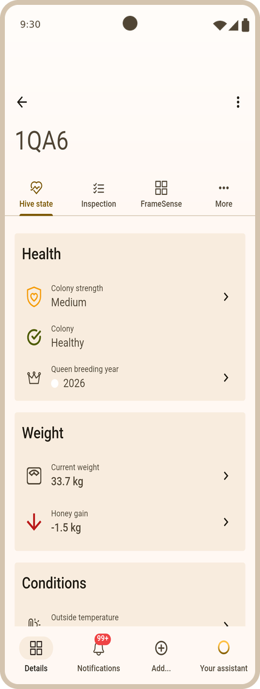{width=200}

**Najważniejsze informacje:**

- **Sekcja Zdrowie** – prezentuje aktualny stan rodziny pszczelej, informując czy rodzina jest zdrowa, czy też wykryto potencjalne zagrożenie w postaci choroby. W tej sekcji wyświetlany jest również rok wychowu matki pszczelej oraz wskaźnik **Siły rodziny** (Słaba / Średnia / Silna / Bardzo silna), odzwierciedlający witalność rodziny wyznaczoną przez AI na podstawie danych z inspekcji. Kliknij wskaźnik siły rodziny, aby otworzyć ekran *Siła rodziny*, gdzie zobaczysz pełną historię zmian i możesz ręcznie skorygować ocenę AI. Kliknij ikonę informacji (**i**) obok wskaźnika, aby otworzyć legendę wyjaśniającą znaczenie każdego poziomu oraz zakres liczby obsadzonych ramek gniazda, jaki mu odpowiada, z wyróżnionym aktualnym poziomem danego ula.
- **Sekcja Waga** – zawiera informacje dotyczące aktualnej wagi ula oraz przybytku miodu, co pozwala ocenić tempo produkcji oraz aktywność rodziny pszczelej.
- **Sekcja Warunki** – przedstawia dane środowiskowe z wnętrza ula oraz jego otoczenia, takie jak temperatura zewnętrzna, temperatura wewnętrzna, wilgotność oraz ciśnienie wewnątrz ula.
- **Szczegółowe dane i wykresy** – po rozwinięciu poszczególnych elementów w danej sekcji użytkownik może zobaczyć bardziej szczegółowe informacje oraz wykresy zmian parametrów w czasie, co ułatwia analizę stanu ula i warunków panujących w jego wnętrzu.

Więcej informacji na temat analizy i prezentacji danych w formie wykresów zawarto w rozdziałach [Monitorowanie parametrów](#monitorowanie-parametrow) oraz [Analiza danych i raporty](#analiza-danych-i-raporty)

#### 4.2 Przegląd

Zakładka *Przegląd* umożliwia przeglądanie historii przeprowadzonych kontroli danego ula. Przeglądy zaprezentowane są w formie listy ().

Figure: Zakładka Szczegóły - przykładowy widok zakładki Przegląd (lista przeglądów i szczegóły przeglądu) (1) {#fig-beehive-details-overview-list}

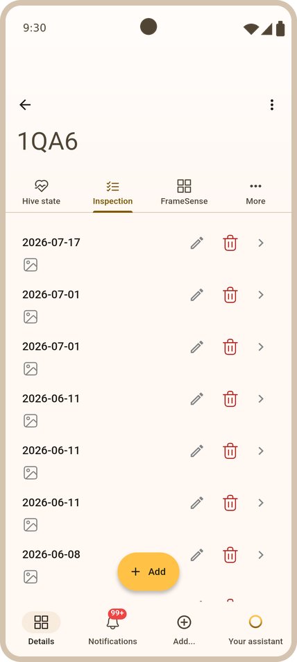{width=200}

Figure: Zakładka Szczegóły - przykładowy widok zakładki Przegląd (lista przeglądów i szczegóły przeglądu) (2) {#fig-beehive-details-overview-list-expanded}

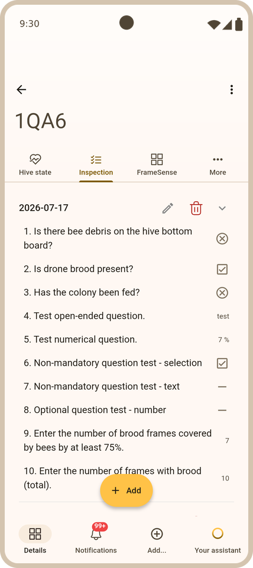{width=200}

**Najważniejsze informacje:**

- **Lista przeglądów** – prezentuje zestawienie wszystkich wykonanych przeglądów dla wybranego ula wraz z datą przeglądu.
- **Materiały multimedialne** – przy danym przeglądzie może być widoczna ikona zdjęcia lub nagrania, jeśli podczas przeglądu zostały dodane materiały wizualne.
- **Szczegóły przeglądu** – po kliknięciu w wybrany wiersz wyświetlane są szczegółowe informacje dotyczące przeglądu, w tym odpowiedzi udzielone podczas jego wykonywania.

#### 4.3 Notatki

Zakładka *Notatki* pozwala zapisywać i przeglądać informacje dotyczące obserwacji lub zdarzeń związanych z danym ulem. Notatki, tak jak i przeglądy, zaprezentowane są w formie listy ().

Figure: Zakładka Szczegóły - przykładowy widok zakładki Notatki {#fig-beehive-details-notes-list}

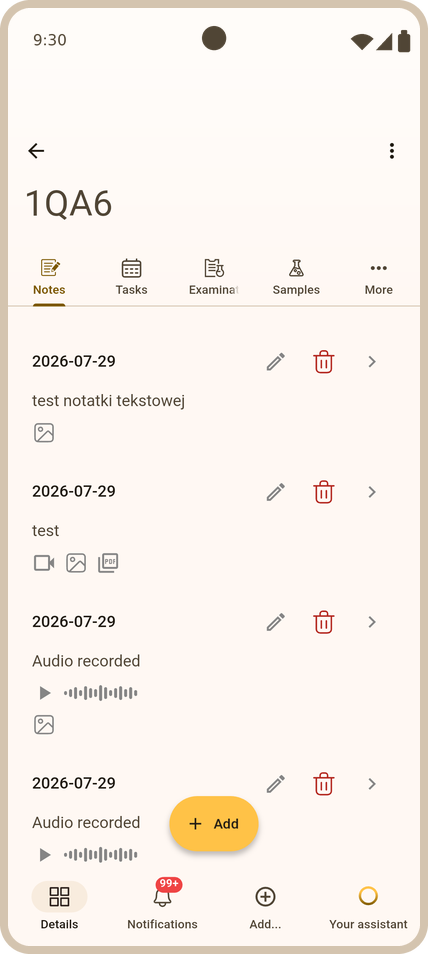{width=200}

**Najważniejsze informacje:**

- **Lista notatek** – prezentuje wszystkie notatki zapisane dla wybranego ula, zawierając tytuł/datę oraz skrócony fragment treści (jeśli notatka zawiera tekst).
- **Materiały dodatkowe** – przy notatkach mogą pojawić się ikony zdjęcia, nagrania wideo lub nagrania audio, jeśli takie materiały zostały do nich dołączone.
- **Etykiety generowane przez AI** – notatka tekstowa jak i głosowa może posiadać jedną lub kilka małych, złotych etykiet z ikoną iskierki, generowanych automatycznie przez AI i podsumowujących jej temat (np. *Bezmateczność*, *Podkarmianie*). Dzięki temu możesz szybko sprawdzić, czego dotyczy dana notatka już z poziomu listy notatek, bez konieczności otwierania jej i przeglądania pełnej treści.
- **Szczegóły notatki** – po kliknięciu - rozwinięciu - wybranej notatki wyświetlana jest pełna treść notatki wraz z dołączonymi materiałami, a także etykietami AI, podsumowującymi treść notatki.

#### 4.4 Badania

Zakładka *Badania* prezentuje w przejrzysty sposób listę wszystkich wykonanych oraz zapisanych badań (), przeprowadzonych w ramach wybranego ula. Dzięki temu użytkownik może szybko sprawdzić historię analiz oraz wrócić do wcześniejszych wyników.

Figure: Zakładka Szczegóły - przykładowy widok zakładki Badania {#fig-beehive-details-examination-list}

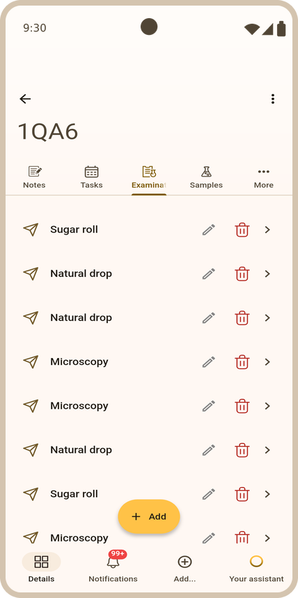{width=200}

**Najważniejsze informacje:**

- **Lista badań** – prezentuje wszystkie badania zapisane dla wybranego ula, posortowane malejąco według daty wykonania badania.
- **Szczegóły badania** – po kliknięciu w pojedyncze badanie zostają wyświetlone jego szczegóły, w tym: data badania, rodzaj badania oraz zapisane załączniki.

#### 4.5 Próbki

W zakładce *Próbki* znajdziesz listę wszystkich zarejestrowanych próbek dla konkretnego ula ().

Figure: Zakładka Szczegóły - przykładowy widok zakładki Próbki {#fig-beehive-details-sample-list}

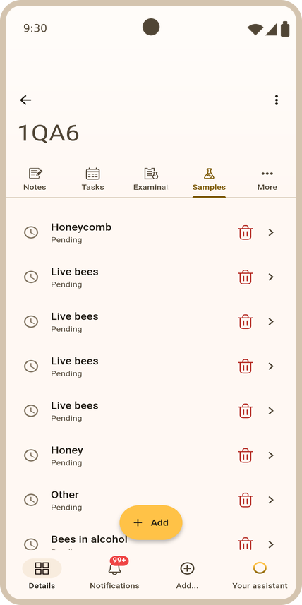{width=200}

**Najważniejsze informacje:**

- **Lista próbek** – prezentuje wszystkie próbki zapisane dla wybranego ula, posortowane malejąco według daty pobrania próbki.
- **Szczegóły próbki** – po kliknięciu w pojedynczą próbkę zostaną wyświetlone jej szczegóły, w tym: data pobrania próbki, rodzaj badania oraz wygenerowany przez system kod badania.

#### 4.6 FrameSense

Zakładka *FrameSense* prezentuje historię analiz AI ramek pszczelich, wykonanych dla wybranego ula, uporządkowanych od najnowszej.

**Najważniejsze informacje:**

- **Lista analiz** – pokazuje każdą analizę ramki wraz ze statusem: *Analizujemy*, *Analiza zakończona* lub *Analiza nie powiodła się*.
- **Szczegóły analizy** – po otwarciu zakończonej analizy wyświetlane jest przesłane zdjęcie z oznaczeniami poszczególnych elementów oraz podsumowanie zawartości plastra, obejmujące udział czerwiu, zapasów pokarmu oraz pustej i zasłoniętej powierzchni, a także spis pszczół oraz mateczniki. Poniżej znajduje się również sekcja z rekomendacjami, które pomogą Ci rozwiązać potencjalne problemy wykryte podczas analizy ramki oraz podjąć świadome decyzje i działania naprawcze. Zobacz [9. FrameSense](#analiza-ramki), aby dowiedzieć się więcej.

### 5. Omówienie ustawień pasieki

Widok *Ustawienia pasieki* pozwala zarządzać podstawowymi danymi pasieki oraz śledzić informacje na temat jej stanu wyposażenia. Do widoku można przejść będąc w zakładce *Ule* (wnętrze pasieki), klikając ikonkę **⋮** w prawym górnym rogu ekranu i wybierając *Ustawienia*.
Widok *Ustawienia pasieki* składa się z następujących sekcji:

- Szczegóły pasieki
- Hub

Figure: Widok Ustawienia pasieki {#fig-apiary-settings-3}

{width=200}

Aby zobaczyć zawartość danej sekcji, należy kliknąć w jej nagłówek, w wyniku czego zostanie wyświetlony pełny widok ze szczegółowymi informacjami.

#### 5.1 Szczegóły pasieki

Sekcja *Szczegóły pasieki* prezentuje podstawowe informacje identyfikujące pasiekę.

Figure: Widok Ustawienia pasieki - sekcja Szczegóły pasieki {#fig-apiary-settings-details-2}

{width=200}

**Najważniejsze informacje:**

- **Nazwa** – jedyne pole tej sekcji; wyświetlana jest pełna nazwa pasieki, identyfikująca ją w systemie. Litera widoczna na kafelku pasieki wylicza się automatycznie z pierwszej litery nazwy.

#### 5.2 Hub

Sekcja **Hub** prezentuje dane techniczne urządzenia Apisense Hub, odpowiedzialnego za zbieranie danych pomiarowych z uli w pasiece.

Figure: Widok Ustawienia pasieki - sekcja Hub {#fig-apiary-settings-hub}

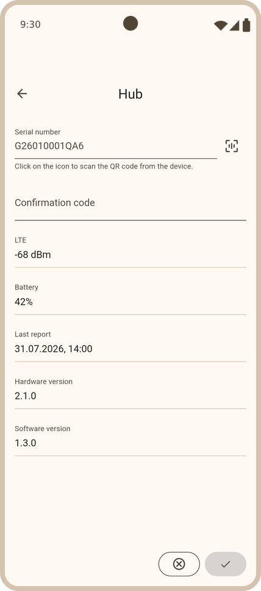{width=200}

**Najważniejsze informacje:**

- **Numer seryjny i kod potwierdzający** – prezentowane są unikalny numer seryjny urządzenia oraz kod weryfikacyjny, potwierdzający jego przypisanie do użytkownika.
- **LTE i bateria** – wyświetlane są informacje o aktualnym stanie połączenia LTE oraz poziomie naładowania baterii urządzenia Apisense Hub.
- **Ostatnie zgłoszenie** – prezentowana jest data i czas ostatniej komunikacji urządzenia Apisense Hub z systemem.
- **Wersje sprzętowa i oprogramowania** – umożliwia sprawdzenie aktualnej wersji sprzętowej oraz oprogramowania urządzenia Apisense Hub.

### 6. Omówienie ustawień ula

Widok *Ustawienia ula* pozwala na zarządzanie podstawowymi informacjami o ulu, danymi dotyczącymi matki pszczelej oraz przypisanymi urządzeniami pomiarowymi. Do widoku można przejść z zakładki *Szczegóły* ula (wnętrze ula), klikając ikonkę **⋮** widoczną w prawym górnym rogu ekranu i wybierając *Ustawienia*.
Widok *Ustawienia ula* został podzielony na następujące sekcje:

- Szczegóły ula
- Informacje o matce
- Wyposażenie

Figure: Widok Ustawienia ula {#fig-beehive-settings-3}

{width=200}

Aby zobaczyć zawartość danej sekcji, należy kliknąć w jej nagłówek, w wyniku czego zostanie wyświetlony pełny widok ze szczegółowymi informacjami.

#### 6.1 Szczegóły ula

Sekcja *Szczegóły ula* prezentuje podstawowe informacje identyfikujące ul i jego konstrukcję.

Figure: Widok Ustawienia ula - sekcja Szczegóły ula {#fig-beehive-settings-details}

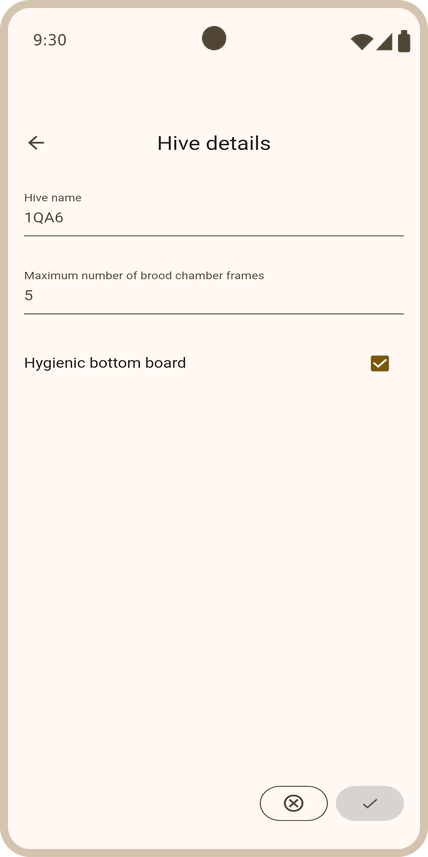{width=200}

**Najważniejsze informacje:**

- **Nazwa ula** – pełna nazwa ula ułatwiająca jego identyfikację w systemie.
- **Maksymalna liczba ramek w korpusie gniazdowym** – informacja o maksymalnej liczbie ramek, które mogą zmieścić się w korpusie gniazdowym ula.
- **Dennica higieniczna** – informacja, czy ul posiada dennicę higieniczną.

#### 6.2 Informacje o matce

Sekcja *Informacje o matce* umożliwia przegląd szczegółowych danych dotyczących matki pszczelej w ulu. Kliknij wybrany nagłówek, by wyświetlić szczegóły.

Figure: Widok Ustawienia ula - sekcja Informacje o matce {#fig-beehive-settings-queen}

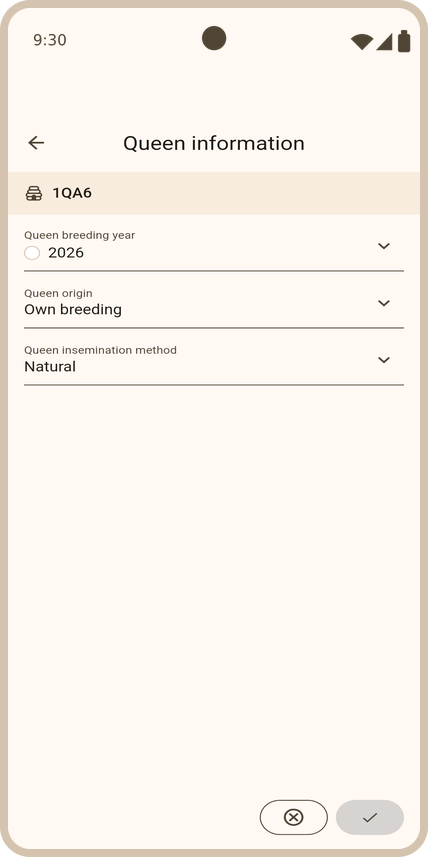{width=200}

**Najważniejsze informacje:**

- **Rok wychowu matki** – prezentuje rok wychowu matki pszczelej.
- **Pochodzenie matki** – jedna z wartości: *Własna hodowla*, *Zakup krajowy*, *Zakup zagraniczny*, *Nieznane*.
- **Sposób unasiennienia matki** – jedna z wartości: *Naturalny*, *Sztuczny*, *Nieznany*.

#### 6.3 Wyposażenie

Sekcja *Wyposażenie* prezentuje urządzenia pomiarowe przypisane do danego ula oraz ich aktualny stan.

Figure: Widok Ustawienia ula - sekcja Wyposażenie {#fig-beehive-settings-devices}

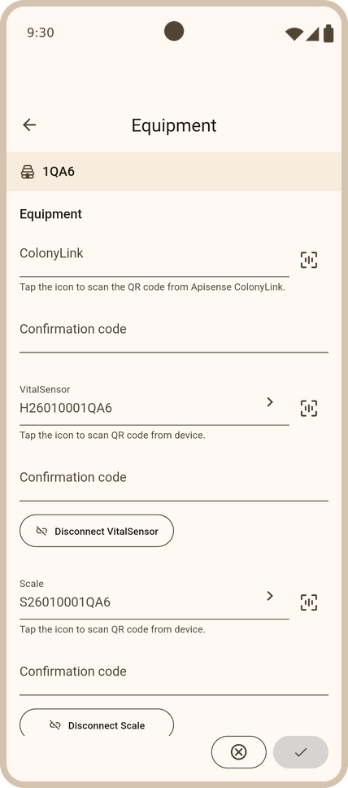{width=200}

**Najważniejsze informacje:**

- **Trzy bloki urządzeń** – sekcja obejmuje **ColonyLink**, **VitalSensor** i **Scale**, w tej kolejności. Każdy blok ma pola *Numer seryjny* i *Kod potwierdzający*.

- **Przyciski akcji** – przy VitalSensorze i Scale znajdziesz przyciski *Wymieniłem baterię* oraz *Odłącz VitalSensor* / *Odłącz Scale*. ColonyLink nie ma przycisku odłączania — można go wyłącznie podmienić, skanując kod innego urządzenia.

- **Rozwinięcie szczegółów** – kliknięcie nazwy urządzenia otwiera pełny widok z informacjami o stanie sprzętu w ulu ().

- **Szczegóły urządzenia** – po kliknięciu w dane urządzenie wyświetlane są:

    - **BLE i bateria** – informacja o aktualnej sile sygnału BLE i poziomie naładowania urządzenia.
    - **Ostatnie zgłoszenie** – data i czas ostatniej komunikacji urządzenia z Apisense Hub.
    - **Ostatni pomiar** – data i czas wykonania najnowszego pomiaru przez urządzenie.
    - **Wersje sprzętowa i oprogramowania** – umożliwia sprawdzenie aktualnej wersji sprzętowej oraz oprogramowania urządzenia Apisesne Scale/Apisense VitalSensor.

Figure: Widok Ustawienia ula - sekcja Wyposażenie - szczegóły Scale oraz VitalSensor (1) {#fig-beehive-settings-scale}

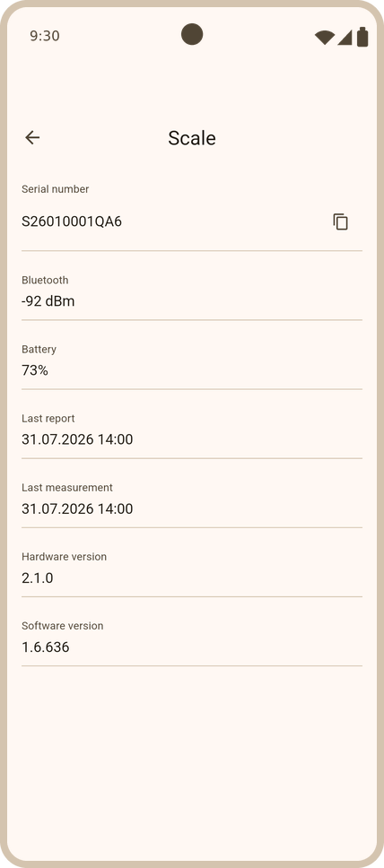{width=200}

Figure: Widok Ustawienia ula - sekcja Wyposażenie - szczegóły Scale oraz VitalSensor (2) {#fig-beehive-settings-sensor}

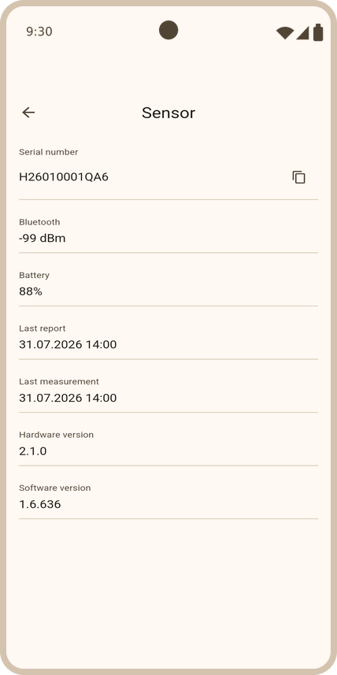{width=200}

### 7. Interpretacja statusów i ikon wykorzystywanych w systemie

W systemie wykorzystywane są różne statusy oraz ikony, które ułatwiają szybkie rozpoznanie stanu pasieki, uli, urządzeń pomiarowych oraz zaplanowanych działań. Elementy te pełnią funkcję wizualnych oznaczeń, dzięki którym użytkownik może w prosty sposób zidentyfikować najważniejsze informacje bez konieczności szczegółowego analizowania danych.

W niniejszym rozdziale przedstawiono znaczenie poszczególnych ikon, symboli oraz oznaczeń kolorystycznych stosowanych w interfejsie systemu, co pozwoli na ich prawidłową interpretację podczas codziennej pracy z aplikacją.

#### 7.1 Pierwsze uruchomienie urządzeń

Po utworzeniu pasieki z Hubem oraz przypisaniu Scale/VitalSensor do ula, zanim urządzenia nawiążą łączność z systemem na kafelkach będą prezentowane następujące informacje: 

- **Hub — kafelek pasieki** - na kafelku pasieki zobaczysz komunikat z instrukcją uruchomienia urządzenia oraz trzeba przyciskami () - wybierz tę, która odpowiada Twojej sytuacji:

| Opcja | Maksymalny czas oczekiwania | Kiedy wybrać |
| :---- | :---------------------- | :------------ |
| **Ładowarka** | ok. 30 min | Hub jest podłączony do zewnętrznego zasilania |
| **Pełne słońce** | ok. 3 h | Hub wystawiony na słońce przy sprzyjającym nasłonecznieniu |
| **Słabe słońce** | ok. 24 h | Rozładowany Hub przy słabym nasłonecznieniu |

Figure: Kafelek z pasieką - pierwsze uruchomienie urządzenia Apisense Hub - instrukcja uruchomienia {#fig-apiary-instruction}

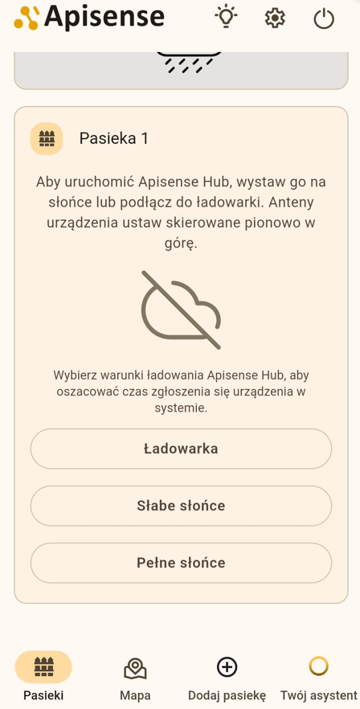{width=200}

Po wybraniu opcji uruchamia się **odliczanie** (zegar) z szacowanym maksymalnym czasem, jaki należy odczekać do pierwszego połączenia (). To **szacunek**, nie gwarancja - rozładowany Hub bez dostępu do światła może potrzebować więcej czasu. Jeśli po upływie czasu Hub nadal się nie zgłasza, aplikacja zaproponuje ponowienie próby. 

Figure: Kafelek z pasieką - pierwsze uruchomienie urządzenia Apisense Hub - zegar {#fig-apiary-timer}

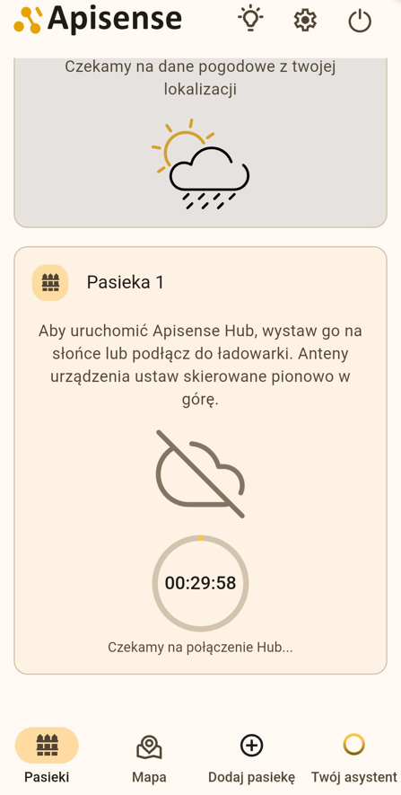{width=200}

- **Scale i VitalSensor — kafelek ula** - na kafelku ula pojawia się pytanie () czy urządzenie jest prawidłowo zamontowane oraz czy znajduje się w zasięgu Huba (do ok. 35 m). Po potwierdzeniu uruchamia się **zegar** z szacowanym maksymalnym czasem nawiązania komunikacji urządzenia pomiarowego z Hubem (). 

Figure: Kafelek z ulem - pierwsze uruchomienie urządzenia Apisense Scale/VitalSensor - pytanie {#fig-beehive-device-first-contact}

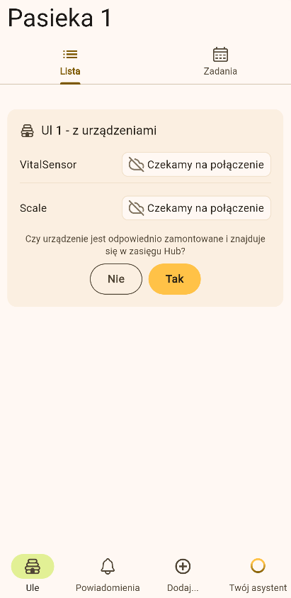{width=200}

Figure: Kafelek z ulem - pierwsze uruchomienie urządzenia Apisense Scale/VitalSensor - zegar {#fig-beehive-timer}

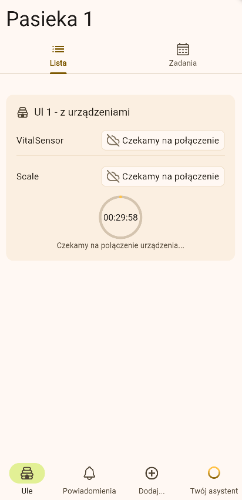{width=200}

**Dodatkowe komunikaty na kafelku pasieki**

Po pierwszym zgłoszeniu się urządzeń i wyświetleniu pierwszych danych, na kafelku z pasieką czy ulem, nadal mogą nie być zaprezentowane pełne informacje. Niektóre dane będą widoczne dopiero po kilku dniach: 

| Komunikat | Znaczenie |
| :---- | :--------- |
|  **Czekamy na dane pogodowe z twojej lokalizacji** | Hub jest online, ale prognoza pogody nie jest jeszcze znana. Prognoza pogody powinna pojawić się w kolejnym dniu po stabilnej komunikacji Huba. |
| **Zbieramy dane o zdrowiu X z Y uli** | Patrz [Stan zdrowia](#stan-zdrowia). |

#### 7.2 Stan zdrowia rodziny

Ikony stanu zdrowia informują o kondycji rodziny pszczelej w poszczególnych ulach i całej pasiece. Ocena zdrowia opiera się na danych z **VitalSensor** i modelu AI. 

| Ikona | Występowanie | Znaczenie |
| :----------- | :---------------- | :--------- |
| 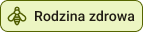 | kafelek z pasieką (zakładka Pasieki) | **Rodzina zdrowa** | Co najmniej jeden ul ma wiarygodne dane z urządzenia VitalSensor (poza okresem *Zbieramy dane*). Rodzina pszczela w tej pasiece jest zdrowa. W żadnym ulu w tej pasiece nie wykryto zagrożenia.| 
| 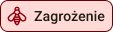 | kafelek z pasieką (zakładka Pasieki) | **Zagrożony** - rodzina pszczela w tej pasiece jest zagrożona. W co najmniej jednym ulu w tej pasiece będącym poza okresem *Zbieramy dane* wykryto zagrożenie w postaci choroby. |
| 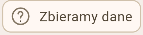  | kafelek z pasieką (zakładka Pasieki), kafelek z ulem (zakładka Ule) | **Zbieramy dane na kafelku z pasieką** -  oznacza, że wszystkie urządzenia typu VitalSensor w pasiece są w okresie zbierania  danych o zdrowiu rodziny (pierwsze ok. 3 dni od przypisania), trwa pierwsza analiza AI - system zbiera dane, ale model nie ma jeszcze wystarczającej historii, aby wiarygodnie ocenić stan zdrowia rodziny. **Zbieramy dane na kafelku z ulem** - występuje na ulu, do którego przypisany jest VitalSensor znajdujący się w okresie zbierania danych o zdrowiu rodziny (analogicznie jak w przypadku pasieki)|
| 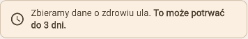 | kafelek pasieki (zakładka Pasieki) | *Zbieramy dane o zdrowiu X z Y uli…* - oznacza, że w co najmniej jednym ulu w pasiece istnieje VitalSensor, który wciąż jest w okresie zbierania danych o zdrowiu rodziny. Przykład: w pasiece jest 5 uli, w 4 z nich od dłuższego czasu jest VitalSensor i każdy z nich wskazuje, że rodzina jest zdrowa. Do 1 ula VitalSensor został przypisany dzisiaj. Na kafelku z pasieką zobaczysz mniejszy kafelek *Rodzina zdrowa* i informację *Zbieramy dane o zdrowiu 1 z 5 uli.* |
| Brak kafelka o stanie zdrowia | kafelek pasieki (zakładka Pasieki), kafelek ula (zakładka Ule) | Pasieka bez Huba lub pasieka z Hubem, ale w żadnym ulu w tej pasiece nie ma urządzeń typu VitalSensor. System nie ma podstaw do oceny zdrowia rodziny. |
| 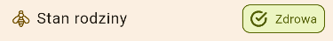 | kafelek ula - wiersz *Stan rodziny*, zakładka *Stan ula* w *Szczegóły* | **Zdrowa** - VitalSensor poza okresem zbierania danych; model nie wykrył choroby. Rodzina w tym ulu uznana za zdrową. |
| 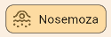 | kafelek ula (zakładka Ule)| Nazwa choroby na żółtym tle - wykryto chorobę w ulu o niskim/umiarkowanym poziomie porażenia. Nazwa choroby na czerwonym tle - wykryto chorobę w ulu o wysokim poziomie porażenia. *+N obok nazwy choroby* - oznacza, że w ulu wykryto więcej niż jedną chorobę. |
|  | wiersz *Rodzina* w zakładce *Stan ula* | **Brak danych** - oznacza, że system nie może ocenić stanu zdrowia rodziny pszczelej. Przykładowo może wystąpić, gdy VitalSensor był w okresie zbierania danych, ale nagle przestał komunikować się z Hubem i dane nie zdążyły zostać zebrane oraz przeanalizowane przez model AI. Na kafelkach pasieki i ula w takiej sytuacji **nie pojawia się żaden kafelek stanu zdrowia** — patrz wiersz „Brak kafelka o stanie zdrowia" wyżej. |
| 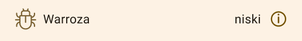 | m.in. *Szczegóły*, *Mapa* | Ikona choroby — Warroza.  Wykryto chorobę (Warroza) o niskim poziomie porażenia. |
| 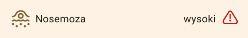 | m.in. *Szczegóły*, *Mapa* | Ikona choroby — Nosemoza. Wykryto chorobę (Nosemoza) o wysokim poziomie porażenia. Sprawdź zalecenia w zakładce *Problemy*. |

#### 7.3 Ikony informacyjne

Ikony informacyjne przedstawiają informacje dotyczące pasiek i uli oraz dane zebrane z urządzeń pomiarowych.

| Ikona                                      | Występowanie                         | Znaczenie                                                                                                                                                                                                                                                                                                                                             |
| :----------------------------------------- | :----------------------------------- | :---------------------------------------------------------------------------------------------------------------------------------------------------------------------------------------------------------------------------------------------------------------------------------------------------------------------------------------------------- |
| 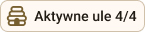          | kafelek z pasieką (zakładka Pasieki) | Liczba aktualnie aktywnych uli na całkowitą liczbę uli w pasiece. Ul jest aktywny, gdy posiada co najmniej jedno prawidłowo komunikujące się urządzenie.  Przykład: W pasiece są 2 ule. W ulu 1 wszystkie urządzenia przestały się zgłaszać. W ulu 2 tylko Scale się zgłasza, a VitalSensor nie. Na ikonie zostanie wyświetlone: Aktywne ule 1/2. |
| 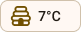      | kafelek z ulem (zakładka Ule)        | Aktualna temperatura wewnątrz ula.                                                                                                                                                                                                                                                                                                                    |
| 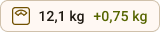    | kafelek z ulem (zakładka Ule)        | Aktualna waga ula i dzienny przybytek miodu.                                                                                                                                                                                                                                                                                                          |
| 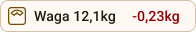  | kafelek z ulem (zakładka Ule)        | Aktualna waga ula i dzienny ubytek miodu.                                                                                                                                                                                                                                                                                                             |
| 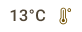     | wnętrze ula (zakładka Szczegóły)     | Aktualna temperatura wewnątrz ula.                                                                                                                                                                                                                                                                                                                    |
| 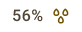 | wnętrze ula (zakładka Szczegóły)     | Aktualna wilgotność wewnątrz ula.                                                                                                                                                                                                                                                                                                                     |
| 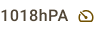 | wnętrze ula (zakładka Szczegóły)     | Aktualne ciśnienie atmosferyczne wewnątrz ula.                                                                                                                                                                                                                                                                                                        |

<!-- TODO: brakuje assetu beehive_details_humidity_risk.png — przywrócić wiersz po dodaniu pliku do docs/manual/pictures/
|  | wnętrze ula (zakładka Szczegóły)     | Aktualna wartość wilgotności w ulu znajduje się poza oczekiwanym zakresem - występuje ryzyko pojawienia się chorób.                                                                                                                                                                                                                                                                                                                     |
-->

#### 7.4 Stan urządzeń Apisense

Ikony stanu urządzeń Apisense wskazują aktualny status pracy: jakość połączenia oraz poziom naładowania baterii urządzeń monitorujących pasieki i ule. 

| Ikona                             | Występowanie                                     | Znaczenie                                                                                                                                                                               |
| :-------------------------------- | :----------------------------------------------- | :-------------------------------------------------------------------------------------------------------------------------------------------------------------------------------------- |
|         | kafelek z pasieką (zakładka Pasieki)             | Bardzo dobry poziom sygnału LTE urządzenia Apisense Hub. Żadna akcja nie jest wymagana.                                                                                                 |
|       | kafelek z pasieką (zakładka Pasieki)             | Średni poziom sygnału LTE urządzenia Apisense Hub. Żadna akcja nie jest wymagana.                                                                                                       |
|          | kafelek z pasieką (zakładka Pasieki)             | Bardzo słaby poziom sygnału LTE urządzenia Apisense Hub. Urządzenie może przestać się zgłaszać. W miarę możliwości należy odpowiednio zmienić położenie urządzenia (Hub).              |
| 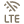     | kafelek z pasieką (zakładka Pasieki)             | Urządzenie Apisense Hub nie zgłasza się (tryb offline). Należy zweryfikować przyczynę stanu offline i podjąć odpowiednie kroki.                                                         |
|     | kafelek z pasieką (zakładka Pasieki)             | Bardzo wysoki poziom baterii urządzenia Apisense Hub. Żadna akcja nie jest wymagana.                                                                                                    |
|     | kafelek z pasieką (zakładka Pasieki)             | Średni poziom baterii urządzenia Apisense Hub.                                                                                                                                          |
|      | kafelek z pasieką i ulem (zakładka Pasieki, Ule) | Bardzo słaby poziom baterii urządzenia (na kafelku z pasieką dotyczy Huba, na kafelku z ulem - Scale lub VitalSensor). Należy naładować (Hub) lub wymienić baterie (Scale, VitalSensor). |
|  | kafelek z pasieką (zakładka Pasieki), kafelek z ulem (zakładka Ule)             | Poziom baterii urządzenia nieznany. Należy poczekać na kolejne zgłoszenie się urządzenia. Jeżeli stan długo się utrzymuje np. kilka godzin (ikona baterii szara i przekreślona, ale aktualne dane są wyświetlane np. temperatura) należy zgłosić problem w aplikacji.                                                                                              |
|  | kafelek z pasieką (zakładka Pasieki), kafelek z ulem (zakładka Ule) | Pełna/wysoka, wyszarzona ikona baterii oznacza, że Hub lub Scale/VitalSensor **nie zgłasza się**, ale ostatni znany poziom baterii był **wysoki**. Sprawdź zasilanie i zasięg; urządzenie mogło stracić łączność z innych powodów niż rozładowanie baterii. |
|  | kafelek z pasieką (zakładka Pasieki), kafelek z ulem (zakładka Ule) | Wyszarzona ikona baterii z dwiema kreskami - ostatni znany poziom baterii był na poziomie **średnim**. Brak komunikacji wynika najprawdopodobniej z problemów z zasięgiem BLE (ule) lub LTE (Hub). |
|  | kafelek z pasieką (zakładka Pasieki), kafelek z ulem (zakładka Ule) | Wyszarzona ikona baterii z jedną kreską - ostatni znany poziom baterii był **niski**. Problemy z komunikacją urządzenia wynikają najprawdopodobnie z krytycznie niskiego stanu baterii. Wymień baterie (Scale, VitalSensor) lub naładuj Hub. |
| 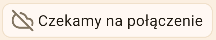 | kafelek ula (zakładka Ule) | **Czekamy na połączenie** - oznacza, że czekamy na kontakt urządzenia z Hubem. |
| 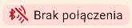| kafelek ula (zakładka Ule) | **Brak połączenia** - urządzenie przestało komunikować się z Hubem. |
|  | kafelek ula (zakładka Ule) | **Bateria wyczerpana** - Ostatni znany stan baterii: rozładowana. Należy wymienić baterię urządzenia. |
|  | kafelek ula (zakładka Ule) | **Urządzenie połączone — czekamy na pierwszy pomiar** - urządzenie zgłosiło się do Huba, ale nie przysłało jeszcze żadnego pomiaru. Ten stan zobaczysz zaraz po podpięciu Scale lub VitalSensora do ula. |

#### 7.5 Oznaczenia kolorystyczne

Oznaczenia kolorystyczne ułatwiają szybkie rozpoznanie statusów, kategorii oraz ważnych informacji w systemie.

| Ikona                                   | Występowanie                          | Znaczenie                                                                                                                                                                                           |
| :-------------------------------------- | :------------------------------------ | :-------------------------------------------------------------------------------------------------------------------------------------------------------------------------------------------------- |
| 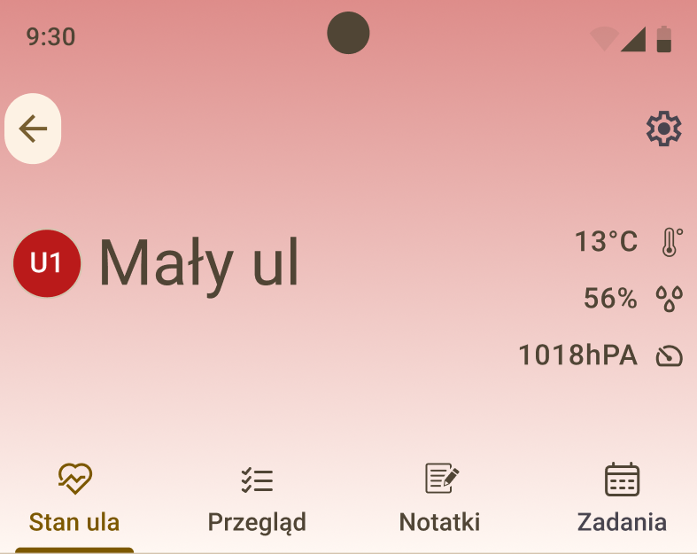         | wnętrze ula (zakładka Szczegóły)      | Kolor tła ula wraz z ikoną (kolorowe kółeczko) odpowiadają kolorowi przypisanemu do roku wychowu matki.                                                                                                |
|        | różne widoki m.in. Notatki, Przeglądy | Kolor żółty w aplikacji oznacza potwierdzenie wyboru, możliwość wykonania jakiejś akcji - często widoczny na przyciskach.                                                                           |
| 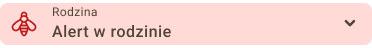             | różne widoki m.in. Stan ula           | Kolor czerwony w aplikacji świadczy o wystąpieniu negatywnego zjawiska, przekroczeniu wartości oczekiwanych parametrów, powiadomieniach i ostrzeżeniach (nie dotyczy tła ula w zakładce Szczegóły). |
| 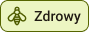 | różne widoki m.in. kafelek z ulem     | Kolor zielony w aplikacji informuje, że wszystko jest w porządku, oznacza neutralność lub pozytywny efekt.                                                                                          |

#### 7.6 Akcje

Ikony akcji umożliwiają wykonanie dostępnych operacji, takich jak dodawanie, edycja lub usuwanie danych.

| Ikona                            | Występowanie                                     | Znaczenie                                                         |
| :------------------------------- | :----------------------------------------------- | :---------------------------------------------------------------- |
| 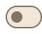 | różne widoki m.in. wykresy   | Przełącznik - wybór nieaktywny.                                   |
|   | różne widoki m.in. wykresy   | Przełącznik - wybór aktywny.                                      |
|     | różne widoki m.in. dodawanie notatek itp.        | Potwierdź lub zapisz wybór.                                       |
| 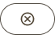  | różne widoki m.in. dodawanie notatek itp.        | Odrzuć wprowadzone dane/Nie zapisuj.                              |
|       | m.in. edycja notatek         | Przycisk umożliwiający wprowadzanie zmian dla wybranego elementu. |
|     | m.in. usuwanie notatek         | Przycisk umożliwiający usunięcie wybranego elementu.              |

#### 7.7 Nawigacja

Ikony nawigacyjne służą do poruszania się pomiędzy widokami i funkcjami aplikacji.

| Ikona                           | Występowanie                                               | Znaczenie                                                                                                          |
| :------------------------------ | :--------------------------------------------------------- | :----------------------------------------------------------------------------------------------------------------- |
|         | menu **⋮** w prawym górnym rogu ekranu | Pozycja *Wyloguj* w menu **⋮**, służąca do wylogowania się z systemu. Nie jest to osobna ikona na pasku — menu zawiera także *Dodaj sugestię* i *Ustawienia*. |
|  | różne widoki - lewy górny róg ekranu                       | Przycisk służący do przejścia do poprzedniego widoku (przycisk Wstecz), np. z zakładki *Ule* do *Pasieki*.         |
|    | różne widoki m.in. formularz chorobowy, Dodaj przegląd    | Przycisk służący do przejścia do następnego widoku (przycisk Dalej), np. przejście do kolejnego pytania przeglądu lub formularza chorobowego. |

______________________________________________________________________

## Monitorowanie parametrów

System umożliwia ciągłe monitorowanie najważniejszych parametrów środowiskowych oraz produkcyjnych w ulu na podstawie danych zbieranych przez urządzenia pomiarowe. Analiza tych informacji pozwala na bieżąco oceniać kondycję rodziny pszczelej, warunki panujące w ulu oraz dynamikę produkcji miodu. Regularne obserwowanie zmian poszczególnych parametrów ułatwia również wczesne wykrywanie nieprawidłowości oraz podejmowanie odpowiednich działań w odpowiednim czasie.

Dane prezentowane w systemie mogą być wyświetlane w formie **aktualnych wartości, wykresów zmian w czasie oraz zestawień**, co umożliwia łatwe śledzenie trendów i analizę zachowania rodziny pszczelej w dłuższym okresie.

Figure: Widok Szczegóły ula - przykładowe wartości parametrów i wykres wagi {#fig-beehive-details-with-chart}

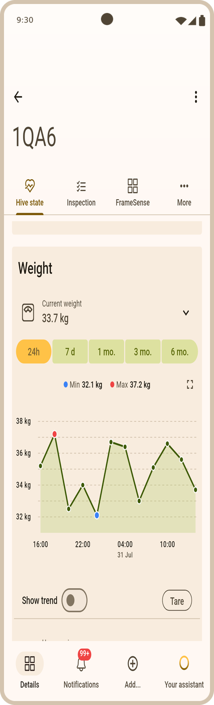{width=200}

### 1. Temperatura

Temperatura jest jednym z kluczowych parametrów wpływających na rozwój i funkcjonowanie rodziny pszczelej. W systemie prezentowana jest zarówno **temperatura wewnątrz ula**, jak i **temperatura zewnętrzna**, co pozwala porównać warunki panujące w ulu z temperaturą otoczenia.

Najważniejsze informacje:

- **Źródła:** VitalSensor mierzy temperaturę wewnątrz ula; Scale - temperaturę zewnętrzną przy ulu.
- **Temperatura zewnętrzna** umożliwia analizę wpływu warunków atmosferycznych na aktywność pszczół.
- **Temperatura wewnętrzna** odzwierciedla warunki panujące w gnieździe pszczelim. Stabilna temperatura wskazuje na prawidłową aktywność rodziny pszczelej i odpowiednią opiekę nad czerwiem. Typowo 32–36°C w kłębie w sezonie.
- **Nagłe zmiany temperatury wewnętrznej** mogą wskazywać na osłabienie rodziny, brak matki lub inne nieprawidłowości wymagające kontroli ula.
- **Wykresy temperatury** pozwalają obserwować zmiany w czasie i identyfikować długoterminowe trendy.

### 2. Wilgotność

Wilgotność w ulu ma istotny wpływ na rozwój czerwiu, zagęszczanie miodu oraz ogólną kondycję rodziny pszczelej. Zbyt wysoka lub zbyt niska wilgotność może negatywnie wpływać na zdrowie pszczół i jakość produktów pszczelich.

Najważniejsze informacje:

- **Wilgotność wewnętrzna** ula, mierzona przez VitalSensor, odzwierciedla warunki mikroklimatyczne w gnieździe.
- **Zbyt wysoka wilgotność** może sprzyjać rozwojowi chorób oraz pogarszać warunki przechowywania pokarmu.
- **Zbyt niska wilgotność** może prowadzić do wysychania czerwiu i negatywnie wpływać na funkcjonowanie rodziny pszczelej.
- **Analiza wykresów wilgotności** pozwala ocenić stabilność warunków w ulu oraz skuteczność wentylacji.

### 3. Ciśnienie

Pomiar ciśnienia w ulu pozwala obserwować zmiany warunków wewnętrznych oraz ich zależność od czynników zewnętrznych, takich jak zmiany pogody.

Najważniejsze informacje:

- **Ciśnienie wewnątrz ula**, również mierzone przez VitalSensor, może zmieniać się pod wpływem warunków atmosferycznych oraz aktywności rodziny pszczelej.
- **Spadki lub wzrosty ciśnienia** mogą być sygnałem nadchodzących zmian pogody, które często wpływają na aktywność lotną pszczół.
- **Analiza trendów ciśnienia** w połączeniu z innymi parametrami może pomóc w interpretacji zachowania rodziny pszczelej.

### 4. Waga

Pomiar wagi ula pozwala na bieżąco monitorować zmiany masy ula, które wynikają m.in. z aktywności pszczół, zbiorów nektaru, zużycia zapasów czy warunków pogodowych.

Najważniejsze informacje:

- **Aktualna waga** ula, mierzona przez Scale, przedstawia całkowitą masę ula wraz z rodziną pszczelą, zapasami i wyposażeniem.
- **Zmiany wagi w czasie** pozwalają obserwować intensywność pożytków oraz aktywność zbieraczek.
- **Spadki wagi** mogą wskazywać na zużywanie zapasów, rójkę lub okresy słabszego pożytku.
- **Analiza wykresów wagi** umożliwia ocenę dynamiki rozwoju rodziny pszczelej, sezonowej produkcji miodu oraz jest kluczowa w planowaniu miodobrania.
- **Tarowanie wagi** — możesz wyzerować wagę, aby od wybranego momentu śledzić przyrost lub ubytek masy netto. W sekcji *Waga* widoku *Stan ula*, na wykresie wagi kliknij przycisk *Taruj* i wybierz:
    - **Taruj teraz** — wyzeruj względem najnowszego odczytu.
    - **Taruj w punkcie** — wyzeruj od dowolnego momentu; po wybraniu tej opcji dotknij odpowiedniego punktu bezpośrednio na wykresie wagi.

    Po pomyślnym tarowaniu wyświetlenie zmienia się na **Aktualna waga (tara)**, a na wykresie pojawia się znacznik *Tara* (pionowa, przerywana linia). Aby wrócić do wagi brutto, kliknij *Resetuj* obok przycisku *Taruj*.

### 5. Przybytek miodu

Parametr przybytku miodu przedstawia szacunkową ilość miodu zgromadzonego przez rodzinę pszczelą w określonym czasie, na podstawie zmian wagi ula.

Najważniejsze informacje:

- **Przybytek miodu** pokazuje tempo gromadzenia nektaru i jego przetwarzania przez pszczoły.
- **Dodatnie wartości** wskazują na okres intensywnego pożytku i aktywnej pracy pszczół.
- **Spadek lub brak przybytku** może oznaczać zakończenie pożytku, niesprzyjające warunki pogodowe lub zmniejszoną aktywność rodziny.
- **Analiza trendów przybytku** pozwala ocenić produktywność rodziny oraz moment optymalny do planowania miodobrania.

### 6. Interpretacja parametrów: waga ula a przybytek miodu

- **Wykres wagi ula** — przedstawia rzeczywistą masę całego ula. Uwzględnia wszystkie zmiany masy — zarówno nagłe, wynikające z działań pszczelarza (np. dołożenie półkorpusu, zdjęcie nadstawek czy miodobranie), jak i stopniowe zmiany związane z naturalną aktywnością pszczół oraz warunkami środowiskowymi.
- **Wykres przybytku miodu** — przedstawia szacunkową zmianę ilości zgromadzonego miodu. W przeciwieństwie do wykresu wagi eliminuje wpływ działań wykonywanych przez pszczelarza, dzięki czemu odzwierciedla zmiany wynikające z aktywności rodziny pszczelej.

W praktyce oznacza to, że oba wykresy mogą przedstawiać różne wartości. Przykładowo, jeśli do ula zostanie dołożony półkorpus, całkowita masa ula wzrośnie, jednak przy jednoczesnym spadku aktywności pszczół przybytek miodu może pozostać na tym samym poziomie lub nawet przyjąć wartość ujemną.

**Uwaga:** Na wykresie przybytku miodu dla zakresów obejmujących 7 dni i więcej mogą występować większe wahania wynikające z agregacji danych. Na prezentowane wartości mogą również wpływać czynniki środowiskowe, takie jak opady deszczu czy zwiększona wilgotność drewna.

**Przybliżanie:** wykres przybytku miodu możesz otworzyć na pełnym ekranie i przybliżać (gestem) lub przesuwać, aby przyjrzeć się surowemu przybytkowi ze szczegółami — tak samo jak wykresy pozostałych parametrów. Ułatwia to analizę zmian przybytku miodu oraz ich porównywanie z warunkami pogodowymi.

______________________________________________________________________

## Analiza danych i raporty

Moduł analizy danych umożliwia przeglądanie i interpretowanie informacji zbieranych przez system. Dzięki wizualizacji danych w postaci wykresów użytkownik może łatwiej obserwować zmiany zachodzące w rodzinach pszczelich w różnych okresach czasu. Funkcje analityczne pozwalają szybciej wychwycić istotne zależności, ocenić efekty działań w pasiece oraz podejmować bardziej świadome decyzje dotyczące jej prowadzenia.

### 1. Wizualizacja danych na wykresach

Wykresy umożliwiają przejrzyste przedstawienie zmian poszczególnych parametrów w czasie. Dzięki nim użytkownik może szybko zidentyfikować charakterystyczne wzorce, nagłe zmiany lub okresy zwiększonej aktywności w ulu.

#### 1.1 Jak wyświetlić wykres

Aby wyświetlić wykresy poszczególnych parametrów dla wybranego ula (), należy przejść przez następującą ścieżkę w aplikacji:

Figure: Widok Szczegóły ula - przykładowe wartości parametrów i wykres wagi {#fig-beehive-details-with-chart-2}

{width=200}

- Z zakładki *Pasieki* (widok startowy widoczny zaraz po zalogowaniu się do aplikacji Apisense) przejdź do zakładki *Ule*. W tym celu kliknij kafelek z wybraną pasieką.
- Z zakładki *Ule* przejdź do zakładki *Szczegóły*. Aby to zrobić kliknij w kafelek z wybranym ulem.
- Upewnij się, że znajdujesz się w zakładce *Szczegóły* (podświetlone na dolnym menu), podzakładce *Stan ula* (podkreślone na górnym menu). Wykresy znajdują się w sekcjach *Waga* oraz *Warunki*.
- Wykres zostanie wyświetlony () po kliknięciu w dowolny nagłówek wybrany z wymienionych wyżej sekcji (np. Waga aktualna z sekcji *Waga*).

#### 1.2 Dostępne wykresy

W aplikacji Apisense dostępne są wykresy dla następujących parametrów:

- waga ula
- przybytek miodu
- temperatura zewnętrzna
- temperatura wewnętrzna
- wilgotność
- ciśnienie atmosferyczne

#### 1.3 Powiększanie i tryb pełnoekranowy

- Dotknij ikony *Pełny ekran* nad wykresem (pod przyciskiem 6 miesięcy), aby otworzyć go w trybie pełnoekranowym — opcja pozwala na szczegółową analizę i przesuwanie widoku (dostępne zarówno dla wykresu wagi, jak i warunków).
- Aby przyjrzeć się wykresowi bliżej, zsuń lub rozsuń palce (pinch to zoom) aby przybliżyć/oddalić widok albo przeciągnij, aby przesunąć widok. Możesz też skorzystać z przycisków powiększania/przesuwania obok wykresu. Po przybliżeniu pojawia się przycisk *Resetuj powiększenie*, którego kliknięcie przywraca domyślny zakres. Opcja przybliżania widoku jest dostępna tylko w trybie pełnoekranowym wykresu. Po przybliżeniu wykresu obejmującego 7 dni lub więcej dane zostają rozgrupowane, dzięki czemu możesz zobaczyć wartości z każdego pojedynczego pomiaru.

#### 1.4 Ramy czasowe prezentowane na wykresach

Dane na wykresach prezentowane są w kilku przedziałach czasowych. Ostatnie:

- 24 godziny
- 7 dni
- 1 miesiąc
- 3 miesiące
- 6 miesięcy

Aby wyświetlić wykres dla wybranego zakresu, należy kliknąć odpowiedni przedział czasu wyświetlany nad wykresem.

#### 1.5 Interpretacja wykresów

Wykresy pozwalają obserwować zmiany parametrów w czasie oraz analizować ich wzajemne zależności. Dzięki wizualnej formie prezentacji danych łatwiej zauważyć powtarzające się schematy, okresy stabilności lub nagłe odchylenia od typowych wartości.

Analiza wykresów umożliwia między innymi:

- ocenę dynamiki zmian w ulu w różnych okresach,
- identyfikację momentów zwiększonej aktywności rodziny pszczelej,
- wykrywanie nietypowych zdarzeń lub anomalii,
- obserwację długoterminowych zmian zachodzących w pasiece.

Regularne korzystanie z wykresów pozwala lepiej zrozumieć funkcjonowanie poszczególnych rodzin pszczelich oraz szybciej reagować na pojawiające się zmiany.

Podczas interpretacji wykresów należy również zwrócić uwagę na występujące w nich przerwy. Brak połączenia i duże odstępy między sąsiednimi punktami (pomiarami) oznaczają brak dostępnych danych w danym przedziale czasu. Taka sytuacja może wystąpić na przykład wtedy, gdy pomiar nie został wykonany z powodu rozładowanej baterii urządzenia pomiarowego, problemów z komunikacją lub innych przyczyn technicznych. W okresach, dla których występują takie przerwy, rzeczywista wartość parametru nie jest znana, dlatego system nie interpoluje ani nie szacuje brakujących danych.

### 2. Trendy

Trendy umożliwiają analizę ogólnego kierunku zmian danego parametru w czasie. Funkcja ta pomaga odróżnić krótkotrwałe wahania od długoterminowych tendencji.

#### 2.1 Jak wyświetlić trend

Trendy dostępne są w tej samej sekcji, co wykresy poszczególnych parametrów (). Aby je wyświetlić, należy wykonać poniższe kroki:

Figure: Widok Szczegóły ula - wykres wagi wraz z naniesionym trendem {#fig-beehive-details-chart-with-trend}

{width=200}

- Z zakładki *Pasieki* (widok startowy widoczny zaraz po zalogowaniu się do aplikacji Apisense) przejdź do zakładki *Ule*. W tym celu kliknij kafelek z wybraną pasieką.
- Z zakładki *Ule* przejdź do zakładki *Szczegóły*. Aby to zrobić kliknij w kafelek z wybranym ulem.
- Upewnij się, że znajdujesz się w zakładce *Szczegóły* (podświetlone na dolnym menu), podzakładce *Stan ula* (podkreślone na górnym menu). Trendy znajdują się w sekcjach *Waga* oraz *Warunki*.
- Kliknij w nagłówek z dowolnym parametrem wybranym z wymienionych wyżej sekcji (np. Waga aktualna z sekcji *Waga*).
- Pod wykresem znajduje się przełącznik *Pokaż trend*, który domyślnie jest wyłączony. Aby wyświetlić trend na wybranym wykresie kliknij ten przełącznik. Po jego aktywowaniu na wykresie pojawi się dodatkowa linia przedstawiająca ogólny kierunek zmian analizowanego parametru.

#### 2.2 Interpretacja trendów

Linia trendu przedstawia uśredniony kierunek zmian w danym okresie, dzięki czemu łatwiej zauważyć, czy wartości danego parametru:

- rosną,
- maleją,
- pozostają stabilne.

Analiza trendów pozwala skupić się na długoterminowych zmianach, pomijając krótkotrwałe wahania wynikające z naturalnej aktywności rodziny pszczelej lub chwilowych zmian warunków.

#### 2.3 Korzyści z analizy trendów

Wykorzystanie trendów w analizie danych umożliwia:

- szybszą ocenę ogólnej sytuacji w ulu,
- wczesne wychwycenie nieprawidłowości,
- łatwiejsze identyfikowanie długoterminowych zmian,
- lepsze planowanie działań w pasiece,
- bardziej świadome podejmowanie decyzji dotyczących zarządzania rodzinami pszczelimi.

______________________________________________________________________

## Powiadomienia

System powiadomień w aplikacji informuje użytkownika o istotnych zdarzeniach w pasiece, stanie urządzeń monitorujących oraz o zalecanych działaniach związanych z prowadzeniem uli. Informacje przekazywane są w formie powiadomień oraz rekomendacji generowanych na podstawie danych z czujników, obserwacji i analizy systemowej. Dzięki temu użytkownik może szybciej reagować na pojawiające się problemy, a także podejmować decyzje dotyczące dalszego prowadzenia pasieki.

Powiadomienia generowane przez system są dostępne **w aplikacji** — w sekcji powiadomień można przeglądać komunikaty i zapoznać się z ich szczegółami. 

### 1. Gdzie znaleźć powiadomienia w aplikacji

Powiadomienia w aplikacji możesz znaleźć realizując poniższe kroki:

- Z zakładki *Pasieki* (widok startowy widoczny zaraz po zalogowaniu się do aplikacji Apisense) przejdź do zakładki *Ule*. W tym celu kliknij kafelek z wybraną pasieką.
- Z zakładki *Ule* przejdź do zakładki *Powiadomienia*. W tym celu kliknij ikonę z dzwonkiem znajdującą się w dolnym menu, podobnie jak zakładka *Ule*.
- W rezultacie zostanie otwarty widok *Powiadomień*, z domyślnie wybraną zakładką *Problemy* ().
- Oprócz zakładki *Problemy* możesz przejść również do zakładki *Techniczne*, wybierając odpowiednią opcję z górnego menu.

### 2. Kategorie powiadomień

Powiadomienia w aplikacji są dostępne w zakładce *Powiadomienia*. Powiadomienia dzielą się na następujące kategorie, które odpowiadają poszczególnym zakładkom ():

- **Problemy** – powiadomienia związane ze stanem zdrowia rodzin pszczelich, dotyczące wykrytych chorób takich jak Warroza wraz z zalecanym postępowaniem w celu zwalczenia konkretnej choroby.
- **Techniczne** – powiadomienia dotyczące działania urządzeń monitorujących, np. niski poziom baterii lub brak zasięgu.

Figure: Zakładka Powiadomienia - przykładowe powiadomienia chorobowe i techniczne (zakładki Problemy i Techniczne) (1) {#fig-notifications-problems-details}

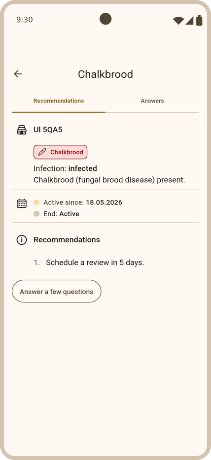{width=200}

Figure: Zakładka Powiadomienia - przykładowe powiadomienia chorobowe i techniczne (zakładki Problemy i Techniczne) (2) {#fig-notifications-technical}

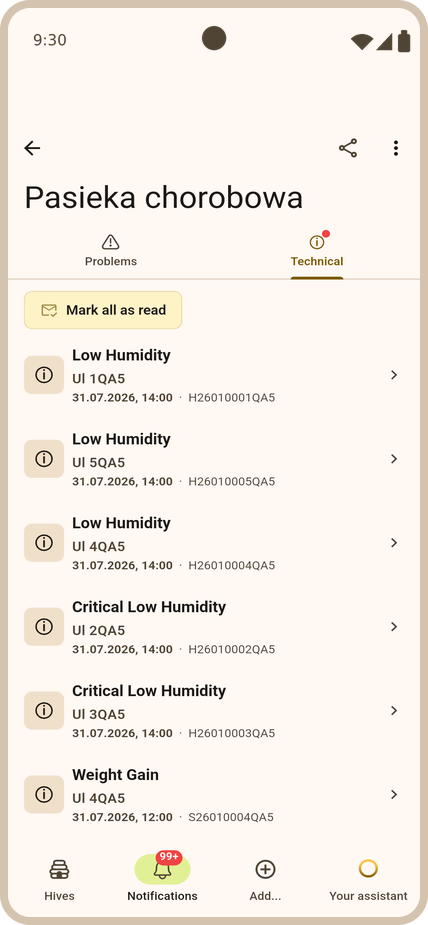{width=200}

Nowe powiadomienia pojawiają się automatycznie na odpowiedniej liście w zależności od ich rodzaju. Nieodczytane komunikaty są wyświetlane pogrubioną czcionką, a po otwarciu wracają do zwykłej grubości — po tym poznasz, że zostały już przeczytane.

Szczegóły otwierasz kliknięciem wiersza, ale obie zakładki zachowują się inaczej. W zakładce *Problemy* otworzy się osobny widok epizodu choroby. W zakładce *Techniczne* wiersz rozwinie się w miejscu i pełna treść komunikatu pojawi się pod jego tytułem.

!!! tip
    Aby jednym kliknięciem oznaczyć wszystkie powiadomienia w zakładce *Techniczne* jako przeczytane, użyj przycisku *Oznacz wszystkie jako przeczytane*. Zakres działania przycisku zależy od miejsca, z którego zostanie użyty:
    - z poziomu pojedynczego ula — zostaną oznaczone jako przeczytane wyłącznie powiadomienia techniczne dotyczące tego ula,
    - z poziomu pasieki — zostaną oznaczone jako przeczytane wszystkie powiadomienia techniczne dotyczące tej pasieki oraz znajdujących się w niej uli.

______________________________________________________________________

## Asystent AI

Asystent AI to funkcja wspierająca użytkownika w analizie sytuacji w pasiece oraz w interpretacji obserwowanych zjawisk. Na podstawie przekazanych informacji system generuje odpowiedzi i wskazówki, które mogą pomóc w podejmowaniu decyzji dotyczących prowadzenia pasieki.

Z asystenta AI można korzystać poprzez zadawanie pytań w aplikacji ().

Figure: Zakładka Twój asystent - przykładowe pytanie zadane asystentowi AI (1) {#fig-apiary-beehives}

{width=200}

Figure: Zakładka Twój asystent - przykładowe pytanie zadane asystentowi AI (2) {#fig-ai-assistant}

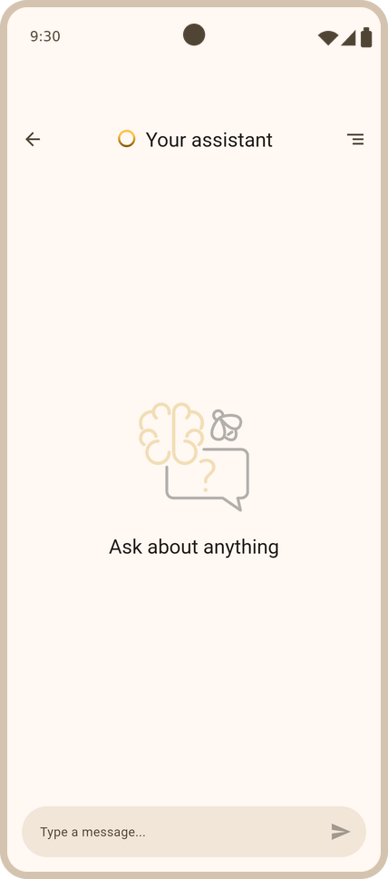{width=200}

Po przesłaniu pytania asystent analizuje dostępne informacje i generuje odpowiedź zawierającą możliwe wyjaśnienia sytuacji lub sugestie dalszego postępowania.

Z asystenta AI można skorzystać poprzez wybór zakładki *Twój asystent* z dolnego menu, dostępnej w podstawowych widokach aplikacji (*Pasieki*, *Ule*, *Ul*). Dzięki temu użytkownik ma szybki dostęp do pomocy asystenta w dowolnym momencie korzystania z systemu.

______________________________________________________________________

## Zarządzanie kontem

Użytkownik może przeglądać oraz modyfikować swoje dane, zmieniać ustawienia konta, a także zarządzać preferencjami dotyczącymi działania aplikacji.

### 1. Edycja danych użytkownika

Funkcja edycji danych użytkownika umożliwia aktualizację podstawowych informacji przypisanych do konta, takich jak wyświetlana nazwa użytkownika, dane kontaktowe czy hasło. Dzięki temu użytkownik może na bieżąco zarządzać swoimi danymi oraz dostosować ustawienia konta do własnych potrzeb.

#### 1.1 Edycja danych

Aby edytować dane użytkownika, należy:

- W zakładce *Pasieki* (widok startowy aplikacji Apisense) kliknij ikonę **⋮**, znajdującą się w prawej górnej części ekranu, i wybierz *Ustawienia*. W rezultacie zostanie otwarty widok *Ustawienia konta* ().
- Widok *Ustawienia konta* składa się z kilku sekcji: **Wyświetlana nazwa**, **E-mail**, **Telefon komórkowy**, **Doświadczenie**, **Hasło**, **Język** oraz **Jednostki**. W każdej z nich prezentowane są aktualne dane użytkownika.
- Aby zmienić zawartość wybranej sekcji, należy kliknąć jej nagłówek, co spowoduje otwarcie nowego widoku, w którym możliwa będzie edycja danych. Przykładowo, w przypadku zmiany hasła użytkownik zostanie poproszony o wprowadzenie nowego hasła oraz jego powtórzenie ().
- Po wprowadzeniu zmian należy je zapisać, klikając żółty przycisk znajdujący się w prawym dolnym rogu ekranu.

Figure: Ustawienia konta - przykładowy widok ustawień oraz zmiana hasła (1) {#fig-app-settings}

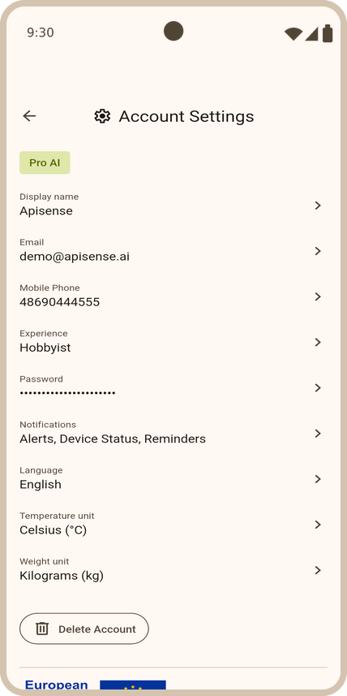{width=200}

Figure: Ustawienia konta - przykładowy widok ustawień oraz zmiana hasła (2) {#fig-change-password}

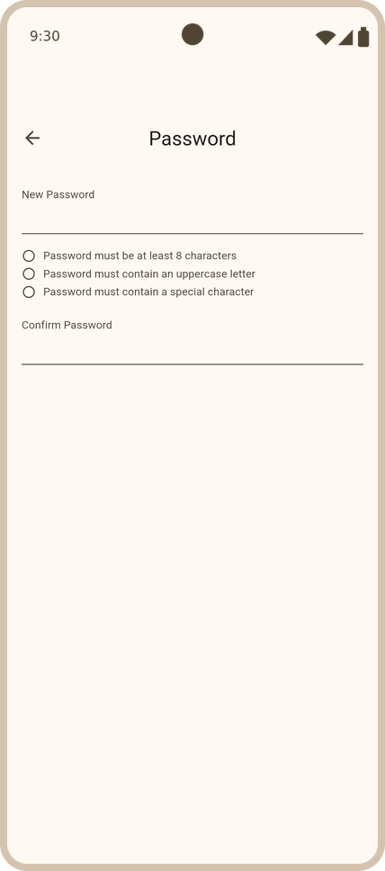{width=200}

#### 1.2 Usunięcie konta

W dolnej części widoku *Ustawienia konta* () dostępny jest również przycisk *Usuń konto*, który umożliwia trwałe usunięcie konta użytkownika.

### 2. Sprawdzenie wersji aplikacji

Aby sprawdzić, jaka wersja aplikacji Apisense jest aktualnie zainstalowana na Twoim urządzeniu:

- Przejdź do widoku *Ustawienia konta*. W tym celu kliknij ikonę **⋮**, znajdującą się w prawym górnym rogu zakładki *Pasieki*, i wybierz *Ustawienia*.
- Przewiń widok **na sam dół**.
- Na dole ekranu, w centralnej części zobaczysz wpis w formacie **Wersja X.Y.Z** (np. *Wersja 1.2.3*) - to numer zainstalowanej wersji aplikacji.

Warto porównyć ten numer z wersją dostępną w sklepie Google Play lub App Store przed zgłoszeniem problemu technicznego.

!!! note
    **Ekrany aktualizacji aplikacji:** Przy uruchomieniu aplikacja mobilna sprawdza, czy dostępna jest nowsza wersja.

    - Jeśli zainstalowana wersja **nie jest już wspierana**, wyświetlany jest pełnoekranowy komunikat *Wymagana aktualizacja*. Aby kontynuować korzystanie z aplikacji, musisz kliknąć *Aktualizuj* i zainstalować nową wersję ze sklepu.
    - Jeśli **istnieje nowsza wersja, ale Twoja nadal działa i jest wspierana**, pojawia się możliwe do zamknięcia okno *Dostępna nowa wersja* z opcjami *Aktualizuj* lub *Później*. Wybranie *Później* sprawi, że komunikat nie pojawi się ponownie, dopóki nie ukaże się jeszcze nowsza wersja.

    Po aktualizacji, przy pierwszym uruchomieniu aplikacja wyświetla okno **Co nowego** z krótkim, przesuwanym podsumowaniem zmian w nowej wersji — kliknij *Dalej*, aby przejrzeć nowości w aplikacji lub /*Pomiń*/*Gotowe*, aby zamknąć podsumowanie.

### 3. Preferencje jednostek

Sekcja *Jednostki* w *Ustawieniach konta* umożliwia wybór jednostek miar wyświetlanych w całej aplikacji:

- **Jednostka temperatury** — Celsjusz (°C) lub Fahrenheit (°F).
- **Jednostka wagi** — Kilogramy (kg) lub Funty (lbs).

Zmiany są widoczne od razu na wszystkich wykresach i odczytach w aplikacji.

______________________________________________________________________

## Zgłaszanie problemów i sugestii

Jeśli podczas korzystania z aplikacji zauważysz błąd, nieprawidłowe działanie funkcji lub masz pomysł na usprawnienie systemu, możesz zgłosić to bezpośrednio z poziomu aplikacji. Zachęcamy również do przesyłania propozycji nowych funkcji, które mogłyby ułatwić codzienną pracę z systemem.

Każde zgłoszenie jest analizowane przez zespół odpowiedzialny za rozwój aplikacji. Informacje zwrotne od użytkowników pomagają szybciej identyfikować problemy, poprawiać istniejące rozwiązania oraz rozwijać funkcje najlepiej odpowiadające potrzebom pszczelarzy.

### 1. Zgłaszanie problemów i sugestii w aplikacji

Aby zgłosić problem lub sugestię w aplikacji, należy wykonać poniższe kroki:

- Kliknij ikonę **⋮** (więcej opcji) dostępną z każdego widoku w aplikacji, znajdującą się w prawym górnym rogu ekranu, i wybierz *Dodaj sugestię* z menu (obok pozycji *Ustawienia* i *Wyloguj*). W efekcie zostanie otwarty widok *Dodaj sugestię* ().
- W widoku *Dodaj sugestię* uzupełnij następujące, wymagane pola:

    - **Wybierz kategorię** - wybierz jedną z dostępnych kategorii w zależności od tego, czy chcesz zgłosić problem czy sugestię ulepszenia aplikacji.
    - **Opis** - wprowadź opis problemu lub tego, co chciałbyś zmienić w aplikacji

- Opcjonalnie możesz załączyć również zdjęcia do swojego zgłoszenia, co jest szczególnie przydatne jeśli zgłaszasz problem znaleziony w aplikacji. Uwaga: do zgłoszenia możesz dołączyć jedynie zdjęcia - nagrania nie są akceptowane. 
- Po uzupełnieniu powyższych informacji kliknij żółty przycisk *Wyślij sugestię*, wyświetlany w prawym dolnym rogu widoku, co spowoduje przesłanie zgłoszenia.

Figure: Widok Dodaj sugestię - przykładowy problem zgłoszony poprzez aplikację {#fig-add-suggestion}

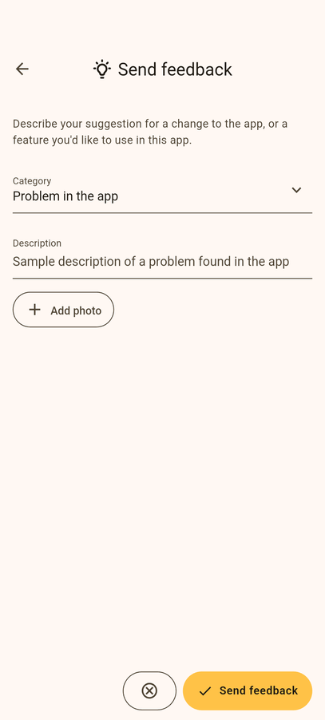{width=200}

______________________________________________________________________

## Dobre praktyki użytkowania systemu

### 1. Codzienne korzystanie z panelu

- Regularnie przeglądaj najważniejsze widoki apliakacji, w szczególności listę pasiek i uli, aby na bieżąco śledzić statusy i pomiary. Reaguj na alarmy i powiadomienia w aplikacji w terminie.

### 2. Uzupełnianie notatek i przeglądów

- Po każdej wizycie w pasiece dodawaj notatki i przeglądy w aplikacji (najlepiej z załącznikami w postaci zdjęć). Dzięki temu możliwe będzie analizowanie historii działań oraz dokładniejsza ocena sytuacji przez system.

### 3. Regularne sprawdzanie alarmów

- Sprawdzaj zakładkę ***Powiadomienia*** w aplikacji, aby nie przeoczyć krytycznych zdarzeń, takich jak wykrycie choroby.

### 4. Kontrola poziomu baterii przed sezonem

- Przed sezonem sprawdź w aplikacji poziom baterii wszystkich urządzeń monitorujących stan Twoich pasiek. Wymień baterie (2×AA w Scale i VitalSensor) przy niskim poziomie; Hub ładuj przez panel fotowoltaiczny lub sieć. Unikaj przerw w transmisji w szczycie sezonu. Po wymianie baterii w Scale lub VitalSensor nie trzeba ponownie parować urządzenia ani zmieniać ustawień w aplikacji — wystarczy umieścić urządzenie w zasięgu Huba i poczekać na synchronizację danych (szczegóły: [FAQ — po wymianie baterii](../faq/index.md#po-wymianie-baterii)).

### 5. Aktualizacje

- Aktualizuj aplikację mobilną do najnowszej wersji (Google Play / App Store), aby mieć dostęp do ulepszeń i nowych funkcji. Jeśli Twoja wersja nie jest już wspierana, aplikacja będzie wymagać aktualizacji przed dalszym korzystaniem (zobacz [Sprawdzenie wersji aplikacji](#2-sprawdzenie-wersji-aplikacji)).
- Aktualizacje systemu operacyjnego urządzenia również wpływają na stabilność działania aplikacji.

______________________________________________________________________

## Rozwiązywanie problemów

### 1. Często zadawane pytania i proponowane rozwiązania

#### 1.1 Brak danych w aplikacji

**Rozwiązanie:** upewnij się, że urządzenia (Hub, Scale, VitalSensor) są włączone, w zasięgu BLE (do ok. 35 m od Huba) i że minęło do ok. 2 godzin od pierwszego uruchomienia. Sprawdź baterie i zasilanie Huba (panel PV lub sieć). Szczegółowa lista problemów i rozwiązań związanych z komunikacją urządzeń znajduje się w **Instrukcji konfiguracji urządzeń** (rozdział Rozwiązywanie problemów).

#### 1.2 Nie mogę się zalogować

**Rozwiązanie:** sprawdź poprawność wprowadzonej nazwy użytkownika i hasła. Jeśli zapomniałeś hasła skontaktuj się z z pomocą Apisense: **bee@apisense.ai**.

#### 1.3 Aplikacja pokazuje "Wymagana aktualizacja" i nie mogę wejść do aplikacji

**Rozwiązanie:** oznacza to, że zainstalowana wersja nie jest już wspierana. Kliknij *Aktualizuj*, aby zainstalować najnowszą wersję z Google Play / App Store, a następnie uruchom aplikację ponownie.

#### 1.4 Czy jest możliwe, aby waga ula wskazywała wartość dodatnią, podczas gdy przybytek miodu był ujemny, mimo że jest on wyliczany na podstawie pomiarów wagi?

**Rozwiązanie:** tak, jest to jak najbardziej możliwe. Przykładowo, pszczelarz może dołożyć półkorpus, co spowoduje wzrost całkowitej masy ula. Jednocześnie, jeśli rodzina pszczela jest osłabiona, produkcja miodu może się zmniejszyć. W takiej sytuacji na wykresie wagi ula widoczny będzie wyraźny wzrost wynikający z dołożenia półkorpusu. Natomiast na wykresie przybytku masa dodanego półkorpusu nie zostanie uwzględniona, dzięki czemu wykres będzie odzwierciedlał wyłącznie rzeczywistą zmianę ilości miodu. W efekcie na wykresie przybytku widoczny będzie spadek związany z ograniczoną aktywnością pszczół, a nie sztuczny wzrost wynikający z ingerencji pszczelarza.

#### 1.5 Co zrobić po wymianie baterii w Scale lub VitalSensor?

**Rozwiązanie:** po wymianie baterii wystarczy:

- ponownie umieścić urządzenie Scale lub VitalSensor w jego docelowym miejscu,
- upewnić się, że znajduje się ono w zasięgu Huba (maksymalnie około 35 m),
- poczekać na kolejny cykl pomiarowy.

Zaktualizowane dane pojawią się w aplikacji automatycznie - może to potrwać do kilku godzin, pod warunkiem że Hub poprawnie komunikuje się z systemem (nie jest w trybie offline - rozładowana bateria/brak łączności).

Po zakończeniu wymiany baterii **nie są wymagane** żadne dodatkowe czynności w aplikacji ani na urządzeniu Hub, Scale ani VitalSensor. Nie należy ponownie parować urządzeń, dodawać ich do ula ani naciskać przycisku RESET.

#### 1.6 Czy po wymianie baterii muszę ponownie sparować urządzenie, dodać je do ula lub usunąć ul z aplikacji?

**Rozwiązanie:** nie. Wymiana baterii w Scale lub VitalSensor nie wymaga ponownego parowania urządzenia, usuwania ani ponownego dodawania urządzenia do ula ani usuwania ula z aplikacji. Wystarczy umieścić urządzenie z powrotem w zasięgu łączności Huba i poczekać na kolejną synchronizację danych. Hub musi przy tym poprawnie komunikować się z systemem (nie może być w trybie offline — rozładowany lub brak łączności).

#### 1.7 Czy po rozładowaniu Huba lub wymianie baterii w Scale/VitalSensor muszę nacisnąć przycisk RESET na Hubie?

**Rozwiązanie:** nie. Nie należy wykonywać resetu Huba po wymianie baterii w urządzeniach Scale lub VitalSensor. Po rozładowaniu Huba i ponownym podłączeniu go do ładowania lub wystawieniu na słońce Hub automatycznie wznowi pracę, połączy się z systemem i urządzeniami — bez naciskania przycisku RESET.

#### 1.8 Inne problemy

**Rozwiązanie:** skontaktuj się z pomocą techniczną Apisense: **bee@apisense.ai**.

______________________________________________________________________

## Instrukcja w skrócie

Poniżej znajdziesz skrót najważniejszych czynności w aplikacji Apisense Pro AI. Każdy punkt zawiera krótki opis oraz odnośniki do szczegółowych rozdziałów instrukcji; przy wybranych czynnościach dołączono też link do krótkiego materiału wideo.

### 1. Rejestracja i logowanie

- **Rejestracja:** Pobierz aplikację mobilną Apisense lub wejdź na stronę internetową systemu. Wybierz *Załóż konto*, wypełnij dane (nazwa użytkownika, e-mail, telefon), utwórz hasło spełniające wymagania i kliknij *Zarejestruj się*.

> [Wideo](#wideo-rejestracja), [Rejestracja](#1-rejestracja)

- **Logowanie:** Uruchom aplikację lub stronę internetową, w widoku *Zaloguj się* wpisz nazwę użytkownika i hasło, następnie kliknij *Zaloguj się*.

> [Logowanie](#2-logowanie)

### 2. Zarządzanie pasieką

- **Dodawanie pasieki:** W zakładce *Pasieki* wybierz *Dodaj pasiekę* z dolnego menu. W widoku *Dodaj pasiekę* wpisz nazwę i wybierz *Z urządzeniami* (zeskanuj kod QR z Huba) lub *Bez urządzeń*, następnie zapisz.

> [Wideo](#wideo-dodaj-pasieke), [Dodawanie pasieki z urządzeniami](#111-dodawanie-pasieki-z-urzadzeniami), [Dodawanie pasieki bez urządzeń](#112-dodawanie-pasieki-bez-urzadzen)

- **Edycja pasieki:** Kliknij kafelek wybranej pasieki. Kliknij ikonę **⋮** będąc w zakładce *Ule* i wybierz *Ustawienia*. W widoku *Ustawienia pasieki* kliknij nagłówek sekcji, dla której chcesz zedytować dane. Zmień wartości pól i kliknij zapisz (żółty przycisk).

> [Edycja pasieki](#12-edycja-pasieki)

- **Usuwanie pasieki:** Kliknij kafelek wybranej pasieki. Kliknij ikonę **⋮** będąc w zakładce *Ule* i wybierz *Ustawienia*. W widoku *Ustawienia pasieki* kliknij przycisk *Usuń pasiekę*.

> [Usuwanie pasieki](#13-usuwanie-pasieki)

- **Dodawanie ula:** Kliknij kafelek wybranej pasieki. Wybierz *Dodaj…* → *Dodaj ul* z dolnego menu. Wypełnij dane w sekcji *Szczegóły ula*, *Informacje o matce pszczelej* oraz zeskanuj kody QR z urządzeń Scale i VitalSensor. Kliknij żółty przycisk Zapisz.

> [Wideo](#wideo-dodaj-ul), [Dodawanie ula](#21-dodawanie-ula)

- **Edycja ula:** Kliknij kafelek wybranej pasieki. Kliknij kafelek wybranego ula. Kliknij ikonę **⋮** będąc w zakładce *Szczegóły* i wybierz *Ustawienia*. W widoku *Ustawienia ula* kliknij nagłówek sekcji, dla której chcesz zedytować dane. Zmień wartości pól i kliknij zapisz (żółty przycisk).

> [Edycja ula](#22-edycja-ula)

- **Usuwanie ula:** Kliknij kafelek wybranej pasieki. Kliknij kafelek wybranego ula. Kliknij ikonę **⋮** będąc w zakładce *Szczegóły* i wybierz *Ustawienia*. W widoku *Ustawienia ula* kliknij przycisk *Usuń ul*.

> [Usuwanie ula](#23-usuwanie-ula)

- **Dodawanie przeglądów:** Kliknij kafelek wybranej pasieki. Kliknij kafelek wybranego ula. Wybierz *Dodaj...* -> *Przegląd* z dolnego menu. Załącz łącznie 4 wymagane zdjęcia ramek (kliknij *Zobacz przykład*, jeśli nie wiesz, jak powinny wyglądać). Odpowiedz na pytania. Żółta strzałka w prawo umożliwia przejście do następnego pytania. Kliknij *Zakończ przegląd* (żółty przycisk w ostatnim oknie przeglądu) by zapisać. Rozpoczęty przegląd można zapisać jako szkic (przechowywany 24 godziny); zakończony przegląd można później edytować lub usunąć z menu dodatkowego lub klikając ikonę ołówka/kosza na liście przeglądów.

> [Wideo](#wideo-dodaj-przeglad), [Dodawanie przeglądów](#dodawanie-przegladow)

- **Dodawanie notatek:** Kliknij kafelek wybranej pasieki. Kliknij kafelek wybranego ula. Wybierz *Dodaj...* -> *Notatkę* z dolnego menu. Wprowadź zawartość notatki (tekst lub nagraj notatkę głosową, możesz dodać też zdjęcia lub nagrania (*+*)). Zapisz notatkę (żółty przycisk).

> [Wideo — notatka tekstowa](#wideo-notatka-tekst)
> [Wideo — notatka audio](#wideo-notatka-audio) 
> [Notatki](#4-notatki)

- **Zgłaszanie obserwacji szerszenia azjatyckiego:** Kliknij ikonę szerszenia azjatyckiego na kafelku pasieki, następnie przycisk *Zgłoś obserwację* i odpowiedz na pytanie *Czy widzisz teraz szerszenia azjatyckiego?* (Tak/Nie). Ikona szerszenia azjatyckiego zostanie odpowiednio zaktualizowana (aktywna obserwacja / sprawdzono, czysto / nieaktualne), a nad nią pojawi się data ostatniego zgłoszenia.  

> [Obserwacja szerszenia azjatyckiego](#obserwacja-szerszenia)

### 3. Zdrowie rodziny

- **Wypełnianie formularza chorobowego z poziomu pasieki:** Kliknij kafelek wybranej pasieki. Wybierz *Powiadomienia* z dolnego menu. W zakładce *Problemy* kliknij wiersz z chorobą — otworzy się osobny widok ze szczegółami. Kliknij przycisk *Odpowiedz na kilka pytań*. Udziel odpowiedzi na pytania (Tak / Nie / Pomiń). Aby przejść do kolejnego, kliknij żółtą strzałkę w prawo. Na koniec kliknij *Zapisz*.

> [Wideo](#wideo-potwierdz-chorobe), [Wypełnianie formularza z poziomu pasieki](#formularz-chorobowy-pasieka)

- **Wypełnianie formularza chorobowego z poziomu ula:** Kliknij kafelek wybranej pasieki. Kliknij kafelek wybranego ula. Wybierz *Powiadomienia* z dolnego menu. W zakładce *Problemy* kliknij wiersz z chorobą — otworzy się osobny widok ze szczegółami. Kliknij przycisk *Odpowiedz na kilka pytań*. Udziel odpowiedzi na pytania (Tak / Nie / Pomiń). Aby przejść do kolejnego, kliknij żółtą strzałkę w prawo. Na koniec kliknij *Zapisz*.

> [Wideo](#wideo-potwierdz-chorobe), [Wypełnianie formularza z poziomu ula](#formularz-chorobowy-ul)

- **Rejestrowanie próbki:** Kliknij kafelek wybranej pasieki. Kliknij kafelek wybranego ula. Wybierz *Dodaj...* -> *Zarejestruj próbkę* z dolnego menu. Wybierz datę pobrania próbki i rodzaj badania. Kliknij przycisk *Wygeneruj kod*. Zapisz *Kod badania* na próbce i wyślij do Apisense. (Uwaga: opcja Zarejestruj próbkę jest dostępna tylko w ulu z przypisanym urządzeniem VitalSensor).

> [Wideo](#wideo-zarejestruj-probke), [Rejestrowanie próbki](#rejestrowanie-probki)

- **Dodawanie badania:** Kliknij kafelek wybranej pasieki. Kliknij kafelek wybranego ula. Z dolnego menu wybierz *Dodaj... -> Badanie*. Wybierz datę i rodzaj badania z listy rozwijanej (np. Flotacja), uzupełnij wymagane zdjęcia i pola (np. liczba roztoczy warrozy), następnie zapisz żółtym przyciskiem. Zapisane badanie można później edytować lub usunąć z menu dodatkowego lub klikając ikonę ołówka/kosza na liście badań.

> [Dodawanie badania](#41-dodawanie-badania)

- **Dodawanie analizy ramki:** Kliknij kafelek wybranej pasieki. Kliknij kafelek wybranego ula. Z dolnego menu wybierz *Dodaj... -> FrameSense*. Umieść ramkę w obrysie widoku aparatu, zrób lub wgraj jedno zdjęcie ramki pszczelej i kliknij *Wyślij do analizy*. Wynik (*Analizujemy* / *Analiza zakończona* / *Analiza nie powiodła się*) śledź w zakładce *FrameSense*. Wejdź w szczegóły analizy i sprawdź podsumowanie oraz rekomendacje.

> [FrameSense](#analiza-ramki)

### 4. Panel główny i nawigacja

- **Lista pasiek (zakładka Pasieki):** Widok startowy po zalogowaniu się do aplikacji Apisense - kafelki pasiek z podstawowymi informacjami. Kliknij pasiekę, aby przejść do listy uli.

> [Wideo](#wideo-dodaj-pasieke), [Omówienie listy pasiek (zakładka Pasieki)](#omowienie-listy-pasiek)

- **Mapa pasiek:** Po zalogowaniu do aplikacji, z dolnego menu wybierz *Mapa*, aby zobaczyć lokalizacje pasiek. Możesz filtrować widok według problemów (np. Warroza).

> [Omówienie mapy pasiek (zakładka Mapa)](#omowienie-mapy-pasiek)

- **Lista uli (zakładka Ule):** Kliknij kafelek wybranej pasieki. W rezultacie pojawią się wszystkie ule przypisane do tej pasieki. Widok *Ule* prezentuje listę uli; kliknij wybrany ul, aby przejść do szczegółów.

> [Wideo](#wideo-dodaj-ul), [Omówienie listy uli (zakładka Ule)](#omowienie-listy-uli)

- **Zawartość ula (zakładka Szczegóły):** Górne zakładki to *Stan ula*, *Przegląd* i *FrameSense*; *Notatki*, *Zadania*, *Badania* i *Próbki* znajdziesz pod *Więcej*. Możesz wyświetlić również wykresy poszczególnych parametrów np. Przybytek miodu.

> [Omówienie zawartości ula (zakładka Szczegóły)](#omowienie-zawartosci-ula)

- **Ustawienia pasieki i ula:** Ikona **⋮** w widoku pasieki (zakładka *Ule*) lub ula (zakładka *Szczegóły*) prowadzi do ustawień (obok pozycji *Dodaj sugestię* i *Wyloguj*). Możesz tu edytować informacje o pasiece lub ulu.

> [Omówienie ustawień pasieki](#omowienie-ustawien-pasieki), [Omówienie ustawień ula](#omowienie-ustawien-ula)

### 5. Monitorowanie i analiza danych

- **Parametry (temperatura, wilgotność, ciśnienie, waga, przybytek miodu):** Kliknij kafelek wybranej pasieki. Kliknij kafelek wybranego ula. Bieżące wartości są widoczne w zakładce *Szczegóły* ula, podzakładka *Stan ula*, w sekcjach *Waga*, *Warunki*.

> [Monitorowanie parametrów](#monitorowanie-parametrow)

- **Wykresy:** Kliknij kafelek wybranej pasieki. Kliknij kafelek wybranego ula. W zakładce *Szczegóły* -> *Stan ula* rozwiń sekcję *Waga* lub *Warunki* i kliknij w wybrany parametr, aby zobaczyć wykres w wybranym przedziale czasowym (24 h, 7 dni, 1–6 miesięcy). Kliknij przycisk *Pełny ekran*, aby powiększyć wykres, następnie zsuń/rozsuń palce lub przeciągnij, albo skorzystaj z przycisków na ekranie, aby przybliżyć i przesunąć widok i wyświetlić dokładne pomiary.

> [Wizualizacja danych na wykresach](#1-wizualizacja-danych-na-wykresach)

- **Trendy:** Kliknij kafelek wybranej pasieki. Kliknij kafelek wybranego ula. W zakładce *Szczegóły* -> *Stan ula* rozwiń sekcję *Waga* lub *Warunki* i kliknij w wybrany parametr, aby wyświetlić wykres. Na ekranie wykresu włącz przełącznik *Pokaż trend*.

> [Trendy](#2-trendy)

### 6. Powiadomienia

- **Powiadomienia:** Kliknij kafelek wybranej pasieki. Wybierz zakładkę *Powiadomienia* z dolnego menu. Dostępne są kategorie: *Problemy* (m.in. choroby) oraz *Techniczne* (urządzenia, łączność).

> [Powiadomienia](#powiadomienia)

### 7. Asystent AI

- **Twój asystent AI:** Z dolnego menu wybierz *Twój asystent* (dostęp z widoków *Pasieki*, *Ule*, *Szczegóły*), następnie wpisz pytanie i wyślij do asystenta. Asystent przeanalizuje dane i udzieli odpowiedzi.

> [Twój asystent AI](#twoj-asystent-ai)

### 8. Konto

- **Edycja danych użytkownika:** W widoku startowym *Pasieki* kliknij ikonę **⋮** i wybierz *Ustawienia*. Możesz zmienić nazwę, e-mail, telefon, hasło oraz język. Z tego miejsca możesz też usunąć konto.

> [Edycja danych użytkownika](#edycja-danych-uzytkownika)

- **Sprawdzenie wersji aplikacji:** W widoku *Ustawienia konta* przewiń na sam dół ekranu — zobaczysz wpis **Wersja X.Y.Z**. Jeśli Twoja wersja nie jest już wspierana, aplikacja przy uruchomieniu wyświetli zamiast tego pełnoekranowy komunikat *Wymagana aktualizacja*.

> [Sprawdzenie wersji aplikacji](#2-sprawdzenie-wersji-aplikacji)

### 9. Zgłaszanie problemów i sugestii

- **Zgłaszanie w aplikacji:** Kliknij ikonę **⋮** w prawym górnym rogu dowolnego widoku i wybierz *Dodaj sugestię*. Wypełnij kategorię i opis, opcjonalnie dołącz zdjęcia. Kliknij *Wyślij sugestię*.

> [Zgłaszanie problemów i sugestii](#zglaszanie-problemow-i-sugestii)

______________________________________________________________________

W razie problemów wyszukaj problem na liście [Często zadawane pytania i proponowane rozwiązania](#faq-czesto-zadawane) lub skontaktuj się z pomocą Apisense: **bee@apisense.ai**.

______________________________________________________________________
