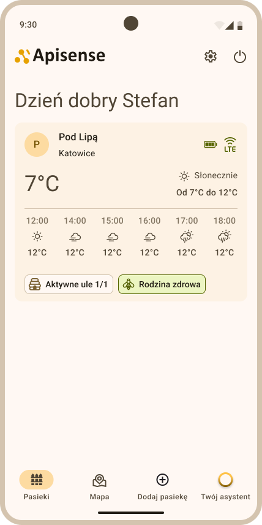

# Instrukcja konfiguracji urządzeń

## Spis treści

- [Wprowadzenie](#wprowadzenie)
- [Cel](#cel)
- [Wymagania wstępne](#wymagania-wst%C4%99pne)
- [Zawartość zestawu Apisense](#zawarto%C5%9B%C4%87-zestawu-apisense)
- [Rejestracja / Logowanie w systemie](#rejestracja-logowanie-w-systemie)
- [Dodanie urządzeń do systemu i pierwsze uruchomienie](#dodanie-urz%C4%85dze%C5%84-do-systemu-i-pierwsze-uruchomienie)
- [Montaż urządzeń](#monta%C5%BC-urz%C4%85dze%C5%84)
- [Test poprawności działania urządzeń](#test-poprawno%C5%9Bci-dzia%C5%82ania-urz%C4%85dze%C5%84)
- [Rozwiązywanie problemów](#rozwi%C4%85zywanie-problem%C3%B3w)
- [Instrukcja w skrócie](#instrukcja-w-skr%C3%B3cie)
- [Lista dobrych praktyk](#lista-dobrych-praktyk)

______________________________________________________________________

## Wprowadzenie

**Apisense** to inteligentny system ochrony pszczół, który daje pszczelarzom pełną kontrolę nad zdrowiem rodzin pszczelich i umożliwia wczesne wykrywanie zagrożeń w ulach. System korzysta z nowoczesnych czujników IoT oraz algorytmów sztucznej inteligencji do analizy stanu zdrowia pszczół, na bieżąco analizując m.in. skład i poziom feromonów pszczelich odpowiadających za komunikację wewnątrz kolonii. Dzięki Apisense ograniczasz stosowanie chemii oraz koszty utrzymania pasieki, a efektem są silniejsze rodziny i wyższe zbiory miodu o najwyższej jakości. Niniejsza instrukcja konfiguracji prowadzi krok po kroku przez montaż, rejestrację i dodanie urządzeń do systemu.

#### **Uwaga:** Przed przystąpieniem do montażu poszczególnych urządzeń wchodzących w skład zestawu Apisense należy przejść etapy opisane w rozdziałach [Rejestracja / Logowanie w systemie](#rejestracja-logowanie-w-systemie) oraz [Dodanie urządzeń do systemu i pierwsze uruchomienie](#dodanie-urz%C4%85dze%C5%84-do-systemu-i-pierwsze-uruchomienie).

______________________________________________________________________

## Cel

- **Rejestracja w systemie** — umożliwia utworzenie indywidualnego konta użytkownika oraz pozwala na korzystanie z aplikacji, alarmów i systemu rekomendacji.
- **Dodanie urządzeń do systemu** — pozwala na ich powiązanie z kontem użytkownika, przypisanie urządzeń do pasiek i uli oraz zapewnia stały dostęp do informacji o stanie zdrowia pszczół.
- **Bezpieczne uruchomienie** — poprawne pierwsze uruchomienie i weryfikacja działania zapewniają wiarygodne dane oraz 24/7 zdalny monitoring i pełną kontrolę nad ulem.
- **Prawidłowy montaż urządzeń IoT** — kluczowy dla uzyskania wiarygodnych pomiarów oraz długotrwałej i bezawaryjnej pracy systemu. Urządzenia Apisense są niewielkich rozmiarów i montuje się je bezinwazyjnie; montaż nie wymaga wymiany uli ani ingerencji w ich budowę.

______________________________________________________________________

## Wymagania wstępne

1. **Smartfon lub komputer** — do rejestracji, logowania i codziennego korzystania z panelu pszczelarza oraz powiadomień i wskazówek.
2. **Dostęp do Internetu** — niezbędny do synchronizacji danych, alarmów i zdalnego monitoringu 24/7.
3. **Zestaw Apisense** — komplet urządzeń (Hub, Scale, VitalSensor) dostarczony przez Apisense oraz dostęp do kompleksowego systemu monitoringu pasiek Apisense Pro AI.

______________________________________________________________________

## Zawartość zestawu Apisense

### 1. Elementy w opakowaniu

- **Apisense Hub** — bramka LTE z panelem solarnym (**Rys. 1**), zapewniająca komunikację z pozostałymi urządzeniami i zbieranie danych.

 <strong>Rys. 1</strong> Apisense Hub — bramka LTE z panelem solarnym w zestawie

- **Apisense Scale** — waga pasieczna (**Rys. 2**) umożliwiająca śledzenie przybytku miodu, z funkcją monitorowania temperatury na zewnątrz ula.

 <strong>Rys. 2</strong> Apisense Scale — waga pasieczna w zestawie

- **Apisense VitalSensor** — czujnik do umieszczenia w ulu (**Rys. 3**), wyposażony w zintegrowany sensor gazu, mikrofon akustyczny oraz moduły monitorujące temperaturę i wilgotność.

 <strong>Rys. 3</strong> Apisense VitalSensor — czujnik w zestawie

- **Elementy montażowe** — do bezpiecznego i stabilnego zamocowania urządzeń (montaż nie wymaga wymiany uli ani ingerencji w ich budowę). W skład elementów montażowych wchodzą:

    - **Uchwyt aparatowy** - element wykorzystywany do montażu Apisense Hub, umożliwiający stabilne zamocowanie urządzenia.
    - **Drewniana kantówka** - element stabilizujący, umożliwiający prawidłowe ustawienie i wypoziomowanie wagi (Scale) pod ulem. Zapewnia równomierne rozłożenie ciężaru ula na czujniki pomiarowe oraz utrzymuje stabilność całej konstrukcji.
    - **Uchwyty montażowe do ramki** - elementy umożliwiające bezpieczne i stabilne zamocowanie Apisense VitalSensor bezpośrednio na ramce ula. Konstrukcja uchwytów pozwala na montaż bez trwałych modyfikacji ula oraz bez zakłócania pracy rodziny pszczelej.

- **Naklejki z kodem QR** — do szybkiej rejestracji pasieki i uli w systemie oraz identyfikacji urządzeń. Naklejki (**Rys. 4**) umieszczone są na poszczególnych urządzeniach (Hub, Scale, VitalSensor) oraz na uchwycie do VitalSensor (**Rys. 5**).

 <strong>Rys. 4</strong> Naklejka z kodem QR na Apisense Hub, Scale i VitalSensor

 <strong>Rys. 5</strong> Naklejka z kodem QR na uchwycie do VitalSensor

- **Zasilanie** — system monitoringu pasieki zasilany jest bateryjnie oraz akumulatorowo, w zależności od typu urządzenia. W skład zestawu zasilającego dostarczanego do użytkownika wchodzą następujące elementy:

    - 4x bateria AA
    - 1x wbudowany akumulator Li-Ion (litowo-jonowy) w urządzenie Apisense Hub
    - 1x panel fotowoltaiczny przymocowany na stałe do urządzenia Apisense Hub
    - 1x przewód zasilający i zasilacz sieciowy do ładowania sieciowego

#### 1.1. Dane techniczne

- **Hub** - urządzenie wyposażone jest w akumulator litowo-jonowy (Li-Ion) wielokrotnego ładowania. Czas pracy do 2 tygodni bez doładowywania z panelu fotowoltaicznego, możliwość ładowania z sieci elektrycznej. Ładowanie sieciowe odbywa się za pomocą standardowego zasilacza niskonapięciowego, stosowane jest złącze DC 12V lub USB-C.
- **Scale** - urządzenie zasilane jest dwiema bateriami typu AA (2×AA). Przewidywany czas pracy na jednym komplecie baterii wynosi minimum 36 miesięcy, w zależności od intensywności transmisji danych oraz jakości zastosowanych baterii.
- **VitalSensor** - urządzenie zasilane jest dwiema bateriami typu AA (2×AA). Szacowany czas pracy wynosi 12 miesięcy na jednym komplecie baterii. Czas działania zależy od częstotliwości pomiarów i transmisji danych, temperatury i jakości zastosowanych ogniw. Zaleca się kontrolę poziomu baterii w systemie i niezwłoczną wymianę baterii w przypadku powiadomień o zbliżającym się wyczerpaniu.

### 2. System Apisense Pro AI

- **Aplikacja Apisense** — główny interfejs systemu Apisense ([Apisense Pro AI](https://app.apisense.ai/)), umożliwiający zarządzanie ulami, analizę danych pomiarowych oraz bieżący nadzór nad stanem pasieki (**Rys. 6**).
    Po zalogowaniu użytkownik uzyskuje dostęp do wszystkich funkcji związanych z jego kontem oraz przypisanymi urządzeniami pomiarowymi.
    Interfejs zapewnia przejrzysty podgląd aktualnych parametrów środowiskowych, takich jak temperatura, wilgotność czy masa ula, prezentowanych w formie wykresów i zestawień. Użytkownik może monitorować zmiany w czasie rzeczywistym, analizować dane historyczne oraz reagować na ewentualne nieprawidłowości dzięki systemowi powiadomień i rekomendacji.

 <strong>Rys. 6</strong> Widok z Systemu Apisense Pro AI

______________________________________________________________________

## Rejestracja / Logowanie w systemie

System Apisense Pro AI jest dostępny pod następującym adresem: [Apisense Pro AI](https://app.apisense.ai/) oraz poprzez aplikację mobilną Apisense, którą można pobrać w sklepach Google Play oraz App Store.

### 1. Rejestracja - krok po kroku

- Pobierz aplikację mobilną i uruchom ją lub przejdź pod podany adres: [Apisense Pro AI](https://app.apisense.ai/). Po uruchomieniu aplikacji pojawi się ekran z możliwością założenia konta (**Rys. 7**).

 <strong>Rys. 7</strong> Rejestracja do Systemu Apisense Pro AI — widok startowy Załóż konto

- W wyznaczonych polach wprowadź następujące dane:

    - Nazwa użytkownika
    - Adres email
    - Numer telefonu komórkowego

    Potwierdź zapoznanie się z regulaminem oraz polityką prywatności zaznaczając odpowiednie pole, a następnie kliknij przycisk *Dalej* (**Rys. 8**).

 <strong>Rys. 8</strong> Rejestracja do Systemu Apisense Pro AI — przykład poprawnie wypełnionych danych do rejestracji w widoku Załóż konto

- Zostanie wyświetlony kolejny widok - Utwórz hasło. W tym widoku zostaniesz poproszony o utworzenie silnego hasła (**Rys. 9**), które będziesz potem wykorzystywał, by zalogować się do systemu. Hasło musi zawierać:

    - Co najmniej 1 znak specjalny (np. #, $, %, \_)
    - Co najmniej 1 cyfrę
    - Co najmniej 1 wielką literę
    - Co najmniej 8 znaków

    Następnie wpisz ponownie to samo hasło w pole *Powtórz hasło* i przejdź do kolejnego kroku klikając przycisk *Dalej*.

 <strong>Rys. 9</strong> Rejestracja do Systemu Apisense Pro AI — przykład poprawnie wypełnionych pól w widoku Utwórz hasło

- To już ostatni etap rejestracji. W tym kroku odpowiedz na pytanie od ilu lat zajmujesz się pszczelarstwem zaznaczając jedną z dwóch możliwych odpowiedzi, po czym kliknij przycisk *Dalej* (**Rys. 10**).

 <strong>Rys. 10</strong> Rejestracja do Systemu Apisense Pro AI — przykład odpowiedzi na pytanie o doświadczenie

- Jeśli wszystko przebiegło pomyślnie powinieneś zobaczyć poniższy ekran startowy - witamy w Apisense! (**Rys. 11**):

 <strong>Rys. 11</strong> Ekran startowy po pomyślnej rejestracji do Systemu Apisense Pro AI — Witamy w Apisense!

### 2. Logowanie

Jeżeli posiadasz już konto w Systemie Apisense Pro AI postępuj zgodnie z poniższymi krokami:

- Uruchom aplikację mobilną Apisense lub przejdź pod podany adres: [Apisense Pro AI](https://app.apisense.ai/).

- W widoku *Zaloguj się* (**Rys. 12**), w wyznaczone pola wprowadź odpowiednie dane, podane podczas rejestracji do systemu:

    - nazwa użytkownika
    - hasło

    Następnie kliknij przycisk *Zaloguj się*, po czym powinieneś zobaczyć widok startowy aplikacji Apisense - zakładkę Pasieki.

 <strong>Rys. 12</strong> Logowanie do Systemu Apisense Pro AI — widok Zaloguj się

______________________________________________________________________

## Dodanie urządzeń do systemu i pierwsze uruchomienie

Aby uzyskać dostęp do pomiarów wykonanych przez poszczególne urządzenia, należy odpowiednio je uruchomić oraz dodać do systemu i przypisać do odpowiedniej pasieki oraz ula. Proces odbywa się poprzez utworzenie struktury pasieki w Aplikacji Apisense oraz zeskanowanie kodów QR znajdujących się na urządzeniach.

#### Uwaga: Podczas pierwszej konfiguracji urządzeń wymagane będą naklejki z kodami QR znajdujące się na poszczególnych urządzeniach Apisense (Zobacz sekcję: [Naklejki z kodem QR](#naklejki-qr)). Przygotuj urządzenia z naklejkami i postępuj zgodnie z poniższą instrukcją.

### 1. Tworzenie pasieki i powiązanie z Hub

W pierwszym kroku należy utworzyć nową pasiekę w systemie oraz przypisać do niej Apisense Hub, co odbywa się poprzez zeskanowanie kodu QR umieszczonego na tym urządzeniu.

- Zaloguj się do Systemu Apisense Pro AI (patrz [Logowanie](#2-logowanie)).

- Będąc w zakładce Pasieki (widok startowy po zalogowaniu, **Rys. 11**) kliknij zakładkę *Dodaj pasiekę* znajdującą się w dolnej części tego widoku. Po kliknięciu zostanie otwarty widok Dodaj pasiekę.

- Aby dodać pasiekę wypełnij poszczególne pola w widoku Dodaj pasiekę (**Rys. 13**):

    - Nazwa - wpisz nazwę swojej pasieki - pod taką nazwą pasieka będzie wyświetlana w panelu.

    - Skrót nazwy - jest ustawiany domyślnie, w celu łatwiejszej identyfikacji pasieki. Możesz wprowadzić własny skrót - maksymalnie 3 znaki.

    - Numer seryjny - to numer identyfikacyjny urządzenia. Kliknij w ikonę kodu QR znajdującą się w prawej części tego pola i zeskanuj kod QR z naklejki umieszczonej na Apisense Hub. Kolejne pole *Kod potwierdzający* zostanie wypełnione automatycznie.

    - Kod potwierdzający - zostanie wypełniony automatycznie, po poprawnym zeskanowaniu kodu QR.

    Pola *Nazwa* oraz *Skrót nazwy* będą mogły zostać zedytowane przez użytkownika w dowolnym momencie.

    

    
     <strong>Rys. 13</strong> Dodawanie pasieki z powiązanym Apisense Hub w systemie

    **Po uzupełnieniu niezbędnych danych kliknij żółty przycisk na dole ekranu, potwierdzający utworzenie pasieki z powiązanym urządzeniem Apisense Hub.**

- Jeśli utworzenie pasieki się powiodło, zostaniesz przekierowany do widoku Pasieki, a na Twojej liście pasiek pojawi się pasieka, którą właśnie utworzyłeś (**Rys. 14**).

  
   <strong>Rys. 14</strong> Pomyślnie dodana pasieka z powiązanym Apisense Hub w widoku pasiek w systemie

Aby dodać pozostałe urządzenia (Scale i VitalSensor) do systemu przejdź do punktu 2. w tym rozdziale.

### 2. Tworzenie ula i powiązanie z Scale oraz VitalSensor

Na tym etapie należy utworzyć ul w ramach wybranej pasieki, a następnie przypisać do niego urządzenia Scale oraz VitalSensor poprzez zeskanowanie kodów QR znajdujących się na ich obudowie.

- Zaloguj się do Systemu Apisense Pro AI ([Logowanie](#2-logowanie)), jeśli jest taka koniecność.
- Będąc w zakładce Pasieki (widok startowy po zalogowaniu) kliknij kafelek z pasieką, do której chcesz dodać ul i przypisać urządzenia (Scale i VitalSensor). Po kliknięciu w kafelek zostanie wyświetlony widok pojedynczej pasieki (**Rys. 15**).

  
   <strong>Rys. 15</strong> Widok zawartości pojedynczej pasieki w systemie

- Aby dodać ul do tej pasieki kliknij zakładkę *Dodaj...* na dolnym pasku menu i wybierz opcję *Dodaj ul*, w wyniku czego zostanie wyświetlony widok Dodaj ul (**Rys. 16**).

- Wypełnij poszczególne pola w widoku Dodaj ul - sekcja Szczegóły ula (**Rys. 16**):

    - Nazwa ula - wpisz nazwę dla swojego ula - pod taką nazwą ul będzie wyświetlany w panelu.
    - Maksymalna liczba ramek w korpusie gniazdowym - podaj maksymalną liczbę ramek, które mogą zmieścić się w korpusie gniazdowym ula.
    - Pole wyboru - zaznacz, jeśli ul posiada dennicę higieniczną.

    Powyższe informacje będą mogły zostać zedytowane przez użytkownika w dowolnym momencie.

    

    
     <strong>Rys. 16</strong> Dodawanie ula w systemie — sekcja Szczegóły ula

    Aby przejść do kolejnego etapu dodawania ula kliknij żółty przycisk ze strzałką w prawo, znajdujący się na dole ekranu.

- **Sekcja Informacje o matce pszczelej:** Na tym etapie dodawania ula należy wypełnić informacje o matce pszczelej (**Rys. 17**):

    - Rok wychowu matki - wybierz rok wychowu matki pszczelej z listy rozwijanej (kliknij strzałkę w dół widoczną przy tym polu po prawej stronie).

    - Pochodzenie matki - wybierz jedną z opcji dostępnej na liście rozwijanej (kliknij strzałkę w dół widoczną przy tym polu po prawej stronie).

    - Sposób unasiennienia matki - wybierz jedną z trzech opcji: Naturalny, Sztuczny lub Nieznany.

        Powyższe informacje będą mogły zostać zedytowane przez użytkownika w dowolnym momencie.

    

    
     <strong>Rys. 17</strong> Dodawanie ula w systemie — sekcja Informacje o matce pszczelej

    Następnie kliknij żółty przycisk ze strzałką w prawo, znajdujący się na dole ekranu, w celu przejścia do ostatniego kroku dodawania ula.

- **Wyposażenie:** Ostatni etap obejmuje powiązanie urządzeń z tym konkretnym ulem. **Uwaga:** Kluczowe jest, aby urządzenia skonfigurowane w ramach ula (Scale i VitalSensor) były w rzeczywistości zainstalowane w tym samym fizycznym ulu.
    Aby powiązać urządzenia z ulem wypełnij następujące pola (**Rys. 18**):

    - VitalSensor - kliknij w ikonę kodu QR znajdującą się w prawej części tego pola i zeskanuj kod QR z naklejki umieszczonej na Apisense VitalSensor. Kolejne pole *Kod potwierdzający* zostanie wypełnione automatycznie.

    - Kod potwierdzający - zostanie wypełniony automatycznie, po poprawnym zeskanowaniu kodu QR.

    - Scale - kliknij w ikonę kodu QR znajdującą się w prawej części tego pola i zeskanuj kod QR z naklejki umieszczonej na Apisense Scale. Kolejne pole *Kod potwierdzający* zostanie wypełnione automatycznie.

    - Kod potwierdzający - zostanie wypełniony automatycznie, po poprawnym zeskanowaniu kodu QR.

    

    
     <strong>Rys. 18</strong> Dodawanie ula w systemie — sekcja Wyposażenie

- Po wypełnieniu wszystkich sekcji i niezbędnych pól kliknij żółty przycisk *Zapisz*, aby dodać ul z powiązanymi urządzeniami (Scale, VitalSensor).

- Jeśli utworzenie ula się powiodło, zostaniesz przekierowany do widoku *Ule*, a na Twojej liście uli pojawi się ul, który właśnie utworzyłeś (**Rys. 19**).

  
  
   <strong>Rys. 19</strong> Pomyślnie dodany ul z powiązanymi Apisense Scale oraz VitalSensor w widoku Ule oraz Szczegóły ula

Gratulacje! Masz już pasiekę i ul z zarejestrowanymi urządzeniami w Systemie Apisense Pro AI. Teraz możesz przejść do uruchomienia fizycznych urządzeń.

### 3. Pierwsze uruchomienie

W tym kroku po raz pierwszy uruchomisz urządzenia Apisense (Hub, Scale, VitalSensor). Aby to zrobić postępuj zgodnie z poniższymi wytycznymi:

- **Apisense Hub** - uruchamia się automatycznie po wystawieniu panelu na słońce lub podłączeniu zewnętrznego źródła zasilania.

    1. Możliwe sposoby zasilania:

        - **Panel fotowoltaiczny (PV)** – wystarczy wystawić panel na światło słoneczne. Uwaga: urządzenie może uruchomić się również przy silnym oświetleniu sztucznym (np. mocna żarówka). Jeżeli ilość dostarczonego światła jest niewystarczająca rozważ pozostałe sposoby zasilania.
        - Zasilacz 12V DC – podłącz zewnętrzny zasilacz 12V do gniazda DC.
        - USB-C – podłącz przewód USB-C do kompatybilnego źródła zasilania.
        - Dodatkowy panel PV – podłącz panel i wystaw go na światło słoneczne.

- **Apisense Scale** — umieść dwie baterie typu AA w komorze baterii wagi, zwracając uwagę na prawidłową polaryzację (+ i −) zgodnie z oznaczeniami wewnątrz komory. Przed zamknięciem komory i skręceniem upewnij się, że dioda sygnalizacyjna Scale zaświeciła się, co potwierdza, że baterie zostały umieszczone prawidłowo i urządzenie zostało pomyślnie uruchomione (**Rys. 20**). Następnie szczelnie zamknij pokrywę komory i skręć obudowę.

    

    
     <strong>Rys. 20</strong> Dioda sygnalizacyjna Scale oznaczająca pomyślne uruchomienie urządzenia

- **Apisense VitalSensor** — umieść dwie baterie typu AA w komorze baterii urządzenia, zwracając uwagę na prawidłową polaryzację (+ i −) zgodnie z oznaczeniami wewnątrz komory. Po włożeniu baterii upewnij się, że pokrywa komory jest zamknięta. Jeżeli baterie zostały umieszczone prawidło, dioda sygnalizacyjna VitalSensor powinna się zaświecić (**Rys. 21**).

    

    
     <strong>Rys. 21</strong> Dioda sygnalizacyjna VitalSensor oznaczająca pomyślne uruchomienie urządzenia

**Uwaga:** pierwsze odczyty z urządzeń pomiarowych w aplikacji powinny pojawić się w ciągu maksymalnie 2 godzin od ich uruchomienia. Przed przystąpieniem do montażu należy zweryfikować w aplikacji, czy odczyty są widoczne — pozwoli to upewnić się, że urządzenia zostały prawidłowo zarejestrowane w systemie i działają poprawnie.

Sposób sprawdzenia pierwszych odczytów opisano w rozdziale: [Test poprawności działania urządzeń](#test-poprawno%C5%9Bci-dzia%C5%82ania-urz%C4%85dze%C5%84).

______________________________________________________________________

## Montaż urządzeń

Przed przystąpieniem do montażu poszczególnych urządzeń wchodzących w skład zestawu Apisense należy przejść etapy opisane w rozdziałach [Rejestracja / Logowanie w systemie](#rejestracja-logowanie-w-systemie) oraz [Dodanie urządzeń do systemu i pierwsze uruchomienie](#dodanie-urz%C4%85dze%C5%84-do-systemu-i-pierwsze-uruchomienie), a także zweryfikować wyświetlanie pierwszych odczytów z urządzeń pomiarowych w Aplikacji Apisense [Test poprawności działania urządzeń](#test-poprawno%C5%9Bci-dzia%C5%82ania-urz%C4%85dze%C5%84).

### 1. Montaż Apisense Hub

- **Umiejscowienie i orientacja**

    - Apisense Hub montuj:
        - zwrócony w miarę możliwości **w kierunku słońca** (dopuszczalne nieznaczne odchylenie na wschód/zachód),
        - **nachylony min. 20°** względem poziomu (zalecane **30–50°**), tak aby panel fotowoltaiczny miał optymalny dostęp do promieni słonecznych (panel nie może być zacieniony).
        - Kluczowa jest również **wysokość** na jakiej zostanie umieszczony Hub - urządzenie nie może być zamontowane zbyt nisko. **Zalecana wysokość to 1-2 m nad ziemią**. W przeciwnym przypadku panel może nie otrzymywać wystarczającej ilości światła do prawidłowego działania - w szczególności zimą, gdy słońce jest nisko na niebie.
    - Zapewnij, aby anteny stanowiące integralną część urządzenia Apisense Hub były skierowane ku górze.
    - Apisense Hub powinien być montowany w centrum pasieki, **maksymalnie 35 m** od najdalszego ula wyposażonego w VitalSensor lub Scale — zapewnia to stabilną łączność BLE (Bluetooth Low Energy) ze wszystkimi urządzeniami pomiarowymi.
    - **Nie montuj Apisense Hub do elementów metalowych** — metal zakłóca sygnał radiowy i pogarsza działanie łączności BLE oraz transmisji LTE. Użyj słupka wbitego w ziemię, drzewa, drewnianego słupka ogrodzenia lub innej stabilnej, niemagnetycznej konstrukcji. Apisense Hub nie musi być zamocowany bezpośrednio do ula.
    - Do montażu użyj **uchwytu aparatowego** dołączonego do zestawu. Pamiętaj, że miejsce montażu musi gwarantować **stabilne ustawienie z nachyleniem w stronę słońca** (najlepiej 30–50°).

    Przykład poprawnie zamontowanego Apisense Hub, został zaprezentowany na rysunku poniżej (**Rys. 22**):

    

    
     <strong>Rys. 22</strong> Prawidłowy montaż Apisense Hub

### 2. Montaż Apisense Scale (waga pasieczna)

- **Umiejscowienie i orientacja** — waga pasieczna powinna zostać umieszczona pod ulem (lub w konstrukcji ważącej) na **stabilnym i równym podłożu, położona prostopadle do ramek w ulu**. Odległość od Apisense Hub w zasięgu łączności BLE (do ok. 35 m), bez fizycznych przeszkód tłumiących sygnał. Prawidłowe wypoziomowanie i orientacja jest **kluczowe dla dokładności pomiarów**.

- **Montaż i wypoziomowanie — krok po kroku**

    1. **Umieść Scale w docelowym miejscu** — uruchomioną Scale ustaw tak, aby była położona na stabilnym i równym podłożu oraz zorientowana prostopadle do ramek w ulu.

    2. **Umieść drewnianą kantówkę** — stanowiącą integralny element konstrukcji — równolegle do Scale i w odpowiedniej odległości tak, aby ciężar ula rozkładał się równomiernie na całej powierzchni zarówno wagi jak i kantówki.

    3. **Zamontuj ul na Scale** (jeśli jeszcze nie stoi) — umieść ul na przygotowanej konstrukcji (**Rys. 23**) i upewnij się, że obciążenie nadal rozkłada się równomiernie.

        

        
         <strong>Rys. 23</strong> Prawidłowe ustawienie ula na wadze oraz kantówce

    4. **Zweryfikuj w Systemie Apisense Pro AI** — jeśli urządzenie zostało prawidłowo zamontowane i nie utraciło łączności z Hub, w ciągu najbliższych kilku godzin w systemie powinny pojawić się kolejne odczyty. Szczegółowa instrukcja jak dodać Scale do panelu została przedstawiona w rozdziale [Dodanie urządzeń do systemu i pierwsze uruchomienie](#dodanie-urz%C4%85dze%C5%84-do-systemu-i-pierwsze-uruchomienie), natomiast jak sprawdzić pierwsze odczyty - w rozdziale [Test poprawności działania urządzeń](#test-poprawno%C5%9Bci-dzia%C5%82ania-urz%C4%85dze%C5%84).

    Po dokładnym wykonaniu powyższych czynności można uznać Apisense Scale za bezpiecznie podłączoną do systemu i korzystać z odczytów w panelu.

### 3. Montaż Apisense VitalSensor

- **Umiejscowienie** — urządzenie niewielkich rozmiarów Apisense VitalSensor montuje się bezinwazyjnie wewnątrz ula, najlepiej w górnym rogu centralnej ramki pszczelej, tak, aby nie zakłócać pracy pszczół i wentylacji; pionowo, aby naklejka z kodem QR była widoczna od góry po włożeniu ramki do ula. Odległość od Apisense Hub w zasięgu łączności BLE (do ok. 35 m).

- **Montaż - krok po kroku**

    1. **Umieść VitalSensor na centralnej ramce** — uruchomiony VitalSensor zamontuj do ramki pszczelej przy użyciu specjalnych uchwytów montażowych dołączonych do zestawu. Apisense VitalSensor powinien zostać stabilnie osadzony na centralnej ramce (w kłębie), tak, aby się nie przemieszczał, a także zamontowany pionowo, aby naklejka z kodem QR była widoczna od góry po włożeniu ramki do ula. Prawidłowo przymocowany VitalSensor do ramki pszczelej został przedstawiony na **Rys. 24**.

    

    
     <strong>Rys. 24</strong> Prawidłowy montaż VitalSensor do ramki pszczelej

    2. **Umieść ramkę w ulu** — ostrożnie włóż ramkę z przymocowanym urządzeniem do ula - najlepiej umieść ją w środkowej części korpusu gniazdowego (**Rys. 25**).

    

    
     <strong>Rys. 25</strong> Zalecane umieszczenie ramki pszczelej z VitalSensor w ulu

    4. **Zweryfikuj w Systemie Apisense Pro AI** — jeśli urządzenie zostało prawidłowo zamontowane i nie utraciło łączności z Hub, w ciągu najbliższych kilku godzin w systemie powinny pojawić się kolejne odczyty. Szczegółowa instrukcja jak dodać VitalSensor do panelu została przedstawiona w rozdziale [Dodanie urządzeń do systemu i pierwsze uruchomienie](#dodanie-urz%C4%85dze%C5%84-do-systemu-i-pierwsze-uruchomienie), natomiast jak sprawdzić pierwsze odczyty - w rozdziale [Test poprawności działania urządzeń](#test-poprawno%C5%9Bci-dzia%C5%82ania-urz%C4%85dze%C5%84).

    Po dokładnym wykonaniu powyższych czynności można uznać Apisense VitalSensor za bezpiecznie podłączony do systemu i korzystać z odczytów w panelu.

______________________________________________________________________

## Test poprawności działania urządzeń

### 1. Czas pierwszej synchronizacji

Po dodaniu urządzenia do systemu i uruchomieniu go rozpoczyna się proces pierwszej synchronizacji — urządzenie (Scale, VitalSensor) nawiązuje komunikację z Apisense Hub, który następnie przesyła dane do serwera.

- Pierwsza synchronizacja może potrwać do 2 godzin, w zależności od jakości sygnału sieci, liczby podłączonych urządzeń oraz okna czasowego komunikacji Hub z serwerem.
- W tym czasie nawiązywane jest połączenie z serwerem, przesyłane są dane konfiguracyjne oraz wykonywany jest pierwszy pakiet pomiarów.
- W aplikacji, na kafelku pasieki oraz ula, do których zostały przypisane urządzenia oczekujące na synchronizację, zostaje wyświetlony status *Brak danych*.
- Nie należy wyłączać urządzeń ani resetować ich w trakcie pierwszej synchronizacji.

W ciągu maksymalnie 2 godzin w Systemie Apisense Pro AI powinny pojawić się pierwsze odczyty z poszczególnych urządzeń. Status *Brak danych* zostanie wówczas automatycznie zmieniony na aktualny, zgodny z odebranymi pomiarami.

### 2. Sprawdzenie pierwszych odczytów w systemie

Po zakończeniu pierwszej synchronizacji w aplikacji powinny pojawić się pierwsze dane pomiarowe.

Należy zweryfikować informacje wyświetlane na poszczególnych elementach systemu:

- **Pasieka** - w zakładce *Pasieki* (ekran startowy aplikacji) na kafelku wybranej pasieki zaprezentowane są odpowiednio zaktualizowane informacje: temperatura, poziom baterii oraz zasięg LTE dla Hub; prezentowana jest także liczba aktywnych uli (liczba uli, z którymi jest powiązane przynajmniej jedno prawidłowo komunikujące się z Hub urządzenie typu Scale, VitalSensor).
- **Ul** - w zakładce **Ule** (po wejściu w kafelek pasieki) na kafelku wybranego ula wyświetlane są zaktualizowane: temperatura wewnętrzna, waga oraz przybytek miodu.
- **Szczegóły ula** - w zakładce Szczegóły (po wejściu w kafelek ula) wyświetlane są szczegółowe dane pomiarowe dotyczące wagi i warunków panujących wewnątrz ula.

### 3. Co zrobić, gdy brakuje danych

Jeżeli po ponad 2 godzinach od uruchomienia i prawidłowego rozmieszczenia urządzeń, w Aplikacji Apisense dane pomiarowe wciąż się nie pojawiły, należy:

- **Zweryfikować stan zasialania**:

    - Hub:
        sprawdzić, czy panel fotowoltaiczny nie jest zacieniony lub czy zasilacz jest prawidłowo podłączony

    - Scale:
        sprawdzić poprawność montażu baterii 2 × AA (prawidłowa polaryzacja +/-). W razie potrzeby wymienić baterie na nowe.

    - VitalSensor:
        sprawdzić poprawność montażu baterii 2 × AA (prawidłowa polaryzacja +/-). W razie potrzeby wymienić baterie na nowe.

- **Sprawdzić poprawność konfiguracji i montażu**:

    - sprawdzić prawidłowy montaż urządzeń w miejscu docelowym
    - upewnić się, że urządzenia znajdują się w zasięgu komunikacji Hub

- **Wykonać restart urządzenia**:

    - Scale/VitalSensor:

        - Wyjąć baterie
        - Odczekać około 10 sekund
        - Włożyć ponownie baterie, zwracając szczególną uwagę na polaryzację

- **Znaleźć problem na liście problemów i rozwiązań** — W rozdziale Rozwiązywanie problemów [Lista problemów i proponowane rozwiązania](#1-lista-problem%C3%B3w-i-proponowane-rozwi%C4%85zania) niniejszej instrukcji zostały przedstawione typowe problemy i ich rozwiązania. Sprawdź, czy Twój problem znajduje się na liście i jeśli tak - zastosuj proponowane rozwiązanie.

- **Skontaktować się z pomocą techniczną** — w razie braku danych mimo poprawnego montażu i konfiguracji skontaktuj się z pomocą Apisense: **bee@apisense.ai**.

______________________________________________________________________

## Rozwiązywanie problemów

### 1. Lista problemów i proponowane rozwiązania

| Nr  | Problem                                                                      | Urządzenie  | Proponowane rozwiązanie                                                                                                                                                                                                                                                                                                                                                                                                               |
| --- | ---------------------------------------------------------------------------- | ----------- | ------------------------------------------------------------------------------------------------------------------------------------------------------------------------------------------------------------------------------------------------------------------------------------------------------------------------------------------------------------------------------------------------------------------------------------- |
| 1   | Urządzenie nieaktywne (nigdy się nie zgłosiło)                               | VitalSensor | 1. Sprawdź poprawność montażu baterii. Wyjmij baterię i włóż ponownie, zwracając uwagę na polaryzację.  2. Sprawdź, czy bateria nie jest rozładowana. Jeśli jest - wymień baterię. **Uwaga**: po poprawnym montażu baterii dioda LED powinna się zaświecić.  3\*. Jeśli problem nadal występuje lub przewody zostały uszkodzone skontaktuj się z pomocą Apisense.                                                         |
| 2   | Rozładowana bateria / bardzo niski poziom baterii                            | VitalSensor | Wymień baterię, zwracając uwagę na polaryzację.  **Uwaga**: po poprawnym montażu baterii dioda LED powinna się zaświecić.  \* Jeśli problem nadal występuje lub przewody zostały uszkodzone skontaktuj się z pomocą Apisense.                                                                                                                                                                                                 |
| 3   | Brak komunikacji z Apisense Hub mimo poprawnego zasilenia (brak zasięgu BLE) | VitalSensor | Umieść czujnik bliżej Apisense Hub. W ciągu 12 godzin czujnik powinien pojawić się w systemie.  \* Jeśli problem nadal występuje, skontaktuj się z pomocą Apisense.                                                                                                                                                                                                                                                               |
| 4   | Słaby zasięg BLE (poniżej -90 dBm)                                           | VitalSensor | Odwróć czujnik w ramce lub całą ramkę o 180° (dioda LED w czujniku skierowana w stronę Apisense Hub). Poziom sygnału powinien się zwiększyć powyżej -90 dBm.  \* Jeśli problem nadal występuje, rozważ zmianę lokalizacji Hub, tak by był bliżej czujnika. Należy zadbać, aby nie pogorszyć zasięgu pozostałych urządzeń. W razie problemów skontaktuj się z pomocą Apisense.                                                     |
| 5   | Brak komunikacji z Apisense Hub (brak zasięgu BLE)                           | Scale       | Umieść wagę bliżej Apisense Hub. W ciągu 12 godzin urządzenie powinno pojawić się w panelu \* Jeśli problem nadal występuje, skontaktuj się z pomocą Apisense.                                                                                                                                                                                                                                                                    |
| 6   | Słaby zasięg BLE (poniżej -90 dBm)                                           | Scale       | Upewnij się, że elektronika wagi jest skierowana w stronę Apisense Hub. Rozważ zmianę lokalizacji Apisense Hub (bliżej wagi), dbając o zasięg pozostałych urządzeń. Poziom sygnału powinien się zwiększyć powyżej -90 dBm.  \* Jeśli problem nadal występuje rozważ zmianę lokalizacji Hub, tak by był bliżej wagi. W razie problemów skontaktuj się z pomocą Apisense.                                                           |
| 7   | Dioda LED się nie zaświeca po włączeniu przycisku „Power”                    | Hub         | Sprawdź zasilanie - jeżeli Hub nie otrzymuje wystarczającej ilości światła rozważ zmianę jego położenia (nachylenie, wysokość) lub użyj zewnętrznego zasilania. Pozwól Hub się naładować (ok. 3 godziny), po czym kliknij przycisk "Power" - dioda LED powinna się zaświecić, a w ciągu 90 minut Apisense Hub powinien pojawić się w panelu. Jeśli Apisense Hub nie był ładowany przez dłuższy czas — patrz problem „Brak ładowania”. |
| 8   | Brak ładowania                                                               | Hub         | Sprawdź podłączenie panelu zasilającego do Apisense Hub. Upewnij się, że ustawienie panelu jest prawidłowe (miejsce nie jest zacienione, panel skierowany w kierunku słońca, nachylenie minimum 20°). W panelu powinno być widoczne ładowanie Apisense Hub.  \* Jeśli problem nadal występuje, skontaktuj się z pomocą Apisense.                                                                                                  |
| 9   | Częsty status „Pasieka nieaktywna”                                           | Hub         | Ustaw Apisense Hub w kierunku słońca z nachyleniem min. 20°. Rozważ zmianę lokalizacji; sprawdź, czy w pobliżu nie ma metalowych przedmiotów ani linii energetycznych. Pamiętaj o pozostałych urządzeniach, aby nie pogorszyć zasięgu BLE.  \* Przy braku poprawy skontaktuj się z pomocą Apisense.                                                                                                                               |
| 10  | Słaby sygnał z urządzeniami (BLE poniżej -90 dBm)                            | Hub         | Obróć Apisense Hub o 90° w osi pionowej. Po 12 godzinach sprawdź poziom sygnału w panelu; w razie potrzeby powtórz. Jeśli problem nadal występuje rozważ zmianę lokalizacji Apisense Hub; sprawdź przeszkody (metal, linie energetyczne). Przy braku poprawy — zgłoś do Apisense.  \* Przy braku poprawy skontaktuj się z pomocą Apisense.                                                                                        |
| 11  | Inne problemy                                                                | —           | Skontaktuj się z Apisense: **bee@apisense.ai**.                                                                                                                                                                                                                                                                                                                                                                                       |

______________________________________________________________________

## Instrukcja w skrócie

### 1. Najważniejsze kroki

1. **Przygotuj zestaw** — sprawdź zawartość opakowania (Hub, Scale, VitalSensor, zasilanie, elementy montażowe, naklejki z kodem QR).
2. **Zarejestruj się w systemie** — zainstaluj aplikację mobilną Apisense lub przejdź na stronę [Apisense Pro AI](https://app.apisense.ai/) i załóż konto/zaloguj się do Systemu Apisense Pro AI.
3. **Dodaj pasiekę i ul** — podczas tworzenia pasieki przypisz do niej Hub, natomiast podczas dodawania ula przypisz mu Scale i VitalSensor. Wymienione urządzenia przypiszesz skanując kody QR znajdujące się na ich obudowach.
4. **Uruchom urządzenia i sprawdź diody** — wystaw Hub na słońce lub podłącz przewód USB-C do kompatybilnego źródła zasilania. Włóż po dwie baterie typu AA do Scale i VitalSensor, po czym sprawdź czy diody potwierdzające poprawne uruchomienie się zaświeciły.
5. **Poczekaj na synchronizację** — po 2 godzinach sprawdź pierwsze odczyty w systemie. Zweryfikuj dane wyświetlane w zakładkach Pasieki, Ule i Szczegóły ula (status z *Brak danych* zmieni się na aktualny).
6. **Zamontuj urządzenia** — Hub skierowany ku słońcu, na wysokości 1-2 m nad ziemią, nachylony 30–50° względem poziomu; Scale na stabilnym podłożu w zasięgu do 35 m od Hub; VitalSensor w ulu, w górnym rogu centralnej ramki pszczelej, do 35 m od Hub.
7. **Kontroluj regularnie** — korzystaj z monitoringu 24/7, alarmów i rekomendacji w aplikacji Apisense.

W razie problemów sprawdź baterie i łączność, znajdź problem na [Lista problemów i proponowane rozwiązania](#1-lista-problem%C3%B3w-i-proponowane-rozwi%C4%85zania) lub skontaktuj się z pomocą Apisense **bee@apisense.ai**.

## Lista dobrych praktyk
  
### 1. Co robić a czego nie robić z VitalSensor

- Regularnie sprawdzaj czy otwory VitalSensor nie zostały zawoskowane przez pszczoły - jeśli tak się stało, oczyść lub wymień kratkę na nową.
- Nie przemieszczaj VitalSensor między ramkami po jego zainstalowaniu.
- Staraj się utrzymać ramkę z VitalSensor w tej samej pozycji w środku gniazda.
- Nie przesuwaj ramki z VitalSensor i/lub samego VitalSensor między ulami – grozi to zainfekowaniem innych rodzin patogenami pochodzącymi z poprzedniej.
- Nie instaluj więcej niż jednego VitalSensor w jednym ulu.
- Umieść etykietę z kodem QR przypiętym do VitalSensor na zewnętrznej ściance ula, w którym go umieszczasz.
- Nie zanurzaj całego VitalSensor w alkoholu/sodzie kaustycznej. Możesz wykorzystać te substancje do oczyszczenia z wosku samej odczepionej kratki z otworami.
- Nie wkładaj ramki z VitalSensor do miodarki.
- Nie wystawiaj czujnika na działanie otwartego ognia.
- Przed wyjęciem ramki w celu zbioru miodu / przechowywania / transportu należy wyjąć czujnik z ramki.
- Regularnie sprawdzaj poziom naładowania baterii w aplikacji, zarówno dla czujników, jak i bramki.
- Wszelkie uszkodzenia niezwłocznie zgłaszaj do pomocy Apisense (bee@apisense.ai).
- Nie myj czujnika pod bieżącą wodą.
- Nie dezynfekuj czujnika poprzez zanurzenie (nie moczyć go w alkoholu, środkach dezynfekujących, wodzie itp.).
- Nie otwieraj, nie rozbieraj, nie odkręcaj ani nie modyfikuj czujnika w żaden sposób.
