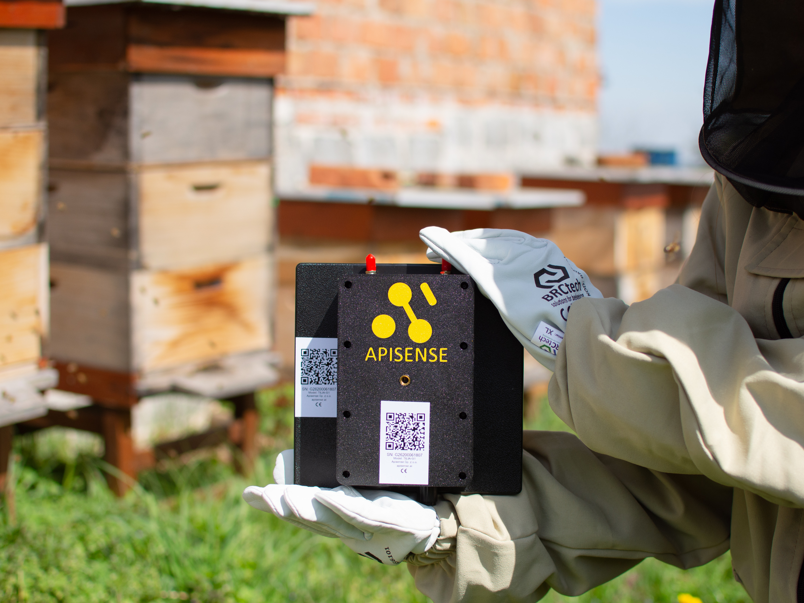
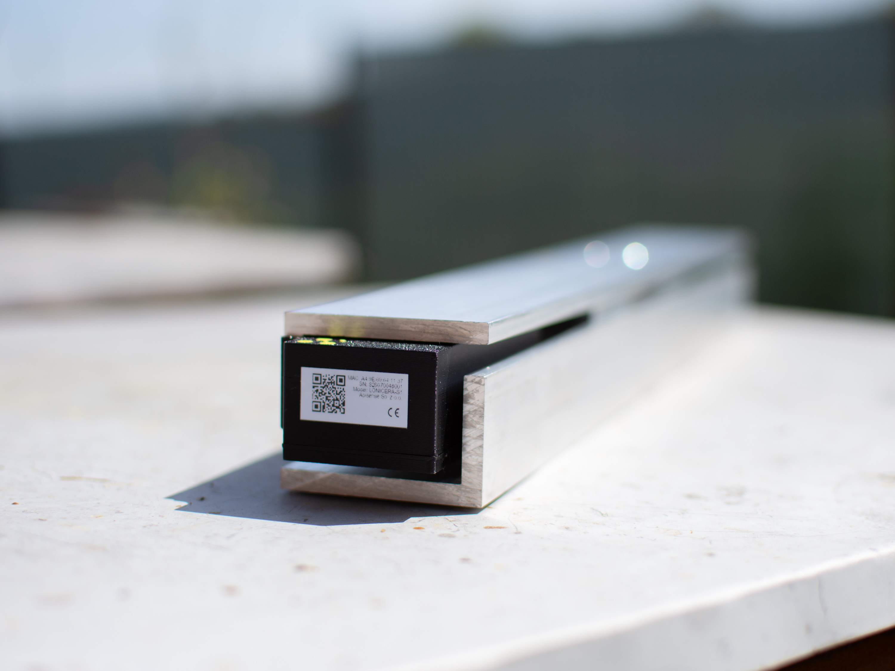
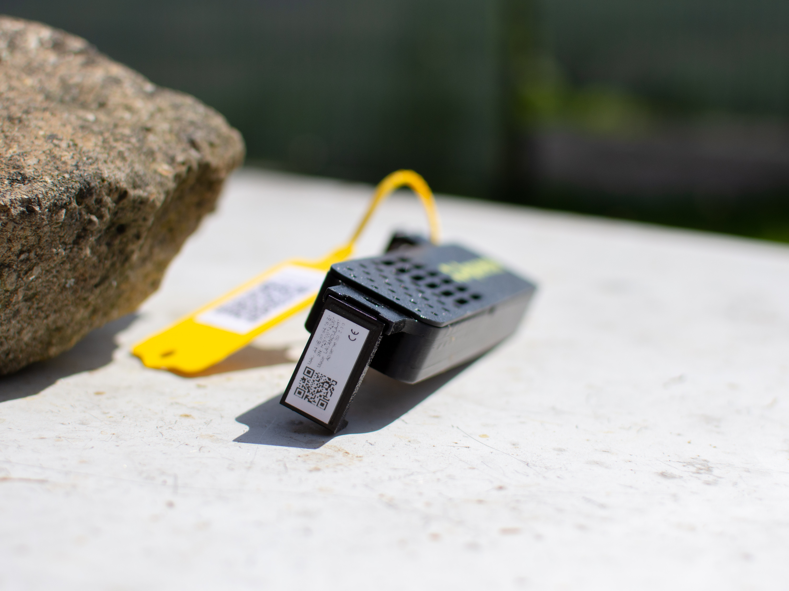
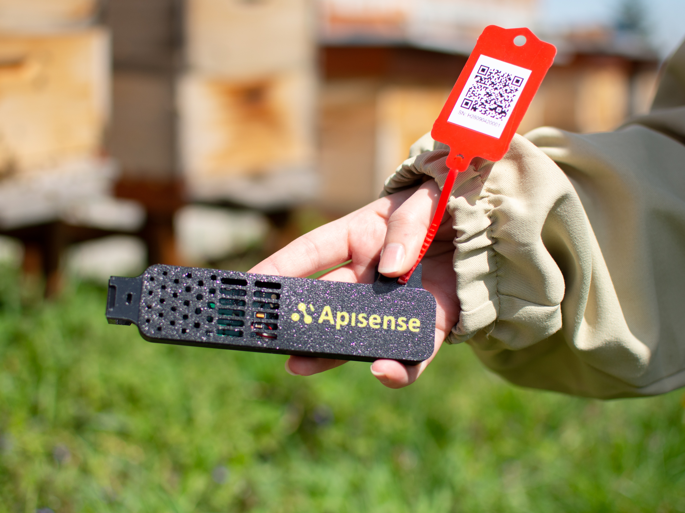
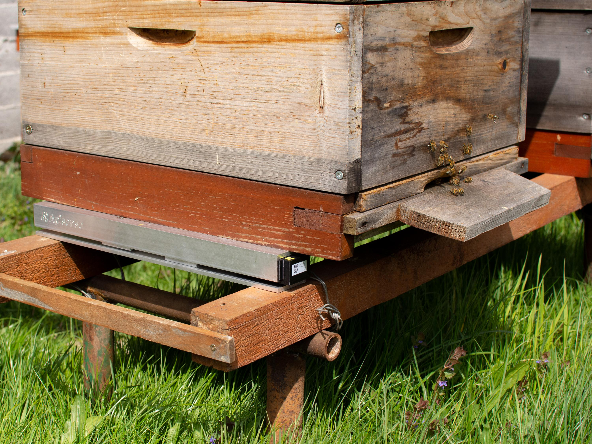
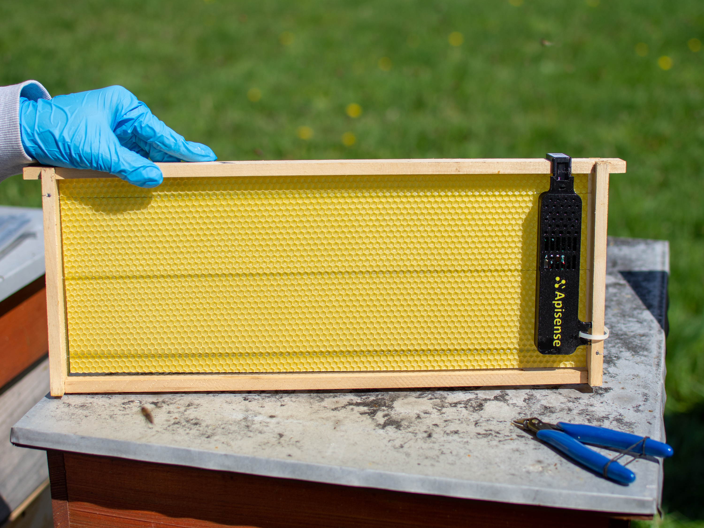
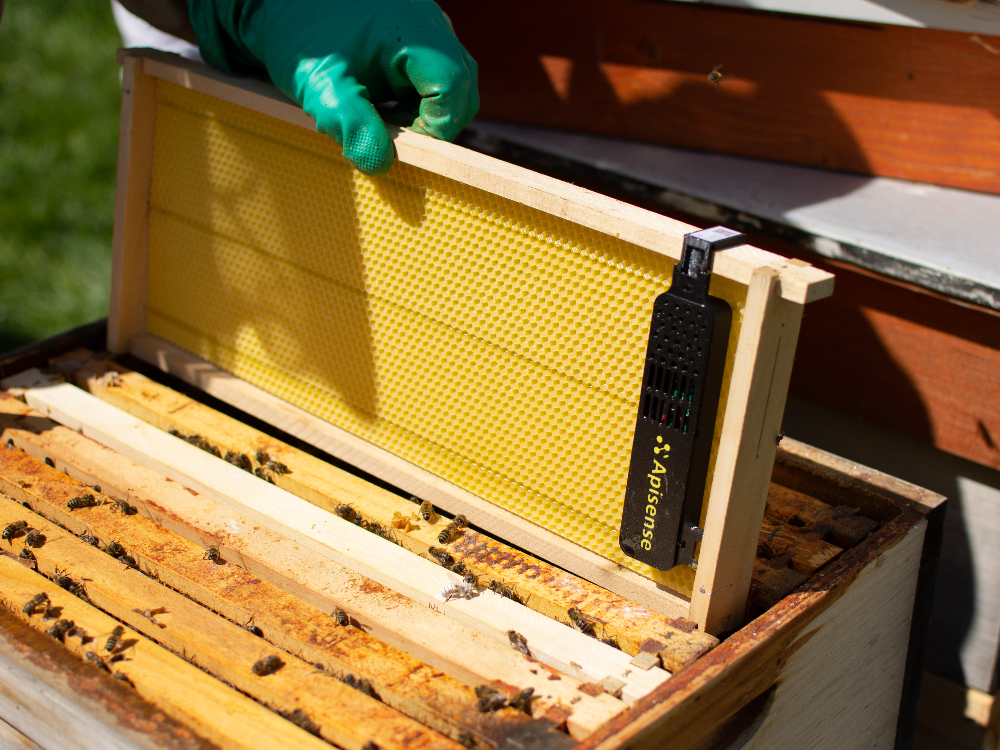

---
caption:
  figure:
    caption_prefix: 'Fig. {index}:'
    reference_text: 'Fig. {index}'
---

# Device Configuration Manual

## Introduction

This manual walks you step by step through registration, adding devices to the system, and installing them. For a full description of the Apisense system, hardware, software, and key benefits see the [System Overview](../../overview/index.md).

!!! note "Note"
    Before installing any device included in the Apisense kit, complete the steps described in [Registration / Login](#registration-login) and [Adding Devices to the System and First Start-up](#adding-devices-to-the-system-and-first-start-up).

---

## Purpose

- **System registration** — create an individual user account and gain access to the app, alerts, and the recommendation engine.
- **Adding devices** — link devices to your account, assign them to apiaries and hives, and enable continuous health monitoring.
- **Safe first start-up** — correct first start-up and verification ensures reliable data and 24/7 remote monitoring with full hive control.
- **Correct IoT device installation** — critical for accurate measurements and long-term, trouble-free system operation. Apisense devices are compact and installed non-invasively; no hive replacement or structural modification is required.

---

## Prerequisites

1. **Smartphone or computer** — for registration, login, and daily use of the beekeeper dashboard, notifications, and tips.
2. **Internet access** — required for data synchronisation, alerts, and 24/7 remote monitoring.
3. **Apisense kit** — the complete set of devices (Hub, Scale, VitalSensor) supplied by Apisense, along with access to the Apisense Pro AI monitoring system.

---

## Apisense Kit Contents

The Apisense kit includes:

- **Apisense Hub** ()

    Figure: Apisense Hub included in the kit {#fig-hub}

    {width=200}

- **Apisense Scale** ()

    Figure: Apisense Scale included in the kit {#fig-scale}

    {width=200}

- **Apisense VitalSensor** ()

    Figure: Apisense VitalSensor included in the kit {#fig-sensor}

    {width=200}

- **Mounting hardware** — for secure, stable device installation (no hive replacement or structural modification required). Includes:
  - **Camera mount bracket** — used to mount the Apisense Hub, ensuring a stable and adjustable position.
  - **Wooden levelling beam** — stabilising element that enables correct positioning and levelling of the Scale beneath the hive. Distributes the hive load evenly across the scale sensors and maintains structural stability.
  - **Frame mounting clips** — allow secure, stable attachment of the Apisense VitalSensor directly to the bee frame. Designed for tool-free mounting without permanent hive modifications or disruption to the colony.
- **QR code stickers** — for quick apiary and hive registration and device identification. Stickers are affixed to each device: Apisense Hub (), Apisense Scale () and Apisense VitalSensor (), and to the VitalSensor frame clip ().

    Figure: QR code sticker on Apisense Hub {#fig-qr-hub}

    {width=200}

    Figure: QR code sticker on Apisense Scale {#fig-qr-scale}

    {width=200}

    Figure: QR code sticker on Apisense VitalSensor {#fig-qr-sensor}

    {width=200}

    Figure: QR code sticker on the VitalSensor frame clip {#fig-qr-frame-clip}

    {width=200}

For a detailed description of each device (Hub, Scale, VitalSensor), technical specifications, and power information see the [System Overview](../../overview/index.md#2-hardware-technical-specifications).

---

## Registration / Login

The Apisense Pro AI system is available via the Apisense mobile app (App Store, Google Play) and at [app.apisense.ai](https://app.apisense.ai/).

Step-by-step instructions are in the App Manual:

- [Registration](../app-manual.md#1-registration) — creating a new account.
- [Login](../app-manual.md#2-login) — signing in to an existing account.

Once logged in, you will see the app home screen (*Apiaries* tab), from which you can start adding devices.

---

## Adding Devices to the System and First Start-up

To access measurements from each device, you must start it up, add it to the system, and assign it to the correct apiary and hive. This is done by creating the apiary structure in the Apisense app and scanning the QR codes on the devices.

!!! note "Note"
    During the first device setup, the QR code stickers on each Apisense device will be required (see: [QR Code Stickers](#qr-stickers)). Have the devices with stickers ready and follow the instructions below.

### 1. Creating an Apiary and Linking to the Hub

The first step is to create a new apiary in the system and assign the Apisense Hub to it by scanning the QR code on the device.

- In the *Apiaries* tab (home screen after login) tap *Add apiary* at the bottom of the screen. The Add apiary view will open.
- Fill in the fields in the Add apiary view ():
  - Name — enter a name for your apiary; this is how it will appear in the dashboard.
  - Name abbreviation — set automatically for easier identification. You can enter your own abbreviation — maximum 3 characters.
  - Serial number — the device identifier. Tap the QR code icon on the right side of the field and scan the QR code sticker on the Apisense Hub. The *Confirmation code* field will be filled in automatically.
  - Confirmation code — filled in automatically after a successful QR scan.

    The *Name* and *Name abbreviation* fields can be edited at any time.

    Figure: Adding an apiary with the linked Apisense Hub {#fig-add-apiary}

    {width=200}

  **After filling in all required fields, tap the yellow button at the bottom of the screen to confirm creating the apiary with the linked Apisense Hub.**

- If the apiary was created successfully, you will be redirected to the Apiaries view and your new apiary will appear in the list ().

    Figure: Successfully added apiary with linked Apisense Hub in the Apiaries view {#fig-apiaries-list}

    {width=200}

To add the remaining devices (Scale and VitalSensor) to the system, proceed to step 2 of this chapter.

### 2. Creating a Hive and Linking to Scale and VitalSensor

At this stage, create a hive within the selected apiary and assign the Scale and VitalSensor devices to it by scanning the QR codes on their housings.

- In the *Apiaries* tab (home screen after login) tap the tile of the apiary to which you want to add a hive and assign devices (Scale and VitalSensor). The single-apiary view will open ().

    Figure: Single apiary view in the system {#fig-apiary-view}

    {width=200}

- To add a hive tap *Add...* in the bottom menu bar and select *Add hive*. The Add hive view will open ().
- Fill in the fields in the Add hive view — Hive details section ():
  - Hive name — enter a name for your hive; this is how it will appear in the dashboard.
  - Maximum number of frames in the brood box — enter the maximum number of frames that fit in the brood box.
  - Checkbox — tick if the hive has a hygienic floor.

    These details can be edited at any time.

    Figure: Adding a hive — Hive details section {#fig-add-beehive-details}

    {width=200}

  Tap the yellow right-arrow button at the bottom of the screen to proceed to the next step.

- **Queen bee information section:** Fill in the queen information ():
  - Queen rearing year — select from the dropdown list (tap the down arrow on the right of the field).
  - Queen origin — select from the dropdown list.
  - Mating method — choose one of three options: Natural, Artificial, or Unknown.

    These details can be edited at any time.

    Figure: Adding a hive — Queen bee information section {#fig-add-beehive-queen}

    {width=200}

  Tap the yellow right-arrow button at the bottom of the screen to proceed to the final step.

- **Equipment:** The final step links devices to this specific hive.

    !!! note "Note"
        It is critical that the devices configured for a hive (Scale and VitalSensor) are physically installed in that same hive.

    Fill in the following fields ():
  - VitalSensor — tap the QR code icon on the right side of the field and scan the QR code sticker on the Apisense VitalSensor. The *Confirmation code* field will be filled in automatically.
  - Confirmation code — filled in automatically after a successful QR scan.
  - Scale — tap the QR code icon on the right side of the field and scan the QR code sticker on the Apisense Scale. The *Confirmation code* field will be filled in automatically.
  - Confirmation code — filled in automatically after a successful QR scan.

    Figure: Adding a hive — Equipment section {#fig-add-beehive-devices}

    {width=200}

- Once all sections are complete tap the yellow *Save* button to add the hive with its linked devices (Scale, VitalSensor).
- If the hive was created successfully, you will be redirected to the *Hives* view and your new hive will appear in the list (, ).

  Figure: Successfully added hive with linked Apisense Scale and VitalSensor in the Hives view {#fig-beehives-list}

  {width=200}

  Figure: Hive details for the added hive with linked devices {#fig-beehive-details}

  {width=200}

Congratulations! You now have an apiary and a hive with registered devices in the Apisense Pro AI system. You can now proceed to starting up the physical devices.

### 3. First Start-up

In this step you will start up the Apisense devices (Hub, Scale, VitalSensor) for the first time. Follow the guidelines below:

- **Apisense Hub** — starts up automatically when the panel is exposed to sunlight or an external power source is connected.
  1. Available power options:
    - **Photovoltaic panel (PV)** — simply expose the panel to sunlight.

        !!! note "Note"
            The device may also start up under strong artificial lighting (e.g. a powerful bulb). If the light level is insufficient, consider the other power options.
    - USB-C — connect a USB-C cable to a compatible power source.
    - Additional PV panel — connect the panel and expose it to sunlight.

- **Apisense Scale** — insert two AA batteries into the scale battery compartment, observing correct polarity (+ and −) as marked inside the compartment. Before closing and screwing the compartment shut, verify that the Scale indicator LED lights up, confirming the batteries are correctly installed and the device has started successfully. Then close the compartment lid securely and tighten the housing.

- **Apisense VitalSensor** — insert two AA batteries into the device battery compartment, observing correct polarity (+ and −) as marked inside the compartment. After inserting the batteries, make sure the compartment cover is closed. If the batteries are installed correctly, the VitalSensor indicator LED should light up.

!!! note "Note"
    The first readings from the measurement devices should appear in the app within a maximum of 2 hours of start-up. Before proceeding with installation, verify in the app that readings are visible — this confirms the devices are correctly registered in the system and operating properly.

How to check the first readings is described in: [Verifying Device Operation](#verifying-device-operation).

---

## Device Installation

Before installing any Apisense device, complete the steps in [Registration / Login](#registration-login) and [Adding Devices to the System and First Start-up](#adding-devices-to-the-system-and-first-start-up), and verify that the first readings from the measurement devices are visible in the Apisense app ([Verifying Device Operation](#verifying-device-operation)).

### 1. Installing the Apisense Hub

- **Location and orientation**
  - Mount the Apisense Hub:
    - facing **towards the sun** as much as possible (slight east/west deviation is acceptable),
    - tilted **at least 20°** from horizontal (recommended **30–50°**) so the photovoltaic panel has optimal access to sunlight (the panel must not be shaded).
    - **Height** is also critical — the device must not be mounted too low. **Recommended height: 1–2 m above ground.** At lower heights the panel may not receive enough light to operate correctly, especially in winter when the sun is low.
  - **The Apisense Hub has two external antennas — BLE and LTE.** Each uses a **different connector type (one male, one female)**, so **they cannot be confused or swapped** — each antenna only screws into its matching socket. **Do not force an antenna into the wrong connector** — this can damage the socket.
      - **BLE antenna** — connectivity to in-apiary measurement devices (VitalSensor, Scale).
      - **LTE antenna** — data transmission to the Apisense cloud.
  - The antennas are mounted at the bottom of the device. Ensure they are **oriented vertically upwards** () — this orientation is critical for proper BLE and LTE range.
  - Mount the Apisense Hub in the centre of the apiary, **no more than 35 m** from the furthest hive equipped with a VitalSensor or Scale — this ensures stable BLE (Bluetooth Low Energy) connectivity to all measurement devices.
  - **Do not mount the Apisense Hub on metal structures** — metal interferes with the radio signal and degrades BLE and LTE performance. Use a post driven into the ground, a tree, a wooden fence post, or another stable non-metallic structure. The Hub does not need to be attached directly to a hive.
  - Use the **camera mount bracket** included in the kit. The mounting location must provide a **stable position tilted towards the sun** (ideally 30–50°).

    An example of a correctly installed Apisense Hub is shown below ():

  Figure: Correct antenna placement and Hub installation in the apiary {#fig-hub-installation}

  {width=200}

### 2. Installing the Apisense Scale (Hive Scale)

- **Location and orientation** — the hive scale should be placed under the hive (or within a weighing structure) on **stable, level ground, oriented perpendicular to the frames inside the hive**. Within BLE range of the Apisense Hub (up to approx. 35 m), without physical obstacles that attenuate the signal. Correct levelling and orientation is **critical for measurement accuracy**.

- **Installation and levelling — step by step**

  1. **Position the Scale** — place the started Scale on stable, level ground, oriented perpendicular to the hive frames.
  2. **Place the wooden levelling beam** — an integral part of the assembly — parallel to the Scale and at the correct distance so that the hive weight is distributed evenly across both the scale and the beam.
  3. **Place the hive on the Scale** (if not already in position) — set the hive on the prepared assembly () and verify that the load is still evenly distributed.

  Figure: Correct hive placement on the scale and levelling beam {#fig-scale-installation}

  {width=200}

  4. **Verify in Apisense Pro AI** — if the device has been correctly installed and has not lost connectivity with the Hub, new readings should appear in the system within the next few hours. For instructions on adding the Scale to the dashboard see [Adding Devices to the System and First Start-up](#adding-devices-to-the-system-and-first-start-up); for checking first readings see [Verifying Device Operation](#verifying-device-operation).

    Once all the above steps are completed correctly, the Apisense Scale is securely connected to the system and its readings are available in the dashboard.

### 3. Installing the Apisense VitalSensor

- **Location** — the compact Apisense VitalSensor is installed non-invasively inside the hive, ideally in the upper corner of the central bee frame, so as not to disrupt bee activity and ventilation; vertically, so the QR code sticker is visible from above when the frame is inserted. Within BLE range of the Apisense Hub (up to approx. 35 m).

- **Installation — step by step**

  1. **Attach the VitalSensor to the central frame** — mount the started VitalSensor to the bee frame using the special mounting clips included in the kit. The Apisense VitalSensor should be seated securely on the central frame (at the cluster), so it cannot shift, and mounted vertically so the QR code sticker is visible from above when the frame is inserted. A correctly mounted VitalSensor is shown in .

  Figure: Correct VitalSensor installation on the bee frame {#fig-sensor-on-frame}

  {width=200}

  2. **Insert the frame into the hive** — carefully slide the frame with the attached device into the hive — ideally position it in the centre of the brood box ().

  Figure: Recommended placement of the bee frame with VitalSensor in the hive {#fig-frame-in-hive}

  {width=200}

  3. **Verify in Apisense Pro AI** — if the device has been correctly installed and has not lost connectivity with the Hub, new readings should appear in the system within the next few hours. For instructions on adding the VitalSensor to the dashboard see [Adding Devices to the System and First Start-up](#adding-devices-to-the-system-and-first-start-up); for checking first readings see [Verifying Device Operation](#verifying-device-operation).

    Once all the above steps are completed correctly, the Apisense VitalSensor is securely connected to the system and its readings are available in the dashboard.

---

## Verifying Device Operation

### 1. First Synchronisation Time

After a device is added to the system and started, the first synchronisation process begins — the device (Scale, VitalSensor) establishes communication with the Apisense Hub, which then forwards data to the server.

- First synchronisation may take up to 2 hours, depending on signal quality, the number of connected devices, and the Hub's communication window with the server.
- During this time the server connection is established, configuration data is transmitted, and the first measurement batch is taken.
- In the app, the apiary and hive tiles to which the devices awaiting synchronisation are assigned will show the status *No data*.
- Do not switch off or reset devices during the first synchronisation.

Within a maximum of 2 hours, the first readings from each device should appear in the Apisense Pro AI system. The *No data* status will then automatically update to reflect the received measurements.

### 2. Checking the First Readings

After the first synchronisation completes, the first measurement data should appear in the app.

Verify the information displayed on each part of the system:

- **Apiary** — in the *Apiaries* tab (app home screen) the apiary tile shows updated information: temperature, battery level, and LTE signal for the Hub; the number of active hives is also shown (hives associated with at least one Scale or VitalSensor that is communicating correctly with the Hub).
- **Hive** — in the *Hives* tab (accessed via the apiary tile) the hive tile shows updated: internal temperature, weight, and honey gain.
- **Hive details** — in the Details tab (accessed via the hive tile) detailed measurement data for weight and internal hive conditions is displayed.

### 3. What to Do if Data is Missing

If measurement data has still not appeared in the Apisense app more than 2 hours after start-up and correct device placement:

- **Check the power supply:**
  - Hub: verify the photovoltaic panel is not shaded, or that the power adapter is correctly connected.
  - Scale: verify the 2×AA batteries are installed correctly (correct +/− polarity). Replace batteries if necessary.
  - VitalSensor: verify the 2×AA batteries are installed correctly (correct +/− polarity). Replace batteries if necessary.

- **Check configuration and installation:**
  - Verify correct device installation at the intended location.
  - Confirm devices are within Hub communication range.

- **Restart the device:**
  - Scale/VitalSensor:
    - Remove the batteries.
    - Wait approximately 10 seconds.
    - Reinsert the batteries, paying close attention to polarity.

- **Find the issue in the troubleshooting list** — see [Troubleshooting](troubleshooting.md) for common problems and solutions. Check whether your issue is listed and apply the suggested solution.

- **Contact technical support** — if data is still missing despite correct installation and configuration, contact Apisense support: **[bee@apisense.ai](mailto:bee@apisense.ai)**.
