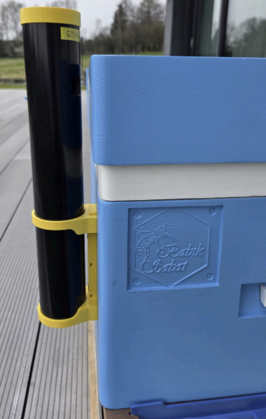
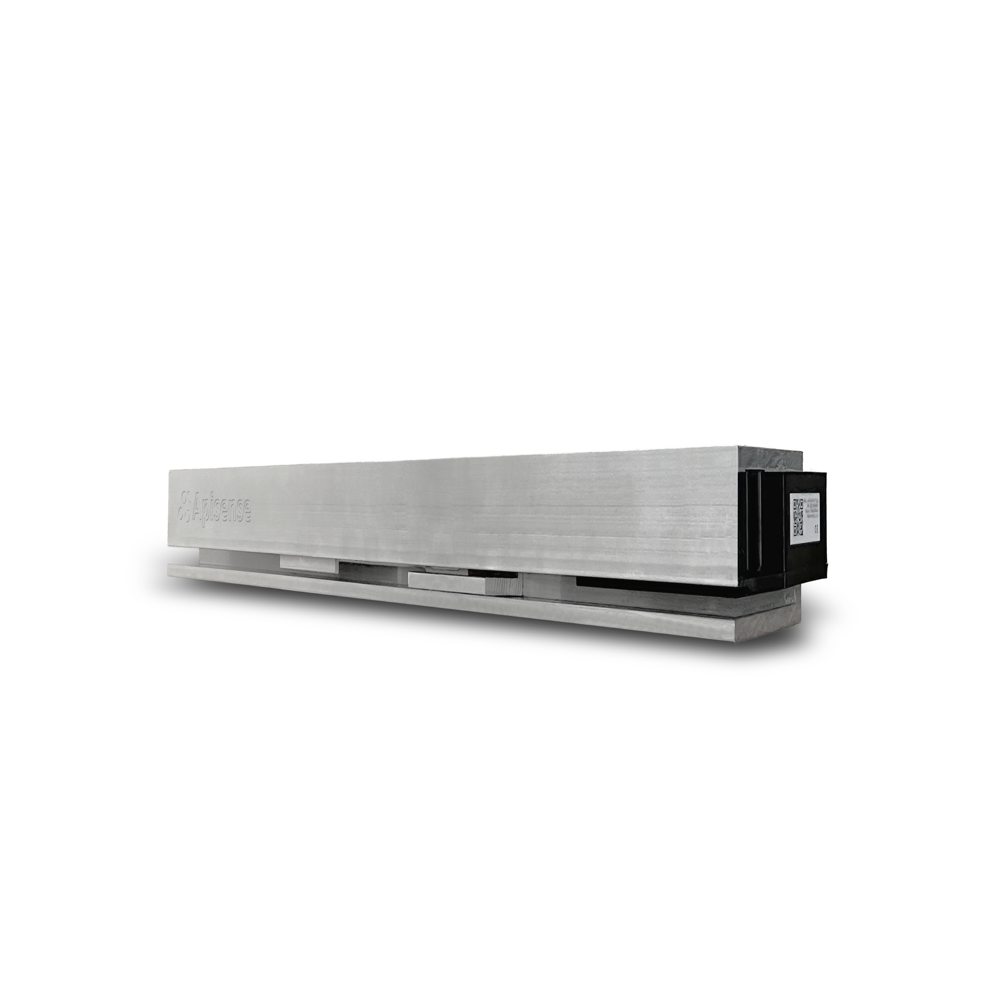
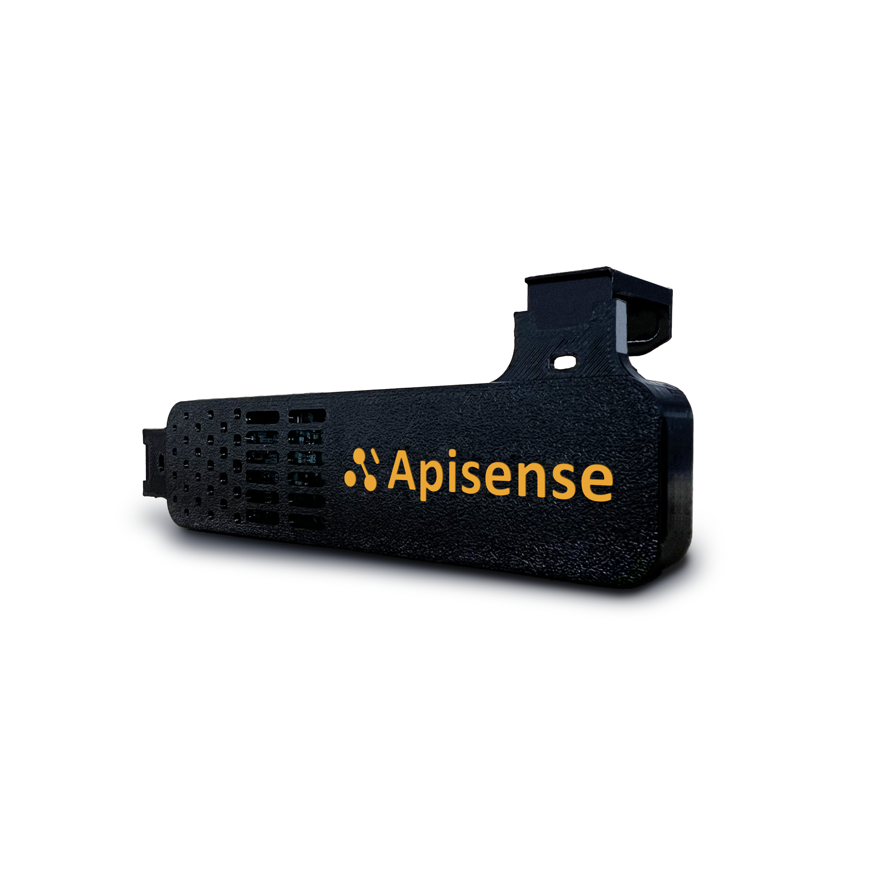
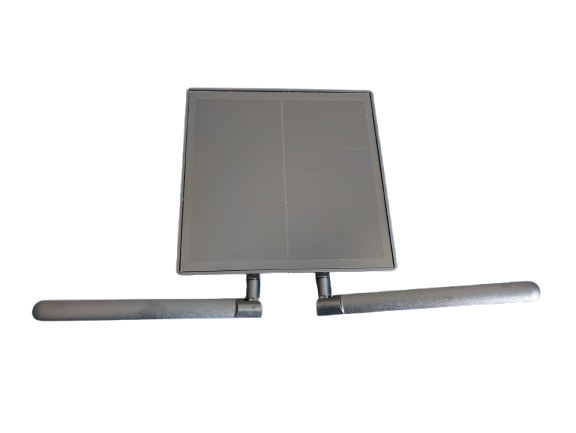
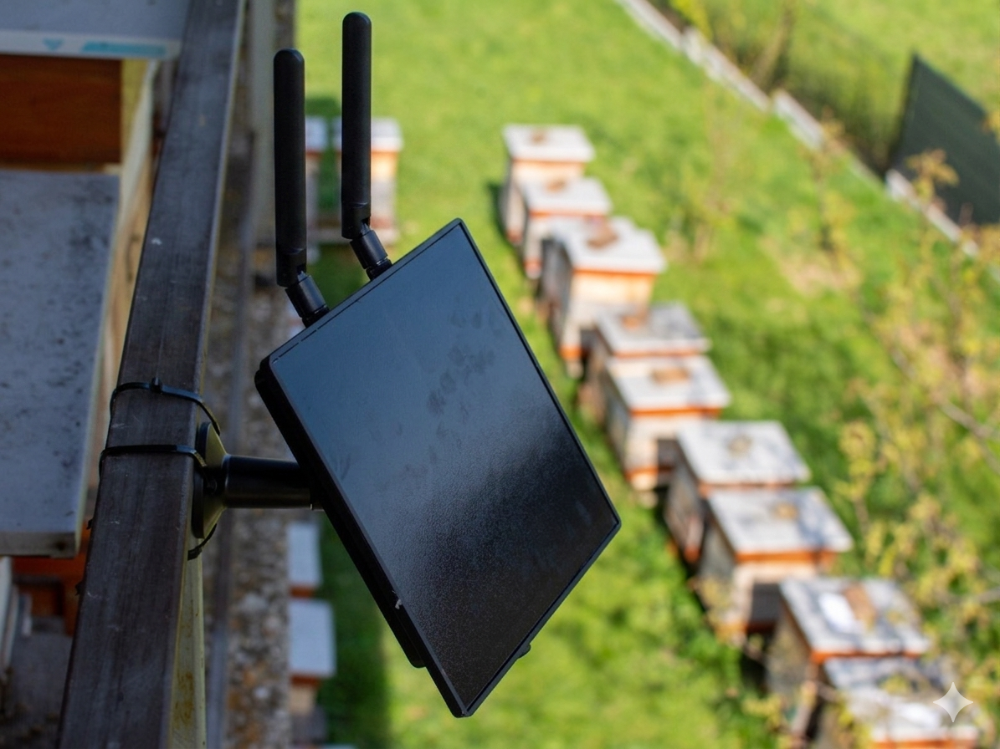

# Instrukcja konfiguracji urządzeń

## Wprowadzenie

Niniejsza instrukcja prowadzi krok po kroku przez rejestrację, dodanie urządzeń do systemu oraz ich montaż. Opis systemu Apisense, sprzętu, oprogramowania i korzyści znajdziesz w [Przeglądzie systemu](../../overview/index.md).

!!! note "Uwaga"
    Przed przystąpieniem do montażu poszczególnych urządzeń wchodzących w skład zestawu Apisense należy przejść etapy opisane w rozdziałach [Rejestracja / Logowanie w systemie](#rejestracja-logowanie-w-systemie) oraz [Dodanie urządzeń do systemu i pierwsze uruchomienie](#dodanie-urzadzen-do-systemu-i-pierwsze-uruchomienie).

---

## Cel

- **Rejestracja w systemie** — umożliwia utworzenie indywidualnego konta użytkownika oraz pozwala na korzystanie z aplikacji, alarmów i systemu rekomendacji.
- **Dodanie urządzeń do systemu** — pozwala na ich powiązanie z kontem użytkownika, przypisanie urządzeń do pasiek i uli oraz zapewnia stały dostęp do informacji o stanie zdrowia pszczół.
- **Bezpieczne uruchomienie** — poprawne pierwsze uruchomienie i weryfikacja działania zapewniają wiarygodne dane oraz 24/7 zdalny monitoring i pełną kontrolę nad ulem.
- **Prawidłowy montaż urządzeń IoT** — kluczowy dla uzyskania wiarygodnych pomiarów oraz długotrwałej i bezawaryjnej pracy systemu. Urządzenia Apisense są niewielkich rozmiarów i montuje się je bezinwazyjnie; montaż nie wymaga wymiany uli ani ingerencji w ich budowę.

---

## Wymagania wstępne

1. **Smartfon lub komputer** — do rejestracji, logowania i codziennego korzystania z panelu pszczelarza oraz powiadomień i wskazówek.
2. **Dostęp do Internetu** — niezbędny do synchronizacji danych, alarmów i zdalnego monitoringu 24/7.
3. **Zestaw Apisense** — komplet urządzeń (Hub, Scale, VitalSensor) dostarczony przez Apisense oraz dostęp do kompleksowego systemu monitoringu pasiek Apisense Pro AI.

---

## Zawartość zestawu Apisense

W skład zestawu Apisense wchodzą:

- **Apisense Hub** (**Rys. 1**)

 <strong>Rys. 1</strong> Apisense Hub w zestawie
  

- **Apisense Scale** (**Rys. 2**)

 <strong>Rys. 2</strong> Apisense Scale w zestawie
  

- **Apisense VitalSensor** (**Rys. 3**)

 <strong>Rys. 3</strong> Apisense VitalSensor w zestawie
  

- **Elementy montażowe** — do bezpiecznego i stabilnego zamocowania urządzeń (montaż nie wymaga wymiany uli ani ingerencji w ich budowę). W skład elementów montażowych wchodzą:
  - **Uchwyt aparatowy** — element wykorzystywany do montażu Apisense Hub, umożliwiający stabilne zamocowanie urządzenia.
  - **Drewniana kantówka** — element stabilizujący, umożliwiający prawidłowe ustawienie i wypoziomowanie wagi (Scale) pod ulem. Zapewnia równomierne rozłożenie ciężaru ula na czujniki pomiarowe oraz utrzymuje stabilność całej konstrukcji.
  - **Uchwyty montażowe do ramki** — elementy umożliwiające bezpieczne i stabilne zamocowanie Apisense VitalSensor bezpośrednio na ramce ula. Konstrukcja uchwytów pozwala na montaż bez trwałych modyfikacji ula oraz bez zakłócania pracy rodziny pszczelej.
- **Naklejki z kodem QR** — do szybkiej rejestracji pasieki i uli w systemie oraz identyfikacji urządzeń. Naklejki (**Rys. 4**) umieszczone są na poszczególnych urządzeniach (Hub, Scale, VitalSensor) oraz na uchwycie do VitalSensor (**Rys. 5**).

  
**Rys. 4** Naklejka z kodem QR na Apisense Hub, Scale i VitalSensor

  
**Rys. 5** Naklejka z kodem QR na uchwycie do VitalSensor

Szczegółowy opis każdego z urządzeń (Hub, Scale, VitalSensor), specyfikacja techniczna i informacje o zasilaniu znajdują się w [Przeglądzie systemu](../../overview/index.md#2-specyfikacja-sprzetowa).

---

## Rejestracja / Logowanie w systemie

Szczegółowe instrukcje krok po kroku znajdziesz w Instrukcji aplikacji:

- [Rejestracja](../app-manual.md#1-rejestracja) — zakładanie nowego konta.
- [Logowanie](../app-manual.md#2-logowanie) — logowanie do istniejącego konta.

Po pomyślnym zalogowaniu zobaczysz ekran startowy aplikacji (zakładka *Pasieki*), z którego rozpoczniesz dodawanie urządzeń.

---

## Dodanie urządzeń do systemu i pierwsze uruchomienie

Aby uzyskać dostęp do pomiarów wykonanych przez poszczególne urządzenia, należy odpowiednio je uruchomić oraz dodać do systemu i przypisać do odpowiedniej pasieki oraz ula. Proces odbywa się poprzez utworzenie struktury pasieki w Aplikacji Apisense oraz zeskanowanie kodów QR znajdujących się na urządzeniach.

!!! note "Uwaga"
    Podczas pierwszej konfiguracji urządzeń wymagane będą naklejki z kodami QR znajdujące się na poszczególnych urządzeniach Apisense (zobacz sekcję: [Naklejki z kodem QR](#naklejki-qr)). Przygotuj urządzenia z naklejkami i postępuj zgodnie z poniższą instrukcją.

### 1. Tworzenie pasieki i powiązanie z Hub

W pierwszym kroku należy utworzyć nową pasiekę w systemie oraz przypisać do niej Apisense Hub, co odbywa się poprzez zeskanowanie kodu QR umieszczonego na tym urządzeniu.

- Będąc w zakładce Pasieki (widok startowy po zalogowaniu) kliknij zakładkę *Dodaj pasiekę* znajdującą się w dolnej części tego widoku. Po kliknięciu zostanie otwarty widok Dodaj pasiekę.
- Aby dodać pasiekę wypełnij poszczególne pola w widoku Dodaj pasiekę (**Rys. 6**):
  - Nazwa - wpisz nazwę swojej pasieki - pod taką nazwą pasieka będzie wyświetlana w panelu.
  - Skrót nazwy - jest ustawiany domyślnie, w celu łatwiejszej identyfikacji pasieki. Możesz wprowadzić własny skrót - maksymalnie 3 znaki.
  - Numer seryjny - to numer identyfikacyjny urządzenia. Kliknij w ikonę kodu QR znajdującą się w prawej części tego pola i zeskanuj kod QR z naklejki umieszczonej na Apisense Hub. Kolejne pole *Kod potwierdzający* zostanie wypełnione automatycznie.
  - Kod potwierdzający - zostanie wypełniony automatycznie, po poprawnym zeskanowaniu kodu QR.
    Pola *Nazwa* oraz *Skrót nazwy* będą mogły zostać zedytowane przez użytkownika w dowolnym momencie.
    
    

    
     <strong>Rys. 6</strong> Dodawanie pasieki z powiązanym Apisense Hub w systemie

    **Po uzupełnieniu niezbędnych danych kliknij żółty przycisk na dole ekranu, potwierdzający utworzenie pasieki z powiązanym urządzeniem Apisense Hub.**
- Jeśli utworzenie pasieki się powiodło, zostaniesz przekierowany do widoku Pasieki, a na Twojej liście pasiek pojawi się pasieka, którą właśnie utworzyłeś (**Rys. 7**).

  

  
   <strong>Rys. 7</strong> Pomyślnie dodana pasieka z powiązanym Apisense Hub w widoku pasiek w systemie
  

Aby dodać pozostałe urządzenia (Scale i VitalSensor) do systemu przejdź do punktu 2. w tym rozdziale.

### 2. Tworzenie ula i powiązanie z Scale oraz VitalSensor

Na tym etapie należy utworzyć ul w ramach wybranej pasieki, a następnie przypisać do niego urządzenia Scale oraz VitalSensor poprzez zeskanowanie kodów QR znajdujących się na ich obudowie.

- Będąc w zakładce Pasieki (widok startowy po zalogowaniu) kliknij kafelek z pasieką, do której chcesz dodać ul i przypisać urządzenia (Scale i VitalSensor). Po kliknięciu w kafelek zostanie wyświetlony widok pojedynczej pasieki (**Rys. 8**).

  
  

  
   <strong>Rys. 8</strong> Widok zawartości pojedynczej pasieki w systemie

- Aby dodać ul do tej pasieki kliknij zakładkę *Dodaj...* na dolnym pasku menu i wybierz opcję *Dodaj ul*, w wyniku czego zostanie wyświetlony widok Dodaj ul (**Rys. 9**).
- Wypełnij poszczególne pola w widoku Dodaj ul - sekcja Szczegóły ula (**Rys. 9**):
  - Nazwa ula - wpisz nazwę dla swojego ula - pod taką nazwą ul będzie wyświetlany w panelu.
  - Maksymalna liczba ramek w korpusie gniazdowym - podaj maksymalną liczbę ramek, które mogą zmieścić się w korpusie gniazdowym ula.
  - Pole wyboru - zaznacz, jeśli ul posiada dennicę higieniczną.
    Powyższe informacje będą mogły zostać zedytowane przez użytkownika w dowolnym momencie.
    
    

    
     <strong>Rys. 9</strong> Dodawanie ula w systemie — sekcja Szczegóły ula

    Aby przejść do kolejnego etapu dodawania ula kliknij żółty przycisk ze strzałką w prawo, znajdujący się na dole ekranu.
- **Sekcja Informacje o matce pszczelej:** Na tym etapie dodawania ula należy wypełnić informacje o matce pszczelej (**Rys. 10**):
  - Rok wychowu matki - wybierz rok wychowu matki pszczelej z listy rozwijanej (kliknij strzałkę w dół widoczną przy tym polu po prawej stronie).
  - Pochodzenie matki - wybierz jedną z opcji dostępnej na liście rozwijanej (kliknij strzałkę w dół widoczną przy tym polu po prawej stronie).
  - Sposób unasiennienia matki - wybierz jedną z trzech opcji: Naturalny, Sztuczny lub Nieznany.
      Powyższe informacje będą mogły zostać zedytowane przez użytkownika w dowolnym momencie.
    
    

    
     <strong>Rys. 10</strong> Dodawanie ula w systemie — sekcja Informacje o matce pszczelej

    Następnie kliknij żółty przycisk ze strzałką w prawo, znajdujący się na dole ekranu, w celu przejścia do ostatniego kroku dodawania ula.
- **Wyposażenie:** Ostatni etap obejmuje powiązanie urządzeń z tym konkretnym ulem.

    !!! note "Uwaga"
        Kluczowe jest, aby urządzenia skonfigurowane w ramach ula (Scale i VitalSensor) były w rzeczywistości zainstalowane w tym samym fizycznym ulu.

    Aby powiązać urządzenia z ulem wypełnij następujące pola (**Rys. 11**):
  - VitalSensor - kliknij w ikonę kodu QR znajdującą się w prawej części tego pola i zeskanuj kod QR z naklejki umieszczonej na Apisense VitalSensor. Kolejne pole *Kod potwierdzający* zostanie wypełnione automatycznie.
  - Kod potwierdzający - zostanie wypełniony automatycznie, po poprawnym zeskanowaniu kodu QR.
  - Scale - kliknij w ikonę kodu QR znajdującą się w prawej części tego pola i zeskanuj kod QR z naklejki umieszczonej na Apisense Scale. Kolejne pole *Kod potwierdzający* zostanie wypełnione automatycznie.
  - Kod potwierdzający - zostanie wypełniony automatycznie, po poprawnym zeskanowaniu kodu QR.
    
    

    
     <strong>Rys. 11</strong> Dodawanie ula w systemie — sekcja Wyposażenie

- Po wypełnieniu wszystkich sekcji i niezbędnych pól kliknij żółty przycisk *Zapisz*, aby dodać ul z powiązanymi urządzeniami (Scale, VitalSensor).
- Jeśli utworzenie ula się powiodło, zostaniesz przekierowany do widoku *Ule*, a na Twojej liście uli pojawi się ul, który właśnie utworzyłeś (**Rys. 12**).

  
  

  
  
   <strong>Rys. 12</strong> Pomyślnie dodany ul z powiązanymi Apisense Scale oraz VitalSensor w widoku Ule oraz Szczegóły ula

Gratulacje! Masz już pasiekę i ul z zarejestrowanymi urządzeniami w Systemie Apisense Pro AI. Teraz możesz przejść do uruchomienia fizycznych urządzeń.

### 3. Pierwsze uruchomienie

W tym kroku po raz pierwszy uruchomisz urządzenia Apisense (Hub, Scale, VitalSensor). Aby to zrobić postępuj zgodnie z poniższymi wytycznymi:

- **Apisense Hub** - uruchamia się automatycznie po wystawieniu panelu na słońce lub podłączeniu zewnętrznego źródła zasilania.
  1. Możliwe sposoby zasilania:
    - **Panel fotowoltaiczny (PV)** – wystarczy wystawić panel na światło słoneczne.

        !!! note "Uwaga"
            Urządzenie może uruchomić się również przy silnym oświetleniu sztucznym (np. mocna żarówka). Jeżeli ilość dostarczonego światła jest niewystarczająca rozważ pozostałe sposoby zasilania.
    - USB-C – podłącz przewód USB-C do kompatybilnego źródła zasilania.
    - Dodatkowy panel PV – podłącz panel i wystaw go na światło słoneczne.
- **Apisense Scale** — umieść dwie baterie typu AA w komorze baterii wagi, zwracając uwagę na prawidłową polaryzację (+ i −) zgodnie z oznaczeniami wewnątrz komory. Przed zamknięciem komory i skręceniem upewnij się, że dioda sygnalizacyjna Scale zaświeciła się, co potwierdza, że baterie zostały umieszczone prawidłowo i urządzenie zostało pomyślnie uruchomione (**Rys. 13**). Następnie szczelnie zamknij pokrywę komory i skręć obudowę.
    
  **Rys. 13** Dioda sygnalizacyjna Scale oznaczająca pomyślne uruchomienie urządzenia
- **Apisense VitalSensor** — umieść dwie baterie typu AA w komorze baterii urządzenia, zwracając uwagę na prawidłową polaryzację (+ i −) zgodnie z oznaczeniami wewnątrz komory. Po włożeniu baterii upewnij się, że pokrywa komory jest zamknięta. Jeżeli baterie zostały umieszczone prawidło, dioda sygnalizacyjna VitalSensor powinna się zaświecić (**Rys. 14**).
    
  **Rys. 14** Dioda sygnalizacyjna VitalSensor oznaczająca pomyślne uruchomienie urządzenia

!!! note "Uwaga"
    Pierwsze odczyty z urządzeń pomiarowych w aplikacji powinny pojawić się w ciągu maksymalnie 2 godzin od ich uruchomienia. Przed przystąpieniem do montażu należy zweryfikować w aplikacji, czy odczyty są widoczne — pozwoli to upewnić się, że urządzenia zostały prawidłowo zarejestrowane w systemie i działają poprawnie.

Sposób sprawdzenia pierwszych odczytów opisano w rozdziale: [Test poprawności działania urządzeń](#test-poprawnosci-dziaania-urzadzen).

---

## Montaż urządzeń

Przed przystąpieniem do montażu poszczególnych urządzeń wchodzących w skład zestawu Apisense należy przejść etapy opisane w rozdziałach [Rejestracja / Logowanie w systemie](#rejestracja-logowanie-w-systemie) oraz [Dodanie urządzeń do systemu i pierwsze uruchomienie](#dodanie-urzadzen-do-systemu-i-pierwsze-uruchomienie), a także zweryfikować wyświetlanie pierwszych odczytów z urządzeń pomiarowych w Aplikacji Apisense [Test poprawności działania urządzeń](#test-poprawnosci-dziaania-urzadzen).

### 1. Montaż Apisense Hub

- **Umiejscowienie i orientacja**
  - Apisense Hub montuj:
    - zwrócony w miarę możliwości **w kierunku słońca** (dopuszczalne nieznaczne odchylenie na wschód/zachód),
    - **nachylony min. 20°** względem poziomu (zalecane **30–50°**), tak aby panel fotowoltaiczny miał optymalny dostęp do promieni słonecznych (panel nie może być zacieniony).
    - Kluczowa jest również **wysokość** na jakiej zostanie umieszczony Hub - urządzenie nie może być zamontowane zbyt nisko. **Zalecana wysokość to 1-2 m nad ziemią**. W przeciwnym przypadku panel może nie otrzymywać wystarczającej ilości światła do prawidłowego działania - w szczególności zimą, gdy słońce jest nisko na niebie.
  - Zapewnij, aby anteny stanowiące integralną część urządzenia Apisense Hub znajdowały się w dolnej części urządzenia i były skierowane poziomo na zewnątrz (**Rys. 15**).
  - Apisense Hub powinien być montowany w centrum pasieki, **maksymalnie 35 m** od najdalszego ula wyposażonego w VitalSensor lub Scale — zapewnia to stabilną łączność BLE (Bluetooth Low Energy) ze wszystkimi urządzeniami pomiarowymi.
  - **Nie montuj Apisense Hub do elementów metalowych** — metal zakłóca sygnał radiowy i pogarsza działanie łączności BLE oraz transmisji LTE. Użyj słupka wbitego w ziemię, drzewa, drewnianego słupka ogrodzenia lub innej stabilnej, niemagnetycznej konstrukcji. Apisense Hub nie musi być zamocowany bezpośrednio do ula.
  - Do montażu użyj **uchwytu aparatowego** dołączonego do zestawu. Pamiętaj, że miejsce montażu musi gwarantować **stabilne ustawienie z nachyleniem w stronę słońca** (najlepiej 30–50°).
    Przykład poprawnie zamontowanego Apisense Hub, został zaprezentowany na rysunku poniżej (**Rys. 15**):

  

  
  
   <strong>Rys. 15</strong> Prawidłowe rozstawienie anten i montaż Hub w pasiece

### 2. Montaż Apisense Scale (waga pasieczna)

- **Umiejscowienie i orientacja** — waga pasieczna powinna zostać umieszczona pod ulem (lub w konstrukcji ważącej) na **stabilnym i równym podłożu, położona prostopadle do ramek w ulu**. Odległość od Apisense Hub w zasięgu łączności BLE (do ok. 35 m), bez fizycznych przeszkód tłumiących sygnał. Prawidłowe wypoziomowanie i orientacja jest **kluczowe dla dokładności pomiarów**.
- **Montaż i wypoziomowanie — krok po kroku**
  1. **Umieść Scale w docelowym miejscu** — uruchomioną Scale ustaw tak, aby była położona na stabilnym i równym podłożu oraz zorientowana prostopadle do ramek w ulu.
  2. **Umieść drewnianą kantówkę** — stanowiącą integralny element konstrukcji — równolegle do Scale i w odpowiedniej odległości tak, aby ciężar ula rozkładał się równomiernie na całej powierzchni zarówno wagi jak i kantówki.
  3. **Zamontuj ul na Scale** (jeśli jeszcze nie stoi) — umieść ul na przygotowanej konstrukcji (**Rys. 16**) i upewnij się, że obciążenie nadal rozkłada się równomiernie.
      
    **Rys. 16** Prawidłowe ustawienie ula na wadze oraz kantówce
  4. **Zweryfikuj w Systemie Apisense Pro AI** — jeśli urządzenie zostało prawidłowo zamontowane i nie utraciło łączności z Hub, w ciągu najbliższych kilku godzin w systemie powinny pojawić się kolejne odczyty. Szczegółowa instrukcja jak dodać Scale do panelu została przedstawiona w rozdziale [Dodanie urządzeń do systemu i pierwsze uruchomienie](#dodanie-urzadzen-do-systemu-i-pierwsze-uruchomienie), natomiast jak sprawdzić pierwsze odczyty - w rozdziale [Test poprawności działania urządzeń](#test-poprawnosci-dziaania-urzadzen).
    Po dokładnym wykonaniu powyższych czynności można uznać Apisense Scale za bezpiecznie podłączoną do systemu i korzystać z odczytów w panelu.

### 3. Montaż Apisense VitalSensor

- **Umiejscowienie** — urządzenie niewielkich rozmiarów Apisense VitalSensor montuje się bezinwazyjnie wewnątrz ula, najlepiej w górnym rogu centralnej ramki pszczelej, tak, aby nie zakłócać pracy pszczół i wentylacji; pionowo, aby naklejka z kodem QR była widoczna od góry po włożeniu ramki do ula. Odległość od Apisense Hub w zasięgu łączności BLE (do ok. 35 m).
- **Montaż - krok po kroku**
  1. **Umieść VitalSensor na centralnej ramce** — uruchomiony VitalSensor zamontuj do ramki pszczelej przy użyciu specjalnych uchwytów montażowych dołączonych do zestawu. Apisense VitalSensor powinien zostać stabilnie osadzony na centralnej ramce (w kłębie), tak, aby się nie przemieszczał, a także zamontowany pionowo, aby naklejka z kodem QR była widoczna od góry po włożeniu ramki do ula. Prawidłowo przymocowany VitalSensor do ramki pszczelej został przedstawiony na **Rys. 17**.
    
  **Rys. 17** Prawidłowy montaż VitalSensor do ramki pszczelej
  2. **Umieść ramkę w ulu** — ostrożnie włóż ramkę z przymocowanym urządzeniem do ula - najlepiej umieść ją w środkowej części korpusu gniazdowego (**Rys. 18**).
    
  **Rys. 18** Zalecane umieszczenie ramki pszczelej z VitalSensor w ulu
  3. **Zweryfikuj w Systemie Apisense Pro AI** — jeśli urządzenie zostało prawidłowo zamontowane i nie utraciło łączności z Hub, w ciągu najbliższych kilku godzin w systemie powinny pojawić się kolejne odczyty. Szczegółowa instrukcja jak dodać VitalSensor do panelu została przedstawiona w rozdziale [Dodanie urządzeń do systemu i pierwsze uruchomienie](#dodanie-urzadzen-do-systemu-i-pierwsze-uruchomienie), natomiast jak sprawdzić pierwsze odczyty - w rozdziale [Test poprawności działania urządzeń](#test-poprawnosci-dziaania-urzadzen).
    Po dokładnym wykonaniu powyższych czynności można uznać Apisense VitalSensor za bezpiecznie podłączony do systemu i korzystać z odczytów w panelu.

---

## Test poprawności działania urządzeń

### 1. Czas pierwszej synchronizacji

Po dodaniu urządzenia do systemu i uruchomieniu go rozpoczyna się proces pierwszej synchronizacji — urządzenie (Scale, VitalSensor) nawiązuje komunikację z Apisense Hub, który następnie przesyła dane do serwera.

- Pierwsza synchronizacja może potrwać do 2 godzin, w zależności od jakości sygnału sieci, liczby podłączonych urządzeń oraz okna czasowego komunikacji Hub z serwerem.
- W tym czasie nawiązywane jest połączenie z serwerem, przesyłane są dane konfiguracyjne oraz wykonywany jest pierwszy pakiet pomiarów.
- W aplikacji, na kafelku pasieki oraz ula, do których zostały przypisane urządzenia oczekujące na synchronizację, zostaje wyświetlony status *Brak danych*.
- Nie należy wyłączać urządzeń ani resetować ich w trakcie pierwszej synchronizacji.

W ciągu maksymalnie 2 godzin w Systemie Apisense Pro AI powinny pojawić się pierwsze odczyty z poszczególnych urządzeń. Status *Brak danych* zostanie wówczas automatycznie zmieniony na aktualny, zgodny z odebranymi pomiarami.

### 2. Sprawdzenie pierwszych odczytów w systemie

Po zakończeniu pierwszej synchronizacji w aplikacji powinny pojawić się pierwsze dane pomiarowe.

Należy zweryfikować informacje wyświetlane na poszczególnych elementach systemu:

- **Pasieka** - w zakładce *Pasieki* (ekran startowy aplikacji) na kafelku wybranej pasieki zaprezentowane są odpowiednio zaktualizowane informacje: temperatura, poziom baterii oraz zasięg LTE dla Hub; prezentowana jest także liczba aktywnych uli (liczba uli, z którymi jest powiązane przynajmniej jedno prawidłowo komunikujące się z Hub urządzenie typu Scale, VitalSensor).
- **Ul** - w zakładce **Ule** (po wejściu w kafelek pasieki) na kafelku wybranego ula wyświetlane są zaktualizowane: temperatura wewnętrzna, waga oraz przybytek miodu.
- **Szczegóły ula** - w zakładce Szczegóły (po wejściu w kafelek ula) wyświetlane są szczegółowe dane pomiarowe dotyczące wagi i warunków panujących wewnątrz ula.

### 3. Co zrobić, gdy brakuje danych

Jeżeli po ponad 2 godzinach od uruchomienia i prawidłowego rozmieszczenia urządzeń, w Aplikacji Apisense dane pomiarowe wciąż się nie pojawiły, należy:

- **Zweryfikować stan zasilania**:
  - Hub:
    sprawdzić, czy panel fotowoltaiczny nie jest zacieniony lub czy zasilacz jest prawidłowo podłączony
  - Scale:
    sprawdzić poprawność montażu baterii 2 × AA (prawidłowa polaryzacja +/-). W razie potrzeby wymienić baterie na nowe.
  - VitalSensor:
    sprawdzić poprawność montażu baterii 2 × AA (prawidłowa polaryzacja +/-). W razie potrzeby wymienić baterie na nowe.
- **Sprawdzić poprawność konfiguracji i montażu**:
  - sprawdzić prawidłowy montaż urządzeń w miejscu docelowym
  - upewnić się, że urządzenia znajdują się w zasięgu komunikacji Hub
- **Wykonać restart urządzenia**:
  - Scale/VitalSensor:
    - Wyjąć baterie
    - Odczekać około 10 sekund
    - Włożyć ponownie baterie, zwracając szczególną uwagę na polaryzację
- **Znaleźć problem na liście problemów i rozwiązań** — W [Rozwiązywaniu problemów](troubleshooting.md) niniejszej instrukcji zostały przedstawione typowe problemy i ich rozwiązania. Sprawdź, czy Twój problem znajduje się na liście i jeśli tak — zastosuj proponowane rozwiązanie.
- **Skontaktować się z pomocą techniczną** — w razie braku danych mimo poprawnego montażu i konfiguracji skontaktuj się z pomocą Apisense: **[bee@apisense.ai](mailto:bee@apisense.ai)**.
