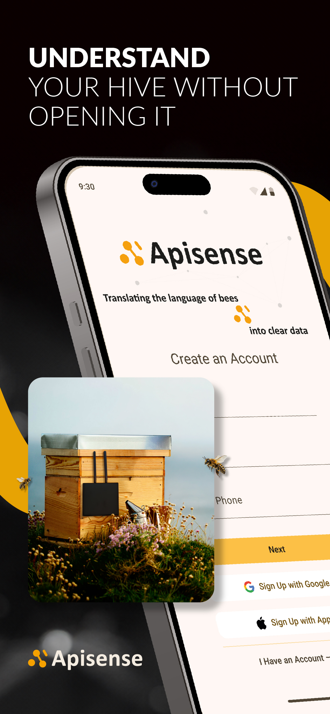
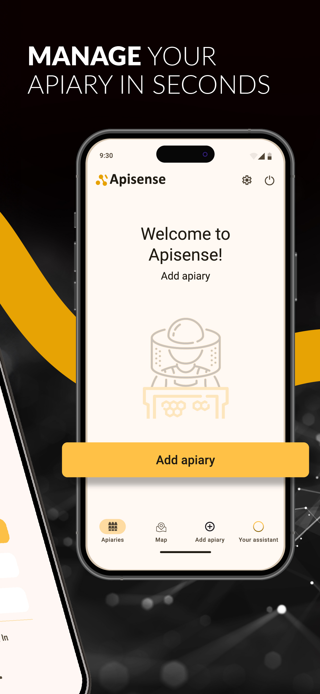
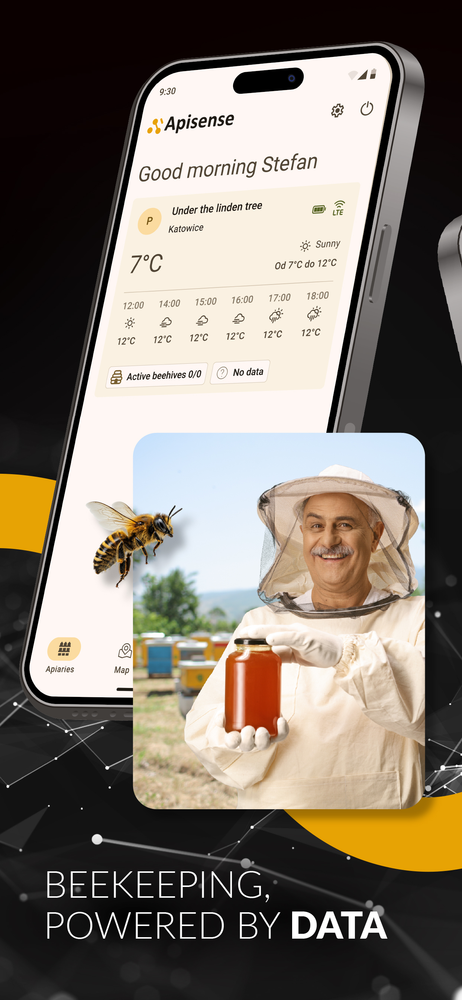
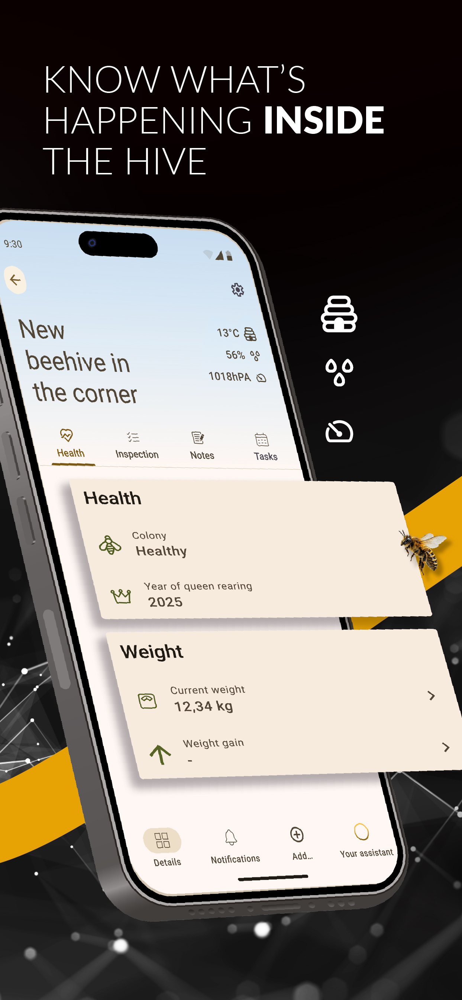
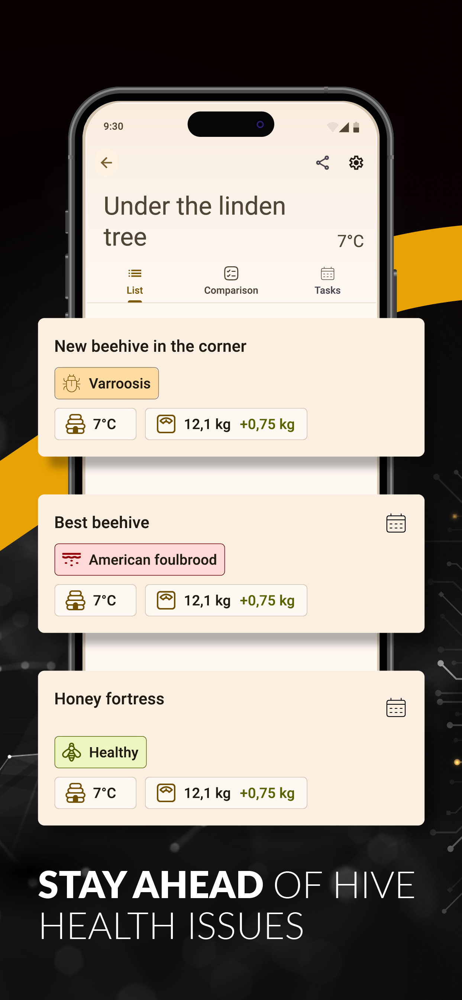
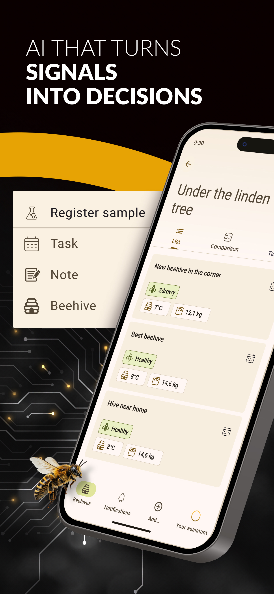

# Apisense – Translating the language of bees into clear data

**Comprehensive IoT Solution for Modern Beekeeping**

## 1. Introduction

Apisense is an advanced early warning system that combines modern Internet of Things (IoT) sensors with Artificial Intelligence (AI) algorithms. The system enables preventative disease detection with up to **95% F1-score** by analyzing honeybee pheromone levels and acoustic hive patterns.

## 2. Hardware Technical Specifications

### **Apisense Hub**

*Hub that aggregates data from sensors and scales across the apiary and forwards it to the cloud.*

- **Power Supply:** Built-in rechargeable Li-Ion battery + integrated photovoltaic (solar) panel.
- **Operating Time:** Up to 2 weeks without sunlight; continuous operation with solar exposure. Support for mains charging (standard low-voltage connector).
- **Connectivity:**
    - **Cloud:** LTE (Global SIM card, 1-year data package included).
    - **Local:** Bluetooth Low Energy (BLE) – range up to 35m to sensors and scales. Supports up to 100 devices.
- **Installation:** Non-invasive mounting (post, tree), weather-resistant (IP65). Optimized solar tilt: 20° to 50°.
- **Dimensions:** Compact housing integrated with solar panel (approx. 17.5x17.5x5 cm).

### **Apisense VitalSensor**

*Key device for early disease identification — continuously captures the environmental parameters from inside the hive that drive the AI detection models.*

- **Sensors:** NOx, VOC, humidity, temperature, gas resistance, acoustic microphone, and additional in-hive environmental parameters.
- **Power Supply:** 2x AA batteries.
- **Battery Life:** Up to 12 months on a single set of batteries.
- **Installation:** Non-invasive bracket for the bee frame (requires no hive modification).
- **Dimensions:** Ultra-slim design fitting in the inter-frame space (approx. 13x3x2 cm).

### **Apisense Scale**

*Precise monitoring of honey gains and colony condition.*

- **Sensors:** Load cell for hive mass measurement and a built-in temperature sensor for ambient (outside-hive) temperature readings.
- **Power Supply:** 2x AA batteries.
- **Battery Life:** Up to 36 months (3 years) on a single set of batteries.
- **Installation:** Low-profile design under the hive, includes a wooden leveling beam for stability.
- **Dimensions:** Standard width matched to hive floorboards (approx. 40x5x4 cm).

## 3. Digital Ecosystem (Software)

- **Mobile Application:** Apisense Pro AI (iOS/Android/Web) – Modern, responsive user experience with advanced trend analytics and historical data.
- **Artificial Intelligence:** AI engine analyzing data, providing actionable recommendations and alarms (e.g., identification of disease (varroa, nosema, foulbrood)).
- **Actionable recommendations:** Based on all inputs available to the system — beekeeper notes, inspections, photos, sensor and scale readings, weather forecasts, and expert knowledge — Apisense generates concrete action recommendations that help the beekeeper strengthen the colony.
- **Notifications:** Real-time push notification system for critical events (e.g., sudden weight drop, sudden temperature drops, sudden humidity increase).

## 4. Key Value Propositions

1. **100% Wireless:** No cabling required, drastically reducing installation costs and weather-related damage risks.
2. **Plug & Play:** Device registration via quick QR code scanning in the app.
3. **Low Maintenance:** Uses standard AA batteries available worldwide; the solar-powered Hub eliminates the need for manual charging.
4. **Durability:** Engineered for extreme apiary conditions (high humidity, variable temperatures).
5. **Precision:** Up to 95% accuracy for early disease identification.

## 5. Apisense Pro AI – Application

The Apisense Pro AI app delivers an intuitive, modern interface for managing apiaries on iOS, Android, and the web.

**Download the app:** 
- [App Store](https://apps.apple.com/app/apisense/id6741760755) 
- [Google Play](https://play.google.com/store/apps/details?id=ai.apisense) 
- [Web version](https://app.apisense.ai/)

### Key app features

- **Instant alerts:** Push notifications for swarming risk and sudden weather changes.
- **Smart recommendations:** Proactive AI-generated advice to optimize hive health.
- **Apiary management:** Organize multiple locations and hundreds of hives within a single dashboard.
- **Multi-user access:** Share data with your team or researchers while retaining full owner control.

For a complete walkthrough of the app — registration, apiary and hive management, inspections, notes, tasks, alerts, and sharing — see the [App Manual](../manual/app-manual.md).
