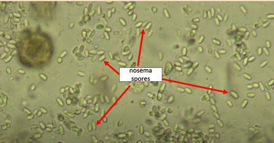

# Mikroskopia Nosema/Vairimorpha

Procedura wykrywania i ilościowego oznaczania spor *Nosema*/*Vairimorpha* w rodzinie pszczelej.

## Tutorial wideo

  <iframe src="https://www.youtube.com/embed/fMrCL1EB6G4"
          title="Testing for Nosema — pełna procedura mikroskopowa"
          allow="accelerometer; clipboard-write; encrypted-media; gyroscope; picture-in-picture; web-share"
          allowfullscreen></iframe>

## Materiały

- **Mikroskop optyczny z wbudowaną kamerą.** Wymagana specyfikacja:
    - Układ optyczny: soczewki ze szkła optycznego
    - Powiększenie całkowite: 400× (obiektyw: 40×; okular: WF10×)
    - Stolik mechaniczny: lewo–prawo / przód–tył
    - Minimalna rozdzielczość kamery: 0,3 MP

    Przykładowe mikroskopy spełniające wymagania:

    - <a href="https://eu.amscope.com/products/40x-1000x-portable-student-compound-led-microscope-1-3mp-usb-camera">AmScope M150 Series z kamerą USB</a>
    - <a href="https://telescopesplanet.com/en/products/digital-microscope-levenhuk-rainbow-d2l-0-3m-1152230498.html">Levenhuk Rainbow D2L 0.3M</a>

- Pęseta
- Moździerz z tłuczkiem (lub inne narzędzie do homogenizacji)
- Hemocytometr (preferowany) lub standardowe szkiełka mikroskopowe
- Szkiełka nakrywkowe
- Woda dejonizowana (preferowana) lub woda kranowa
- Mikropipety z jednorazowymi końcówkami

## Przygotowanie próbki

### 1. Pobierz próbkę pszczół

Użyj **jednej** z poniższych opcji:

- **Martwe pszczoły:** zbierz 25 martwych pszczół robotnic z wkładki higienicznej dna ula, pod warunkiem że pszczoły są martwe (bez oznak rozkładu czy porastania pleśnią).
- **Żywe pszczoły:** złap 25 żywych pszczół robotnic przy wylotku ula.

### 2. Homogenizacja

1. Dodaj **25 mL wody dejonizowanej** do próbki pszczół (1 mL na pszczołę).
2. Zmiażdż (zhomogenizuj) całe pszczoły dokładnie, aby uzyskać jednolitą zawiesinę.
3. Wymieszaj zawiesinę dokładnie — spory mają tendencję do osadzania się na dnie.

!!! note "Dlaczego homogenizujemy całe pszczoły?"
    Spory *Nosema* są obecne nie tylko w przewodzie pokarmowym, ale również w gruczołach gardzielowych i nasieniu trutni. Homogenizacja całych pszczół robotnic zapewnia kompleksowe wykrycie.

## Przygotowanie preparatu mikroskopowego

1. Mikropipetą nanieś małą kroplę (~40 µL) dobrze wymieszanej zawiesiny na czyste szkiełko.
2. Przykryj szkiełkiem nakrywkowym.

!!! tip "Użyj hemocytometru, jeśli masz dostępny"
    Jeśli masz hemocytometr, użyj go — liczenie jest łatwiejsze i bardziej zestandaryzowane.

## Liczenie spor

1. Ustaw ostrość mikroskopu na **powiększeniu 400×** za pomocą śruby mikrometrycznej.
2. Wybierz **pięć losowych pól widzenia** (pięć dużych kwadratów siatki, jeśli używasz hemocytometru).
3. Jeśli pole zawiera nadmiar zanieczyszczeń, wybierz losowo inne.
4. W każdym polu widzenia szukaj spor *Nosema*.

    Spory *Nosema* spp. są owalne z ciemnym, dobrze zarysowanym brzegiem (Rys. 1). Uważaj, aby nie pomylić ich z ziarnami pyłku, które są większe i idealnie okrągłe.

    

     
    <strong>Rys. 1</strong> Obraz mikroskopowy (400×) spor <em>Nosema</em> spp.
    

5. Policz spory w każdym polu widzenia i zapisz wartości.
6. **Zrób zdjęcie każdego z pięciu pól widzenia**, aby przesłać je do aplikacji Apisense.
7. Oblicz **średnią** liczbę spor z pięciu pól widzenia.

### Przykład — Tabela 1

Liczba spor *Nosema* zaobserwowanych w pięciu polach widzenia dla każdej próbki.

| Próbka | Pole 1 | Pole 2 | Pole 3 | Pole 4 | Pole 5 | Średnia |
|---|---|---|---|---|---|---|
| 1 | 40 | 38 | 52 | 44 | 50 | 44,8 |
| 2 | … | … | … | … | … | … |

## Raportowanie w aplikacji Apisense

Wprowadź:

- **Średnią liczbę spor** z pięciu pól widzenia
- **Zdjęcia** wszystkich pięciu pól widzenia
- **Typ próbki pszczół:** martwe / żywe
- **Użytą wodę:** dejonizowana / kranowa
- **Typ preparatu:** hemocytometr / standardowe szkiełko mikroskopowe

## Bibliografia

1. Bartolomé C, Higes M, Hernández RM, Chen YP, Evans JD, Huang Q. *The recent revision of the genera Nosema and Vairimorpha (Microsporidia: Nosematidae) was flawed and misleads the bee scientific community.* J Invertebr Pathol. 2024;206: 108146. <a href="https://doi.org/10.1016/j.jip.2024.108146">doi:10.1016/j.jip.2024.108146</a>
2. Fries I, Chauzat M-P, Chen Y-P, Doublet V, Genersch E, Gisder S, et al. *Standard methods for Nosema research.* J Apic Res. 2013;52: 1–28. <a href="https://doi.org/10.3896/IBRA.1.52.1.14">doi:10.3896/IBRA.1.52.1.14</a>
3. *Nosemosis of honey bees, WOAH Terrestrial Manual.* 2024. <a href="https://www.woah.org/fileadmin/Home/fr/Health_standards/tahm/3.02.04_NOSEMOSIS.pdf">WOAH (PDF)</a>
4. Mazur ED, Gajda AM. *Nosemosis in Honeybees: A Review Guide on Biology and Diagnostic Methods.* Applied Sciences. 2022;12: 5890. <a href="https://doi.org/10.3390/app12125890">doi:10.3390/app12125890</a>
