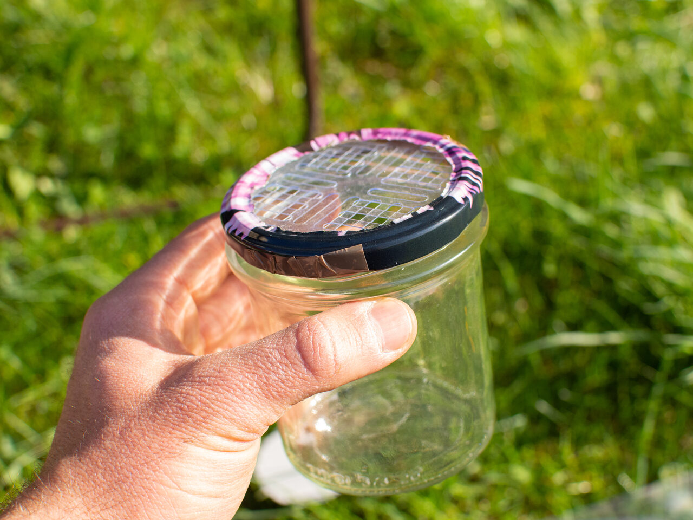
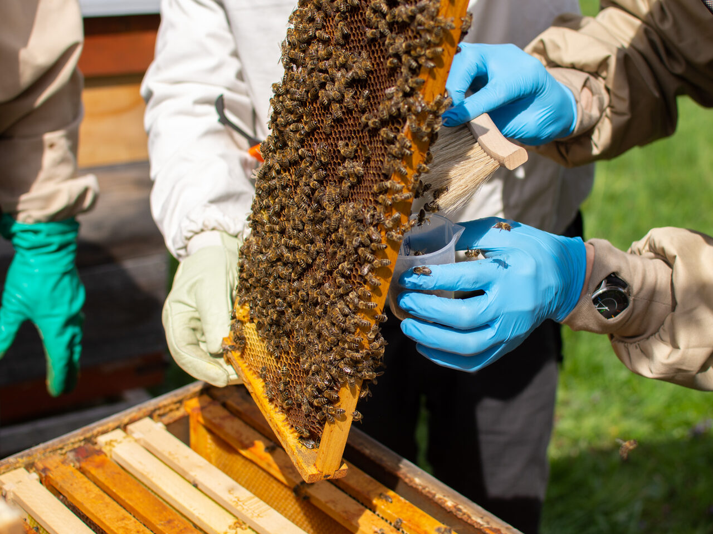

---
caption:
  figure:
    caption_prefix: 'Fig. {index}:'
    reference_text: 'Fig. {index}'
---

# Protocol 1 — *Varroa destructor* monitoring (mandatory)

Two steps: live sugar-roll flotation, and monitoring mite drop on a sticky board.

## STEP 1 — sugar-roll flotation

### Materials

- A **Varroa EasyCheck** device, or a homemade container:
    - glass jar of **500–720 mL**, fitted with a lid with **~3 mm mesh**
    - alternatively, instead of mesh — **a doubly folded queen excluder** placed in the lid, with the slots of both layers crossed perpendicular to each other
- Tablespoon
- Powdered sugar
- Flat dish (tray, baking sheet, plate) filled with water to a depth of **~1 cm**
- Dry cloth

Figure: Example homemade flotation container — glass jar with ~3 mm mesh in the lid {#fig-varroa-jar-mesh}

{width=450}

### Procedure

1. Add **1 tablespoon of powdered sugar** to the container.
2. Collect **300 live bees from brood-nest frames** (~85 mL of bees = half a cup). The easiest way is to hold the container against the comb and brush the bees in directly with disposable-gloved fingers, sweeping gently over the comb surface, or with a brush.

    !!! warning "Do not collect the queen"
        Be careful not to scoop the queen with the sample.

Figure: Collecting 300 bees from a brood-nest frame with a brush (disposable gloves) {#fig-bee-brush-collection}

{width=450}

3. Close the container with the mesh lid.
4. Roll and gently shake the container for **1 minute** so the bees are fully coated with sugar.
5. Let it sit for **max 30 seconds**.
6. Prepare a flat dish with water (~1 cm deep).
7. Invert the closed container and **shake vigorously over the water, like a salt shaker, for 15 seconds**. The powdered sugar dissolves in the water and stops obscuring the mites.

### Repeat the cycle

Repeat the procedure **a second time** with the same bee sample:

1. Sprinkle **1 tablespoon of powdered sugar** over the bees.
2. Roll and gently shake the container for 1 minute.
3. Let it sit for max 30 seconds.
4. Shake vigorously over **the same water** for 15 seconds.

### Counting and reporting

1. **Count the mites** in the water and take a **clear, good-quality photo**.
2. In the Apisense app: ***add → test → flotation*** — enter the mite count and attach the photo.
3. **Return the bees to the colony.**
4. Wash the dish and dry it thoroughly before next use.

## STEP 2 — mite drop on a sticky board

Perform this step if the hive has a **screened bottom board with a tray**.

### Materials

- A ready-made adhesive mite-drop insert, **or** a homemade one made from:
    - a sheet of white smooth paper, a placemat, rigid foil, or a PVC sheet (sized to fit the bottom board — **do not use newsprint**)
    - coated with **edible oil or paraffin**

### Procedure

1. **Ready-made insert:** peel off the protective layer.

    **Homemade insert:** apply edible oil or paraffin.

2. Place the insert in the **lower part of the hive, sticky/coated side up**, in the tray under the screened bottom board.
3. The insert must **lie flat, without lifting, and be clean**.
4. Leave the insert in place for **7 days**.
5. After 7 days, remove the insert, **count the mites**, and take **one clear, good-quality photo covering the entire surface of the insert**.
6. In the Apisense app: ***add → test → mite drop*** — enter the mite count and attach the photo.

!!! tip "Detailed flotation procedure"
    A full description of sugar-roll flotation as a general field procedure (without the seasonal program context) is available in [Varroa sugar roll](../procedures/varroa-sugar-roll.md).
