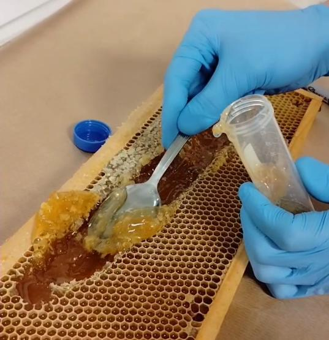

# Protokół 5 — pobranie próbki miodu (obligatoryjny)

Pobranie próbki miodu z każdej rodziny wyposażonej w VitalSensor Apisense, na potrzeby badań laboratoryjnych w Lublinie.

!!! info "Liczba próbek"
    Przygotuj **po jednej próbce z każdej rodziny wyposażonej w sensor**: **liczba sensorów = liczba próbek**.

## Tutorial wideo

  <iframe src="https://www.youtube.com/embed/fAA7ArN8cIU"
          title="Pobieranie próbki miodu — film instruktażowy"
          allow="accelerometer; clipboard-write; encrypted-media; gyroscope; picture-in-picture; web-share"
          allowfullscreen></iframe>

## Materiały

- **Plastikowa probówka z niebieską zakrętką** — dołączona do zestawu Apisense (1 probówka na rodzinę)
- **Łyżka kuchenna** — najwygodniejsze narzędzie do nabierania miodu z ramki
- Rękawiczki jednorazowe
- Trwały marker do opisania probówki

## Procedura

1. Wybierz ramkę z **nadstawki/miodni** rodziny wyposażonej w VitalSensor.
2. Nabierz miód **bezpośrednio z ramki** łyżką i przełóż do probówki z niebieską zakrętką.

    {width=450}

3. **Wypełnij probówkę do pełna.**
4. Zakręć probówkę i **oczyść jej zewnętrzną powierzchnię tak, aby się nie lepiła**.

!!! note "Fragmenty wosku są dopuszczalne"
    Pobierany miód może zawierać **drobne fragmenty wosku** — nie trzeba go filtrować ani odwirowywać.

## Zarejestrowanie próbki w aplikacji

1. W aplikacji Apisense: ***dodaj próbkę / zarejestruj badanie → rodzaj badania = miód → wygeneruj kod***.
2. Aplikacja wygeneruje **unikatowy kod próbki**, przypisany do tej rodziny.
3. **Opisz probówkę wygenerowanym kodem** (trwałym markerem).

## Wysyłka

Próbkę dołącz do paczki opisanej w sekcji [Wysyłka do badań](index.md#wysyłka-do-badań).
