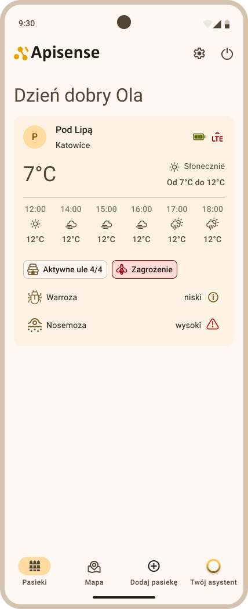
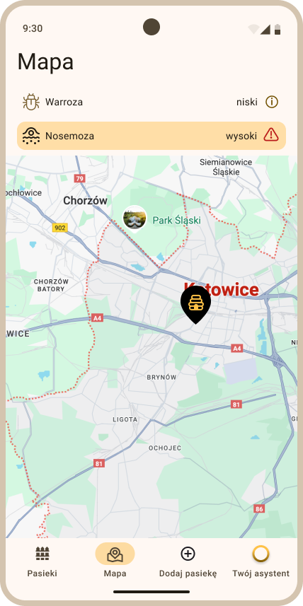
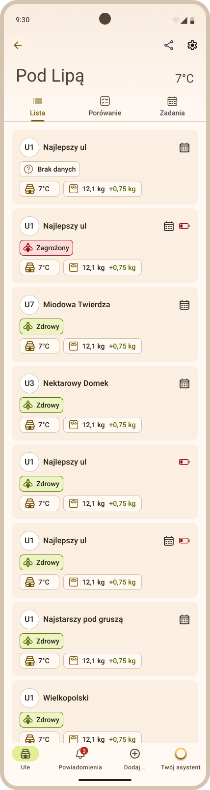
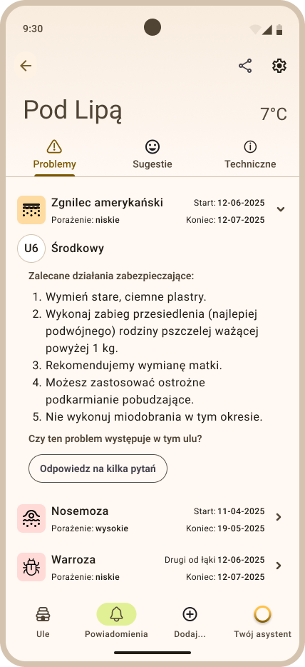
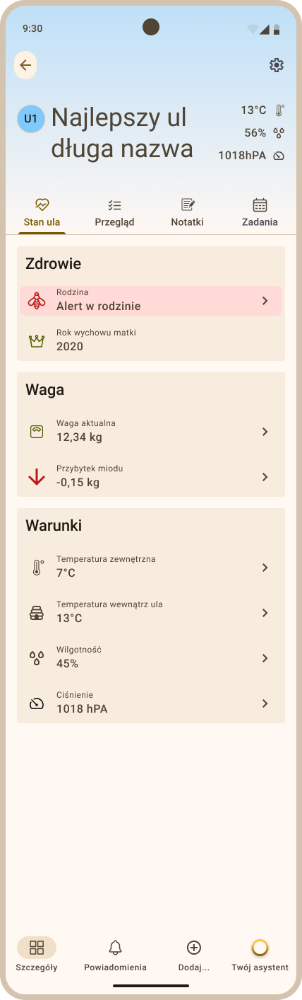
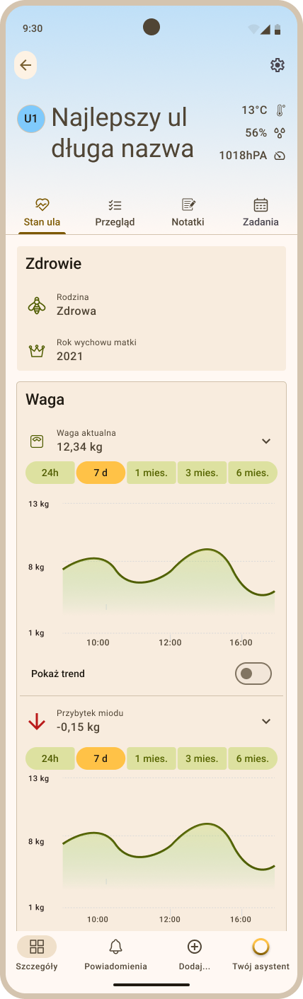
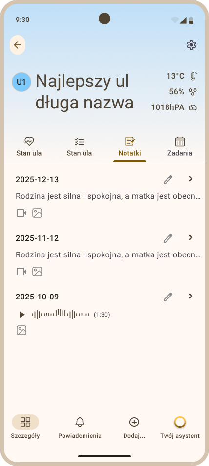
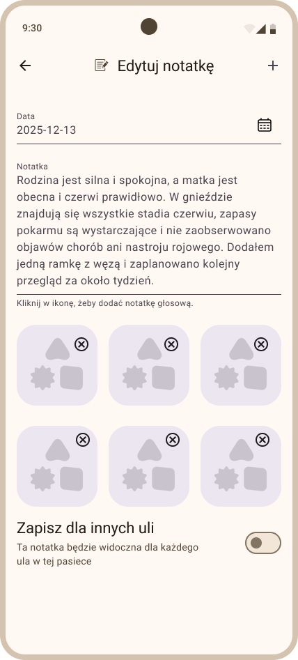
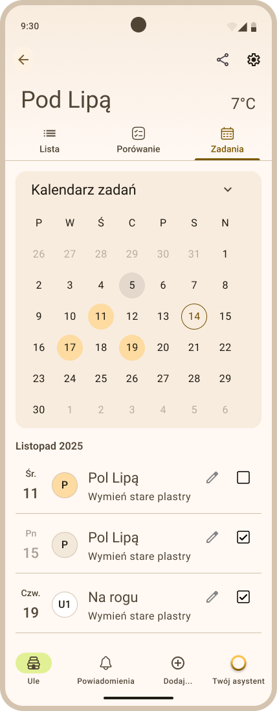

# Apisense – Translating the language of bees into clear data

**Comprehensive IoT Solution for Modern Beekeeping**

## 1. Introduction

Apisense is an advanced early warning system that combines modern Internet of Things (IoT) sensors with Artificial Intelligence (AI) algorithms. The system enables preventative disease detection with up to **95% efficiency** by analyzing honeybee pheromone levels and acoustic hive patterns.

## 2. Hardware Technical Specifications

### **Apisense Hub**

*The heart of the system, providing communication between the apiary and the world.*

- **Power Supply:** Built-in rechargeable Li-Ion battery + integrated photovoltaic (solar) panel.
- **Operating Time:** Up to 2 weeks without sunlight; continuous operation with solar exposure. Support for mains charging (standard low-voltage connector).
- **Connectivity:**
    - **Cloud:** LTE (Global SIM card, 1-year data package included).
    - **Local:** Bluetooth Low Energy (BLE) – range up to 35m to sensors and scales. Supports up to 100 devices.
- **Installation:** Non-invasive mounting (post, tree), weather-resistant (IP65). Optimized solar tilt: 20° to 50°.
- **Dimensions:** Compact housing integrated with solar panel (approx. 17.5x17.5x5 cm).

### **Apisense VitalSensor**

*Advanced sensor suite mounted inside the hive.*

- **Sensors:** Integrated gas sensor (pheromone analysis), acoustic microphone (swarming mood detection), thermometer, hygrometer.
- **Power Supply:** 2x AA batteries.
- **Battery Life:** Up to 12 months on a single set of batteries.
- **Installation:** Non-invasive bracket for the bee frame (requires no hive modification).
- **Dimensions:** Ultra-slim design fitting in the inter-frame space (approx. 13x3x2 cm).

### **Apisense Scale**

*Precise monitoring of honey gains and colony condition.*

- **Functions:** Hive mass measurement, external temperature.
- **Power Supply:** 2x AA batteries.
- **Battery Life:** Up to 36 months (3 years) on a single set of batteries.
- **Installation:** Low-profile design under the hive, includes a wooden leveling beam for stability.
- **Dimensions:** Standard width matched to hive floorboards (approx. 40x5x4 cm).

## 3. Digital Ecosystem (Software)

- **Mobile Application:** Apisense Pro AI (iOS/Android/Web) – Modern, responsive user experience with advanced trend analytics and historical data.
- **Artificial Intelligence:** AI engine analyzing data, providing actionable recommendations and alarms (e.g., identification of disease (varroa, nosema, foulbrood)).
- **Notifications:** Real-time push notification system for critical events (e.g., sudden weight drop, sudden temperature drops, sudden humidity increase).

## 4. Key Value Propositions

1. **100% Wireless:** No cabling required, drastically reducing installation costs and weather-related damage risks.
2. **Plug & Play:** Device registration via quick QR code scanning in the app.
3. **Low Maintenance:** Uses standard AA batteries available worldwide; the solar-powered Hub eliminates the need for manual charging.
4. **Durability:** Engineered for extreme apiary conditions (high humidity, variable temperatures).
5. **Precision:** High-fidelity data collection (95% accuracy in health monitoring).

## 5. Application Interface Preview

The Apisense Pro AI application provides an intuitive and modern interface for managing your apiaries. Below are key representative views:

### Apiary Dashboard

The main dashboard provides an instant overview of your apiary status. It displays real-time weather forecasts, connection status (LTE/Battery), and critical health alerts (e.g., High risk of *Nosema* or *Varroa*).

### Smart Mapping

Visualize all your apiaries on an interactive map. Filter locations by specific "problems" or diseases to prioritize your visits and optimize logistics.

### Beehive Fleet Management

A comprehensive list of all beehives within an apiary. Each entry shows the hive's health status (Healthy/Threatened), current internal temperature, total weight, and 24h weight gain/loss.

### Diagnostic & Action Center

Detailed diagnostic reports for detected issues. For example, if "American Foulbrood" (Zgnilec) is detected, the app provides a step-by-step recommendation (e.g., replace old combs, queen replacement, or specific feeding instructions).

### Comprehensive Hive Telemetry

Detailed telemetry for individual hives, including health status, queen's birth year, precise weight (e.g., 12.34 kg), honey gain trends (-0.15 kg), and environmental conditions (internal/external temperature, humidity, and atmospheric pressure).

### Advanced Analytics

Interactive 24h, 7d, 1-month, and 6-month charts for weight and honey gains. The "Show Trend" feature helps identify subtle changes in colony behavior.

### Multimedia Inspection Notes

Replace traditional paper notebooks with digital inspection logs. Attach photos, videos, or even voice notes directly to a hive. You can also sync a single note across multiple hives in the same apiary.

### Task Scheduler & Calendar

Plan and track all apiary activities. The built-in calendar helps you schedule honey harvesting, treatments, and inspections, ensuring no critical task is missed during the season.

### Key App Features:

- **Instant Alerts:** Push notifications for swarming risk, or sudden weather changes.
- **Smart Recommendations:** Proactive advice generated by AI to optimize hive health.
- **Apiary Management:** Organize multiple locations and hundreds of hives within a single dashboard.
- **Multi-user Access:** Share data with your team or researchers while maintaining full owner control.
